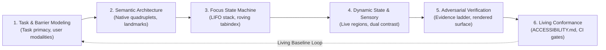

# Accessibility Engineering: Universal Assistive Technology & Inclusive Interaction Protocol

> **Mandate**: *Accessibility is successful task completion and recovery for people with disabilities, not merely a scanner score.* 
> An interface that achieves a 100% automated scanner rating can remain completely unusable if focus is lost, keyboard traps exist, dynamic notifications fail to announce, or error recovery is a dead end. Protect user goals across the entire human sensorimotor spectrum (visual, motor, auditory, cognitive) through deterministic semantic trees, predictable focus choreography, and sensory redundancy before aesthetic polish. Never restrict architectural or visual creativity—liberate it through physical and semantic rigor.

---

## 1 · The 6-Phase Universal Accessibility Lifecycle

Every interactive system—from a simple terminal utility to a complex multi-platform application or streaming AI workspace—must traverse this closed-loop lifecycle:



1. **Phase 1 — Task & Barrier Modeling**:
   * Formulate the core user task: what constitutes complete success, and what does safe recovery look like?
   * Model the 4 human barrier vectors: **Visual** (blindness, low vision, color vision deficiency), **Motor** (tremor, discrete switch, keyboard-only, single-pointer limit), **Auditory** (deafness, hard of hearing), and **Cognitive** (attention deficit, memory overload, reading disabilities, motion sensitivity).
   * **Zero-Surface Bypass**: If the codebase has no human sensory/interaction surface (e.g., pure algorithmic libraries, compilers, headless daemons), exit this skill immediately and route to [`code-quality`](../code-quality/SKILL.md) or [`api-design`](../api-design/SKILL.md).
2. **Phase 2 — Semantic Architecture & Native Primitives**:
   * Ground every interactive affordance in native platform primitives ($\mathcal{A}_2$).
   * Guarantee that every interactive node exposes the universal **OS Semantic Quadruplet**: $\langle \text{Role}, \text{Accessible Name}, \text{State/Value}, \text{Actions} \rangle$ (see [`references/universal-invariants-and-assistive-tree.md`](references/universal-invariants-and-assistive-tree.md)).
   * Establish clear spatial and structural landmarks (Banner, Main, Navigation, Complementary, Contentinfo).
3. **Phase 3 — Interaction Mechanics & Focus Choreography**:
   * Enforce the **LIFO Focus Stack Machine** for all modals, sheets, drawers, and transient flyouts ($\mathcal{A}_4$).
   * Provide discrete navigation for composite widgets (roving tabindex, directional grid navigation) (see [`references/keyboard-focus-and-interaction-mechanics.md`](references/keyboard-focus-and-interaction-mechanics.md)).
   * Eliminate all keyboard traps; guarantee unconditional escape hatches via the `Escape` key.
4. **Phase 4 — Dynamic States, Streaming & Sensory Redundancy**:
   * Implement non-disruptive live annunciation streams for asynchronous updates and state transitions ($\mathcal{A}_5$).
   * Apply the **AI Streaming Liveness Rule**: Throttle and debounce live notifications during generative token streaming; never flood assistive channels per-token (see [`references/dynamic-states-streaming-and-error-recovery.md`](references/dynamic-states-streaming-and-error-recovery.md)).
   * Enforce orthogonal sensory redundancy ($\mathcal{A}_6$): never encode meaning via color, shape, position, or sound alone.
5. **Phase 5 — Adversarial Multi-Lens Verification**:
   * Evaluate the experience on the **Rendered Surface** and within the computed platform accessibility tree, not merely against static source code (see [`references/perceptual-physics-contrast-and-reflow.md`](references/perceptual-physics-contrast-and-reflow.md)).
   * Verify using the **4-Tier Epistemic Evidence Ladder** ($\mathcal{E}_1 \to \mathcal{E}_4$), combining automated rule sweeps with keyboard walkthroughs, zoom/reflow stress tests, and assistive event trace inspections.
6. **Phase 6 — Living Conformance & Exception Governance**:
   * Pin verified behavior into the project's living [`ACCESSIBILITY.md`](templates/ACCESSIBILITY.md) contract.
   * If physical constraints or vendor code prevent compliance, execute the formal **Accessibility Exception Protocol** (see [`references/auditing-conformance-and-exception-protocol.md`](references/auditing-conformance-and-exception-protocol.md)).
   * Hand off automated assertion contracts to [`testing`](../testing/SKILL.md) and [`ci-cd`](../ci-cd/SKILL.md).

---

## 2 · Progressive Disclosure (Reference Routing)

To prevent cognitive overload and preserve context bandwidth, **never load all reference manuals simultaneously**. Consult reference manuals strictly on demand based on task context:

| Context Trigger | Mandatory Reference Manual | Purpose |
| :--- | :--- | :--- |
| **OS a11y trees, quadruplet model, accname computation, roles** | [`references/universal-invariants-and-assistive-tree.md`](references/universal-invariants-and-assistive-tree.md) | Deep mechanics of platform accessibility APIs (UIA, NSAccessibility, AT-SPI, Chromium tree) and accessible name calculation. |
| **Focus rings, tab order, modals, roving tabindex, shortcuts** | [`references/keyboard-focus-and-interaction-mechanics.md`](references/keyboard-focus-and-interaction-mechanics.md) | Formal focus stack machine, trap elimination, discrete keyboard navigation algorithms, WAI-ARIA patterns. |
| **Forms, errors, live regions, LLM streaming, toast alerts** | [`references/dynamic-states-streaming-and-error-recovery.md`](references/dynamic-states-streaming-and-error-recovery.md) | Form state machines, polite vs assertive annunciation, 3-part accessible errors, token streaming throttling. |
| **Contrast ratios, APCA, 400% zoom reflow, forced-colors** | [`references/perceptual-physics-contrast-and-reflow.md`](references/perceptual-physics-contrast-and-reflow.md) | Dual contrast model (WCAG 2.2 vs APCA $L^c$), Windows High Contrast, font zoom math, responsive reflow. |
| **Plain language, timeouts, ADHD/dyslexia, motion sickness** | [`references/cognitive-accessibility-and-sensory-overload.md`](references/cognitive-accessibility-and-sensory-overload.md) | Cognitive load limits, $10\times$ time extension rule, `prefers-reduced-motion` mechanics, sensory overload prevention. |
| **Canvas, WebGL, 3D graphics, game engines, Flutter painters** | [`references/virtual-semantic-mirrors-canvas-and-games.md`](references/virtual-semantic-mirrors-canvas-and-games.md) | Retained virtual accessibility trees, spatial hit-testing synchronization, and the Tabular Alternative Invariant. |
| **Cross-platform translation (Web, iOS, Android, Desktop, TUI, AI)** | [`references/multi-archetype-rosetta-stone.md`](references/multi-archetype-rosetta-stone.md) | Rosetta Stone mapping abstract accessibility moves into idiomatic code across 6 major computing archetypes. |
| **Audits, 0–4 severity grading, WCAG/EN 301 549, exceptions** | [`references/auditing-conformance-and-exception-protocol.md`](references/auditing-conformance-and-exception-protocol.md) | Multi-pass audit execution, mathematical finding schema, epistemic evidence ladder, Formal Exception RFC. |

---

## 3 · Adaptive Cognitive Sizing (The 5 Execution Modes)

Size your accessibility engineering effort to the scope and operational risk of the task. Do not write essays for simple patches, and never skip structural scaffolding on full workflows:

| Mode | Trigger & Scope | Engineering Discipline | Required Output & Protocol |
| :--- | :--- | :--- | :--- |
| **`micro`** | Button label, isolated form field, icon contrast, tooltip ($< 30$ lines). | Immediate execution; verify accessible name, contrast, and focus outline. | **Zero preamble essay**. Emit the code/diff directly with a 1-line accessibility rationale. |
| **`component`** | Combobox, modal dialog, tabs, accordion, dropdown menu, alert banner. | Focus trap/release, roving tabindex, keyboard keys (`Esc`, arrows), live region state. | **3-Line Accessibility Intent Block** immediately preceding implementation. |
| **`flow`** | Multi-step form, wizard, checkout, interactive data table, search filter. | Step-to-step focus traversal, validation error summary announcement, progress annunciation. | **Task Flow Focus & State Matrix** + complete implementation. |
| **`system`** | Full application shell, navigation drawer, design system token architecture. | Global landmark hierarchy, skip links, dynamic theme contrast switching, font zoom resilience. | Structured **Accessibility Architecture Contract** (`ACCESSIBILITY.md`) + code. |
| **`audit`** | WCAG 2.2 AA / Section 508 review, PR accessibility audit, pre-release verification. | Multi-pass adversarial evaluation (Keyboard $\to$ Screen Reader $\to$ Contrast $\to$ Zoom $\to$ Recovery). | **Mathematical Finding Matrix** with anchored citations, 0–4 severity, and code remediation. |

### The 3-Line Accessibility Intent Protocol (For `component` and `flow` Modes)
To prevent philosophical essay bloat, summarize accessibility intent in exactly 3 structured lines before emitting implementation code:
```markdown
> **A11y Target**: [Component Name] · [Native Primitive or Custom Role] · [Accessible Name Strategy]
> **Keyboard & Focus**: [Tab sequence / Roving tabindex] · [Focus indicator style] · [Focus restore anchor]
> **AT Semantics**: [State attributes: expanded/selected/invalid] · [Live annunciation: polite/assertive/none]
```

---

## 4 · The 8 Universal Accessibility Invariants ($\mathcal{A}_1 - \mathcal{A}_8$)

Regardless of technology (Web, iOS, Android, Flutter, Desktop, TUI, Canvas, or AI Agents), every interface must adhere to the 8 Universal Accessibility Invariants:

### 4.1 Invariant 1: Task Primacy & Equivalence of Outcome ($\mathcal{A}_1$)
$$\forall u_i, u_j \in \mathcal{U}, \quad \text{Outcome}(u_i, \text{Task}) \equiv \text{Outcome}(u_j, \text{Task})$$
* **Equivalence of Outcome**: Every human operator, regardless of assistive technology or perceptual modality, must be able to achieve the identical functional outcome. Differences in sensory presentation are permitted; inequality of outcome is strictly prohibited.
* **No Degraded "Accessible Modes"**: Never build a separate, stripped-down "text-only" site that lags behind the primary experience. Accessibility is engineered directly into the primary surface.

### 4.2 Invariant 2: Native Semantic Grounding ($\mathcal{A}_2$)
$$\text{Element} = \begin{cases} \text{NativePlatformPrimitive} & \text{if capability exists} \\ \text{CustomElement} \oplus \text{Quadruplet}(\text{Role}, \text{Name}, \text{State}, \text{Action}) & \text{only by exception} \end{cases}$$
* **Platform Native Primacy**: Always use the platform's native interactive controls (`<button>`, `<dialog>`, `Button`, `Dialog`). Native controls provide keyboard handling, focus management, high-contrast adaptation, and accessibility tree bindings by default.
* **The Semantic Quadruplet**: If a custom element is unavoidable, it must programmatically expose:
  1. *Role*: What the element is (e.g., button, tab, treeitem).
  2. *Accessible Name*: The human-readable label identifying it.
  3. *State / Value*: Current dynamic condition (expanded, selected, checked, disabled, invalid).
  4. *Actions / Events*: Supported invocations (click, activate, dismiss, toggle).

### 4.3 Invariant 3: Modality Independence & Unconstrained Operability ($\mathcal{A}_3$)
$$\forall \text{Action} \in \text{Task}, \quad \exists \text{Sequence} \in \text{DiscreteInputs} \implies \text{Execute}(\text{Action})$$
* **Discrete Input Parity**: No task or interaction may require a specific physical input mechanism (e.g., mouse hovering, multi-finger gestures, fine motor dragging, or voice-only input). Every action must be executable via discrete, stepped inputs (keyboard, switch device, directional pad).
* **Pointer Cancellation**: For pointer interactions, the activation must occur on the up-event, with a mechanism to abort or cancel before completion.

### 4.4 Invariant 4: Deterministic Focus Management & The LIFO Stack ($\mathcal{A}_4$)
$$\text{FocusStack}_{t+1} = \begin{cases} \text{Push}(\text{FocusStack}_t, \text{Target}) & \text{on modal open} \\ \text{Pop}(\text{FocusStack}_t) \implies \text{Focus}(\text{Top}) & \text{on modal dismiss} \end{cases}$$
* **Predictable Focus Progression**: Programmatic focus progression must match the logical reading and operational sequence of the interface.
* **Unbreakable Focus Containment**: Modal dialogs, sheets, and drawers must trap keyboard focus within their bounds while open and dismiss cleanly on `Escape`.
* **Zero Focus Obliteration**: Closing a transient dialog or completing a mutation must deterministically restore focus to the triggering element. Focus must never reset to `<body>` or the top of the window on state change.
* **Luminance Contrast on Focus**: The focused element must present a high-contrast visual focus indicator ($\Delta L^* \ge 3:1$ against adjacent surfaces) that is never obscured by sticky headers, footers, or overlays. Removing focus indicators (`outline: none`) without replacement is strictly forbidden.

### 4.5 Invariant 5: Dynamic State Synchronization & Streaming Pacing ($\mathcal{A}_5$)
$$\text{LiveAnnounce}(\text{Event}) \implies \Delta t_{\text{throttle}} \ge 1.0\text{s} \quad \land \quad \text{Politeness} \in \{\text{Polite}, \text{Assertive}\}$$
* **Non-Disruptive Annunciation**: When state changes asynchronously (validation, loading, background completion), update the assistive event stream without stealing user focus.
* **The AI Streaming & Liveness Rule**: During generative AI token streaming, **never dispatch per-token live announcements** (which crashes screen reader synthesizers with audio buffer storms). Dispatch lifecycle announcements:
  1. *Stream Started* (polite announcement).
  2. *Progress Milestones* (throttled at $\ge 3\text{s}$ intervals).
  3. *Stream Completed / Error* (clear summary announcement).
  Keep user focus anchored on the prompt input or interactive controls throughout generation.

### 4.6 Invariant 6: Orthogonal Sensory Redundancy & Dual Contrast ($\mathcal{A}_6$)
$$\text{InformationChannel} \ge 2 \quad (\text{e.g., Color} \land \text{Icon} \land \text{Text})$$
* **Multimodal Encoding**: Essential meaning, status, or hierarchy must never be communicated through a single sensory channel. Color must be reinforced with icons or text; audio cues must be paired with visual captions.
* **The Dual Contrast Model**:
  1. *Regulatory Gate*: Satisfy WCAG 2.2 AA ratios ($4.5:1$ for normal text, $3:1$ for large text and UI components).
  2. *Perceptual Physics Gate*: Respect APCA luminance polarity ($L^c \ge 60$ for body text, $L^c \ge 45$ for large headers), accounting for spatial frequency and dark-mode backgrounds.
* **Reflow & Zoom Resilience**: Layout and typography must survive $200\%$ font scaling and $400\%$ zoom reflow without horizontal scrolling, overlapping text, or clipping.

### 4.7 Invariant 7: Non-Destructive Error Forgiveness & Reversible Recovery ($\mathcal{A}_7$)
$$\text{ErrorUI} = \text{Cause} \oplus \text{Impact} \oplus \text{ActionableRemedy} \quad \land \quad \text{DestructiveAction} \implies \text{ReversibleUndo}$$
* **The 3-Part Accessible Error**: Every error must programmatically link: (1) what happened in human terms, (2) the impact on the user's data, and (3) a direct, actionable recovery pathway.
* **Forgiving Input Parsers (Postel's Law)**: Be liberal in what you accept (forgiving phone/date inputs) and conservative in what you output.
* **Reversible Safety**: High-impact or destructive actions must support reversible undo or snapshotting, preventing motor slips from causing catastrophic data loss.

### 4.8 Invariant 8: Rendered Surface Truth & Scoped Evidence ($\mathcal{A}_8$)
$$\text{Claim}(\text{Accessible}) \iff \text{EvidenceTier} \ge \mathcal{E}_3 \quad (\text{Rendered Surface} \lor \text{Assistive Tree})$$
* **Composited Reality**: Accessibility quality exists on the final rendered, composited surface and in the computed platform accessibility tree. Static AST review is an incomplete proxy.
* **Honest Scoping**: Findings must state the exact environment, viewport, and epistemic evidence tier ($\mathcal{E}_1 \to \mathcal{E}_4$). Never turn a passing automated linter run into a conformance claim.

---

## 5 · The Multi-Archetype Rosetta Stone

Translate universal accessibility moves directly into idiomatic primitives for your target technology:

```
Universal Accessibility Move:
"Implement an interactive disclosure dialog that traps focus, announces its title on open, dismisses on Escape, and restores focus to the triggering element."
```

| Technology Platform | Native Primitive & Semantics | Keyboard & Focus Trapping | Live Annunciation & State | Reflow & Forced Colors |
| :--- | :--- | :--- | :--- | :--- |
| **Modern Web** (HTML / React / Vue) | Native `<dialog>` or `role="dialog"` + `aria-labelledby` | Focus trap loop; listen `keydown` for `Escape` | `aria-modal="true"`; `aria-live="polite"` for dynamic updates | `rem` font units; `@media (forced-colors: active)` border styling |
| **Mobile iOS** (SwiftUI / UIKit) | `.accessibilityElement()`, `.accessibilityAddTraits(.isModal)` | VoiceOver rotor order; `.accessibilityFocused($isFocused)` | `UIAccessibility.post(notification: .screenChanged, ...)` | Dynamic Type (`@ScaledMetric`); Reduce Motion query |
| **Mobile Android** (Compose / Views) | `Modifier.semantics { heading(); paneTitle = "..." }` | `FocusRequester`; `Modifier.focusProperties()` | `Modifier.liveRegion(LiveRegionMode.Polite)` | Sp font units; `LocalDensity.current` reflow |
| **Desktop Native** (WinUI / macOS) | `AutomationPeer` (WinUI) / `NSAccessibilityProtocol` | Window modal pump; UIA modal pattern; Tab sequence | UIA `LiveSetting.Polite`; `NSAccessibilityPostNotification` | Windows High Contrast brushes; macOS display scaling |
| **Terminal TUI / CLI** (Rust / Go / Python) | High-contrast ANSI brackets `[ > Button < ]`, clear text | Direct key bindings (`Tab`, `Esc`); explicit cursor cell | Status bar text banner; optional terminal bell `\a` | SIGWINCH terminal resize; fallback `--plain` stream mode |
| **Canvas / WebGL / Spatial** (2D/3D / Games) | Parallel off-screen virtual accessibility tree | Virtual hit-test grid; arrow key spatial navigation | Synthesized speech / audio cue hook in game loop | Vector UI scaling; 1-click **Tabular Alternative Mode** |
| **AI / Agentic UI** (Generative UI / Chat) | Semantic card landmarks with level 2/3 headers | Keyboard cancel shortcut (`Esc` / `Cmd+.`); focus on prompt | Debounced lifecycle announcements; zero per-token spam | Scalable container flex layout; responsive prompt bar |

---

## 6 · Usability Auditing & The Mathematical Finding Protocol

When operating in **`audit`** mode, you are strictly forbidden from reporting vague, subjective, or unanchored complaints. Every audit finding must satisfy this mathematical schema:

$$\text{Finding} = [\text{Component/Line Anchor}] + [\text{User Task & Barrier}] + [\text{Violated Invariant / Standard Link}] + [\text{Severity 0--4}] + [\text{Evidence Tier}] + [\text{Concrete Remediation}]$$

### The 0–4 Severity Matrix
* **Severity 0 (Cosmetic)**: Code hygiene or redundant markup (e.g. redundant `role="button"` on `<button>`). No barrier to task completion.
* **Severity 1 (Minor Friction)**: Mild hesitation or awkward announcement. User can easily bypass it without assistance.
* **Severity 2 (Moderate Impediment)**: Significant friction. Requires non-obvious workarounds or multiple attempts.
* **Severity 3 (Major Barrier)**: Prevents a specific category of users (keyboard-only or screen-reader) from completing the task without human assistance.
* **Severity 4 (Catastrophic Blocker)**: System lockout, keyboard trap, unrecoverable data loss, or physical safety violation (e.g., seizure-inducing flashing). Must fix immediately.

### Sample Audited Finding Format
```markdown
### [FINDING-A11Y-01] Modal Dialog Leaks Focus into Inactive Background DOM
- **Anchor**: `src/components/CheckoutModal.tsx:L32-L78`
- **User Task & Barrier**: Screen-reader user attempting to complete purchase cannot access checkout inputs because tab focus navigates hidden background links.
- **Violated Invariant**: Invariant 4 ($\mathcal{A}_4$ Deterministic Focus & The LIFO Stack) · WCAG 2.2 SC 2.4.3 (Focus Order)
- **Severity**: 3 (Major Barrier)
- **Evidence Tier**: $\mathcal{E}_3$ (Rendered Surface & Computed Accessibility Tree Inspection)
- **Observation**: Custom `<div>` modal renders without trapping focus, lacking `aria-modal="true"`, and fails to return focus to the checkout trigger upon pressing Escape.
- **Remediation**:
```tsx
// Replace custom div with native <dialog> element for automatic focus containment
export function CheckoutModal({ isOpen, onClose }: ModalProps) {
  const dialogRef = useRef<HTMLDialogElement>(null);
  
  useEffect(() => {
    const dialog = dialogRef.current;
    if (isOpen) {
      dialog?.showModal(); // Enforces native focus trap, backdrop inertness, and Esc listener
    } else {
      dialog?.close();
    }
  }, [isOpen]);

  return (
    <dialog ref={dialogRef} onCancel={onClose} aria-labelledby="modal-title">
      <h2 id="modal-title">Complete Checkout</h2>
      {/* Form content */}
    </dialog>
  );
}
```
```

---

## 7 · Anti-Pattern Kill-List (Hostile Accessibility Practices)

The following practices are strictly disallowed in any system adhering to this protocol:

* ❌ **Div/Span Click Handlers**: Attaching click events to non-interactive elements (`<div onClick={...}>`) without native semantics, `tabindex="0"`, and keyboard handlers (`Enter`/`Space`).
* ❌ **Focus Outlines Removed**: Applying `outline: none` or `outline: 0` without replacing it with an equal or higher-contrast focus indicator.
* ❌ **Unescapable Keyboard Traps**: Allowing focus to enter an interactive element or container with no keyboard mechanism to exit.
* ❌ **Superficial ARIA Dressing**: Slapping `aria-*` attributes onto broken, invalid semantic structures instead of fixing the underlying element hierarchy.
* ❌ **Silent Dynamic Mutators**: Updating screen contents, error banners, or status messages asynchronously without notifying assistive technologies.
* ❌ **Focus Obliteration**: Destroying or resetting user focus to the document root when re-rendering data or dismissing an overlay.
* ❌ **Color-Only State Indication**: Conveying errors, success, or diff changes exclusively through color hue without icons or descriptive text.
* ❌ **Viewport Zoom Disabling**: Setting `user-scalable=no` or `maximum-scale=1.0` in viewports, breaking low-vision zoom.
* ❌ **Per-Token Live Annunciation Spam**: Triggering live region announcements on every single streaming LLM token, overwhelming screen-reader audio buffers.
* ❌ **False Conformance Claims on AST Scans**: Declaring an interface "accessible" based solely on passing static linter checks ($\mathcal{E}_1$).

---

## 8 · Arsenal Skill Boundary & Ecosystem Routing

Keep accessibility as a distinct quality discipline while allowing adjacent skills to own their specialties:

| Adjacent Skill | Upstream / Downstream Boundary |
| :--- | :--- |
| [`design-philosophy`](../design-philosophy/SKILL.md) | **Upstream**: Owns typography scales, visual hierarchy, 60-30-10 chromatic palette, and perceptual Gestalt grouping. `accessibility` audits those choices for contrast ratios, focus indicator visibility, and 400% zoom reflow. |
| [`ux-engineering`](../ux-engineering/SKILL.md) | **Upstream**: Owns task flows, information architecture, 3-part error copy, and undo mechanics. `accessibility` guarantees those task flows are traversable via assistive tech, focus is maintained, and state updates announce. |
| [`solution-discovery`](../solution-discovery/SKILL.md) | **Execution**: Determines *which* accessibility tools, testing libraries, or runners fit the project stack (axe, Playwright, pa11y, NVDA, screen-reader CLI). `accessibility` specifies *what* invariants must be verified. |
| [`testing`](../testing/SKILL.md) | **Execution**: Owns the execution of unit, integration, and E2E test suites. `accessibility` defines the semantic assertions, keyboard walkthrough paths, and AT verification contracts. |
| [`code-review`](../code-review/SKILL.md) | **Gate**: Catches accessibility regressions and invariant violations as part of routine PR diff inspection. |
| [`ci-cd`](../ci-cd/SKILL.md) | **Pipeline**: Enforces automated accessibility linters and rendered browser regression scans as pre-merge build gates. |
| [`agent-evaluation`](../agent-evaluation/SKILL.md) | **Final Gate**: Verifies task completion, evidence grounding, and negative boundary testing before declaring an accessibility task complete. |
