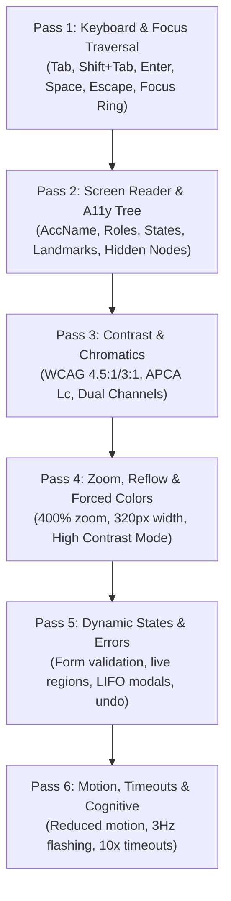

# Auditing, Conformance & The Exception Protocol

> **Mandate**: *An audit without evidence is speculation; an audit without remediation is noise.* 
> This reference manual details the multi-pass audit execution procedure, the 4-tier Epistemic Evidence Ladder, the mathematical finding schema, and the formal protocol for handling technical exceptions.

---

## 1 · The 6-Pass Adversarial Audit Workflow

Never audit an interface by jumping randomly across screens. Execute an adversarial inspection through 6 deterministic passes:



### Pass Checklist & Inspection Prompts
1. **Pass 1 — Keyboard & Focus Mechanics**:
   - Disconnect the mouse. Can every interactive task be reached and completed using only `Tab`, arrow keys, `Enter`, and `Space`?
   - Is a distinct focus ring ($\Delta L^* \ge 3:1$) visible on every single focused element?
   - Do modals trap focus? Does pressing `Escape` dismiss the modal and restore focus to the trigger?
2. **Pass 2 — Assistive Tree & Semantics**:
   - Inspect the platform accessibility tree dump. Does every button, link, and input have a concise, meaningful accessible name?
   - Are redundant role announcements eliminated (e.g. no `"Submit button, button"`)?
   - Are decorative icons properly hidden (`aria-hidden="true"`)?
3. **Pass 3 — Chromatic & Contrast Verification**:
   - Check text contrast against all background states (normal, hover, active, disabled).
   - Verify that status indicators (error, success, warning) do not rely solely on color.
4. **Pass 4 — Zoom, Reflow & Forced Colors**:
   - Zoom viewport to $400\%$ ($320\text{px}$ width). Does content reflow vertically without horizontal scrollbars?
   - Enable OS High Contrast / Forced Colors. Do buttons, active tabs, and input borders remain clearly visible?
5. **Pass 5 — Dynamic States & Error Recovery**:
   - Trigger form validation failures. Does focus move to the error summary? Are errors programmatically linked via `aria-describedby`?
   - Are dynamic updates announced via live regions without interrupting user focus?
6. **Pass 6 — Motion, Timeouts & Cognitive Friction**:
   - Enable `prefers-reduced-motion`. Do non-essential animations cease?
   - Check for optical flashing $> 3\text{Hz}$.
   - Are timed sessions equipped with a 2-minute warning and $10\times$ extension toggle?

---

## 2 · The 4-Tier Epistemic Evidence Ladder

To eliminate false conformance claims, every audit finding and verification report must declare its evidence tier:

```
[Tier 4: Dynamic Task Completion & Assistive Verification] (Highest Confidence)
  └─ Real or simulated screen-reader / AT event stream completes full task flow with verified feedback.
[Tier 3: Rendered Surface & Accessibility Tree Inspection]
  └─ Computed CSS styles, composited pixel contrast, forced-colors rendering, live OS a11y tree dump.
[Tier 2: Headless Dynamic DOM / Component State Mount]
  └─ Component rendered in JSDOM / headless runner; synthetic keydown events; activeElement checks.
[Tier 1: Static AST & Syntax Linting] (Lowest Confidence)
  └─ Static source code regex / ESLint a11y rules; presence of aria-* attributes in markup.
```

> **The Axiom of Honest Scoping**: *Static AST linters ($\mathcal{E}_1$) catch at most 25% of accessibility defects. You may never claim "WCAG Conformance" based solely on $\mathcal{E}_1$ or $\mathcal{E}_2$ checks.*

---

## 3 · The Mathematical Finding Protocol

Every audit finding must be reported using this strict mathematical schema:

$$\text{Finding} = [\text{Anchor}] + [\text{User Task & Barrier}] + [\text{Violated Invariant / Standard Link}] + [\text{Severity 0--4}] + [\text{Evidence Tier}] + [\text{Concrete Remediation}]$$

### Severity Grading Definitions
* **Severity 0 (Cosmetic)**: Code hygiene or redundant markup (e.g. redundant `role="button"` on `<button>`). No barrier to task completion.
* **Severity 1 (Minor Friction)**: Mild hesitation or awkward announcement. User easily bypasses it without assistance.
* **Severity 2 (Moderate Impediment)**: Significant friction. Requires non-obvious workarounds or multiple attempts.
* **Severity 3 (Major Barrier)**: Prevents a specific category of users (keyboard-only or screen-reader) from completing the task without human assistance.
* **Severity 4 (Catastrophic Blocker)**: System lockout, keyboard trap, unrecoverable data loss, or physical safety violation (e.g., seizure-inducing flashing).

---

## 4 · The Formal Accessibility Conformance Exception Protocol (RFC)

When physical constraints, third-party vendor code, or platform limitations make 100% compliance impossible, an agent must **never** silently ignore requirements or loop endlessly in speculative fixes. It must formalize an **Accessibility Exception RFC**:

### The 6 Mandatory Elements of an Exception
1. **Identifier & Scope**: Unique ID, component name, and affected file path.
2. **Technical Constraint**: Specific technical or physical reason why standard compliance cannot be achieved (e.g., third-party binary, embedded hardware limitation).
3. **Affected Invariants & Standard SC**: Specific invariants ($\mathcal{A}_1 - \mathcal{A}_8$) and WCAG criteria impacted.
4. **Blast Radius & Affected Population**: Exact user groups affected (e.g. keyboard-only users navigating 3D canvas).
5. **Compensating Alternative Pathway**: The alternative, accessible mechanism provided to ensure equivalence of outcome (e.g. a tabular view or telephone fallback).
6. **Remediation & Sunset Target**: Milestone or date when the exception will be re-evaluated or resolved.

### Template Exception Record
```markdown
### [A11Y-EXCEPTION-2026-01] Legacy WebGL Molecule Viewer
- **Anchor**: `src/components/MoleculeVisualizer.tsx`
- **Technical Constraint**: Closed-source WebGL canvas library with no internal accessibility tree hooks.
- **Affected Invariants**: $\mathcal{A}_2$ (Native Semantics), $\mathcal{A}_3$ (Modality Independence) · WCAG 2.2 SC 2.1.1.
- **Blast Radius**: Keyboard-only and screen-reader users cannot manipulate 3D molecular bonds.
- **Compensating Alternative Pathway**:
  - Implemented an accessible semantic `<table>` listing all atoms, bonds, and spatial coordinates.
  - Added a CSV download button allowing direct extraction of molecular structure data.
- **Sunset Target**: Q4 2026 platform migration to SVG-based retained renderer.
- **Approved By**: Architecture Lead & Accessibility Specialist.
```
