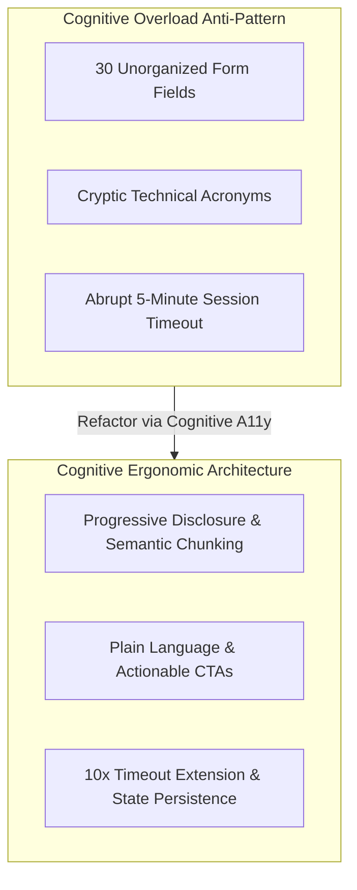
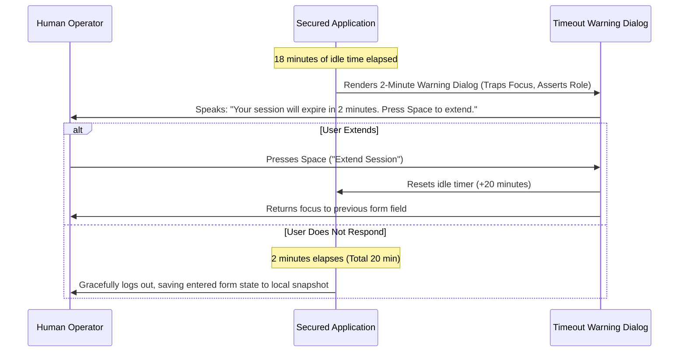

# Cognitive Accessibility, Sensory Overload & Motion Defense

> **Mandate**: *Accessibility is not limited to physical blindness or motor impairment; it fundamentally defends human cognitive bandwidth.* 
> An interface that overwhelms working memory, flashes aggressively, triggers vestibular nausea through unconstrained motion, or abruptly logs users out without warning is deeply hostile to users with ADHD, autism, dyslexia, anxiety, vestibular disorders, or cognitive exhaustion.

---

## 1 · Cognitive Ergonomics & Working Memory Ceilings

Human working memory can hold only $7 \pm 2$ discrete chunks of information simultaneously (Miller's Law), and decision time increases logarithmically with the number of choices (Hick-Hyman Law).



### The 4 Cognitive Invariants
1. **Semantic Chunking**: Group related inputs into discrete, titled sections using `<fieldset>` and `<legend>` (or platform native equivalents). Never present more than 5–7 unrelated inputs on a single screen without progressive disclosure.
2. **Recognition Over Recall**: Never force users to remember information entered on Step 1 while completing Step 3. Provide persistent breadcrumbs, step counters, and live order/input summaries.
3. **Plain Language Discipline**:
   - Write UI microcopy at an 8th-grade reading level (Flesch-Kincaid Grade Level $\le 8$).
   - Avoid internal system jargon (e.g., use `"Failed to save your profile"` instead of `"HTTP 500: Database Connection Pool Exhausted"`).
   - Use active voice and specific action verbs on buttons (e.g. `"Send Application"` instead of `"Submit"`).
4. **Predictable Focus & Layout Stability**:
   - Never change layout context or trigger popups unexpectedly simply because an input received focus or changed value.
   - Form inputs must only trigger submission when the user explicitly activates a "Submit" control.

---

## 2 · Sensory Overload, Vestibular Health & Motion Defense

Vestibular disorders affect the inner ear, causing unprompted motion, parallax scrolling, or scaling transitions to induce severe nausea, vertigo, and migraines. Furthermore, rapid optical flashing can trigger epileptic seizures.

### 1. The Reduced Motion Invariant (`prefers-reduced-motion`)
Every non-essential animation (parallax scrolling, 3D rotations, zoom scaling, page transition slides) must be muted when the user requests reduced motion:

```css
/* Universal Motion Shield */
@media (prefers-reduced-motion: reduce) {
  *,
  *::before,
  *::after {
    animation-duration: 0.01ms !important;
    animation-iteration-count: 1 !important;
    transition-duration: 0.01ms !important;
    scroll-behavior: auto !important;
  }
}
```
*Note*: Essential functional transitions (such as an opacity fade indicating a loading state) may remain, provided they do not involve rapid spatial translation or scaling.

### 2. The Flashing & Seizure Threshold (WCAG 2.3.1)
- **The 3Hz Invariant**: No element may flash or flicker more than **3 times per second** ($> 3\text{Hz}$) unless the flash is below the general flash and red flash thresholds.
- Avoid repeating strobe alerts, pulsating neon buttons, or rapidly alternating colored banners.

### 3. Auto-Play & Carousel Controls
- Any audio or video that starts automatically must provide an immediate, accessible **Pause or Stop control** within the first 3 seconds, or an option to mute system audio.
- Carousels, tickers, and auto-scrolling sliders must include a prominent **Pause/Play toggle** and pause automatically whenever mouse hover or keyboard focus enters the container.

---

## 3 · The 10x Timeout Extension Rule

Abrupt session timeouts represent a catastrophic barrier for users who require additional time to read text, navigate with switch devices, or process cognitive steps.



### The 3 Timeout Invariants
1. **The 2-Minute Warning**: The system must warn the user at least **2 minutes prior** to any impending timeout.
2. **1-Click / 1-Keystroke Extension**: The warning must offer a single interactive button or keypress that extends the session by at least **$10\times$ the default warning window** (e.g. at least 20 minutes).
3. **Form State Preservation**: If a session expires regardless, the application must cache unsubmitted form data in local storage or a server snapshot so the user can resume immediately upon re-authenticating without retyping data.
