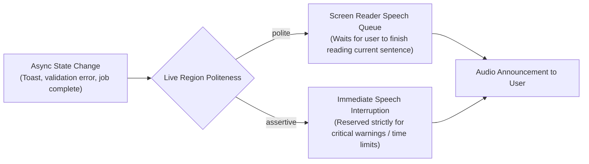
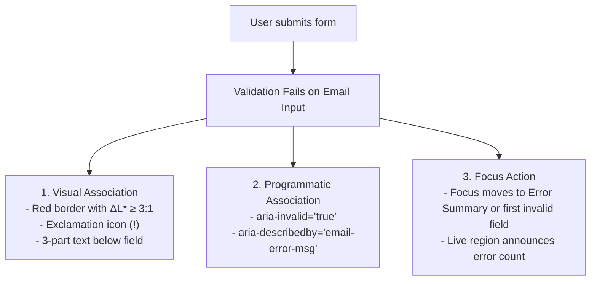
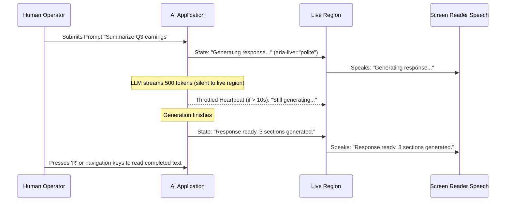

# Dynamic States, Streaming Liveness & Error Recovery

> **Mandate**: *Errors and dynamic state mutations are critical accessibility states, not mere visual side-effects.* 
> When content updates asynchronously—whether via network fetching, form validation, background workers, or real-time LLM token streaming—assistive technology users must be kept informed without having their focus stolen or their audio buffers flooded.

---

## 1 · The Assistive Live Region Architecture

Live regions notify screen-reader users of dynamic changes occurring outside the current focus target without pulling focus away from the user's active cursor.



### The Three Live Region Dimensions
1. **Politeness (`aria-live` / `LiveSetting`)**:
   - `polite`: The assistive engine finishes uttering current words before announcing the new update. **Use for 95% of dynamic notifications** (toasts, search result counts, cart updates, background completions).
   - `assertive`: The assistive engine immediately cuts off current speech to announce the message. **Use strictly for critical system alerts** (imminent session timeout, urgent payment failure, safety warnings).
2. **Atomicity (`aria-atomic`)**:
   - `aria-atomic="true"`: When any text inside the container changes, the assistive engine announces the **entire** container contents.
   - `aria-atomic="false"`: The engine announces only the exact text chunk that was appended or mutated.
3. **Relevance (`aria-relevant`)**:
   - Default: `additions text`. Announces added text nodes; ignores element deletions to avoid spamming "removed item" updates.

### Pre-Rendering Invariant
* **Crucial Implementation Rule**: The live region container element itself **must already exist in the DOM / UI tree before** the text update occurs. Dynamically injecting an entire `aria-live` container at the moment of an error causes many screen readers to ignore it entirely. Pre-render the empty container in the initial markup, then inject text content when the event fires.

---

## 2 · The 3-Part Accessible Error Invariant

Every validation failure or operational error must be accessible across three distinct sensory and programmatic dimensions:

$$\text{AccessibleError} = \langle \text{Visual Association}, \text{Programmatic Association}, \text{Focus Action} \rangle$$



### 1. The 3-Part Error Content Structure
Never display cryptic or unhelpful errors like `"Invalid input"`. Every error message must contain:
1. *What happened*: In plain, human language (e.g., `"The email address is missing an '@' symbol."`).
2. *Impact on data*: (e.g., `"Your invitation cannot be sent until this is resolved."`).
3. *Actionable recovery step*: (e.g., `"Enter an email in the format user@example.com."`).

### 2. Programmatic Input Association
```html
<label for="user-email">Email Address</label>
<input 
  type="email" 
  id="user-email" 
  name="email" 
  aria-invalid="true" 
  aria-describedby="email-error-msg email-hint"
/>
<span id="email-hint" class="hint">Work or personal email</span>
<span id="email-error-msg" class="error-text" role="alert">
  <span class="icon" aria-hidden="true">⚠️</span>
  Missing an '@' symbol. Enter an email in the format name@domain.com.
</span>
```

### 3. Focus Placement on Form Submission
When an entire form is submitted and multiple errors exist:
- Render an **Error Summary Banner** at the top of the form with `role="alert"` and `tabindex="-1"`.
- Programmatically move focus to the Error Summary Banner.
- List each failed field as an internal anchor link (e.g. `<a href="#user-email">Email Address: Missing '@' symbol</a>`). Clicking or activating the link directly focuses the invalid input.

---

## 3 · AI Streaming Liveness & Generative UI Invariants

Modern applications frequently integrate generative LLMs that stream tokens dynamically into chat panes, document editors, or generative UI canvases. Without defensive accessibility engineering, streaming causes severe assistive failures.

### The Speech Buffer Saturation Problem
If a component updates an `aria-live` region with each incoming LLM token, the browser dispatches 20 to 100 accessibility events per second. The screen reader's text-to-speech engine crashes, freezes, or produces a cacophony of repeated syllables.

### The Debounced Lifecycle Announcer Pattern



### The 4 AI Streaming Invariants
1. **Zero Per-Token Announcements**: Streaming text containers must **never** be decorated with `aria-live="polite"` or `aria-live="assertive"`.
2. **Lifecycle State Machine**: Use a dedicated, visually hidden live region that announces only discrete milestones:
   - On dispatch: `"Processing prompt..."`
   - On completion: `"Response generated. Press Down Arrow to review."`
   - On tool action: `"Calling database tool..."`
   - On failure: `"Generation failed: Network timeout. Press Retry."`
3. **Anchor Focus Stability**: User focus must **remain fixed** on the prompt input or the trigger button while generation occurs. Never rip focus into the streaming output container while text is actively mutating.
4. **Keyboard Cancellation Guarantee**: Provide an immediate keyboard shortcut (e.g., `Escape` or `Cmd+.`) to abort or pause generation. When canceled, preserve the partial output and announce `"Generation paused"`.

---

## 4 · Asynchronous Loading & Skeleton Screens

When content is loading over the network:
- **Skeleton Placeholders**: Visual skeleton loading blocks must be marked `aria-hidden="true"`. A screen reader must never announce `"grey placeholder box, image"` 12 times in a row.
- **Container Busy State**: Set `aria-busy="true"` on the parent container while network fetching is active. When the payload renders, set `aria-busy="false"` to allow assistive inspection.
- **Determinate vs Indeterminate Progress**:
  - Indeterminate: Use `role="status"` with text `"Loading transactions..."`.
  - Determinate: Use a native `<progress value="45" max="100">` or `role="progressbar"` with `aria-valuenow`, `aria-valuemin`, and `aria-valuemax`.
