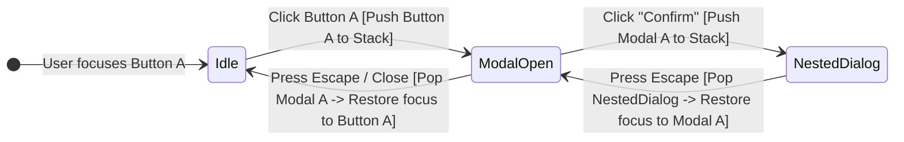
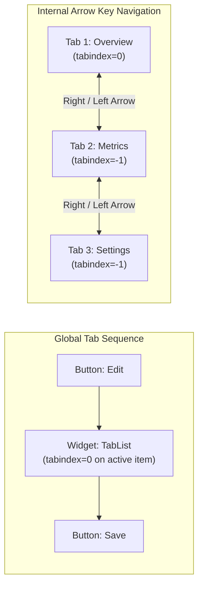

# Keyboard, Focus & Interaction Mechanics

> **Mandate**: *Every interactive task must be reachable, operable, understandable, and recoverable without a pointing device.* 
> If a keyboard, switch device, or screen-reader user cannot navigate to an element, operate its controls, or see where the cursor is located, the software has suffered a total functional failure. Focus order, visibility, and containment must behave like a deterministic state machine.

---

## 1 · The LIFO Focus Stack Machine

Modal dialogs, action sheets, context menus, and sliding drawers introduce non-linear navigation interruptions. To prevent focus from getting lost in background DOM nodes or obliterated when closing, every interface must implement a **Last-In, First-Out (LIFO) Focus Stack**:



### The 4 Focus Stack Invariants
1. **Initial Trapping Target**: When an overlay opens, focus must programmatically move to the first interactive element inside the container, or to the container itself if it contains introductory text (`tabindex="-1"`).
2. **Cycle Tab Navigation**: When the user presses `Tab` on the last focusable element inside the modal, focus must loop to the first focusable element. When pressing `Shift+Tab` on the first element, focus must loop to the last element.
3. **The Escape Invariant**: Pressing the platform's standardized dismiss key (`Escape` on desktop/web, Back gesture on mobile/Android) must dismiss the top-most overlay.
4. **Deterministic Focus Restoration**: When the overlay dismisses, focus **must** be returned to the exact trigger element that opened it. Focus must never be dropped to `document.body` or the top of the viewport.

---

## 2 · Focus Progression & Roving Tabindex

### Natural Tab Sequence vs Composite Widgets
- **Page-Level Navigation**: Standard sequential elements (form fields, individual buttons, links) participate in the natural tab order (`tabindex="0"`).
- **Composite Interactive Widgets**: In composite controls containing dozens of sub-items (toolbars, menu bars, tab strips, tree views, grids), having every single item in the tab order causes keyboard fatigue. Use the **Roving Tabindex** or **Active Descendant** pattern:



### The Roving Tabindex Algorithm
1. The currently selected or active sub-item has `tabindex="0"`.
2. All non-active sibling items have `tabindex="-1"`.
3. Pressing `Tab` moves focus out of the entire widget to the next control on the page.
4. Pressing `ArrowRight` / `ArrowDown` (or `ArrowLeft` / `ArrowUp`):
   - Sets `tabindex="-1"` on the current sub-item.
   - Advances to the next sub-item (wrapping around if needed).
   - Sets `tabindex="0"` on the newly active sub-item.
   - Calls `.focus()` on the newly active sub-item.

---

## 3 · Perceptual Physics of Focus Indicators

A focus indicator is a life-critical navigation cursor for keyboard users. Removing it with `outline: none` or hiding it behind overflow boundaries renders the interface invisible.

### The 4 Physical Focus Requirements
1. **Luminance Contrast ($\Delta L^* \ge 3:1$)**:
   The focus indicator must maintain at least a $3:1$ contrast ratio against:
   - The surface background immediately adjacent to it.
   - The background of the unfocused component itself.
   *Dual-Ring Pattern*: To guarantee $3:1$ contrast on any arbitrary background (light, dark, or image), use a dual-layer ring (e.g. a $2\text{px}$ white outline offset by a $2\text{px}$ dark outer ring).
2. **Minimum Enclosing Thickness**:
   The focus indicator must be at least $2\text{px}$ thick and enclose the interactive perimeter.
3. **No Overflow Clipping**:
   Ensure parent containers with `overflow: hidden` or `overflow: scroll` do not clip negative-offset focus rings. Use an internal inset outline (`outline-offset: -2px`) or ensure adequate internal padding.
4. **Visibility in Forced Colors**:
   In Windows High Contrast Mode or forced-colors themes, CSS box-shadows are stripped. Always declare a physical `outline: 2px solid transparent`, which becomes rendered as the system `Highlight` color in high-contrast mode.

---

## 4 · Skip Navigation & Landmark Hopping

On web applications with expansive header banners, top menus, and search bars, a keyboard user must press `Tab` dozens of times before reaching page content.

### The Skip-to-Content Pattern
Place a "Skip to main content" link as the very first interactive node in the DOM:
```html
<a href="#main-content" class="skip-link">Skip to main content</a>

<style>
.skip-link {
  position: absolute;
  top: -999px;
  left: 1rem;
  background: #000;
  color: #fff;
  padding: 0.75rem 1.25rem;
  z-index: 10000;
  font-weight: 600;
  border-radius: 4px;
}
.skip-link:focus {
  top: 1rem; /* Becomes visually prominent only when focused */
  outline: 3px solid #2563eb;
}
</style>

<main id="main-content" tabindex="-1">
  <!-- Main content begins here -->
</main>
```
*Note*: Adding `tabindex="-1"` to `<main>` allows older browsers and assistive technologies to programmatically receive focus when the skip link is activated.

---

## 5 · Standard Keyboard Interaction Matrix

| Composite Component | Activation Keys | Internal Navigation Keys | Dismiss / Exit Keys |
| :--- | :--- | :--- | :--- |
| **Button / Link** | `Enter`, `Space` | N/A | N/A |
| **Checkbox / Switch** | `Space` | N/A | N/A |
| **Radio Group** | `Space` (selects) | `ArrowUp`, `ArrowDown`, `ArrowLeft`, `ArrowRight` (moves & selects) | `Tab` (exits group) |
| **Tabs** | `Space` / `Enter` (or automatic on focus) | `ArrowLeft`, `ArrowRight` (horizontal) / `ArrowUp`, `ArrowDown` (vertical) | `Tab` (moves into active tab panel) |
| **Menu / Dropdown** | `Enter`, `Space`, `ArrowDown` | `ArrowDown`, `ArrowUp`, `Home`, `End` | `Escape` (closes menu, returns focus to trigger) |
| **Combobox / Autocomplete** | `Enter` (selects), `ArrowDown` (opens list) | `ArrowDown`, `ArrowUp` (navigates options) | `Escape` (closes popup, clears selection) |
| **Modal / Dialog** | `Enter`, `Space` (on buttons) | `Tab`, `Shift+Tab` (cycles within dialog) | `Escape` (dismisses modal, restores focus) |
| **Accordion / Disclosure** | `Enter`, `Space` (toggles) | `ArrowDown`, `ArrowUp` (moves between headers) | `Tab` (exits into panel content) |
| **Slider** | N/A | `ArrowRight`/`ArrowUp` (+step), `ArrowLeft`/`ArrowDown` (-step), `PageUp`/`PageDown` (+large step), `Home`/`End` (min/max) | `Tab` |
