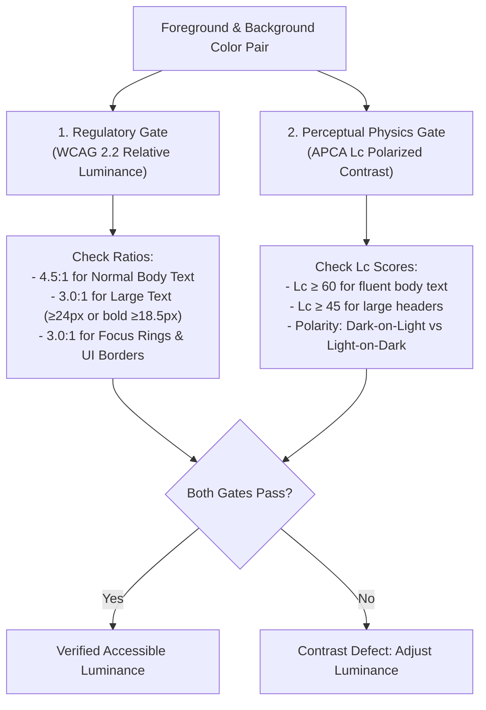
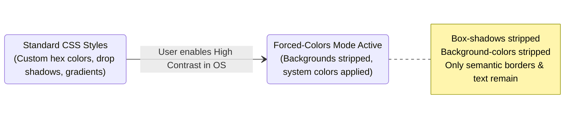

# Perceptual Physics: Dual Contrast, Reflow & Forced Colors

> **Mandate**: *Visual perception is governed by optics, ocular luminance mechanics, and spatial frequency, not arbitrary hex codes.* 
> An interface must remain legible and navigable across the full spectrum of human eyesight, ambient lighting conditions, high-magnification viewports, and operating system contrast overrides.

---

## 1 · The Dual Contrast Model (WCAG & APCA)

Contrast evaluation requires balancing regulatory compliance with perceptual optical reality.



### 1. The Regulatory Standard: WCAG 2.2 Relative Luminance
Relative luminance ($L$) is computed from sRGB components normalized to $[0, 1]$:
$$R_s = \begin{cases} \frac{R}{12.92} & \text{if } R \le 0.04045 \\ \left(\frac{R + 0.055}{1.055}\right)^{2.4} & \text{otherwise} \end{cases}$$
$$L = 0.2126 R_s + 0.7152 G_s + 0.0722 B_s$$
$$\text{Contrast Ratio} = \frac{L_1 + 0.05}{L_2 + 0.05} \quad (\text{where } L_1 > L_2)$$

* **Minimum Ratios**:
  - **$4.5:1$**: Standard body text ($< 24\text{px}$ regular, $< 18.5\text{px}$ bold).
  - **$3.0:1$**: Large text ($\ge 24\text{px}$ regular, $\ge 18.5\text{px}$ bold).
  - **$3.0:1$**: User Interface Components (active borders of inputs, checkboxes, toggle buttons, and focus indicators against surrounding surfaces).

### 2. The Perceptual Physics Standard: APCA (WCAG 3.0 Ready)
WCAG 2's mathematical formula has well-documented optical flaws: it over-rewards dark colors against dark backgrounds and under-penalizes thin saturated fonts (e.g. orange text on white). 
The **Advanced Perceptual Contrast Algorithm (APCA)** accounts for:
- **Luminance Polarity**: Light text on dark backgrounds requires higher contrast than dark text on light backgrounds due to ocular light scattering (haloing).
- **Spatial Frequency & Weight**: Thinner font strokes require higher luminance contrast ($L^c$) to be decipherable by the human retina.
- *Rule of Thumb*: Aim for $L^c \ge 60$ for fluent body reading, and never use font weights below $400$ on small text.

---

## 2 · Forced Colors & Windows High Contrast Mode

Operating systems (notably Windows High Contrast Mode and macOS Increased Contrast) allow users to override all application styling with a restricted, high-visibility system palette.



### The 3 Forced-Colors Invariants
1. **The Transparent Border Invariant**:
   If an input or button relies solely on a background fill color (e.g., a solid pill button with no border), when High Contrast Mode strips the background fill, **the button perimeter disappears completely**.
   *Fix*: Always declare an explicit border, even if transparent in normal mode:
   ```css
   .button {
     background-color: #2563eb;
     color: #ffffff;
     border: 2px solid transparent; /* Becomes system Highlight in forced colors */
     border-radius: 6px;
   }
   ```
2. **CSS System Color Keywords**:
   Use system color keywords when designing custom widgets intended to blend seamlessly into user themes:
   - `Canvas` / `CanvasText`: Background and body text.
   - `ButtonFace` / `ButtonText`: Button surface and button label.
   - `Highlight` / `HighlightText`: Selected items, active focus indicators, checked states.
3. **Never Suppress Forced Colors Arbitrarily**:
   Do **not** use `forced-color-adjust: none` on entire pages or layouts. Reserve it strictly for specialized items that lose their meaning without specific colors (such as a multi-colored syntax highlighter or a graphic color-picker swatch).

---

## 3 · 400% Zoom & Responsive Reflow Physics

Low-vision users rely on browser zoom up to $400\%$ to read content. An interface must reflow elastically without horizontal clipping.

### The 320px Viewport Equivalence
A desktop viewport of $1280\text{px}$ width zoomed to $400\%$ renders at an effective CSS viewport width of:
$$\text{Effective Width} = \frac{1280\text{px}}{4.0} = 320\text{px}$$

### The 4 Reflow Stress Invariants
1. **No 2D Scrolling**: Content must reflow into a single vertical column. Horizontal scrolling is strictly prohibited, except for content where two-dimensional spatial layout is essential (e.g., spreadsheets, maps, data charts).
2. **Elastic Typographic Units**: Never declare typography, layout containers, or padding in fixed, rigid pixel units (`px`). Use root-relative units (`rem`, `em`, `ch`, `%`) so that user browser font overrides reflow naturally.
3. **No Truncation with Ellipsis on Critical Content**: Avoid `text-overflow: ellipsis` on interactive buttons, links, or instructional text. When zoomed, truncated text hides critical actions. Allow text to wrap onto multiple lines.
4. **Text Spacing Override Survival (WCAG 1.4.12)**:
   The interface must remain completely readable and functional when the following user stylesheet overrides are applied:
   - Line height: $\ge 1.5\times$ font size.
   - Paragraph spacing: $\ge 2.0\times$ font size.
   - Letter spacing: $\ge 0.12\times$ font size.
   - Word spacing: $\ge 0.16\times$ font size.
   Ensure containers use `min-height` rather than fixed `height` so content does not overflow and clip.
