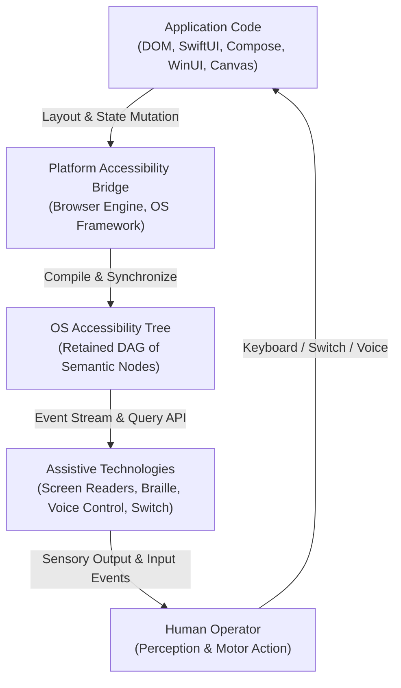
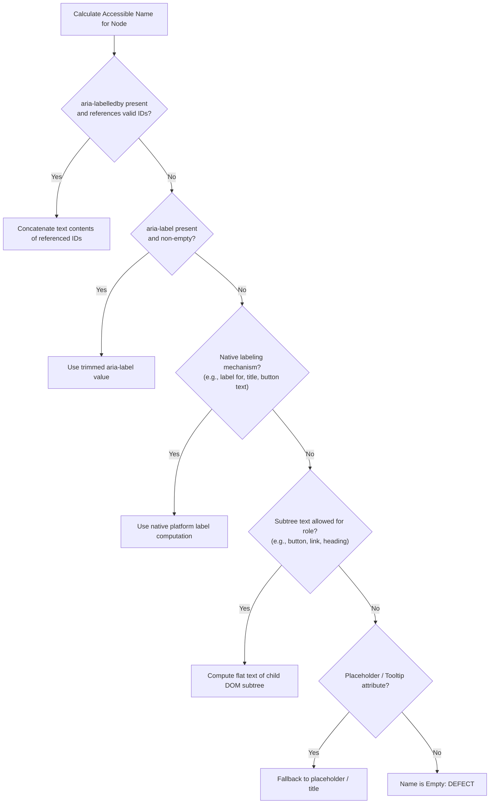

# Universal Accessibility Invariants & The Assistive Technology Tree

> **Mandate**: *Code syntax is merely an intermediate representation; user perception occurs in the platform accessibility tree.* 
> Assistive technologies (screen readers, braille displays, voice control engines, switch devices) do not parse HTML source strings or Swift view structs directly. They query the operating system's compiled **Accessibility Tree**. To build accessible software across any platform, an engineer must master how runtime controls compile into accessibility tree nodes.

---

## 1 · The Platform Accessibility Tree Architecture

Every modern operating system maintains a parallel, semantic object model derived from the application runtime's visual tree. When an interface renders, the platform bridges the visual display to assistive technologies through platform-specific Accessibility APIs:

### The 5 Major Platform Accessibility Bridges
1. **Windows**: **UI Automation (UIA)** (modern) and **Microsoft Active Accessibility (MSAA) / IAccessible2** (legacy). Uses `AutomationElement`, control patterns (`InvokePattern`, `ValuePattern`, `SelectionPattern`), and property change events.
2. **macOS & iOS**: **NSAccessibility Protocol** (macOS) and **UIAccessibility** (iOS). Uses accessibility elements, attributes (`AXRole`, `AXTitle`, `AXValue`), traits (`.isButton`, `.isModal`), and notifications (`.screenChanged`).
3. **Linux / Unix**: **ATK** and **AT-SPI2** (Assistive Technology Service Provider Interface) via D-Bus. Uses roles, states, and relations.
4. **Android**: **AccessibilityNodeInfo** and **AccessibilityService**. Uses actions (`ACTION_CLICK`, `ACTION_SCROLL`), window state changed events, and semantic properties.
5. **Modern Browsers**: The **Blink/Gecko/WebKit Accessibility Engine**. Parses DOM and CSS, computes the accessible name, resolves ARIA attributes, and exposes the tree directly to the underlying OS API.

---

## 2 · The Universal Node Quadruplet

Regardless of operating system or language, every node in an accessibility tree is defined by four core dimensions:

$$\text{AccessibilityNode} = \langle \mathcal{R}, \mathcal{N}, \mathcal{S}, \mathcal{A} \rangle$$

### 1. Role ($\mathcal{R}$)
What the element represents to the user. 
- *Examples*: Button, Checkbox, Dialog, Heading, Link, Tab, TreeItem, Slider, Alert.
- *Invariant*: The role communicates the interaction contract. If an element has role `button`, the user expects it to activate on `Space` and `Enter`. If it has role `checkbox`, it must toggle checked state.

### 2. Accessible Name ($\mathcal{N}$)
The primary human-readable text label that identifies the node.
- *Examples*: `"Close"`, `"Save changes"`, `"Billing address"`.
- *Invariant*: Every interactive node must have a non-empty accessible name ($\mathcal{N} \neq \emptyset$). Unlabeled icons are fatal defects.

### 3. State & Value ($\mathcal{S}$)
The dynamic operational condition of the element.
- *State Flags*: `expanded` (true/false), `selected` (true/false), `checked` (true/false/mixed), `disabled` (true/false), `invalid` (true/false), `busy` (true/false).
- *Values*: Range values (`current: 40, min: 0, max: 100`) or textual values (`"United States"`).

### 4. Actions & Events ($\mathcal{A}$)
The programmatic invocations the node supports.
- *Examples*: `Invoke()`, `Expand()`, `Collapse()`, `SetValue(x)`, `Dismiss()`, `Scroll()`.

---

## 3 · Accessible Name and Description Computation (accname 1.2)

To ensure assistive technologies read the correct label, follow the formal precedence rules of the **Accessible Name and Description Computation** standard:

### Critical Rules for Accessible Names
1. **No Duplicate Phrasing**: Do not include the role in the accessible name. For example:
   - ❌ Bad: `<button aria-label="Submit button">` $\to$ Screen reader announces: *"Submit button, button"*.
   - ✅ Good: `<button aria-label="Submit application">` $\to$ Screen reader announces: *"Submit application, button"*.
2. **Hidden Element References**: `aria-labelledby` can reference elements that are visually hidden (`display: none` or `visibility: hidden`), allowing visual designers to keep labels off-screen while screen readers resolve the full title.
3. **The Accessible Description**: Use `aria-describedby` or secondary description mechanisms for supplementary instructions (e.g. password rules, format hints). The description is announced *after* the name and role.

---

## 4 · Semantic Tree Pruning & Invisibility Hygiene

Assistive technology users perceive interface complexity directly through the size and structure of the accessibility tree. A cluttered tree creates cognitive fatigue.

### The Three Pruning Primitives
1. **Decorative Elements**:
   - Web: `aria-hidden="true"` or empty `alt=""`.
   - iOS: `.accessibilityHidden(true)`.
   - Android: `contentDescription = null`.
   - *Rule*: Purely decorative background shapes, decorative icons adjacent to text, and visual spacers must be stripped from the accessibility tree.
2. **Modal Inactivity (Backdrop Inertness)**:
   - When a modal dialog opens, all background siblings must be made inert:
   - Web: Native `<dialog>` handles this automatically; on custom containers use the `inert` attribute.
   - iOS: Mark modal containers with `.accessibilityAddTraits(.isModal)`.
   - Android: Mark background panes with `Modifier.semantics { invisibleToUser() }`.
3. **Semantic Grouping (Container Flattening)**:
   - Combine disparate micro-elements (an avatar image, a username, and a timestamp in a list row) into a single semantic node:
   - Web: Wrap row in a single link or button, or apply `role="group"` with `aria-label`.
   - iOS: `.accessibilityElement(children: .combine)`.
   - Android: `Modifier.semantics(mergeDescendants = true) { ... }`.
   - *Impact*: Reduces the number of repetitive swipe gestures from 5 down to 1.

---

## 5 · Landmarking & Spatial Wayfinding

Landmarks allow screen-reader and voice-control users to bypass repetitive content and jump directly to relevant sections:

| Universal Landmark Role | Web HTML5 Tag / ARIA Role | Mobile / Desktop Native Translation |
| :--- | :--- | :--- |
| **Banner (Top-level shell)** | `<header>` / `role="banner"` | Top Navigation Bar / Window Toolbar |
| **Main Content** | `<main>` / `role="main"` | Primary Scroll View / Content Pane |
| **Navigation** | `<nav>` / `role="navigation"` | Tab Bar / Drawer Navigation / Sidebar |
| **Complementary** | `<aside>` / `role="complementary"` | Inspector panel / Contextual sidebar |
| **Contentinfo** | `<footer>` / `role="contentinfo"` | Bottom Status Bar / Shell Footer |
| **Search** | `<search>` / `role="search"` | Dedicated Search Toolbar / Search Field Group |

* **Landmark Uniqueness Rule**: If an interface contains more than one instance of a landmark (e.g., two `<nav>` regions), each must have a distinct accessible name (e.g., `aria-label="Main Navigation"` and `aria-label="Account Settings"`).
