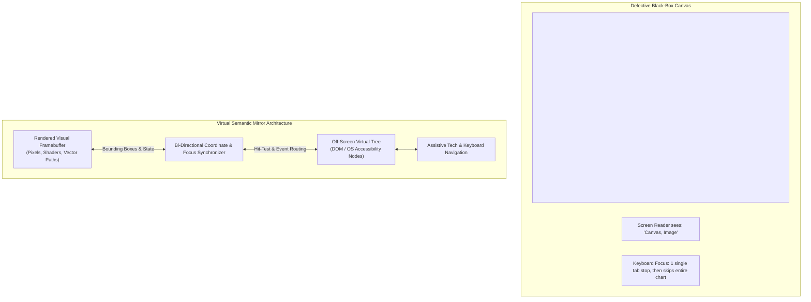
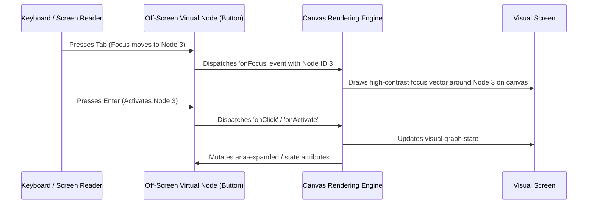

# Virtual Semantic Mirrors: Canvas, WebGL, Games & Spatial UI

> **Mandate**: *Pixels rendered onto a flat graphics buffer are invisible to assistive technologies unless backed by an explicit semantic mirror.* 
> Modern interactive systems—data charts, 2D/3D WebGL visualizations, Flutter `CustomPainter` widgets, game engines, and spatial XR interfaces—render direct framebuffers. Accessibility in these environments cannot rely on native HTML tags; it requires an **Off-Screen Virtual Semantic Mirror**.

---

## 1 · The Direct Pixel Rendering Dilemma

Standard HTML or mobile native elements produce OS accessibility nodes automatically. A `<canvas>` or WebGL viewport, by contrast, is a single black-box bitmap:



Without an active semantic bridge, a complex 50-node financial chart or interactive diagram appears to a screen reader as nothing more than `"image"`.

---

## 2 · The Virtual Semantic Mirror Pattern

To make custom graphical surfaces fully accessible, maintain an off-screen retained tree of interactive semantic nodes synchronized with the graphical engine:



### The 4 Mirror Invariants
1. **Node Equivalence**: Every interactive visual entity rendered on the canvas (nodes, bars, slices, buttons, sliders) must have a corresponding off-screen semantic node.
2. **Spatial Coordinate Synchronization**:
   - The virtual node must have physical dimensions matching its visual counterpart:
     ```css
     .virtual-node {
       position: absolute;
       /* Bounding box dynamically synced with canvas entity */
       top: var(--entity-y);
       left: var(--entity-x);
       width: var(--entity-w);
       height: var(--entity-h);
       opacity: 0.001; /* Invisible visually, but hit-testable by OS accessibility APIs */
     }
     ```
3. **Visual Focus Rendering**: When an off-screen virtual node receives focus, the canvas rendering loop **must** draw a visual focus indicator ($\Delta L^* \ge 3:1$) directly onto the visual canvas around that entity's coordinates.
4. **Hit-Testing Bi-Directionality**: Clicking the physical canvas must forward focus to the corresponding virtual node; activating the virtual node must trigger the canvas action.

---

## 3 · The Tabular Alternative Invariant (Data Visualizations)

Even with a virtual semantic mirror, exploring a scatter plot with 2,000 data points or an intricate multi-line graph via sequential arrow keys can be overwhelming for keyboard and screen-reader users.

### The 1-Click Alternate View Contract
Every complex data visualization or graphical simulation **must** provide a visible, 1-click toggle button (accompanied by an `Alt+T` keyboard shortcut) that swaps the visual canvas with a fully accessible semantic `<table>` or tree grid:

```html
<div class="chart-container">
  <div class="chart-controls">
    <button id="toggle-data-view" aria-controls="chart-canvas chart-table" aria-expanded="false">
      Show Data Table (Alt+T)
    </button>
  </div>

  <!-- Primary Graphical Canvas -->
  <canvas id="chart-canvas" role="region" aria-label="Quarterly Revenue Trend"></canvas>

  <!-- Semantic Fallback Table (Hidden or Rendered on Toggle) -->
  <table id="chart-table" class="data-table" hidden>
    <caption>Quarterly Revenue Trend (2025–2026)</caption>
    <thead>
      <tr>
        <th scope="col">Quarter</th>
        <th scope="col">Gross Revenue ($M)</th>
        <th scope="col">Growth (%)</th>
      </tr>
    </thead>
    <tbody>
      <tr><th scope="row">Q1 2025</th><td>$12.4</td><td>+8.2%</td></tr>
      <tr><th scope="row">Q2 2025</th><td>$14.1</td><td>+13.7%</td></tr>
    </tbody>
  </table>
</div>
```

---

## 4 · Game Engines & Spatial XR Ergonomics

When building interactive games (Unity, Unreal, Godot) or spatial computing interfaces (WebXR, Apple Vision Pro, Meta Quest):

1. **Spatial Audio Anchoring**:
   - Environmental audio must be paired with visible directional captions (e.g., `"[Explosion to the left]"` with an on-screen visual compass indicator).
2. **Input Remapping & Hold Toggles**:
   - Never require holding a physical trigger or key down continuously for longer than 3 seconds. Provide a settings toggle to convert "Hold" actions into "Press to Toggle".
   - Allow full remapping of every button, key, and gesture.
3. **Gaze Dwell & Head Tracking**:
   - In spatial XR, allow gaze-dwell selection (staring at an interactive node for $N$ milliseconds triggers activation) as an alternative to hand-pinch or controller clicks.
4. **Adjustable Game Speed & Field of View**:
   - Allow users to reduce simulation tick speed (e.g., $0.5\times$ or $0.75\times$) for complex real-time decision-making without penalties.
