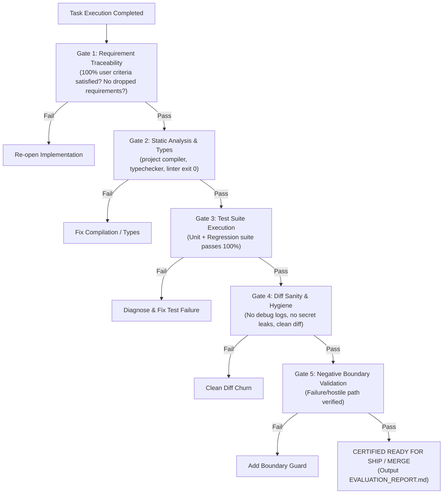

# Agent Evaluation: Task Verification Gate & Self-Audit Protocol

> **Mandate**: Never declare a task complete merely because code was edited. Code changes are unverified hypotheses until proven by concrete execution evidence. Audit requirement satisfaction, execute compilers and tests, inspect the git diff for hygiene, and certify completion with verifiable citations.

---

## 1 · The 5-Point Verification Gate

Before declaring success or reporting completion to the user, every task must pass through the **5-Point Verification Gate**:

### Gate 1: Requirement Traceability
* Verify every explicit requirement, constraint, and acceptance criterion in the user's prompt.
* If the prompt asked for "X with error handling for Y", verify that *both* X and Y are implemented.
* If any requirement was dropped, modified, or postponed, disclose it explicitly.

### Gate 2: Static Analysis & Types
* Run the project's configured compiler, typechecker, or linter (e.g. `tsc --noEmit`, `mypy`, `cargo check`, `go vet`, or the repository's configured build/lint task).
* Must exit with code `0`. Zero type errors, zero compiler warnings. In dynamic environments without a compiler, execute the project's standard static linter or syntax verification.

### Gate 3: Test Suite Execution
* Run the target module's scoped tests AND the full workspace regression test suite.
* Capture real execution evidence (passed test count, execution time, exit code `0`).
* Never claim tests pass based on assumption—execute the command and inspect output.

### Gate 4: Diff Sanity & Hygiene
* Inspect `git diff` against the starting branch commit.
* Verify: No leftover debug statements (`console.log`, `pdb`, `print`), no temporary scratch files, no formatting-only thrashing on untouched files, and no secret keys (see [`references/diff-hygiene-rules.md`](references/diff-hygiene-rules.md)).

### Gate 5: Negative Boundary Validation
* Confirm that at least one negative or hostile path (e.g. invalid parameter, unauthorized access, missing file) was exercised and verified to fail gracefully with an appropriate error.

---

## 2 · The Gate Verdict

Based on the 5-point evaluation, issue exactly one verdict:

| Verdict | Meaning | Permitted Action |
| :--- | :--- | :--- |
| **`CERTIFIED_READY`** | All 5 gates passed with empirical evidence. | Propose commit, open PR, or present final solution to user. |
| **`BLOCKED`** | One or more gates failed. | Halt, enter self-correction loop, or disclose exact failure evidence to user. |

*(Detailed criteria and checklist: [`references/verification-checklist.md`](references/verification-checklist.md)).*

---

## 3 · The Recovery Ladder (On Gate Failure)

When a gate fails, execute disciplined recovery rather than thrashing:

1. **Step 1 (Analyze)**: Read the exact compiler error message, failed test assertion diff, or git diff discrepancy.
2. **Step 2 (Localize)**: Determine whether the failure was caused by the new code, a missing mock setup, or a broken assumption.
3. **Step 3 (Surgical Fix)**: Apply the minimal necessary patch to resolve the failure.
4. **Step 4 (Re-Verify)**: Re-run the failed gate from the beginning. Never skip forward to Gate 5 if Gate 2 or 3 failed.
5. **Step 5 (Escalate if Stuck)**: If three remediation attempts fail, invoke `failure-recovery` or halt mutations, summarize the blocker with exact logs and citations, and ask the user for guidance.

---

## 4 · Output Standards

When completing major milestones or submitting complex changes, summarize the verification pass using the standardized format in [`examples/evaluation-report-template.md`](examples/evaluation-report-template.md):
- **Citations**: Line-anchored references for all key implementations.
- **Commands Executed**: Exact shell commands and exit codes.
- **Diff Summary**: Lines added, removed, and files modified.

---

## 5 · The Clean Evaluation Stopping Contract

An evaluation audit is strictly **COMPLETE** only when:
1. **100% Traceability Verified**: Every prompt requirement is verified or explicitly disclosed.
2. **Static Health Verified**: Project's compiler, typechecker, or linter passes cleanly with exit code `0`.
3. **Test Suite Green**: Target and regression test suites pass with empirical execution evidence.
4. **Diff Hygiene Confirmed**: Zero secrets, debug statements, extraneous scratch files, or unwanted whitespace churn.
5. **Negative Control Verified**: Hostile or failure boundaries have been tested and verified to fail gracefully.
6. **Verdict Certified**: Exactly one clear verdict (`CERTIFIED_READY` or `BLOCKED`) is documented.
