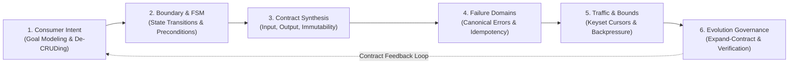
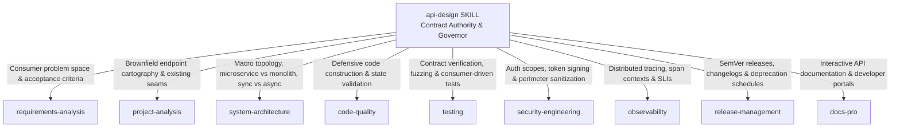

# API Design: Universal Interface Boundary & Contract Evolution Protocol

> **Mandate**: *An interface contract is an immutable covenant between independent computing systems.* An API is not a mechanical reflection of an internal database table, nor is it a casual collection of transport routes. It is the formal specification of consumer intent, state transitions, failure boundaries, and operational guarantees.
> 
> True API design defines durable contracts first, protects against accidental implementation leakage ([Hyrum's Law](https://www.hyrumslaw.com/)), enforces deterministic idempotency across untrusted networks, bounds computational resource consumption, and governs evolution through monotonic additive compatibility. This protocol empowers agent architectural creativity across any protocol, rejects cargo-cult CRUD dogmatism, and routes specialized execution to the Arsenal ecosystem.

---

## 1 · The 6-Phase Universal API Design Lifecycle

Every interface task—from tweaking a single parameter to architecting a global multi-protocol API platform—traverses this closed-loop lifecycle:



1. **Phase 1 — Consumer Intent & Semantic Modeling**:
   * Derive operations from consumer mental models and Jobs-to-be-Done (from [`requirements-analysis`](../requirements-analysis/SKILL.md)).
   * Apply the **Anti-CRUD Sieve**: distinguish raw persistence entities from intent-revealing business transitions (see [`references/semantics-idempotency-and-state-transitions.md`](references/semantics-idempotency-and-state-transitions.md)).
2. **Phase 2 — Boundary Cartography & Finite State Modeling**:
   * Chart entity lifecycles using explicit state transition matrices ($\mathcal{S}_{\text{current}} \times \text{Op} \to \mathcal{S}_{\text{next}}$).
   * Define concurrency controls (Optimistic locking via ETags / version sequences) to prevent lost updates.
3. **Phase 3 — Formal Contract Specification**:
   * Define input parameters, return payloads, and field immutability constraints.
   * Apply the **Parnas Encapsulation Shield**: eliminate internal database IDs, execution timing variances, and implementation leaks ($\mathcal{H}(I) \to 0$, see [`references/contract-first-and-evolution-governance.md`](references/contract-first-and-evolution-governance.md)).
4. **Phase 4 — Canonical Failure Domains & Resilience**:
   * Map domain errors into canonical error categories (Invalid Argument, Not Found, Already Exists / Conflict, Permission Denied, Resource Exhausted, Precondition Failed, Internal Error).
   * Specify deterministic idempotency semantics for all mutating operations (In-flight mutex locks, payload fingerprinting $H(p)$, and TTL caching).
5. **Phase 5 — Resource Bounding & Traffic Governance**:
   * Enforce **Keyset / Cursor Pagination** for all collections; clamp client limits to $N_{\text{max}}$ (see [`references/resource-bounding-pagination-and-traffic.md`](references/resource-bounding-pagination-and-traffic.md)).
   * Establish traffic envelopes, query complexity budgets, and standardized rate-limit backpressure headers (`Retry-After`).
6. **Phase 6 — Evolution Governance & Contract Verification**:
   * Apply the **Monotonic Compatibility Axiom** ($\Delta_{\text{breakage}} = 0$). For breaking changes, mandate the **3-Phase Expand-Contract Protocol** (see [`examples/api-evolution-and-deprecation-walkthrough.md`](examples/api-evolution-and-deprecation-walkthrough.md)).
   * Hand off verified contracts to [`testing`](../testing/SKILL.md) and [`security-engineering`](../security-engineering/SKILL.md).

---

## 2 · Progressive Disclosure (Reference Routing)

To prevent cognitive overload and preserve LLM context bandwidth, consult reference manuals strictly on demand based on task context:

| Context Trigger | Mandatory Reference Manual | Purpose |
| :--- | :--- | :--- |
| **Breaking changes, SemVer, schema evolution, deprecation lifecycles, Hyrum's law** | [`references/contract-first-and-evolution-governance.md`](references/contract-first-and-evolution-governance.md) | Hyrum's metric ($\mathcal{H}$), additive change law, Expand-Contract pattern, sunset headers, brownfield anti-corruption. |
| **Action verbs, CRUD avoidance, state machines, duplicate requests, idempotency** | [`references/semantics-idempotency-and-state-transitions.md`](references/semantics-idempotency-and-state-transitions.md) | Intent operations, FSM transition tables, concurrent lock state machine, payload hashing ($H(p)$), batch semantics. |
| **Status codes, error responses, canonical errors, retry backoff** | [`references/canonical-error-and-failure-domains.md`](references/canonical-error-and-failure-domains.md) | Canonical error taxonomy, tripartite error envelope, CWE-209 sanitization, full jitter backoff formula. |
| **Pagination, query limits, slow lists, rate limits, GraphQL depth** | [`references/resource-bounding-pagination-and-traffic.md`](references/resource-bounding-pagination-and-traffic.md) | Keyset cursors, offset pitfalls, query complexity scoring, token bucket algorithms, rate limit headers. |
| **Auth scopes, multi-tenancy leaks, mass assignment, trace propagation** | [`references/interface-security-and-observability-contracts.md`](references/interface-security-and-observability-contracts.md) | Zero ambient authority, non-spoofable tenant resolution, allowlist validation, W3C traceparent propagation. |
| **Formal contract document creation & schema authoring** | [`examples/universal-api-contract-template.md`](examples/universal-api-contract-template.md) | Markdown specification template for capturing any API design cleanly across any paradigm. |
| **Step-by-step production migration without downtime** | [`examples/api-evolution-and-deprecation-walkthrough.md`](examples/api-evolution-and-deprecation-walkthrough.md) | Concrete trace: legacy plan migration via Expand-Contract, deprecation headers, and safe tombstoning. |
| **Cross-protocol comparisons (REST vs gRPC vs Events vs CLI vs MCP)** | [`examples/multi-archetype-contract-specimens.md`](examples/multi-archetype-contract-specimens.md) | Rosetta Stone modeling the exact same domain operation across 5 distinct archetypes. |

---

## 3 · Adaptive Cognitive Sizing (The 6 Execution Modes)

Size your API design effort to the task's scope and risk profile. Never apply heavy enterprise bureaucracy to a single-field edit, and never execute speculative, uncontracted mutations across high-blast-radius public boundaries:

| Mode | Trigger & Scope | Engineering Discipline | Required Output & Protocol |
| :--- | :--- | :--- | :--- |
| **`micro-contract`** | Adding an optional field, parameter tweak, or minor backward-compatible adjustment. | Instant compatibility check $\to$ verify boundary validation $\to$ test assertion. **Zero boilerplate**. | **3-Line Contract Intent Block** directly preceding code change. |
| **`endpoint-spec`** | Single new operation, RPC method, CLI command, or webhook trigger. | Consumer intent $\to$ operation semantics $\to$ schema contract $\to$ error taxonomy $\to$ idempotency rule. | Operation Specification (in schema, spec doc, or PR description). |
| **`subsystem-contract`** | New inter-service interface, module API, public library SDK, or shared package boundary. | Boundary cartography $\to$ type schemas $\to$ auth scopes $\to$ telemetry contract $\to$ consumer contract tests. | Subsystem Contract Baseline (OpenAPI, Protobuf, IDL, or Type definitions). |
| **`public-api-evolution`** | Breaking change, major version bump, field deprecation, or public contract migration. | Compatibility diff analysis $\to$ Expand-Contract strategy $\to$ sunset timeline $\to$ migration shim. | API Migration & Deprecation Plan. |
| **`protocol-migration`** | Porting an interface across paradigms (e.g. REST $\to$ gRPC, synchronous HTTP $\to$ event queue). | Domain abstraction $\to$ protocol mapping adapter $\to$ dual-run parity tests $\to$ cutover plan. | Cross-Protocol Parity Specification. |
| **`enterprise-platform`** | Multi-team API styleguide, schema registry governance, or federated API gateway rollout. | Global taxonomy $\to$ linting ruleset $\to$ breaking-change CI gate $\to$ versioning policy. | Enterprise API Governance Charter. |

### The 3-Line Contract Intent Protocol (For `micro-contract` Mode)
When operating in `micro-contract` mode, emit this block directly preceding implementation:
```markdown
> **Contract Mutation**: [Exact operation, symbol, or parameter modified]
> **Compatibility Proof**: [Why this is strictly backward-compatible or opt-in]
> **Error/Boundary Invariant**: [Validation bound and canonical error on violation]
```

---

## 4 · The 8 Universal API Design Invariants

Regardless of language, framework, runtime environment, or transport protocol, every robust interface upholds these 8 timeless invariants:

### 4.1 Invariant 1: Contract-First Primacy & Hyrum's Law Shielding
- The formal interface contract must be declared and validated before implementation.
- All internal implementation artifacts (database column names, auto-increment IDs, internal exception class names, serialization key ordering, execution timing variations) must be strictly encapsulated.

### 4.2 Invariant 2: Symmetric Semantic Clarity & Consumer Mental Model
- Interfaces must be engineered from the outside in. Operations must model consumer goals and intent-revealing domain transitions, rejecting anemic CRUD mirroring of database tables.

### 4.3 Invariant 3: Deterministic State Convergence & Idempotency
- Any mutating operation that traverses an untrusted network, process boundary, or async queue must support deterministic idempotency via deduplication tokens or natural mathematical idempotency ($f(f(x)) = f(x)$).
- Idempotency implementations must handle in-flight concurrency locks (returning Conflict / In-Progress status), verify payload fingerprint hashes ($H(p)$) to reject key reuse with altered payloads (returning Invalid Argument / Unprocessable), and enforce bounded TTL storage.

### 4.4 Invariant 4: Closed Canonical Failure Domains
- Failure is a first-class citizen of the contract. Errors must belong to a standardized, machine-readable taxonomy with unambiguous recovery semantics (retryable vs terminal), sanitized actionable guidance, and an operational correlation ID.
- Transport status must match domain outcome: returning transport-level success (such as HTTP 200 or process exit code 0) alongside an embedded error payload is strictly prohibited.

### 4.5 Invariant 5: Monotonic Compatibility & Additive Evolution
- Contracts must evolve monotonically: new fields are optional, existing fields cannot be deleted or semantically mutated, and enums must support unknown variants.
- Breaking changes require a formal 3-phase Expand-Contract deprecation lifecycle (Announce $\to$ Dual-Run $\to$ Sunset).

### 4.6 Invariant 6: Resource Boundedness & Backpressure Defense
- No interface shall permit unbounded execution. Collections must be bounded and cursor-paginated (using deterministic keyset ordering); nested query depths must be budgeted; traffic must declare rate limits and backpressure envelopes (`Retry-After`).

### 4.7 Invariant 7: Zero Ambient Authority & Perimeter Defense
- Authority must be explicitly proven at the boundary via non-spoofable context (tokens, capabilities). Tenant identifiers must be derived cryptographically from verified credentials, never accepted from untrusted client payloads.
- All incoming parameters must be validated against strict boundary allowlists before crossing into core domain logic.

### 4.8 Invariant 8: Observability & Telemetry Traceability as Contract
- Interface envelopes must reserve space for causal context propagation (`traceparent`, correlation IDs), ensuring end-to-end auditability and SLA/SLO verification without breaking the transport boundary.

---

## 5 · The API Design Invariant Exception Protocol (Extreme Edge Cases)

When exceptional constraints (ultra-low-latency financial trading where JSON/Proto serialization overhead is forbidden, microcontrollers with extreme memory ceilings, or legacy third-party protocols that violate canonical standards) conflict with standard API invariants:

> [!CAUTION] API INVARIANT EXCEPTION PROTOCOL
> An agent may deliberately bypass an API design invariant (e.g., using raw unpaginated byte buffers or non-canonical error formats) **IF AND ONLY IF**:
> 1. **Operational Constraint Citation**: Explicitly cites the physical or system blocker.
> 2. **Quarantined Boundary Containment**: Confines the non-conforming interface behind an isolated adapter or private network boundary.
> 3. **Micro-ADR Registration**: Documents the trade-off, rationale, and security mitigations in `API_EXCEPTIONS.md` or the contract specification.

---

## 6 · Universal Archetype Adaptation Matrix

The 8 invariants adapt dynamically across every software archetype:

* **REST & Web APIs**: Represent resources with nouns and state changes with specific verbs; map canonical errors to standard HTTP status codes (400, 401, 403, 404, 409, 422, 429, 500); use Keyset cursors for pagination.
* **gRPC & RPC Protocols**: Model service procedures using Protocol Buffers; map errors to `google.rpc.Status` codes; enforce streaming backpressure and deadlines via gRPC contexts.
* **Asynchronous Event Streams**: Include event IDs, timestamps, and schema version metadata; guarantee message idempotency via unique deduplication keys; support schema evolution via avro/proto registries.
* **CLI & Systems Daemons**: Use POSIX-compliant flags and subcommands; map errors to meaningful exit codes (0=success, non-zero=failure); support deterministic output formats (`--json`) for machine consumption.
* **SDKs & In-Process Libraries**: Maintain semantic versioning guarantees; expose strongly-typed domain interfaces; avoid leaking internal dependencies or global state.
* **AI Agent MCP Tools**: Provide unambiguous tool names and human/agent-readable descriptions; define strict JSON schema parameter bounds; return actionable structured error strings when tool arguments are invalid.

---

## 7 · The Arsenal Skill Boundary & Routing Contract

`api-design` serves as the **Contract Authority & Evolution Governor** for software boundaries. It coordinates with specialized sibling skills:



* **When to remain in `api-design`**:
  * Defining new API endpoints, RPC services, GraphQL schemas, CLI commands, or MCP tools.
  * Formalizing input validation rules, output schemas, and nullability semantics.
  * Designing state machine lifecycles and intent-revealing action verbs.
  * Specifying canonical error taxonomies and idempotency execution contracts.
  * Formulating cursor-based pagination and traffic rate-limiting policies.
  * Planning non-breaking API evolution, deprecation schedules, and sunset migrations.
* **When to transition to sibling skills**:
  * **To [`requirements-analysis`](../requirements-analysis/SKILL.md)**: When the root user intent or business problem is ambiguous and must be disambiguated before contract design.
  * **To [`system-architecture`](../system-architecture/SKILL.md)**: When deciding system-wide topology (event mesh vs synchronous REST, microservices vs modular monolith).
  * **To [`code-quality`](../code-quality/SKILL.md)**: When implementing the defensive internal logic and making illegal states unrepresentable inside the service.
  * **To [`testing`](../testing/SKILL.md)**: When authoring consumer-driven contract tests, endpoint integration suites, or hostile fuzzing harnesses.
  * **To [`security-engineering`](../security-engineering/SKILL.md)**: When implementing cryptographic token verification, TLS/mTLS termination, or CORS policies.
  * **To [`release-management`](../release-management/SKILL.md)**: When tagging SemVer releases, generating release notes, or executing multi-environment cutovers.

---

## 8 · Guardrails & Strictly Disallowed Actions

- ❌ **No Implementation Leaks (Hyrum's Law Violation)**: Never expose internal database auto-increment IDs, internal table names, SQL query errors, or internal language stack traces across public interfaces.
- ❌ **No Anemic CRUD Dogma**: Never force discrete business actions (cancel, approve, refund) into generic field mutations that bypass state transition validations.
- ❌ **No Unpaginated Collections**: Never create an endpoint that returns unbounded lists (`items[]`) without limit caps and cursor navigation.
- ❌ **No Unvalidated Ingestion (Blind Postel's Law)**: Never bind incoming untrusted payloads directly to internal database models without strict allowlist validation.
- ❌ **No Ambient Tenant Authority**: Never accept `tenant_id` from client request bodies or query strings in multi-tenant architectures; tenant identity must be cryptographically extracted from auth context.
- ❌ **No Silent Breaking Changes**: Never alter an existing field's type, remove a field, or change error semantics without an explicit 3-phase Expand-Contract deprecation plan.
- ❌ **No Ambiguous Status Codes**: Never return transport-level success (HTTP 200 or process exit 0) with an embedded error payload, breaking downstream error handling.
- ❌ **No Unprotected Mutating Retries**: Never expose non-idempotent mutation endpoints without explicit idempotency replay tokens and in-flight concurrency locks.

---

## 9 · The API Design Stopping Contract

An API design task is strictly **COMPLETE** only when all of the following conditions are verified:

1. **Consumer Intent Verification**: Every operation directly addresses a documented user goal or business transition, free of internal implementation leakage.
2. **Schema & Invariant Completeness**: Request and response schemas declare explicit types, bounds (`minLength`, `maxLength`, `minimum`, `maximum`), nullability, and immutability rules.
3. **Canonical Error Definition**: All failure paths map to the canonical taxonomy with actionable, sanitized messages and trace correlation IDs.
4. **Idempotency & Concurrency Proof**: Mutating operations specify deterministic deduplication mechanisms and optimistic locking semantics where concurrent updates are possible.
5. **Resource Boundedness**: Keyset cursor pagination and maximum limit clamps ($N_{\text{max}}$) are enforced on all collection queries.
6. **Compatibility Certification**: The interface is mathematically proven to be backward-compatible ($\Delta_{\text{breakage}} = 0$) or accompanied by a formal 3-phase Expand-Contract migration plan.
7. **Downstream Traceability**: The contract specification is recorded in an appropriate schema artifact (OpenAPI, Protobuf, GraphQL, IDL, or Markdown spec) and verified ready for implementation.
