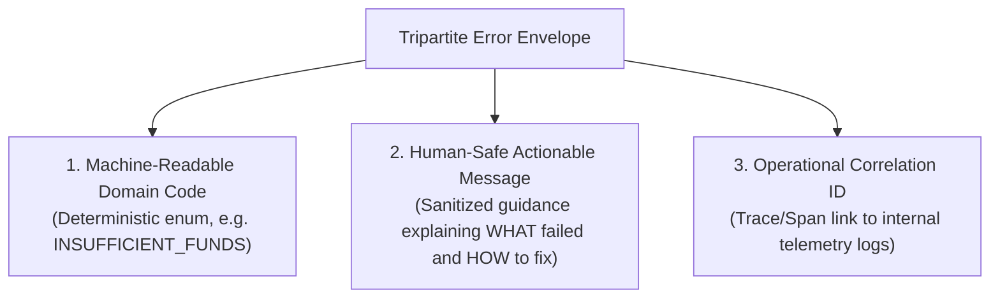

# Canonical Error & Failure Domains

> **Mandate**: *Errors are not embarrassing implementation accidents; they are first-class functional specifications.* A system that fails ambiguously, leaks internal stack traces, or returns conflicting status indicators breaks consumer trust and destroys automated fault recovery. Robust API engineering defines a closed, machine-readable error taxonomy, separates domain failures from transport errors, and guarantees safe, actionable error contracts across all perimeters.

---

## 1 · The 12-Tier Universal Canonical Error Taxonomy

Regardless of whether an interface is expressed over HTTP, gRPC, GraphQL, IPC, or an in-process SDK, all computable failure conditions map into this **12-tier canonical taxonomy**:

| Canonical Code | Semantics & Domain Cause | HTTP (RFC 9457) | gRPC Code | Client Action | Retryable? |
| :--- | :--- | :--- | :--- | :--- | :--- |
| **`INVALID_ARGUMENT`** | Client specified an invalid argument (schema validation failed, malformed payload, out-of-range value). | `400 Bad Request` | `INVALID_ARGUMENT` (3) | Fix input before retrying | ❌ No |
| **`UNAUTHENTICATED`** | Request lacks valid authentication credentials (missing, expired, or invalid token/signature). | `401 Unauthorized` | `UNAUTHENTICATED` (16) | Renew/attach credentials | ❌ No (until authed) |
| **`PERMISSION_DENIED`** | Caller is authenticated but lacks required permission/scope for the target resource. | `403 Forbidden` | `PERMISSION_DENIED` (7) | Request elevated scope | ❌ No |
| **`NOT_FOUND`** | A specified resource could not be found (or caller lacks permission to know it exists). | `404 Not Found` | `NOT_FOUND` (5) | Verify resource identifier | ❌ No |
| **`ALREADY_EXISTS`** | Attempt to create an entity that already exists (unique constraint violation). | `409 Conflict` | `ALREADY_EXISTS` (6) | Inspect existing entity | ❌ No |
| **`FAILED_PRECONDITION`** | System is not in a state required for execution (e.g. order already completed; optimistic lock mismatch). | `412 Precondition` / `409` | `FAILED_PRECONDITION` (9) | Fetch fresh state & re-evaluate | ❌ No |
| **`RESOURCE_EXHAUSTED`** | Quota limit exceeded, rate limit hit, or client budget depleted. | `429 Too Many Req` | `RESOURCE_EXHAUSTED` (8) | Back off until `Retry-After` | ⚠️ Yes (with backoff) |
| **`UNPROCESSABLE_ENTITY`**| Syntax is valid JSON/proto, but semantic domain rules failed (e.g. start date is after end date). | `422 Unprocessable` | `INVALID_ARGUMENT` (3) | Correct domain logic | ❌ No |
| **`ABORTED`** | Concurrency conflict, deadlock, or transaction abort caused by simultaneous competing operations. | `409 Conflict` | `ABORTED` (10) | Retry immediately or with jitter | ⚠️ Yes |
| **`UNAVAILABLE`** | Service is experiencing transient load, maintenance, or dependent system outage. | `503 Service Unavail` | `UNAVAILABLE` (14) | Retry with exponential backoff | ⚠️ Yes |
| **`DEADLINE_EXCEEDED`** | Operation exceeded client- or server-specified timeout deadline. | `504 Gateway Timeout` | `DEADLINE_EXCEEDED` (4) | Check operation status / retry | ⚠️ Yes (if idempotent) |
| **`INTERNAL_ERROR`** | Unrecoverable server-side failure or unexpected internal invariant violation. | `500 Internal Error` | `INTERNAL` (13) | Report correlation ID to support | ❌ No (investigate) |

---

## 2 · The Tripartite Error Envelope

Every error returned across an interface must contain three distinct layers of information:



### 2.1 RFC 9457 Problem Details Standard (REST / HTTP)

For HTTP APIs, follow the standardized [RFC 9457](https://www.rfc-editor.org/rfc/rfc9457.html) specification with custom extensions:

```json
{
  "type": "https://api.example.com/errors/insufficient-funds",
  "title": "Insufficient Funds",
  "status": 422,
  "detail": "Account 'acc_01HZX87' requires a minimum balance of $50.00 to complete this transfer.",
  "instance": "/transfers/tx_99812",
  "code": "INSUFFICIENT_FUNDS",
  "trace_id": "4bf92f3577b34da6a3ce929d0e0e4736",
  "invalid_params": [
    {
      "name": "amount",
      "reason": "Transfer amount exceeds available credit limit.",
      "value": 15000
    }
  ]
}
```

### 2.2 Rich Error Details Model (gRPC / Protobuf)

For gRPC, use `google.rpc.Status` with typed message details from `google/rpc/error_details.proto`:

```protobuf
// Standard rich error payload unpacked from status.details
message ErrorPayload {
  google.rpc.ErrorInfo error_info = 1;         // Machine-readable reason & domain metadata
  google.rpc.BadRequest bad_request = 2;       // Field-level validation violations
  google.rpc.PreconditionFailure precondition = 3; // Violated state preconditions
  google.rpc.RetryInfo retry_info = 4;         // Exact backoff delay for rate-limited calls
}
```

---

## 3 · Information Leakage & Defensive Sanitization (CWE-209)

Exposing internal mechanics in error messages is a severe security vulnerability that violates **Parnas Encapsulation** and **Hyrum's Law**:

### 3.1 Prohibited Observable Leaks
* ❌ **Raw Exception Names**: `org.postgresql.util.PSQLException`, `NullPointerException`, `ECONNREFUSED`.
* ❌ **SQL Query Fragments**: `"Syntax error near line 4: SELECT * FROM user_secrets WHERE..."`.
* ❌ **Internal Network Topology**: `"Failed to connect to redis-cluster-node-03.internal.corp:6379"`.
* ❌ **Filesystem Paths**: `"/var/app/services/auth/crypto_key_store.py", line 42`.
* ❌ **Timing Discrepancies**: Different response times that allow attackers to enumerate existing usernames or passwords.

### 3.2 Defensive Sanitization Rule
```
IF Error is Internal or Unexpected:
    Log full stack trace + telemetry context to secure internal logging.
    Attach correlation trace_id to error context.
    Return to client:
        Code: "INTERNAL_ERROR"
        Message: "An unexpected error occurred. Please contact support quoting trace ID {trace_id}."
        TraceID: {trace_id}
```

---

## 4 · Domain vs Transport Separation (The "HTTP 200 Error" Anti-Pattern)

A critical failure in legacy API design is returning an HTTP `200 OK` status with a payload containing `{ "success": false, "error": "Invalid password" }`.

### Why This Breaks Systems:
1. **Network Infrastructure Blindness**: API Gateways, load balancers, and CDNs treat `200 OK` as successful traffic, skewing uptime metrics and caching error pages.
2. **Circuit Breakers Fail**: Resiliency proxies (Envoy, Istio, Sentinel) count `200 OK` as healthy, failing to open circuit breakers during cascading outages.
3. **Consumer Complexity**: Client libraries must parse the entire body and check internal boolean flags rather than relying on standard protocol status branches.

**Rule**: **The transport status must reflect the outcome of the request.** If the request failed to achieve its intended domain transition, the transport status must indicate an error.

---

## 5 · Retry Semantics & Exponential Backoff Contract

The contract must clearly signal whether a failure is **terminal** or **retryable**, and provide guidance to prevent client retry storms from taking down recovering infrastructure.

### 5.1 Retry Invariants

$$\text{ShouldRetry}(E) = \begin{cases} 
\text{True}, & \text{if } E \in \{\text{RESOURCE\_EXHAUSTED}, \text{UNAVAILABLE}, \text{DEADLINE\_EXCEEDED}, \text{ABORTED}\} \\
\text{False}, & \text{if } E \in \{\text{INVALID\_ARGUMENT}, \text{UNAUTHENTICATED}, \text{PERMISSION\_DENIED}, \text{NOT\_FOUND}, \text{UNPROCESSABLE}\}
\end{cases}$$

### 5.2 The Full Jitter Backoff Formula

When retrying retryable errors, clients must apply exponential backoff with full jitter to break client synchronization:

$$T_{\text{sleep}} = \text{Uniform}(0, \; \min(T_{\text{max}}, \; T_{\text{base}} \times 2^{\text{attempt}}))$$

### 5.3 Explicit Server Backoff Hint (`Retry-After`)

Whenever returning `RESOURCE_EXHAUSTED` (429) or `UNAVAILABLE` (503):
* Include the `Retry-After: <seconds>` header (or `google.rpc.RetryInfo.retry_delay`).
* The client must not execute retries until the specified duration has elapsed.
