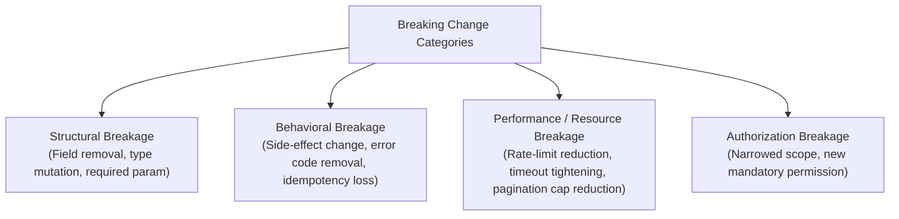
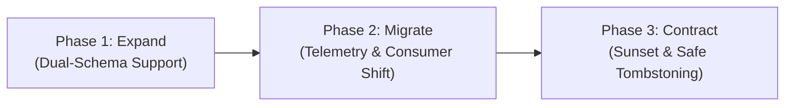

# Contract-First Primacy & Evolution Governance

> **Mandate**: *An interface contract is an immutable covenant between independent systems.* Every uncontracted implementation detail exposed will inevitably become an accidental public dependency ([Hyrum's Law](https://www.hyrumslaw.com/)). True API engineering defines the contract first, strictly encapsulates internal machinery, evolves monotonically through additive changes, and retires legacy interfaces through deterministic deprecation lifecycles.

---

## 1 · Hyrum's Law & Defensive Interface Encapsulation

Hyrum's Law states:
> *"With a sufficient number of users of an API, it does not matter what you promise on the contract: all observable behaviors of your system will be depended on by somebody."*

When an API leaks internal details—such as database autoincrement IDs, internal exception class names, specific JSON key serialization orders, uncontracted HTTP headers, or execution timing variations—consumers build implicit dependencies upon them. When internal refactoring alters these uncontracted details, downstream systems break.

### 1.1 The Hyrum Exposure Surface Metric ($\mathcal{H}$)

We quantify the vulnerability of an interface $I$ to accidental coupling as the ratio of uncontracted observable behaviors to formally specified contract guarantees:

$$\mathcal{H}(I) = \frac{|\mathcal{B}_{\text{observable}} \setminus \mathcal{B}_{\text{contracted}}|}{|\mathcal{B}_{\text{contracted}}|}$$

Where:
* $\mathcal{B}_{\text{contracted}}$ is the set of formally documented, schema-enforced attributes, types, errors, and operational semantics.
* $\mathcal{B}_{\text{observable}}$ is the total set of observable behaviors exhibited by the implementation (response times, header sets, serialization ordering, error text strings, internal metadata).

**Target Invariant**: As an API matures, $\mathcal{H}(I) \to 0$. Any observable output that is not formally contracted must be sanitized, randomized, or encapsulated.

### 1.2 Encapsulation Defenses

1. **Opaque Identifiers**: Never expose raw database primary keys or auto-incrementing integers. Use typed, opaque identifiers (e.g. `usr_01HZX87K9...`, UUIDv7, or domain-prefixed ULIDs).
2. **Deterministic Payload Canonicalization**: Do not rely on runtime serialization ordering (e.g. dictionary hash map iterations). Ensure response serializations are either strictly sorted or explicitly declared unordered in the contract.
3. **Internal Error Redaction**: Never allow internal exceptions, SQL syntax errors, or stack traces to cross the interface perimeter. All failures must be translated into public domain error codes.
4. **Time & Clock Normalization**: Expose time strictly in ISO 8601 / RFC 3339 UTC strings (`2026-09-25T12:00:00Z`) or integer epoch milliseconds. Never expose local server timezones or uncontracted clock drift.

---

## 2 · The Monotonic Compatibility Axiom

An interface evolves safely if and only if every mutation preserves backward compatibility for all existing consumers without requiring coordinated consumer deployments:

$$\text{Contract}(t_2) \supseteq \text{Contract}(t_1) \implies \Delta_{\text{breakage}} = 0$$

### 2.1 The Additive Change Law

Changes to an existing contract are safe if they adhere to the **Additive Change Law**:

| Operation | In Request / Input (Contra-variant) | In Response / Output (Co-variant) | Verdict |
| :--- | :--- | :--- | :--- |
| **Adding a field** | **Must be Optional** (with explicit default) | **Allowed** (Consumer must use tolerant reader) | ✅ Safe / Non-breaking |
| **Removing a field** | **Breaking** (Client may still provide it) | **Breaking** (Client may expect it) | ❌ Forbidden without deprecation |
| **Renaming a field** | **Breaking** | **Breaking** | ❌ Forbidden (Treat as Add + Deprecate) |
| **Relaxing a constraint** (e.g. `min: 5` $\to$ `min: 2`) | **Allowed** (Accepts wider domain) | **Breaking** (Output may violate client expectations) | ⚠️ Asymmetric |
| **Tightening a constraint** (e.g. `max: 100` $\to$ `max: 50`) | **Breaking** (Previously valid inputs rejected) | **Allowed** (Output remains within client expectation) | ⚠️ Asymmetric |
| **Adding an enum variant** | **Breaking** (Old client may not know how to send) | **Allowed IF AND ONLY IF** client implements an unknown fallback variant | ⚠️ Conditionally Safe |

---

## 3 · Breaking Change Taxonomy

A breaking change is any mutation that alters the expected syntax, semantics, or behavioral preconditions of an existing interface.

1. **Structural / Syntactic Breakage**:
   * Changing a field's primitive type (e.g. integer to string).
   * Changing nullability (e.g. nullable string to non-null string).
   * Altering URI paths, RPC method signatures, or CLI flag names.
2. **Behavioral / Semantic Breakage**:
   * Changing the side effect of an operation (e.g. an operation that was previously read-only now alters state).
   * Removing or changing the meaning of an existing canonical error code.
   * Altering the sorting order of default pagination.
3. **Resource & Traffic Breakage**:
   * Reducing the default or maximum page size limit ($N_{\text{max}}$).
   * Drastically tightening rate limits without backward-compatible retry headers.
   * Lowering gateway timeouts below the execution latency of complex operations.
4. **Security & Authorization Breakage**:
   * Requiring a higher privilege scope for an endpoint that was previously public or low-privilege.

---

## 4 · The 3-Phase Expand-Contract Migration Protocol

When a breaking change or major structural refactoring is unavoidable, **never execute an in-place mutation**. Apply the **Expand-Contract Pattern** across three distinct phases:

### Phase 1: Expand (Additive Introduction)
1. Introduce the new field, operation, or endpoint alongside the existing one without altering legacy behavior.
2. Support both inputs concurrently: if the consumer sends the legacy parameter, an internal adapter translates it to the new domain model.
3. Annotate the legacy interface with formal deprecation metadata:
   * REST: HTTP headers `Deprecation: true`, `Sunset: <RFC-3339-Timestamp>`, and `Link: <url>; rel="sunset"`.
   * gRPC: `[deprecated = true]` option on field or method.
   * GraphQL: `@deprecated(reason: "Use newField instead. Sunset: 2027-01-01")`.
   * In-Process / SDK: `@deprecated` decorator or compiler warning attribute.

### Phase 2: Migrate (Dual-Run & Telemetry Monitoring)
1. Monitor operational metrics to track traffic decay on the deprecated interface:
   $$\text{DeprecationTrafficRatio}(t) = \frac{\text{Requests}(I_{\text{deprecated}}, t)}{\text{Requests}(I_{\text{total}}, t)}$$
2. Provide automated migration guides and client SDK shims that redirect legacy calls.
3. If traffic on $I_{\text{deprecated}}$ remains above zero as the sunset date approaches, run proactive outreach to consumers identified by client authorization tokens.

### Phase 3: Contract (Safe Tombstoning & Decommissioning)
1. When $\text{DeprecationTrafficRatio} = 0$ (or the formal sunset window expires following governance approval):
2. Convert the deprecated endpoint into a **Tombstone**:
   * Return a permanent, machine-readable error: HTTP `410 Gone`, gRPC `UNIMPLEMENTED`, or CLI exit code indicating terminal obsolescence.
3. Remove internal translation adapters and dead serialization logic.

---

## 5 · Versioning Strategies & Archetype Trade-offs

There is no single universal versioning mechanism. The right strategy depends on the archetype and distribution model:

| Strategy | Primary Mechanism | Archetype Best Fit | Trade-offs & Invariants |
| :--- | :--- | :--- | :--- |
| **Path / URI Versioning** | `/v1/orders` $\to$ `/v2/orders` | Public REST APIs, multi-tenant SaaS | **Pro**: Clear routing, easy caching. **Con**: Entire API duplicated; discourages fine-grained evolution. |
| **Header / Negotiation Versioning** | `Accept: application/vnd.company.v2+json` | Internal microservices, fine-grained REST | **Pro**: Clean URLs, individual resource versioning. **Con**: Complex cache keys, harder to test via browser. |
| **Package / Module Versioning** | `import ... from "@corp/sdk/v2"` or SemVer in `Cargo.toml` | In-process libraries, SDKs, CLI tools | **Pro**: Enforces compiler-level safety. **Con**: Diamond dependency risks in shared dependency trees. |
| **Package-Level IDL Versioning** | `package orders.v1;` $\to$ `package orders.v2;` | gRPC, Protocol Buffers, Thrift | **Pro**: Binary wire compatibility, side-by-side execution. **Con**: Protobuf message duplication across packages. |
| **Continuous Field Evolution (No Versioning)** | GraphQL schema deprecation, additive JSON | GraphQL, single-page app backends | **Pro**: Zero version sprawl, seamless client updates. **Con**: Schema grows indefinitely; requires disciplined tombstoning. |

---

## 6 · Brownfield Anti-Corruption & Compatibility Strategy

When designing or modifying interfaces in an existing codebase with legacy conventions:

1. **Local Consistency Over Global Dogma**: If the existing system uses snake_case, legacy integer IDs, or custom error wrappers, do not unilaterally introduce camelCase or UUIDs on a single endpoint unless explicitly introducing a new subsystem version.
2. **The Anti-Corruption Adapter**: When connecting modern domain logic to a legacy external API, isolate the legacy contract behind an **Anti-Corruption Layer (ACL)**:
   * Keep external quirks (odd field names, XML wrappers, ambiguous status codes) trapped in the ACL adapter.
   * Provide a clean, invariant-compliant domain interface to the internal application.
3. **Living Interface Inventory**: Document all known exceptions and legacy quirks in a durable interface catalog (`API_CATALOG.md`) with explicit technical-debt tickets for future Expand-Contract remediation.
