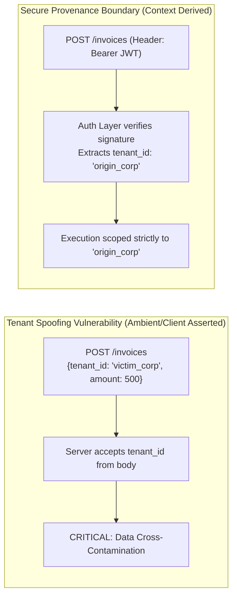
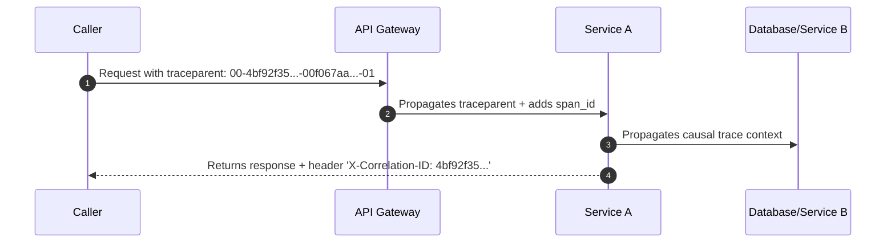

# Interface Security & Observability Contracts

> **Mandate**: *An interface boundary is a hostile security perimeter and the source of truth for distributed vitality.* Never rely on ambient authority or client-supplied tenant identifiers. Security boundaries must be proven explicitly at the gate, untrusted inputs validated against strict mathematical domains, and observability context passed immutably across every boundary to preserve causal trace integrity.

---

## 1 · Zero Ambient Authority & Multi-Tenancy Isolation

Ambient authority—the dangerous anti-pattern where a system implicitly trusts a request based on network location, process environment, or unverified client assertions—is strictly forbidden at interface boundaries.



### 1.1 Non-Negotiable Invariants for Multi-Tenancy
1. **Never Accept `tenant_id` from Client Payloads**: In multi-tenant systems, the tenant/organization identifier must be resolved strictly from the cryptographically verified authentication token (JWT, session certificate, API key record).
2. **Explicit Authorization Scopes**: Every operation contract must declare the exact permissions, scopes, or capabilities required for execution:
   * REST: `Requires Scope: orders:write`
   * gRPC: Method option `[(auth.rule) = { scope: "orders.write" }]`
   * CLI: Operating system user / group permissions check or token configuration.
3. **Fail Closed**: If authorization cannot be deterministically verified due to a token parsing failure, internal auth server timeout, or unrecognized scope, the interface must immediately fail closed with `UNAUTHENTICATED` (401) or `PERMISSION_DENIED` (403).

---

## 2 · Untrusted Boundary Validation & Mass Assignment Defense

All data arriving at an interface perimeter is hostile until proven otherwise.

### 2.1 Defense-in-Depth Validation Rules
1. **Strict Type & Boundary Constraints**:
   * String lengths: Always declare `minLength` and `maxLength` (prevents buffer bloat and ReDoS attacks).
   * Numeric ranges: Always declare `minimum` and `maximum` bounds.
   * Collections: Always bound `minItems` and `maxItems`.
2. **Mass Assignment Prevention (Allowlist Only)**:
   * Never bind untrusted input payloads directly to internal database entity models.
   * Define explicit, dedicated Input Transfer Objects / Request Schemas containing only the exact fields allowed to be mutated.
   * Forbid or strip unknown fields; never allow a client to inject `{ "is_admin": true, "role": "superuser" }` through a generic update endpoint.
3. **Regular Expression Safety**: Any regex pattern used in parameter validation must be audited against **ReDoS (Regular Expression Denial of Service)** polynomial catastrophic backtracking.

---

## 3 · Observability Contracts & Causal Trace Propagation

Interfaces do not exist in isolation; they are nodes in a distributed execution graph. To maintain system vitality and enable rapid root cause analysis, every interface must support distributed context propagation.



### 3.1 Standard Context Headers (OpenTelemetry W3C)

Interfaces must accept and propagate standard W3C Distributed Tracing headers:
* `traceparent`: `00-4bf92f3577b34da6a3ce929d0e0e4736-00f067aa0ba902b7-01`
  * Version (`00`)
  * Trace ID (32 hex characters: unique distributed transaction identifier)
  * Parent Span ID (16 hex characters: immediate upstream caller identifier)
  * Trace Flags (`01` = recorded/sampled)
* `tracestate`: Vendor-specific routing tags and baggage pairs.

### 3.2 Correlation ID Handshake
1. If the client supplies an `X-Correlation-ID` or `X-Request-ID`, validate its format and adopt it in all downstream log messages.
2. If absent, the gateway must generate a cryptographically random, collision-resistant UUIDv7 or trace ID.
3. **Always return the correlation identifier in the response headers and in every error envelope.** This bridges client-side error reports directly to server-side telemetry traces.

---

## 4 · Data Privacy & PII Handling at Interface Boundaries

Interfaces must protect sensitive data (Personally Identifiable Information, secrets, financial records) from leakage into logs, caches, and intermediate proxies:

1. **No Sensitive Data in URLs / Query Parameters**:
   * ❌ `GET /users/search?ssn=123-45-6789` or `GET /reset-password?token=secret123`
   * URLs are recorded in plain text in browser histories, proxy access logs, CDN logs, and server logs.
   * All sensitive data must be passed in the encrypted request body or authorization headers.
2. **Field Masking & Redaction Contracts**:
   * Declare sensitive fields in schemas with security tags:
     ```yaml
     credit_card_number:
       type: string
       format: masked-pan
       example: "************4242"
     ```
   * Ensure internal logging middleware automatically redacts any payload field marked with sensitive or secret annotations.
3. **Cache-Control Defense**: Any endpoint returning sensitive user data must enforce strict caching headers:
   `Cache-Control: no-store, no-cache, private, must-revalidate`.
