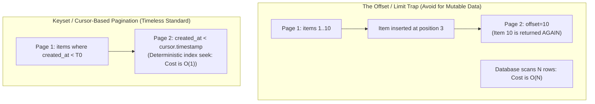

# Resource Bounding, Pagination & Traffic Governance

> **Mandate**: *An unconstrained interface is a denial-of-service vulnerability waiting to be triggered.* Any interface that permits unbounded collection queries, unlimited execution depths, or uncontrolled concurrency will inevitably exhaust memory, saturate databases, and cascade into system-wide outages. Every production contract must enforce resource boundedness, deterministic cursor-based pagination, and explicit traffic envelopes.

---

## 1 · The Resource Boundedness Axiom

No interface operation shall permit unbounded memory allocation, unbounded database scans, or unbounded payload transmissions:

$$\forall \text{Query}(Q), \quad |\text{Response}(Q)| \le N_{\text{max}} \land \text{ExecutionTime}(Q) \le T_{\text{budget}}$$

### 1.1 Non-Negotiable Rules
1. **No Unpaginated Collection Endpoints**: Any operation returning a list must be paginated by default. An endpoint that returns `items[]` without limit/cursor parameters is strictly forbidden.
2. **Mandatory Limit Clamping**:
   * Define a sensible default limit (e.g. `limit = 20`).
   * Define a hard maximum limit ceiling (e.g. `limit_max = 100`).
   * If a client requests `limit = 5000`, the server must **clamp** the limit to $N_{\text{max}}$ (or reject with `INVALID_ARGUMENT`), never fulfill the unbounded request.
3. **Payload Size Limits**: Declare maximum permissible request body sizes (e.g. 1 MB for standard JSON, 10 MB for binary uploads) at the API gateway layer.

---

## 2 · Pagination Paradigms: Keyset Cursors vs Offset Pitfalls



### 2.1 The Fatal Flaws of Offset Pagination (`?offset=1000&limit=50`)
1. **$O(N)$ Database Degradation**: To return offset 100,000, the database engine must read and discard 100,000 rows. At deep pages, query latency spikes exponentially.
2. **Missing & Duplicate Elements**: If a record is inserted or deleted while a client is traversing pages, records shift positions across page boundaries, causing clients to see duplicates or miss records entirely.
3. **Information Leakage**: Exposing `total_count: 8,421,902` leaks company business metrics and forces expensive `SELECT COUNT(*)` queries on every page request.

### 2.2 The Canonical Keyset / Cursor Specification

Keyset pagination uses the values of the ordered columns from the last seen item as the bookmark for fetching the next page.

#### Invariants for Stable Keyset Pagination:
1. **Deterministic Tie-Breaker**: The ordering clause must be strictly unique. If sorting by `created_at` (which can collide), you **must** append a secondary unique tie-breaker (e.g. `ORDER BY created_at DESC, id DESC`).
2. **Opaque Cursor Tokens**: Never expose internal database column names or raw query fragments in query strings. Encode the sort values into an opaque, URL-safe base64 token:
   $$\text{Cursor} = \text{Base64Url}(\text{JSON}(\{\text{t}: 1727265600, \text{id}: \text{"ord\_01HZX87"}\}))$$
3. **Symmetric Navigation Envelope**:
```json
{
  "items": [
    { "id": "ord_01HZX87", "total": 99.50, "created_at": "2026-09-25T10:00:00Z" }
  ],
  "pagination": {
    "next_cursor": "eyJ0IjoxNzI3MjY1NjAwLCJpZCI6Im9yZF8wMUhaWDg3In0",
    "has_more": true,
    "limit": 20
  }
}
```

---

## 3 · Query Complexity & Deep Graph Protection

For interfaces that allow client-driven query projections (e.g. GraphQL, dynamic field filtering `?fields=a,b,c`, or SQL-like query builders):

### 3.1 Depth & Breadth Limiting
* Enforce a hard ceiling on AST query nesting depth (e.g. maximum depth of 5 levels).
* Forbid circular self-referential graph expansion without explicit depth bounds (e.g. `author { books { author { books { ... } } } }`).

### 3.2 Query Complexity Cost Budgeting
Assign static cost weights to fields and multiply by pagination limits:
$$\text{Cost}(Q) = \sum_{\text{scalars}} 1 + \sum_{\text{connections}} (\text{limit} \times \text{Cost}(\text{target\_type}))$$
If $\text{Cost}(Q) > \text{Budget}_{\text{max}}$, reject the query at compile/parse time before touching the database with `INVALID_ARGUMENT` or `RESOURCE_EXHAUSTED`.

---

## 4 · Traffic Envelopes, Rate Limiting & Backpressure

Every interface contract must explicitly communicate its consumption limits and provide deterministic signaling when thresholds are approached or exceeded.

### 4.1 Standardized Rate Limiting Headers (IETF Draft)

```http
HTTP/1.1 429 Too Many Requests
Content-Type: application/problem+json
RateLimit-Limit: 100, 100;window=60
RateLimit-Remaining: 0
RateLimit-Reset: 14
Retry-After: 14

{
  "type": "https://api.example.com/errors/rate-limit-exceeded",
  "title": "Rate Limit Exceeded",
  "status": 429,
  "detail": "Quota of 100 requests per 60 seconds exceeded. Please wait 14 seconds.",
  "code": "RESOURCE_EXHAUSTED"
}
```

### 4.2 Algorithm Selection Matrix

| Algorithm | Mechanism | Best Fit | Operational Behavior |
| :--- | :--- | :--- | :--- |
| **Token Bucket** | Tokens refill at steady rate $r$ up to capacity $b$. | Public API per-tenant limits | Allows short bursts while enforcing long-term average rate. |
| **Leaky Bucket** | Requests enter queue; leak out at constant rate. | Data ingestion pipelines | Smooths out spiky traffic into constant processing rate. |
| **Sliding Window Log / Counter** | Tracks requests over sliding time window $W$. | High-security endpoints (auth/login) | Prevents boundary-bursting attacks common in fixed windows. |
| **Concurrency Limits (Little's Law)** | Limits active in-flight requests ($L = \lambda W$). | Database-intensive operations | Sheds excess load dynamically based on measured server latency. |

### 4.3 Client Backpressure Handling Contract
1. **Respect `Retry-After`**: Clients must pause calls until the indicated timestamp/seconds elapse.
2. **Full Jitter on Retry**: If multiple concurrent threads hit rate limits, they must randomize retry delays to prevent synchronized wave amplification.
3. **Circuit Breaking**: After $N$ consecutive `RESOURCE_EXHAUSTED` or `UNAVAILABLE` errors, client SDKs should open a local circuit breaker and fail fast without network traversal.
