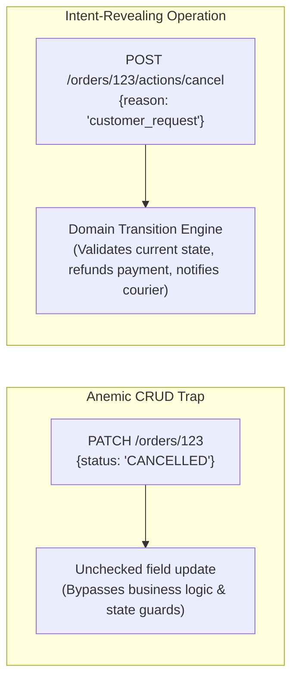
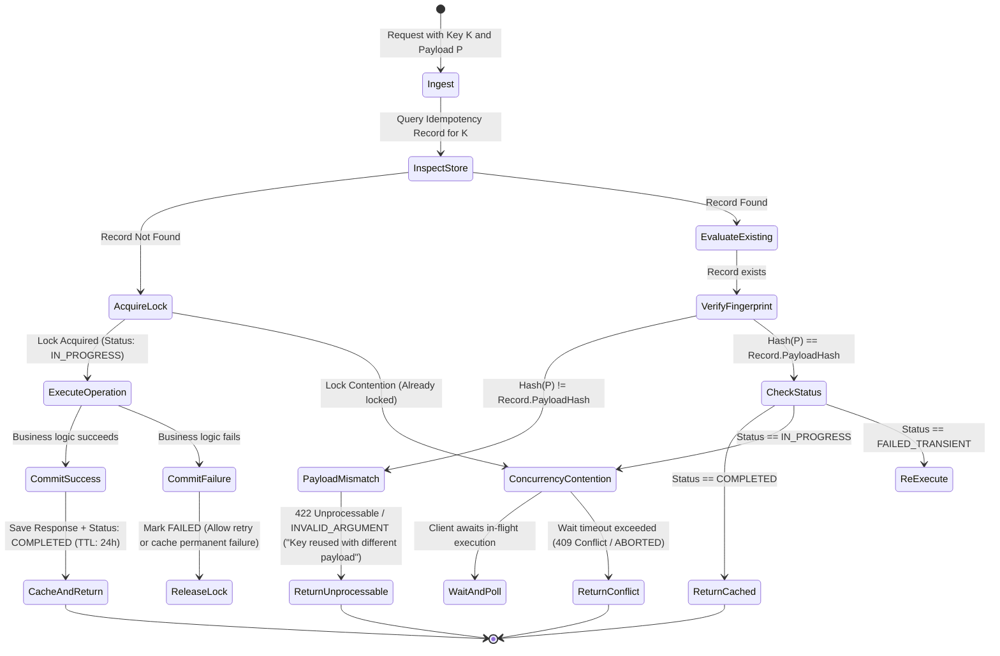
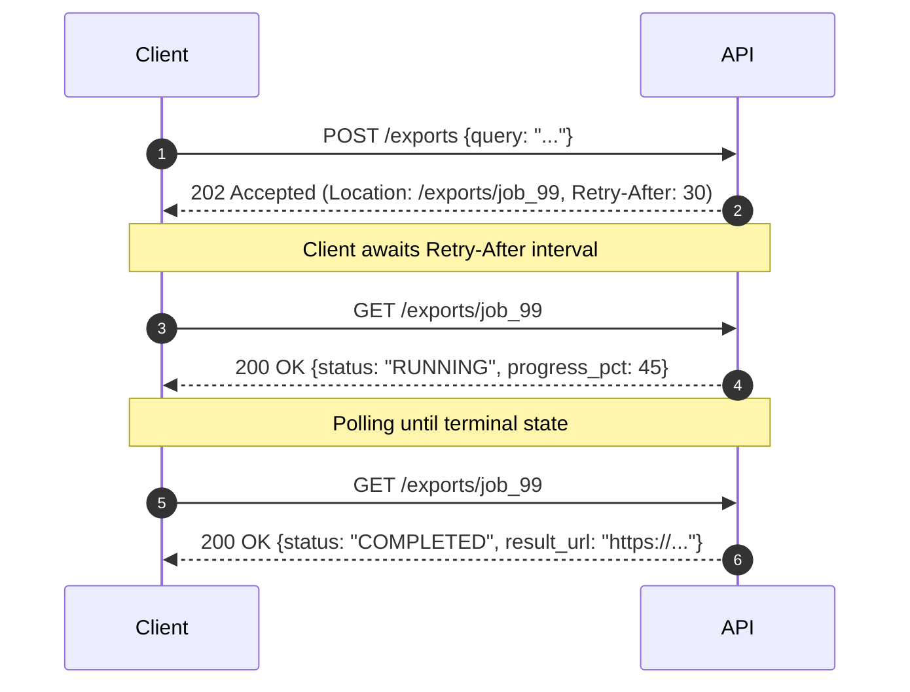

# Semantics, Idempotency & State Transitions

> **Mandate**: *An interface is not a dumb database gateway; it is the orchestrator of meaningful state transitions.* Interfaces must reflect consumer intent rather than internal CRUD tables. Every mutation exposed across an untrusted network or asynchronous queue must provide deterministic idempotency guarantees, protecting the system against duplicate execution, network retries, and race conditions.

---

## 1 · Consumer Intent vs The CRUD Dogma

Traditional API design often forces every operation into synthetic nouns and generic CRUD verbs (`GET`, `POST`, `PUT`, `DELETE`). In real-world enterprise domains, this leads to anemic interfaces, awkward payload munging, and dangerous race conditions.



### 1.1 Intent-Revealing Action Pattern

When an operation represents a discrete business action, state transition, or computation rather than a simple entity creation:
1. **Sub-resource Action Verbs**: Use explicit sub-resource action paths or RPC method names:
   * REST: `POST /orders/{id}/actions/cancel` or `POST /deployments/{id}/actions/rollback`
   * gRPC: `rpc CancelOrder(CancelOrderRequest) returns (CancelOrderResponse)`
   * GraphQL: `mutation CancelOrder(input: CancelOrderInput!)`
   * CLI: `app order cancel --id 123 --reason "..."`
2. **Explicit Transition Payloads**: The request payload must capture the *intent and context* of the transition (e.g. `cancellation_reason`, `refund_preference`), not arbitrary internal state flags.
3. **Guard Preconditions**: The contract must explicitly reject transitions from invalid states with canonical precondition errors (e.g. attempting to cancel an order that has already shipped returns `PRECONDITION_FAILED` or `409 Conflict`, never silent success or generic error).

---

## 2 · State Machine Interface Modeling

Any entity undergoing a multi-step lifecycle must be governed by a formal **Finite State Machine (FSM)** encoded in the interface contract.

### 2.1 The Transition Invariant Table

For every entity with a lifecycle, define the explicit transition matrix:

| Current State ($\mathcal{S}_{\text{current}}$) | Allowed Operation | Next State ($\mathcal{S}_{\text{next}}$) | Forbidden Operations & Error Behavior |
| :--- | :--- | :--- | :--- |
| `DRAFT` | `Submit` | `PENDING_REVIEW` | `Approve` $\to$ `FAILED_PRECONDITION` ("Must submit before approval") |
| `PENDING_REVIEW` | `Approve` / `Reject` | `APPROVED` / `REJECTED` | `Submit` $\to$ `FAILED_PRECONDITION` ("Already submitted") |
| `APPROVED` | `Fulfill` | `COMPLETED` | `Reject` $\to$ `CONFLICT` ("Cannot reject approved order") |
| `COMPLETED` | `Archive` | `ARCHIVED` | `Cancel` $\to$ `CONFLICT` ("Terminal state reached") |
| `ARCHIVED` | *None (Terminal)* | — | Any mutation $\to$ `CONFLICT` ("Entity is immutable") |

### 2.2 Concurrency Defense (Optimistic Locking & ETags)

To prevent the **Lost Update Problem** during state transitions:
1. Every stateful entity contract must expose a version identifier: an integer sequence (`version: 4`), timestamp, or cryptographic hash (`etag: "W/'a8b2c4'"`).
2. Mutation operations must require the client to supply the expected version:
   * REST: `If-Match: "W/'a8b2c4'"` header or `expected_version: 4` in payload.
   * gRPC: `int64 expected_version = 2;` in request message.
3. If the current version in storage differs from `expected_version`, the operation must immediately abort with `412 Precondition Failed` or `ABORTED / CONFLICT`, returning the current state to the client.

---

## 3 · The Universal Idempotency Lifecycle & State Machine

Idempotency is the mathematical property that an operation produces the exact same side-effect and outcome regardless of whether it is executed once or multiple times:

$$\forall k \in \mathcal{K}, \quad \mathcal{E}(k, p, t_1) = \mathcal{E}(k, p, t_2) \implies \text{State}(t_1) = \text{State}(t_2)$$

### 3.1 The 4 Flaws of Naive Idempotency

Most implementations fail because they do not handle:
1. **In-Flight Concurrency Races**: Two duplicate requests arrive at millisecond $t_0$. Both see "not yet processed" and execute simultaneously, causing double charges.
2. **Payload Fingerprint Mismatch**: A buggy or malicious client sends the same idempotency key for two completely different requests.
3. **Execution Failure Caching**: Caching a transient 500 error permanently, preventing the client from ever retrying successfully.
4. **Unbounded Storage**: Leaking idempotency records indefinitely until the database exhausts memory.

### 3.2 The Airtight Idempotency Protocol

Every mutating operation with an idempotency key ($K$) and payload ($P$) must execute through this state machine:



### 3.3 Protocol Execution Rules

1. **Payload Fingerprinting**: Compute a cryptographic hash of the normalized request payload:
   $$\text{Fingerprint} = \text{SHA256}(\text{CanonicalJSON}(P))$$
   Store $\text{Fingerprint}$ alongside $K$. If an incoming request with key $K$ has a different fingerprint, immediately reject with `422 Unprocessable Entity` or `INVALID_ARGUMENT` ("Idempotency key reused with different request payload").
2. **Atomic In-Flight Locking**: Use a distributed lock or atomic database insertion (`INSERT ... ON CONFLICT DO NOTHING`) with `status = "IN_PROGRESS"`.
3. **Transient vs Permanent Failure Handling**:
   * If the execution fails due to a **terminal client error** (e.g. `400 Bad Request`, `422 Validation Error`), cache the error response. Replaying the exact same bad request must return the exact same validation error.
   * If the execution fails due to a **transient infrastructure error** (e.g. DB network timeout, 503), **do not cache the failure as completed**. Release the lock or mark `status = "FAILED_TRANSIENT"`, allowing the client to safely retry.
4. **Time-To-Live (TTL)**: Idempotency records must have an explicit expiration window (typically 24 hours to 7 days) configured via database TTL to bound storage.

---

## 4 · Batch & Bulk Mutation Semantics

When an interface supports processing multiple items in a single call (e.g. `POST /invoices/batch-create`):

### 4.1 The Two Execution Models

The contract must explicitly declare which model it follows:

| Dimension | Model A: All-or-Nothing (Atomic Transaction) | Model B: Independent Partial Success (Best Effort) |
| :--- | :--- | :--- |
| **Transaction Semantics** | ACID transaction; any item failure rolls back the entire batch. | Each item processed independently; failures do not roll back successes. |
| **Status Response** | `200 OK` (all succeeded) or `400/422/500` (entire batch failed). | `207 Multi-Status` or `200 OK` with individual item outcome array. |
| **Client Complexity** | Low (simple retry of the entire batch). | Higher (client must inspect per-item results and retry only failed items). |
| **Use Case** | Financial ledger entries, multi-table interdependent records. | Bulk notifications, batch data imports, syncing offline records. |

### 4.2 Standard Envelope for Partial Success (Model B)

If using independent processing, the response contract must link each result directly to its input index or client-provided item ID:

```json
{
  "summary": {
    "total": 3,
    "succeeded": 2,
    "failed": 1
  },
  "results": [
    {
      "index": 0,
      "correlation_id": "item_ref_alpha",
      "status": "SUCCEEDED",
      "id": "inv_01HZX9..."
    },
    {
      "index": 1,
      "correlation_id": "item_ref_beta",
      "status": "FAILED",
      "error": {
        "code": "INVALID_CURRENCY",
        "message": "Currency XYZ is not supported."
      }
    },
    {
      "index": 2,
      "correlation_id": "item_ref_gamma",
      "status": "SUCCEEDED",
      "id": "inv_01HZXA..."
    }
  ]
}
```

---

## 5 · Long-Running Asynchronous Operations

When an operation cannot complete within standard network timeouts ($> 2.5\text{ seconds}$), **never hold an open synchronous connection**.



1. **Immediate Acceptance**: Acknowledge receipt immediately with `202 Accepted` (or equivalent async response).
2. **Status Seam**: Return a persistent job resource identifier and a URL/pointer to query status:
   * REST: Header `Location: /jobs/{job_id}` and `Retry-After: {seconds}`.
   * gRPC: Return `google.longrunning.Operation` message with `name: "operations/123"`.
3. **Terminal Result Separation**: When the job reaches `COMPLETED`, provide the final payload reference or artifact URL. When it reaches `FAILED`, provide canonical error details.
