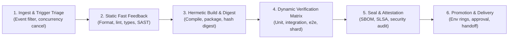
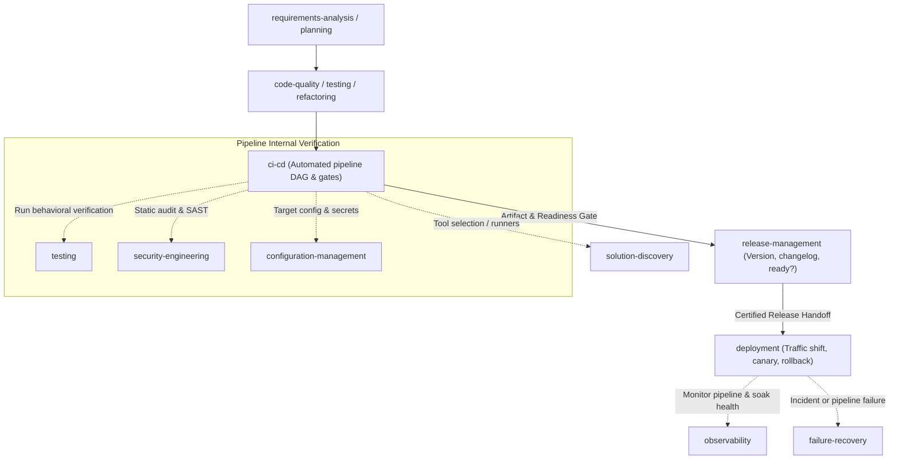

# CI/CD: Universal Automated Pipeline & Continuous Verification Protocol

> **Mandate**: *Continuous Integration and Continuous Delivery (CI/CD) is the automated, repeatable, and tamper-evident conversion of source state mutations ($\Delta S$) into verified computational artifacts ($\mathcal{A}$), orchestrating their progressive promotion across quality and operational boundaries.*  
> A pipeline is not a vendor YAML dialect (`.github/workflows`, `.gitlab-ci.yml`, `Jenkinsfile`), nor is it coupled to any container runtime, orchestrator, or cloud provider. It is a declarative Directed Acyclic Graph (DAG) of transformations, gates, and promotion criteria. True CI/CD engineering preserves agent problem-solving creativity, rejects platform dogma, enforces immutable quality gates, and guarantees that every state transition is reproducible, observable, and recoverable across any software archetype.

---

## 1 · The 6-Phase Universal CI/CD Lifecycle

Every automated pipeline—from a local pre-commit check to an enterprise monorepo matrix or an autonomous AI agent evaluation fleet—traverses this closed-loop lifecycle:



1. **Phase 1 — Ingest & Trigger Triage**: Evaluate incoming triggers (push, pull request, tag, schedule, manual dispatch). Apply change-detection filters to prune unaffected dependency sub-graphs. Enforce **Controlled Concurrency** by atomically cancelling obsolete in-progress runs on superseded branch commits.
2. **Phase 2 — Static Fast Feedback (Pre-Flight Gatekeeping)**: Execute lightweight, deterministic static gates (syntax, formatting, linting, typechecking, and secret scanning) targeting execution completion within $\le 60\text{ seconds}$. Fail fast before initiating heavy compute resources (see [`references/pipeline-topology-and-stage-ordering.md`](references/pipeline-topology-and-stage-ordering.md)).
3. **Phase 3 — Hermetic Build & Artifact Synthesis**: Compile and package deployable artifacts in an isolated, reproducible environment. Calculate and pin the immutable cryptographic digest ($\text{Digest}(\mathcal{A})$). Ensure build outputs are completely environment-agnostic (see [`references/hermetic-builds-and-artifact-provenance.md`](references/hermetic-builds-and-artifact-provenance.md)).
4. **Phase 4 — Dynamic Verification Matrix**: Execute test suites across configured runtime matrices or shards. Enforce honest gating with strict flakiness quarantine, zero ignored exit codes, and statistical confidence thresholds for stochastic/AI workflows (see [`references/honest-quality-gates-and-signal-integrity.md`](references/honest-quality-gates-and-signal-integrity.md)).
5. **Phase 5 — Package Sealing & Attestation**: Synthesize the Software Bill of Materials (SBOM), inject build provenance (SLSA metadata), scan packaged artifacts for critical vulnerabilities, and publish sealed artifacts to an immutable registry (see [`references/hermetic-builds-and-artifact-provenance.md`](references/hermetic-builds-and-artifact-provenance.md) and [`references/pipeline-security-and-least-privilege.md`](references/pipeline-security-and-least-privilege.md)).
6. **Phase 6 — Promotion Gating & Delivery Handoff**: Validate environment readiness, evaluate promotion criteria across progressive rings (Ephemeral $\to$ Staging $\to$ Prod), verify human approval gates where required, and hand off the certified artifact tuple $\langle \mathcal{A}, \mathcal{C}, \mathcal{S} \rangle$ to [`deployment`](../deployment/SKILL.md) (see [`references/environment-promotion-and-approval-gates.md`](references/environment-promotion-and-approval-gates.md)).

---

## 2 · Progressive Disclosure (Reference Routing)

To prevent cognitive overload and preserve LLM context bandwidth, **never load all reference manuals simultaneously**. Consult reference manuals strictly on demand based on task context:

| Context Trigger | Mandatory Reference Manual | Purpose |
| :--- | :--- | :--- |
| **Pipeline DAG design, fail-fast ladders, stage ordering, change detection** | [`references/pipeline-topology-and-stage-ordering.md`](references/pipeline-topology-and-stage-ordering.md) | DAG formulation, topological sorting, fail-fast mechanics, affected-graph filtering for monorepos. |
| **Reproducible builds, digest pinning, SBOM, SLSA provenance, container sealing** | [`references/hermetic-builds-and-artifact-provenance.md`](references/hermetic-builds-and-artifact-provenance.md) | Deterministic build environments, SHA-256 digest pinning, SPDX/CycloneDX SBOMs, SLSA attestations. |
| **Cache key hashing, cross-branch poisoning, concurrency cancellation, cost** | [`references/caching-concurrency-and-resource-efficiency.md`](references/caching-concurrency-and-resource-efficiency.md) | Hierarchical cache lattice, lockfile hashing, auto-cancellation (`cancel-in-progress`), worker quotas. |
| **OIDC tokens, secret scoping, fork PR security ("Pwn Requests"), least privilege** | [`references/pipeline-security-and-least-privilege.md`](references/pipeline-security-and-least-privilege.md) | Two-tier PR security model, short-lived OIDC federation, token permission sandboxing (`read-all`). |
| **Flaky test quarantine, test sharding, stochastic AI evaluation, coverage gates** | [`references/honest-quality-gates-and-signal-integrity.md`](references/honest-quality-gates-and-signal-integrity.md) | Honest merge signals, flakiness quarantine, statistical gating ($\mu \pm k\sigma \ge \tau$), merge queues. |
| **Multi-ring promotion, approval checkpoints, GitOps handoffs, rollback readiness** | [`references/environment-promotion-and-approval-gates.md`](references/environment-promotion-and-approval-gates.md) | Ephemeral $\to$ Staging $\to$ Prod rings, human governance gates, handoff to `deployment` & `release-management`. |

---

## 3 · Adaptive Cognitive Sizing (The 6 Execution Modes)

Size your CI/CD engineering effort strictly to the task's scope, operational risk, and repository archetype. Never apply heavy enterprise bureaucracy to a single-line script or local prototype, and never execute speculative, unverified mutations across high-blast-radius production systems:

| Mode | Trigger & Scope | Engineering Discipline | Required Output & Protocol |
| :--- | :--- | :--- | :--- |
| **`micro-check`** | Local commit hooks, typo fixes, doc updates, single-file scripts ($< 30$ lines). | Run fast static check $\to$ unit smoke test. **Zero boilerplate**. | **3-Line CI Intent Block** directly preceding execution. |
| **`standard-pr`** | Feature branch pull request, bug fix, component update (1–5 files). | Full CI verification: static checks $\to$ build $\to$ unit/integration tests $\to$ PR status gate. | **PR Verification Status Report**: Stage timings, gate outcomes, failure diagnostics. |
| **`matrix-library`** | Open-source libraries, client SDKs, cross-platform CLI utilities. | Multi-OS (Linux/macOS/Windows) and multi-runtime (Node, Python, Go, Rust versions) matrix verification with concurrency limits. | **Matrix Compatibility Grid**: Status per platform/version combination. |
| **`monorepo-cascading`** | Polyglot or multi-package monorepos with internal dependency DAGs. | Impact-aware change detection; topological build/test execution; shared remote caching. | **Monorepo Execution Graph**: Affected packages, skipped packages, cache hit rates. |
| **`delivery-promotion`** | Production services, multi-environment applications (Dev $\to$ Staging $\to$ Prod). | Build once $\to$ deploy to staging $\to$ automated integration/smoke verify $\to$ approval gate $\to$ production rollout handoff. | **Environment Promotion Audit**: Artifact hash attestation, stage approvals, deployment handoff tuple. |
| **`agentic-eval-pipeline`** | AI agent prompts, MCP servers, system instructions, model fine-tunes. | Golden dataset benchmark execution, model evaluation scoring ($\ge \tau$), token/latency budget gate, semantic drift check. | **Agentic Verification Certificate**: Benchmark score delta, tool permission audit, cost summary. |

### The 3-Line CI Intent Protocol (For `micro-check` Mode)
To eliminate bureaucratic overhead on small changes, emit this concise block directly preceding pipeline triggers or local validation commands:
```markdown
> **Pipeline Target**: [Ref / Branch / Target Path]
> **Active Gates**: [Static Lint: PASS | Tests (N/N): PASS]
> **Artifact State**: [Ephemeral / Verified Digest: SHA256:abcd...]
```

---

## 4 · The 8 Universal CI/CD Invariants

Regardless of programming language, build engine, CI provider, or cloud runtime, every valid automated pipeline upholds these 8 mathematical laws:

### 4.1 Invariant 1: Build-Once Artifact Immutability (The Promotion Axiom)
A deployable computational artifact $\mathcal{A}$ must be compiled or packaged exactly once and promoted across target environments without re-compilation or repackaging:
$$\text{Digest}(\mathcal{A}_{\text{staging}}) = \text{Digest}(\mathcal{A}_{\text{prod}})$$
* **Mobile/Firmware Qualification**: For environments requiring environment-specific cryptographic code signing (e.g. iOS App Store vs Ad-Hoc provisioning, or secure boot firmware keys), the compiled bytecode/binary payload is immutable ($Hash(\text{Binary}) = \text{const}$); signing is performed as a non-recompiling external cryptographic wrapper.
* **Prohibition**: Compiling distinct binaries for staging vs. production or baking environment-specific configurations into build layers.

### 4.2 Invariant 2: Topological Fast Feedback (The Fail-Fast Axiom)
Pipeline stages must be topologically sorted such that execution cost and latency monotonically increase with stage depth:
$$\text{Cost}(S_1) \le \text{Cost}(S_2) \le \dots \le \text{Cost}(S_n)$$
$$\text{GateFail}(S_k) \implies \text{AbortAll}(S_{k+1 \dots n})$$
* **Prohibition**: Running long-running integration or browser test suites before cheap static linting and typechecking gates pass.

### 4.3 Invariant 3: Hermetic Build Determinism (The Reproducibility Axiom)
Given an immutable source tree at commit $C$, locked dependency tree $\mathcal{L}$, and declared toolchain version $\mathcal{T}$, pipeline outputs must be functionally identical across any host:
$$f(C, \mathcal{L}, \mathcal{T})_{\text{runner}_A} \equiv f(C, \mathcal{L}, \mathcal{T})_{\text{runner}_B}$$
* **Prohibition**: Unpinned floating dependencies (`latest`, `^`, `*`), unversioned compiler environments, or dependency on ambient runner state.

### 4.4 Invariant 4: Honest Gating & Statistical Signal Integrity (The Proof Axiom)
A pipeline gate is valid if and only if its exit signal is strictly deterministic and non-deceptive:
$$\text{DeterministicGate}(\text{PASS}) \iff \text{RequirementsSatisfied} \land \text{ExitCode} = 0$$
$$\text{StochasticGate}(\text{PASS}) \iff \mu(\text{Score}) - k \cdot \sigma \ge \tau \quad (N \ge N_{\text{min}})$$
* **Prohibition**: Retrying failing tests in a blind loop to mask flakiness; suppressing non-zero exit codes with `|| true`; ignoring broken test suites on critical branches.

### 4.5 Invariant 5: Safe Caching & Hierarchical Scoping (The Isolation Axiom)
Build caches must be deterministic, isolated by branch scope, and invalidable by input dependency changes:
$$\text{CacheKey} = Hash(\text{ToolchainVersion} + \text{LockfileContent} + \text{EnvironmentKey})$$
$$\text{Scope}(\text{CacheWrite}) = \text{CurrentBranch}; \quad \text{Scope}(\text{CacheRead}) = \{\text{CurrentBranch}, \text{Mainline}\}$$
* **Prohibition**: Allowing unprivileged feature branches to write to the shared mainline cache (cache poisoning), or relying on untracked global cache directories.

### 4.6 Invariant 6: Least Privilege & Zero Ambient Authority (The Security Axiom)
Pipeline jobs must execute with the minimal permissions required for their specific phase, utilizing short-lived ephemeral tokens and zero ambient long-lived secrets:
$$\text{Perms}(\text{Job}) = \bigcap \text{RequiredCapabilities}(\text{Job})$$
* **Two-Tier PR Rule**: Untrusted external PRs run in zero-secret sandboxes. Elevated tokens are restricted strictly to maintainer-approved or post-merge contexts.
* **Prohibition**: Granting blanket `write-all` repository permissions or exposing production deploy secrets to pull request workflows.

### 4.7 Invariant 7: Controlled Concurrency & Obsolete Run Cancellation (The Conservation Axiom)
Pushing a new commit to a development branch must atomically cancel obsolete in-progress pipeline runs on that ref:
$$\text{Push}(C_{t+1}, \text{Ref}) \implies \text{Cancel}(\text{Run}(C_t, \text{Ref}))$$
* **Prohibition**: Permitting outdated runs to consume shared compute capacity after a newer commit has superseded them.

### 4.8 Invariant 8: Injective Traceability & Actionable Failure Diagnostics (The Observability Axiom)
Every pipeline execution must produce an injective audit trail connecting source commit, pipeline run, generated artifact digest, and test reports:
$$\mathcal{T}_{\text{run}} = \langle \text{CommitSHA}, \text{RunID}, \text{Digest}(\mathcal{A}), \text{LogsURI}, \text{Attestations} \rangle$$
* **Prohibition**: Failing pipelines without concise root-cause diagnostic summaries or leaving untraceable artifacts in distribution registries.

---

## 5 · The CI/CD Invariant Exception Protocol (Emergency Hotfixes)

No static rulebook can accommodate 100% of operational crises without breaking. When exceptional operational constraints (e.g. active Sev-0 production hotfix, catastrophic network partition preventing remote cache retrieval, or air-gapped forensic recovery) conflict with standard pipeline invariants, the agent invokes this protocol:

> [!CAUTION] CI/CD INVARIANT EXCEPTION PROTOCOL
> An agent or engineer may deliberately bypass non-critical pipeline gates **IF AND ONLY IF**:
> 1. **Operational Blocker Citation**: Explicitly cites the Sev-0/Sev-1 incident ticket and explains why specific stages (e.g. 45-minute e2e browser test suite) are bypassed.
> 2. **Non-Negotiable Safety Core**: Mandatory static typecheck, secret scanning, and fundamental smoke sanity can **NEVER** be bypassed.
> 3. **Micro-ADR & Reconciliation Commitment**: Records the bypass decision in the pipeline log (`[CICD-EXCEPTION: emergency manual override during Sev-0 incident #8491; full test suite verification scheduled for post-incident]`).

---

## 6 · Universal Archetype Adaptation

The 8 invariants adapt dynamically across every software archetype by abstracting tools to universal pipeline roles:

| Archetype | Verification Strategy | Build & Artifact Output | Promotion & Delivery Mechanism |
| :--- | :--- | :--- | :--- |
| **Backend Services & APIs** | Static analysis $\to$ Unit tests $\to$ DB migration dry-run $\to$ Integration tests. | OCI Container image pinned by SHA-256 digest + SBOM. | Canary or Blue-Green rollout handoff to [`deployment`](../deployment/SKILL.md). |
| **Polyglot Monorepos** | Affected graph discovery ($\Delta S \cap \text{Deps}(P_i)$) $\to$ Topological sub-DAG execution. | Multiple independent immutable packages / containers. | Independent package versioning and coordinated release DAGs. |
| **Libraries & Public SDKs** | Tiered OS/runtime matrix verification (Linux/macOS/Windows + LTS versions). | Sealed archive (`.tar.gz`, `.whl`, `.gem`, `.jar`) with signed provenance. | Package registry publishing with 2FA/OIDC tokens via [`release-management`](../release-management/SKILL.md). |
| **Mobile Applications** | Lint $\to$ Unit tests $\to$ Headless emulator UI tests. | Immutable compiled binary (`.apk`, `.ipa`, `.aab`) signed via distribution keys. | Internal track / TestFlight promotion rings $\to$ Store release. |
| **Embedded & Firmware** | Static analysis $\to$ QEMU simulation $\to$ Serialized Hardware-in-the-Loop (HIL) bench test. | Signed, byte-for-byte binary firmware image + checksum manifest. | Staged OTA rollout rings (canary devices $\to$ pilot fleet $\to$ global fleet). |
| **Data & ML Pipelines** | Code lint $\to$ Data contract/schema drift validation $\to$ Model metric evaluation. | Versioned pipeline definition + registered model artifact digest. | Shadow scoring pipeline $\to$ Production model serving endpoint. |
| **AI Agents & MCP Systems** | Prompt schema validation $\to$ Golden benchmark eval suite ($\ge \tau$) $\to$ Token budget audit. | Immutable agent bundle / MCP server container + tool permission manifest. | Staged traffic routing with live cognitive health monitoring via [`observability`](../observability/SKILL.md). |

---

## 7 · Boundary Routing with Arsenal Skills



* **`ci-cd`**: The automated execution engine for change flows. Orchestrates stages, enforces dependencies, builds artifacts, executes test matrices, and gates promotion.
* **`release-management`**: Release semantics and governance. Decides *WHAT* is being released (versioning, SemVer/CalVer, changelogs, readiness scorecards).
* **`deployment`**: Operational environment delivery. Decides *HOW* a release reaches an environment (canaries, blue-green, traffic shifting, stateful migrations, health probes).
* **`configuration-management`**: Manages environment variables and secret stores injected into pipelines.
* **`testing`**: Designs tests, test doubles, and behavioral assertions executed by CI/CD.
* **`security-engineering`**: Defines threat models, vulnerability policies, and SAST/DAST rules.
* **`observability`**: Ingests pipeline metrics, duration histograms, and distributed traces.
* **`failure-recovery`**: Responds to pipeline failures, broken builds, or rollback requirements.
* **`solution-discovery`**: Selects specific runners, tools, or CI platforms when establishing greenfield pipelines.

---

## 8 · Antipatterns & Failure Modes

| Antipattern | Fatal Mechanism | Universal Remediation |
| :--- | :--- | :--- |
| **Rebuilding Per Environment** | Building separate binaries for dev, staging, and prod. Guarantees that code tested in staging is *not* what runs in prod. | **Enforce Invariant 1**: Build once, publish immutable digest, inject configuration externally at runtime. |
| **Vanity Green Gates** | Using `continue-on-error: true` or `\|\| true` to suppress test failures and achieve green builds. | **Enforce Invariant 4**: Honest gating. Quarantined tests must be isolated into non-blocking tracking pipelines. |
| **Blind Retry Loops** | Auto-retrying failed test suites 3 times to bypass flakiness. Masks concurrency deadlocks and race conditions. | Quarantine flaky tests to an explicit tracker; fail the gate on non-deterministic behavior. |
| **Fork Secret Leakage** | Running untrusted pull request code with access to production secrets or write tokens. | **Enforce Invariant 6**: Two-tier PR security model. Untrusted PRs run with zero secrets and read-only tokens. |
| **Shared Cache Poisoning** | Allowing feature branches to overwrite mainline cache entries. | **Enforce Invariant 5**: Hierarchical cache scoping. Feature branches read from main, write only to branch scope. |
| **Zombie Concurrency Waste** | Allowing superseded commits to continue running full CI suites. | **Enforce Invariant 7**: Automatically cancel superseded runs on push (`cancel-in-progress: true`). |
