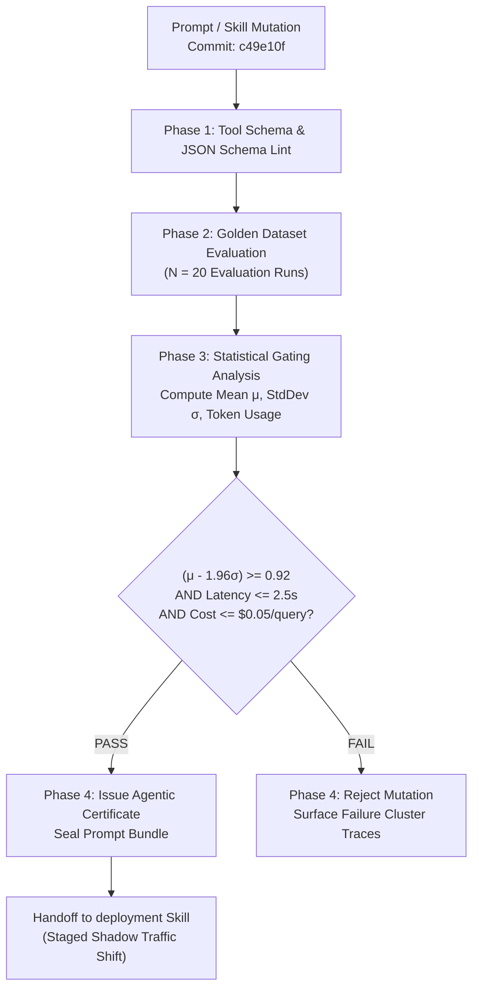

# Example: Agentic Evaluation & Benchmark Pipeline

> **Context**: An autonomous AI agent application integrating LLM prompts, reasoning loops, and Model Context Protocol (MCP) tools. Code changes modify system prompts, tool schemas, or context retrieval algorithms. Standard unit tests cannot assert non-deterministic natural language outputs; the team requires an automated agentic evaluation pipeline.

---

## 1 · Cognitive Evaluation Topology



---

## 2 · Declarative Agentic Pipeline Configuration

```yaml
name: agentic-eval-pipeline

on:
  pull_request:
    paths:
      - 'prompts/**'
      - 'skills/**'
      - 'tools/**'
      - 'src/agent/**'

concurrency:
  group: agent-eval-${{ github.ref }}
  cancel-in-progress: true

permissions: read-all

jobs:
  schema-lint:
    name: Schema & Tool Permission Lint
    runs-on: ubuntu-latest
    steps:
      - uses: actions/checkout@v4
      - run: python -m scripts.validate_tool_schemas

  stochastic-benchmark:
    name: Stochastic Golden Dataset Evaluation
    needs: [schema-lint]
    runs-on: ubuntu-latest
    timeout-minutes: 20
    steps:
      - uses: actions/checkout@v4
      - name: Run Evaluation Harness (N=20 runs)
        env:
          EVAL_DATASET: benchmarks/golden_queries.jsonl
          RUN_COUNT: 20
        run: |
          python -m eval_harness.run \
            --dataset "$EVAL_DATASET" \
            --iterations "$RUN_COUNT" \
            --output eval_results.json
      - name: Evaluate Statistical Gate (Invariant 4)
        run: |
          python -m eval_harness.gate \
            --results eval_results.json \
            --min-confidence-bound 0.92 \
            --max-p95-latency-ms 2500 \
            --max-cost-per-run 0.05
      - name: Archive Evaluation Certificate
        uses: actions/upload-artifact@v4
        with:
          name: agent-eval-certificate
          path: eval_results.json
```

### Statistical Gate Output Diagnostic
```text
=== AGENTIC EVALUATION GATING REPORT ===
Benchmark Dataset: benchmarks/golden_queries.jsonl (50 test cases)
Iterations: 20 independent runs per query (1,000 total samples)

Metrics:
  • Accuracy Mean (μ):       0.954
  • Standard Deviation (σ):  0.012
  • 95% Confidence Bound:    0.930  (Threshold >= 0.920) -> PASS
  • P95 Latency:             1,840ms (Threshold <= 2,500ms) -> PASS
  • Average Cost / Query:    $0.028  (Budget <= $0.050)     -> PASS

Status: STATISTICAL VERIFICATION PASSED (Certified for Staging Handoff)
```
