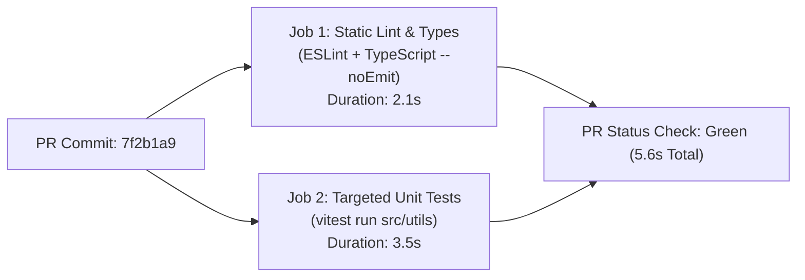

# Example: Micro-Check PR Gate & 3-Line Intent Walkthrough

> **Context**: A developer submits a small bug fix modifying a single utility function in a backend repo ($< 25$ lines of diff). Applying a heavy 40-minute enterprise multi-stage pipeline is wasteful. The agent leverages the `micro-check` cognitive sizing mode.

---

## 1 · The 3-Line CI Intent Protocol

Before executing local pre-flight checks or triggering pipeline verification, emit the concise 3-line intent block:

```markdown
> **Pipeline Target**: `src/utils/token-parser.ts` (PR #142 @ commit `7f2b1a9`)
> **Active Gates**: [Static Lint: PASS (1.2s) | Unit Tests (14/14): PASS (3.4s)]
> **Artifact State**: Ephemeral Test Bundle (SHA-256: `e3b0c442...`)
```

---

## 2 · Minimal Fast Pipeline Specification (Vendor-Neutral Representation)

The declarative pipeline DAG consists of two fast, hermetic jobs executed concurrently or fail-fast sequentially:



### Key Highlights
- **Total Feedback Latency**: $\le 6\text{ seconds}$.
- **Zero Heavy Infrastructure**: No container building, no external database spinning.
- **Immediate Merge Signal**: Gating check satisfies Invariant 2 (Topological Fast Feedback) with zero friction.
