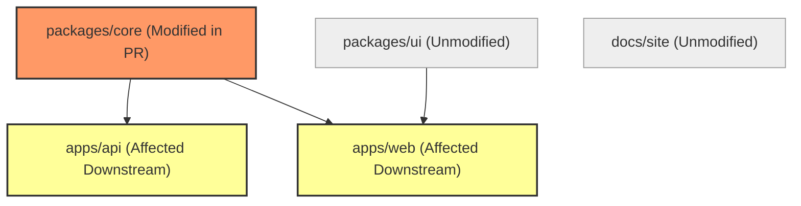

# Example: Monorepo Change-Aware Pipeline

> **Context**: A polyglot monorepo containing multiple applications (`apps/web`, `apps/api`) and shared internal libraries (`packages/core`, `packages/ui`). Running all tests on every commit takes 45 minutes. The team needs an impact-aware pipeline that tests only modified code and its transitive dependents.

---

## 1 · Dependency Graph & Affected Analysis



### Affected Graph Computation
$$\Delta S = \{\text{packages/core/src/auth.ts}\}$$
$$\mathcal{V}_{\text{active}} = \{\text{packages/core}, \text{apps/api}, \text{apps/web}\}$$
$$\mathcal{V}_{\text{skipped}} = \{\text{packages/ui}, \text{docs/site}\}$$

---

## 2 · Declarative Pipeline Execution

```yaml
name: monorepo-affected-ci

on:
  pull_request:
    branches: [main]

concurrency:
  group: monorepo-${{ github.ref }}
  cancel-in-progress: true

permissions: read-all

jobs:
  detect-affected:
    name: Compute Affected DAG (Phase 1)
    runs-on: ubuntu-latest
    outputs:
      affected-matrix: ${{ steps.compute.outputs.matrix }}
      has-affected: ${{ steps.compute.outputs.has-affected }}
    steps:
      - uses: actions/checkout@v4
        with:
          fetch-depth: 0 # Full history needed for merge-base diff
      - id: compute
        run: |
          # Compute affected packages using repository graph tool (e.g. nx, turbo, or custom git diff script)
          AFFECTED=$(./scripts/compute-affected.sh origin/main HEAD)
          echo "Affected packages: $AFFECTED"
          echo "matrix=$AFFECTED" >> $GITHUB_OUTPUT

  build-and-test:
    name: Verify Affected Package (Phase 2 & 4)
    needs: [detect-affected]
    runs-on: ubuntu-latest
    strategy:
      matrix: ${{ fromJson(needs.detect-affected.outputs.affected-matrix) }}
      fail-fast: true
    steps:
      - uses: actions/checkout@v4
      - name: Restore Remote Build Cache
        uses: actions/cache@v4
        with:
          path: .turbo-cache
          key: turbo-${{ runner.os }}-${{ matrix.package }}-${{ hashFiles('**/lockfile') }}
      - name: Test Affected Slice
        run: |
          echo "Running build and test for ${{ matrix.package }}"
          make test PACKAGE=${{ matrix.package }}
```

### Economic Impact
- **Standard Pipeline Duration**: 45 minutes.
- **Affected Pipeline Duration**: 7 minutes.
- **Compute Reduction**: 84% savings per pull request run.
