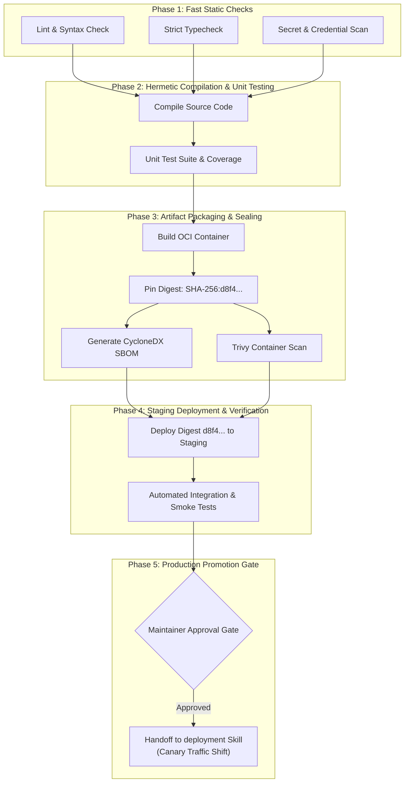

# Example: Standard Service Delivery Pipeline

> **Context**: A core REST/gRPC backend service repository in a production microservice architecture. Requires reliable verification on PR, automated deployment to staging upon merge, and human approval before rolling out to production.

---

## 1 · End-to-End Pipeline DAG Topology



---

## 2 · Concrete Workflow Implementation (Declarative Representation)

```yaml
name: service-continuous-delivery

on:
  push:
    branches: [main]
  pull_request:
    branches: [main]

# Invariant 7: Controlled Concurrency
concurrency:
  group: ${{ github.workflow }}-${{ github.ref }}
  cancel-in-progress: ${{ github.ref != 'refs/heads/main' }}

# Invariant 6: Least Privilege Default
permissions: read-all

jobs:
  static-checks:
    name: Static Fast Feedback (Phase 1)
    runs-on: ubuntu-latest
    timeout-minutes: 5
    steps:
      - uses: actions/checkout@v4
      - name: Cache Toolchain & Dependencies (Invariant 5)
        uses: actions/cache@v4
        with:
          path: ~/.cache
          key: v1-deps-${{ runner.os }}-${{ hashFiles('**/lockfile') }}
          restore-keys: v1-deps-${{ runner.os }}-
      - run: make lint typecheck secret-scan

  build-and-test:
    name: Build & Test (Phase 2)
    needs: [static-checks]
    runs-on: ubuntu-latest
    timeout-minutes: 10
    steps:
      - uses: actions/checkout@v4
      - run: make build test-unit

  package-and-seal:
    name: Package & Seal Artifact (Phase 3)
    needs: [build-and-test]
    runs-on: ubuntu-latest
    timeout-minutes: 15
    permissions:
      contents: read
      packages: write
      id-token: write # OIDC Federation
    outputs:
      artifact-digest: ${{ steps.build-image.outputs.digest }}
    steps:
      - uses: actions/checkout@v4
      - id: build-image
        run: |
          docker build -t app:sealed .
          DIGEST=$(docker inspect --format='{{index .RepoDigests 0}}' app:sealed)
          echo "digest=$DIGEST" >> $GITHUB_OUTPUT
      - name: Generate SBOM & Scan
        run: |
          syft app:sealed -o cyclonedx-json > sbom.json
          trivy image --exit-code 1 --severity CRITICAL app:sealed

  deploy-staging:
    name: Deploy to Staging (Phase 4)
    if: github.ref == 'refs/heads/main'
    needs: [package-and-seal]
    runs-on: ubuntu-latest
    environment: staging
    steps:
      - name: Deploy Immutable Digest (Invariant 1)
        run: |
          echo "Deploying ${{ needs.package-and-seal.outputs.artifact-digest }} to Staging"
          make deploy-staging DIGEST=${{ needs.package-and-seal.outputs.artifact-digest }}
      - name: Run Synthetic Smoke Verification
        run: make test-smoke-staging

  promote-production:
    name: Promote to Production (Phase 5)
    needs: [deploy-staging, package-and-seal]
    runs-on: ubuntu-latest
    environment:
      name: production # Enforces human approval in GitHub Environments
    steps:
      - name: Handoff to deployment skill
        run: |
          echo "Certified Bundle passed to deployment skill for Canary rollout."
```

### Invariant Verification Checklist
- [x] **Invariant 1**: Exactly the same image digest (`needs.package-and-seal.outputs.artifact-digest`) deployed to staging and prod.
- [x] **Invariant 2**: Cheap static checks run before heavy container packaging.
- [x] **Invariant 5**: Cache keys strictly hashed against lockfile.
- [x] **Invariant 6**: Default `permissions: read-all`, scoped OIDC permissions on package push.
- [x] **Invariant 7**: `cancel-in-progress: true` on PRs, queued on main.
