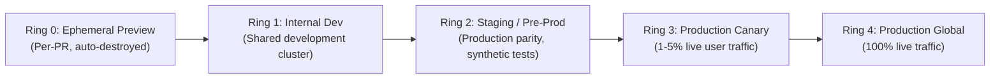
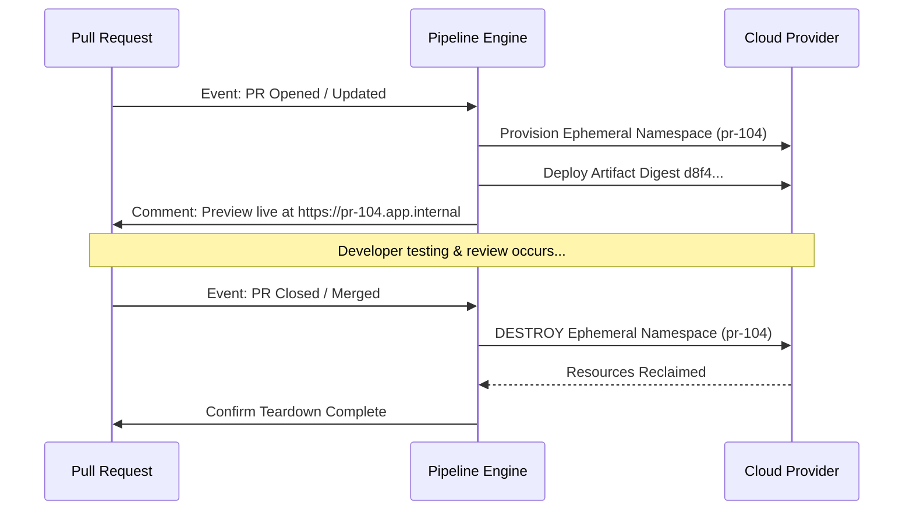
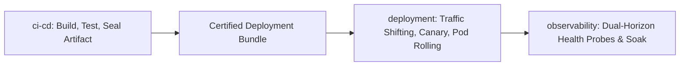

# Environment Promotion, Approval Gates & Delivery Handoff

> **Mandate**: *Continuous Delivery is not the immediate, reckless deployment of every commit to production. It is the disciplined, automated promotion of verified artifacts across progressive trust rings.*

---

## 1 · The Multi-Ring Environment Promotion Model

Software transitions through environments along an increasing curve of operational blast radius and consumer impact:

### Promotion Transition Criteria
An artifact cannot advance to Ring $N+1$ until it satisfies all empirical gates of Ring $N$:
$$\text{CanPromote}(\mathcal{A}, \text{Ring}_N \to \text{Ring}_{N+1}) \iff \bigwedge_{k} \text{Gate}_k(\mathcal{A}, \text{Ring}_N) = \text{PASS}$$

---

## 2 · Ephemeral PR Preview Environments & Lifecycle Teardown

Preview environments provide isolated testing for pull requests without colliding with shared staging environments.

### The Lifecycle Contract
1. **On PR Open / Sync**: The pipeline spins up ephemeral resources (e.g. lightweight namespace, temporary database schema, preview sub-domain `pr-42.preview.domain.com`).
2. **On Test Verification**: Automated smoke tests run against the preview URL.
3. **On PR Close / Merge (Mandatory Teardown)**: The pipeline intercepts the close event and forcibly destroys all preview resources:

* **Cost Defense**: Any pipeline lacking an automated teardown trigger violates Invariant 7 by allowing zombie cloud instances to accumulate and burn budget.

---

## 3 · Human Governance & Approval Gates

While CI/CD prioritizes automation, production mutations in regulated or mission-critical systems often require explicit human sign-off:

### The Governance Boundary
- **Pre-Production Rings (Dev/Staging)**: 100% automated promotion upon passing all verification gates.
- **Production Ring**: Requires an explicit, cryptographic or policy-checked approval gate:
  - Authorized maintainer sign-off.
  - Verification that the release window is within approved maintenance hours.
  - Zero active Sev-0/Sev-1 production incidents in the target region.

---

## 4 · The Handoff to `deployment` & `release-management`

The `ci-cd` pipeline completes its responsibility at the promotion boundary by producing a **Certified Deployment Bundle**:

$$\mathcal{D}_{\text{bundle}} = \langle \mathcal{A}_{\text{immutable}}, \mathcal{C}_{\text{config}}, \mathcal{S}_{\text{secrets}}, \mathcal{P}_{\text{provenance}} \rangle$$

Where:
- $\mathcal{A}_{\text{immutable}}$: Immutable container image or binary pinned by cryptographic digest SHA-256.
- $\mathcal{C}_{\text{config}}$: Validated environment configuration schema from [`configuration-management`](../configuration-management/SKILL.md).
- $\mathcal{S}_{\text{secrets}}$: Secure, scoped secret references (never raw secret values).
- $\mathcal{P}_{\text{provenance}}$: Signed SLSA attestation, SBOM, and release readiness certification from [`release-management`](../release-management/SKILL.md).

Once the bundle is passed to [`deployment`](../deployment/SKILL.md), that skill executes progressive rollout strategies (canary, blue-green, rolling pods, expand/contract migrations), while [`observability`](../observability/SKILL.md) monitors live service health.

---

## 5 · Deterministic Rollback Preparedness

Continuous Delivery requires instant rollback capability without rebuilding:
1. **Forward Promotion of Historical Digests**: A rollback is simply the promotion of the *previously certified artifact digest* $\mathcal{A}_{t-1}$:
$$\text{Rollback} \iff \text{Deploy}(\mathcal{A}_{t-1}, \mathcal{C}_{t-1})$$
2. **Prohibition of Re-compilation during Outages**: Never attempt to fix a production outage by checking out an old git commit and re-running a full 30-minute compilation pipeline. The historical artifact is already sealed in the registry and can be redeployed in seconds.
