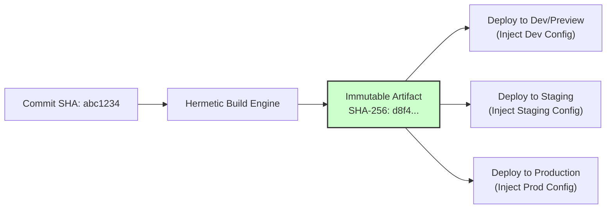

# Hermetic Builds, Artifact Immutability & Provenance Attestations

> **Mandate**: *A computational build is a deterministic pure function mapping source code, locked dependencies, and toolchain configurations to an immutable binary artifact. If the inputs are identical, the output digest must be bit-for-bit reproducible across any runner.*

---

## 1 · The Deterministic Build Function

A build process is formally represented as:
$$\mathcal{A} = \text{Build}(C, \mathcal{L}, \mathcal{T}, \mathcal{E})$$
Where:
- $C$ is the immutable source code commit SHA.
- $\mathcal{L}$ is the exact cryptographic dependency lockfile (`Cargo.lock`, `poetry.lock`, `package-lock.json`, `go.sum`).
- $\mathcal{T}$ is the pinned toolchain version (compiler, SDK, system libraries).
- $\mathcal{E}$ is the hermetic build environment (zero ambient environment variables or unpinned host binaries).

### The Hermetic Guarantee
A build is **hermetic** if and only if:
$$\forall \text{Runner}_A, \text{Runner}_B, \quad \text{Digest}(\text{Build}(C, \mathcal{L}, \mathcal{T})_{\text{Runner}_A}) = \text{Digest}(\text{Build}(C, \mathcal{L}, \mathcal{T})_{\text{Runner}_B})$$

To achieve hermeticity:
1. **Zero Network Egress During Compilation**: All third-party packages must be pre-fetched during an explicit dependency resolution step and verified against lockfile checksums before compilation begins.
2. **Normalized Timestamps & Paths**: Strip host-specific absolute paths from binary metadata and clamp timestamps (e.g. `SOURCE_DATE_EPOCH`) to eliminate non-deterministic binary diffs.
3. **Containerized or Sandboxed Toolchains**: Never rely on ambient host OS compilers; execute within hermetic containers or sandbox toolchains.

---

## 2 · The Build-Once, Promote-Anywhere Principle

A deployable artifact must be synthesized **exactly once** in the build phase of the pipeline. Re-compiling code per target environment (e.g. building a "staging binary" and later a "production binary") is strictly forbidden:



$$\text{Digest}(\mathcal{A}_{\text{dev}}) = \text{Digest}(\mathcal{A}_{\text{staging}}) = \text{Digest}(\mathcal{A}_{\text{prod}})$$

### Separation of Code and Configuration
Environment differences (database connection strings, API endpoints, feature flags, secret keys) must be injected **externally at runtime** via environment variables or secret vaults—never baked into the compiled artifact layers.

---

## 3 · Mobile & Embedded Resolution: Code Signing vs Compilation

In mobile (iOS/Android) and secure embedded firmware, production distribution requires cryptographic signing with private keys that cannot and must not be exposed to staging or CI build stages.

### The Two-Layer Artifact Formalization
To uphold Invariant 1 without violating platform constraints:
1. **Functional Compilation Layer (Immutable)**: The compiled intermediate representation, object files, or bytecode archive ($Hash(\text{Bytecode})$) is built once and sealed.
2. **Distribution Packaging Layer (External Wrapper)**: Cryptographic code signing (e.g., Apple App Store distribution certificates or secure boot keys) is applied to the pre-compiled binary as an external transformation wrapper:
$$\mathcal{A}_{\text{signed}} = \text{Sign}(\text{Bytecode}_{\text{verified}}, \text{Cert}_{\text{prod}})$$
$$\text{Verify}(\mathcal{A}_{\text{signed}}) \implies Hash(\text{Unpack}(\mathcal{A}_{\text{signed}})_{\text{code}}) = Hash(\text{Bytecode}_{\text{verified}})$$
* **Prohibition**: Recompiling mobile source code with different compiler optimization flags or altered source trees for store submission.

---

## 4 · Cryptographic Hashing & Checksum Manifests

Every build pipeline must produce a canonical checksum manifest (`checksums.sha256` or `SHA256SUMS`) as a companion artifact:
```text
d8f4e2...  service-backend.tar.gz
4b7a19...  cli-darwin-arm64
9e120c...  cli-linux-amd64
```
Pipelines downstream must verify artifact digests before initiating deployment or promotion.

---

## 5 · Software Bill of Materials (SBOM) & Supply Chain Security

Every release artifact must be sealed with a machine-readable Software Bill of Materials in a recognized standard format:
- **CycloneDX** (JSON/XML) or **SPDX** (Tag-Value/JSON).

### Minimum Required SBOM Metadata
1. **Component Identity**: Exact Package URLs (PURL) for every direct and transitive dependency.
2. **Cryptographic Hashes**: SHA-256 / SHA-512 hashes for all external dependency packages.
3. **Declared Licenses**: Explicit license identifiers (SPDX IDs) to gate against unauthorized copyleft licenses.
4. **Toolchain Components**: Compiler, base image digest, and build tool versions.

---

## 6 · Supply Chain Levels for Software Artifacts (SLSA) & Provenance

To defend against build tampering, compromised runners, and supply chain poisoning, the pipeline synthesizes signed build provenance:

```json
{
  "_type": "https://in-toto.io/Statement/v0.1",
  "subject": [
    {
      "name": "registry.company.internal/service",
      "digest": { "sha256": "d8f4e2c8a..." }
    }
  ],
  "predicateType": "https://slsa.dev/provenance/v1",
  "predicate": {
    "buildDefinition": {
      "buildType": "https://company.internal/pipeline@v1",
      "externalParameters": {
        "repository": "https://github.com/company/repo",
        "ref": "refs/heads/main",
        "commit": "abc1234..."
      }
    },
    "runDetails": {
      "builder": { "id": "https://actions.company.internal/runner-cluster" },
      "metadata": {
        "invocationId": "run-984210",
        "startedOn": "2026-09-25T12:00:00Z"
      }
    }
  }
}
```
* Deployments must reject artifacts lacking valid cryptographic provenance or signed SLSA attestations.
