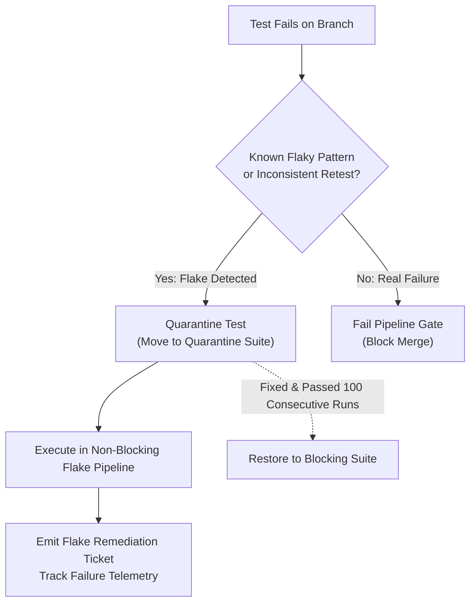
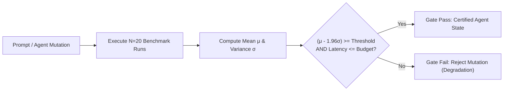

# Honest Quality Gates, Signal Integrity & Statistical Verification

> **Mandate**: *A green pipeline must mean that the code is genuinely verified and releasable. A pipeline that passes broken code is an architectural hazard; a pipeline that fails correct code destroys developer velocity.*

---

## 1 · The Honest Signal Axiom

A merge gate is honest if and only if its pass/fail state is strictly correlated with functional and operational correctness:
$$\text{Signal}(\text{PASS}) \iff \text{Correctness}(\Delta S) = \text{true}$$

### Prohibited Deceptions:
1. **Suppressed Exit Codes**: Appending `|| true` or `continue-on-error: true` to critical build or test steps.
2. **Blind Retry Loops**: Running failing tests 3 times until one magically passes (`flaky-test-runner --retry 3`). This masks race conditions, thread pool starvations, and memory leaks.
3. **Vanity Assertions**: Mocking out 100% of internal logic so tests assert nothing more than that the runtime didn't crash.

---

## 2 · Flaky Test Quarantine Protocol

Flaky tests (tests that produce non-deterministic results on identical commits) erode engineering trust. Pipelines must implement an **Automated Quarantine System**:

### Quarantine Rules
1. **Immediate Extraction**: When a test exhibits non-determinism, quarantine it from the blocking merge gate immediately.
2. **Explicit Quarantine Pipeline**: Run quarantined tests in an asynchronous, non-blocking monitoring pipeline to collect diagnostic traces and failure frequencies.
3. **Restoration Gate**: A quarantined test may return to the blocking test suite only after passing $N \ge 100$ consecutive runs under high load or artificial jitter.

---

## 3 · Statistical Gating for Stochastic & AI Agent Systems

In probabilistic systems (large language models, autonomous agents, stochastic simulations, or performance benchmarks), individual runs are inherently non-deterministic. A single run cannot be evaluated with a simple binary boolean exit code.

### The Statistical Gate Formulation
Stochastic verification runs $N$ evaluation samples ($N \ge 10$) across a golden evaluation dataset $\mathcal{D}_{\text{eval}}$:

$$\mu = \frac{1}{N} \sum_{i=1}^N \text{Score}_i, \quad \sigma = \sqrt{\frac{1}{N-1} \sum_{i=1}^N (\text{Score}_i - \mu)^2}$$

The pipeline enforces a **Lower Bound Confidence Interval**:
$$\text{StatisticalGate}(\text{PASS}) \iff (\mu - k \cdot \sigma) \ge \tau \land \text{Cost}_{\text{tokens}} \le \mathcal{B}_{\text{token}}$$

Where:
- $\tau$ is the minimum required benchmark accuracy threshold.
- $k$ is the confidence multiplier (e.g. $k = 1.96$ for 95% confidence).
- $\mathcal{B}_{\text{token}}$ is the maximum allowable token or latency budget.

---

## 4 · Deterministic Test Sharding & Worker Sizing

Running 2,000 integration tests sequentially on a single runner causes feedback delays ($T > 45\text{m}$).  
Pipelines must partition test suites across $M$ parallel shards deterministically:

$$\text{ShardID} = \text{Hash}(\text{TestPath}) \pmod M$$

### Timing-Balanced Sharding
For optimal speed, partition test files based on historical execution duration $t_{\text{exec}}$ rather than file count, ensuring all $M$ shards terminate at approximately the same time:
$$\sum_{j \in \text{Shard}_1} t_j \approx \sum_{j \in \text{Shard}_2} t_j \approx \dots \approx \sum_{j \in \text{Shard}_M} t_j$$

---

## 5 · Differential Coverage Gating

Global code coverage numbers are vanity metrics that allow developers to write 100 trivial tests for old code while leaving risky new mutations completely uncovered.

### The Delta Coverage Invariant
Gating must evaluate **Differential Coverage** ($\text{Coverage}(\Delta S)$)—the percentage of *new or modified lines* covered by automated tests:
$$\text{Coverage}(\Delta S) = \frac{\text{CoveredLines}(\Delta S)}{\text{ExecutableLines}(\Delta S)} \ge \text{TargetThreshold} \quad (\text{e.g. } 90\%)$$
* Global repository coverage is tracked as a health trend, but pull request mergeability is strictly gated on the delta coverage.

---

## 6 · Merge Queues & Speculative Verification Trains

Merging 5 concurrently green PRs into `main` can result in a broken mainline if PR A and PR B have semantic incompatibilities that neither branch tested against.

### The Merge Queue Protocol
1. When a PR is approved, it enters the **Merge Queue**.
2. The CI engine creates a speculative merge commit: $\text{SpeculativeCommit} = \text{Merge}(\text{mainline}, \text{PR}_A, \text{PR}_B)$.
3. The pipeline verifies the speculative combined state.
4. Only upon successful verification is the code fast-forwarded into the production branch.
