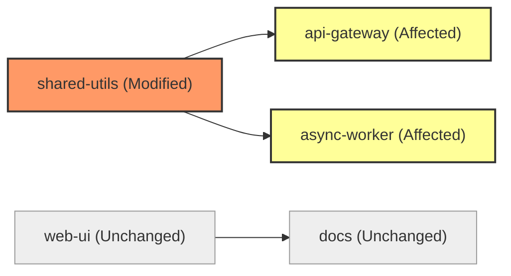
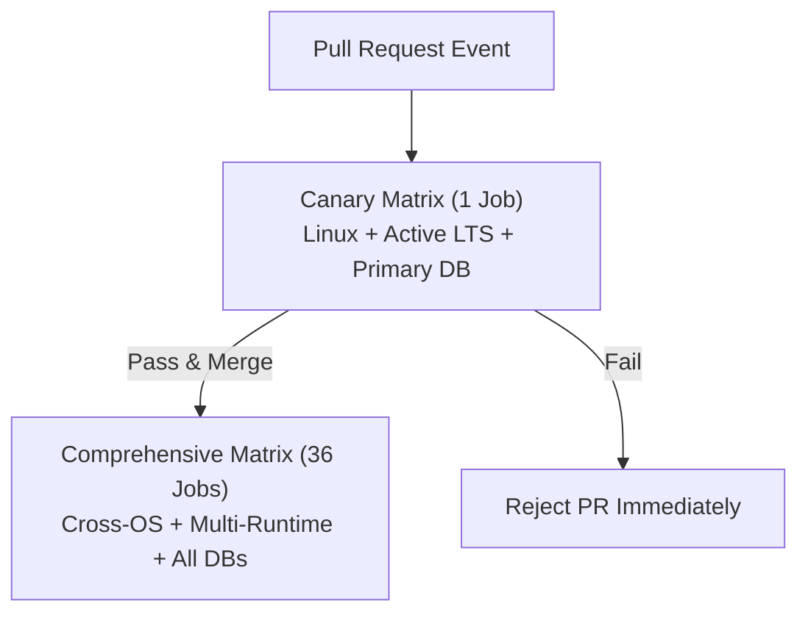

# Pipeline Topology, Stage Ordering & Dependency DAGs

> **Mandate**: *An automated pipeline is a Directed Acyclic Graph (DAG) of computational transformations. The efficiency and reliability of verification are fundamentally bounded by graph topology and stage ordering.*

---

## 1 · Mathematical DAG Formulation

Every pipeline is modeled as a directed acyclic graph:
$$\mathcal{P} = \langle \mathcal{V}, \mathcal{E}, \mathcal{G}, \mathcal{A} \rangle$$
Where:
- $\mathcal{V} = \{v_1, v_2, \dots, v_n\}$ is the set of executable jobs/stages.
- $\mathcal{E} \subseteq \mathcal{V} \times \mathcal{V}$ is the set of directed causal dependency edges ($u \to v$ denotes that job $v$ requires job $u$ to succeed before commencing).
- $\mathcal{G} = \{g_1, g_2, \dots, g_m\}$ is the set of falsifiable verification gates evaluated at stage boundaries.
- $\mathcal{A}$ is the immutable artifact stream propagated across vertices.

### Graph Acyclicity Constraint
Cyclic dependencies are physically and logically invalid:
$$\forall v_i \in \mathcal{V}, \quad \text{Path}(v_i, v_i) = \emptyset$$

---

## 2 · Topological Stage Ordering & Fail-Fast Economics

Pipeline stages must be sorted such that **execution cost and duration increase monotonically with stage depth**, minimizing the wasted compute cost on broken commits:

```mermaid
flowchart TD
    subgraph Stage 1: Fast Static Checks [0 - 60s]
        S1A["Syntax & Formatting"]
        S1B["Typechecking"]
        S1C["Secret Scanning"]
    end

    subgraph Stage 2: Hermetic Build & Unit Tests [1 - 4m]
        S2A["Hermetic Compile"]
        S2B["Unit Test Suite"]
        S2C["SAST Audit"]
    end

    subgraph Stage 3: Integration & Contract Tests [4 - 15m]
        S3A["Container Packaging"]
        S3B["DB Migration Replay"]
        S3C["Service Contract Tests"]
    end

    subgraph Stage 4: Comprehensive E2E & Perf [15 - 45m]
        S4A["End-to-End System Tests"]
        S4B["Synthetic Smoke Verification"]
    end

    Stage 1 --> Stage 2 --> Stage 3 --> Stage 4
```

### The Fail-Fast Law
Let $C(v)$ be the computational cost and $T(v)$ be the duration of job $v$.  
Let $P(\text{failure} \mid v)$ be the historical probability of job $v$ detecting a defect.  
The optimal topological sequence maximizes defect discovery velocity:
$$\text{Priority}(v) = \frac{P(\text{failure} \mid v)}{C(v) \cdot T(v)}$$
* Lightweight static linting and typechecking have minimal cost $C \approx 0$, short duration $T \le 60\text{s}$, and high failure-detection rates; they **MUST** execute at the root of the DAG.
* Heavy browser automation or performance load tests have high cost and duration; they **MUST** execute only after upstream units pass.

---

## 3 · Impact-Aware Change Detection (Monorepos & Polyglot Workspaces)

In multi-package monorepos or polyglot codebases, executing the entire pipeline graph on every commit causes catastrophic build queue thrashing. Pipelines must evaluate the **minimal affected sub-DAG**:

### 3.1 The Impact Boundary Formula
Let $\Delta S$ be the set of files modified between the current commit $C$ and the target merge base $B$:
$$\Delta S = \text{GitDiff}(B, C)$$
Let $\text{Deps}(P)$ represent the internal dependency tree of package $P$.  
The execution set $\mathcal{V}_{\text{active}}$ is the union of directly modified packages and their transitive downstream dependents:
$$\mathcal{V}_{\text{active}} = \{ P \in \mathcal{V} \mid (\Delta S \cap P \neq \emptyset) \lor \exists Q \in \mathcal{V}_{\text{active}} \text{ such that } P \in \text{Dependents}(Q) \}$$



* Packages that have zero intersection with $\Delta S$ and zero dependency on modified upstream libraries are pruned from the pipeline execution graph with mathematical certainty.
* **Root Fallback Rule**: Modifications to shared build configurations (e.g. root lockfiles, global CI workflow definitions, Dockerfiles, or toolchain manifests) invalidate graph pruning and force a full pipeline execution.

---

## 4 · Dynamic Matrix Strategies & Intelligent Pruning

A build matrix evaluates compatibility across dimensions: $\mathcal{M} = \mathcal{O} \times \mathcal{R} \times \mathcal{D}$ (Operating Systems $\times$ Runtime Versions $\times$ Database Engines).

### 4.1 Combinatorial Explosion Defense
A naive matrix of 3 OSes $\times$ 4 runtimes $\times$ 3 databases yields 36 concurrent jobs.  
Pipelines must enforce **Tiered Matrix Gating**:



1. **Canary PR Gate**: Evaluate a single representative target (e.g. Ubuntu LTS + stable runtime). Fast, cheap, and catches $\ge 95\%$ of functional bugs.
2. **Comprehensive Full Matrix**: Defer complete combinatorial validation to post-merge integration or scheduled nightly builds.
3. **Sparse Exclusion Rules**: Explicitly exclude unsupported combinations (e.g., legacy runtime on latest OS) to prevent dead test runs.

---

## 5 · Critical Path Analysis & Latency Optimization

The overall duration of a pipeline is bounded by its critical path—the longest directed sequence of dependent jobs:
$$T_{\text{pipeline}} = \sum_{v \in \text{CriticalPath}} T(v)$$
To optimize pipeline latency:
1. **Parallelize Independent Slices**: Split independent test suites across concurrent workers.
2. **Decouple Artifact Synthesis**: Do not block unit test execution on container image building; execute compilation and unit testing in parallel with base container layer pulls.
3. **Early Abort Cascades**: When any upstream gate fails, terminate all sibling and downstream jobs immediately.
