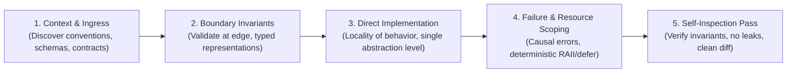

# Code Quality: Universal Engineering & Defensive Construction Protocol

> **Mandate**: Build software that is correct by construction, fails fast with actionable causal context, never leaks resources, and minimizes cognitive load for future maintainers. Enforce strict invariants at untrusted boundaries; keep internal implementations simple, direct, and free from speculative abstraction.

---

## 1 · The Defensive Construction Lifecycle

Never write speculative, leaky, or unbounded code. Execute every code construction or modification task through this 5-phase engineering protocol:

1. **Context & Ingress Discovery**: Inspect project conventions, existing error representations, and runtime constraints before authoring code. Never invent arbitrary abstractions when established project idioms exist.
2. **Boundary Invariants**: Validate and sanitize untrusted inputs at the system perimeter (HTTP, CLI, database, filesystem, environment variables). Once inside the perimeter, represent data with types that make invalid states unrepresentable (see [`references/defensive-boundaries.md`](references/defensive-boundaries.md)).
3. **Direct Implementation (Locality of Behavior)**: Choose the simplest cohesive design that solves the immediate problem. Avoid speculative interfaces or premature generalization. Keep related logic close together (see [`references/simplicity-and-locality.md`](references/simplicity-and-locality.md)).
4. **Failure & Resource Scoping**:
   - Differentiate recoverable operational errors from unrecoverable programmer bugs. Wrap errors with domain context and causal linkage (see [`references/error-hygiene.md`](references/error-hygiene.md)).
   - Bind every resource acquisition (sockets, file descriptors, locks, database connections) to a deterministic cleanup scope (see [`references/concurrency-and-resources.md`](references/concurrency-and-resources.md)).
5. **Self-Inspection Pass**: Before handing code off to testing or review, inspect the diff for accidental state leaks, unhandled async paths, or leftover debug statements.

---

## 2 · Adaptive Cognitive Sizing (Mode Selection)

Size your engineering effort to the risk and scope of the task. Do not over-engineer a simple one-line fix, and never cut corners on critical infrastructure:

| Mode | Trigger & Scope | Quality Discipline | Required Artifacts |
| :--- | :--- | :--- | :--- |
| **`triage`** | Bug fix, localized patch, single-file update (< 50 lines). | Preserve existing call signatures; add defensive boundary checks; maintain exact local style. | Clean code diff with line-anchored explanation. |
| **`standard`** | New feature, endpoint, data model, or refactored subsystem. | Full 5-phase lifecycle; typed domain models; causal error chains; deterministic resource management. | Code implementation + unit/integration test coverage. |
| **`critical`** | Auth, cryptography, billing/financial transactions, distributed state, concurrency locks. | Zero tolerance for ambiguity. Exhaustive state-machine modeling; formal invariant proofs; hostile path auditing. | Code + formal state transition specs + full hostile test suite. |

---

## 3 · The Universal Engineering Invariants

Regardless of language, framework, or paradigm, every codebase must respect four foundational invariants:

### 3.1 Boundary Defense & Type Invariants
* **Validate at the Perimeter**: Untrusted data must be parsed, validated, and sanitized at the ingress point. Never pass raw dictionaries, untyped JSON, or unchecked strings into core domain logic.
* **Make Illegal States Unrepresentable**: Model domain entities using algebraic data types, tagged unions, or strongly-typed value objects. If a state cannot legally occur in the business domain, the type system should reject it at compile time.
* *(Multi-language idioms for TypeScript, Python, Go, Rust: [`references/defensive-boundaries.md`](references/defensive-boundaries.md).)*

### 3.2 Error Hygiene & Failure Transparency
* **Never Swallow Exceptions**: Catching an error and doing nothing, or logging and continuing with a compromised state, is strictly forbidden.
* **Preserve the Causal Chain**: When wrapping errors across module boundaries, always attach the underlying cause (`error.cause` in TS/JS, `%w` wrapping in Go, `anyhow::Context` in Rust, `from err` in Python).
* **Separate Error Taxonomies**: Operational failures (transient network drops, expired tokens) require structured handling and retries; programmer bugs (null pointer dereferences, violated assertions) must fail fast and loudly.
* *(Deep taxonomy and patterns: [`references/error-hygiene.md`](references/error-hygiene.md).)*

### 3.3 Concurrency & Resource Safety
* **Deterministic Lifetimes**: Every open socket, file handle, transaction, or mutex lock must be bound to a deterministic release mechanism (`defer` in Go, `try-finally` in TS/Python, `using`/`IDisposable` in C#, RAII in Rust/C++).
* **Cancellation & Timeout Propagation**: All asynchronous operations and external I/O calls must accept and respect cancellation tokens/contexts and explicit deadlines.
* **Race Condition Elimination**: Avoid mutable shared memory across threads or async event loops. Prefer immutable data structures, atomic primitives, or explicit channel communication.
* *(Concurrency patterns and lock scoping: [`references/concurrency-and-resources.md`](references/concurrency-and-resources.md).)*

### 3.4 Locality of Behavior & Anti-Overengineering
* **Clarity Beats Abstraction**: Favor clean, linear, readable code over webs of premature abstractions. Do not create an interface or abstract base class until you have at least two concrete implementations that genuinely require polymorphism.
* **Single Level of Abstraction**: Keep a function's implementation at a uniform level of detail. Delegate low-level bit/string manipulation to dedicated helpers.
* *(Cognitive ergonomics and anti-smell rules: [`references/simplicity-and-locality.md`](references/simplicity-and-locality.md).)*

---

## 4 · Archetype Adaptation

Adapt quality rules to the specific architectural archetype of the project (see [`references/archetype-patterns.md`](references/archetype-patterns.md)):

* **Web APIs & Services**: Enforce schema validation on request bodies; propagate `ctx.Done()`; maintain request idempotency.
* **Frontend & Mobile**: Prevent unhandled rejections; clean up subscriptions on component unmount; avoid layout recalculation loops.
* **CLI & Systems Daemons**: Use atomic file writes (write to temp + atomic rename); handle POSIX signals (`SIGINT`/`SIGTERM`); adhere to exit code standards.
* **Libraries & SDKs**: Maintain strict backward compatibility; prevent global state pollution; zero unnecessary external dependencies.
* **Data & ML Pipelines**: Enforce schema checks at batch boundaries; handle nulls explicitly; fix random seeds for reproducible runs.

---

## 5 · Guardrails & Anti-Patterns

### 5.1 Strictly Disallowed Actions
- ❌ **No Silent Catches**: Never write empty `catch {}` or `except: pass` blocks without explicit, documented architectural justification.
- ❌ **No Speculative Abstraction (YAGNI)**: Never introduce generic plugin architectures, factory factories, or dynamic reflection for simple, concrete tasks.
- ❌ **No Global Mutable State**: Never introduce package-level mutable variables or global caches that bleed across concurrent requests or test cases.
- ❌ **No Cosmetic Bikeshedding**: Formatting and indentation belong to automated formatters (`prettier`, `black`, `rustfmt`, `gofmt`). Focus human/agent intelligence exclusively on semantics and reliability.

### 5.2 The Clean Construction Stopping Contract
Before declaring any code modification complete, verify:
- [ ] Untrusted inputs at boundaries are validated against explicit schemas.
- [ ] No unhandled error paths or swallowed exceptions exist in the new call graph.
- [ ] All acquired resources (files, sockets, locks) have deterministic cleanup guarantees.
- [ ] Async operations propagate timeouts or cancellation signals.
- [ ] The change is minimal, cohesive, and free from dead code or debug artifacts.
