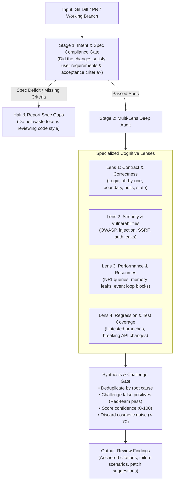

# Code Review: Adversarial Multi-Lens Audit Protocol

> **Mandate**: Assume bugs exist until proven absent. Verify context, callers, and tests before forming judgment. Enforce specification compliance before code aesthetics. Eliminate cosmetic bikeshedding through strict confidence thresholding (0–100), and report only high-signal, evidence-grounded findings with actionable patch recommendations.

---

## 1 · The Two-Stage Review Lifecycle

Never review a pull request or code change as an unstructured stream of impressions. Execute all reviews through this disciplined 2-stage pipeline:

### Stage 1: Specification Compliance Gate
Before evaluating code quality, verify that the code **actually satisfies the requested objective**:
- Are all explicit user requirements and acceptance criteria met?
- Were any edge cases mentioned in the prompt or issue ignored or dropped?
- **Handling Undocumented PRs**: If the change lacks a formal specification or ticket, reconstruct the intended contract from commit messages, issue discussions, and surrounding test diffs. If the intent remains fundamentally ambiguous, report the ambiguity first.
- If the implementation is demonstrably incomplete, **halt immediately**. Document the missing requirements and request completion before reviewing code quality.

### Stage 2: Multi-Lens Deep Audit
Once specification compliance passes, inspect the change surface through four orthogonal lenses:
1. **Contract & Correctness Lens**: Boundary violations, condition inversions, unhandled null/undefined states, state corruption (see [`references/review-lenses.md#lens-1`](references/review-lenses.md)).
2. **Security & Vulnerability Lens**: Injection vectors, tainted data flow, auth/authz bypass, secret leaks, SSRF. When complex threat modeling or supply chain vulnerabilities arise, consult `security-engineering` (see [`references/review-lenses.md#lens-2`](references/review-lenses.md)).
3. **Performance & Resource Safety Lens**: Unbounded queries, memory leaks, unclosed handles/locks, connection exhaustion. For profiling or load capacity verification, consult `performance-engineering` (see [`references/review-lenses.md#lens-3`](references/review-lenses.md)).
4. **Regression & Test Completeness Lens**: Breaking API changes, missing regression tests, untested error branches (see [`references/review-lenses.md#lens-4`](references/review-lenses.md)).

---

## 2 · Adaptive Cognitive Sizing

Scale the review execution based on blast radius, architectural complexity, and change risk:

| Mode | Trigger & Scope | Execution Strategy | Target Output |
| :--- | :--- | :--- | :--- |
| **`lightweight`** | Localized patch, bug fix, or low-risk change to non-critical code. | Single-pass sequential audit across the 4 lenses. Focus on correctness and tests. | Concise review report in conversation. |
| **`standard`** | Multi-file feature branch, new subsystem, or contract modifications. | Full 2-stage review; inspect callers and schemas; generate patch snippets. | Structured findings report (in file or PR comment per project convention). |
| **`composite`** | High-blast-radius architectural overhaul, security-critical modules, or large cross-cutting changes. | Decompose review across specialized passes (correctness, security, performance) or parallel review agents; synthesize findings. | Comprehensive review report with reconciled deduplication and risk summary. |

---

## 3 · Scoring & Noise Filtering (Anti-Nitpicking)

To protect developer and agent bandwidth from cosmetic bikeshedding, every candidate finding is evaluated against a strict confidence threshold:

### Severity Tiers
* **P0 - Blocker**: Critical security vulnerability, data loss risk, build breakage, or severe regression. Must block merge.
* **P1 - Critical**: High-probability logic bug, memory leak, unhandled failure path, or broken public contract.
* **P2 - Moderate**: Missing test coverage for complex logic, performance hotspot, or maintainability risk.
* **P3 - Advisory**: Concrete non-blocking architectural suggestion with clear technical justification.

### Confidence Thresholding & The Suppression Rule
Each finding receives a confidence score from **0 to 100** based on verifiable code evidence:
$$\text{Confidence} = \text{Grounding (Line Citation)} + \text{Reproducibility (Concrete Scenario)} - \text{Speculation}$$

> [!WARNING]
> **Strict Suppression Rule**:
> 1. Any finding with a confidence score **below 70** is **automatically discarded**.
> 2. Any comment on code formatting, whitespace, indentation, or subjective naming preference is **strictly forbidden**. Formatting belongs to automated tools.

*(Detailed scoring rubrics and suppression guidelines: [`references/severity-and-scoring.md`](references/severity-and-scoring.md).)*

---

## 4 · The Adversarial Challenge Pass

Before reporting any finding, execute an internal **Red-Team Challenge**:
* *Does an upstream middleware or validation schema already prevent this invalid state?*
* *Does the language type system or compiler make this impossible at runtime?*
* *Is this pre-existing legacy behavior that was simply untouched by this diff?*

If the answer to any of these is "yes", **drop the finding**. Only report issues that genuinely survive adversarial challenge (see [`references/synthesis-and-challenge.md`](references/synthesis-and-challenge.md)).

---

## 5 · Deliverable Format

All findings must be formatted with actionable, verifiable citations:
- **Location**: File path and line range (`[CODE: path/to/file#L42-L48]`).
- **Severity & Confidence**: e.g., `P1 - Critical (Confidence: 85/100)`.
- **Failure Scenario**: Concrete explanation of what triggers the failure and its observable impact.
- **Recommended Remediation**: Minimal, drop-in replacement code snippet.
