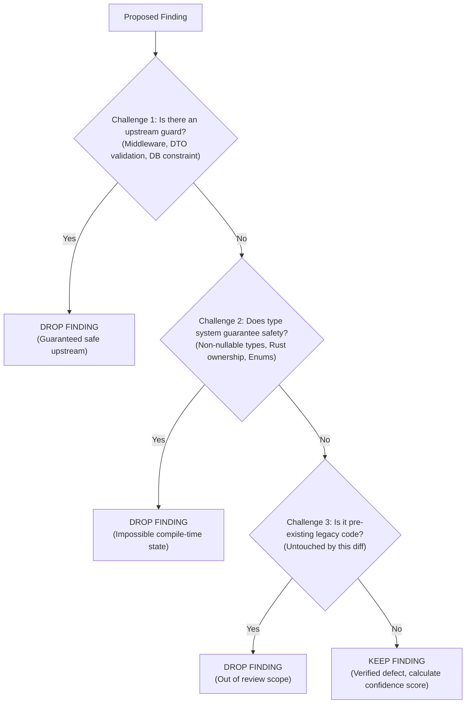

# Synthesis, Deduplication & Adversarial Challenge

> **Mandate**: When multiple review subagents or analytical passes evaluate the same code, raw outputs must be de-duplicated, reconciled for contradictions, and subjected to an adversarial challenge pass to eliminate false positives.

---

## 1. Deduplication Heuristics

Parallel reviewers often report the same underlying defect from different angles (e.g. a Correctness reviewer flags an unhandled `null`, while a Security reviewer flags the same line as a potential denial-of-service vector).

### De-duplication Protocol:
1. **Group by Root Cause**: If multiple findings share the same file, line range, and trigger condition, merge them into a single primary finding.
2. **Elevate to Highest Severity**: If a defect is classified as both P2 (Performance) and P0 (Security), the merged finding adopts the higher severity (P0).
3. **Reconcile Contradictory Recommendations**:
   - If Reviewer A suggests decomposing a function into micro-classes, and Reviewer B warns against unnecessary indirection, apply the **Simplicity & Locality Principle**: Favor clean, cohesive local code over premature abstraction.

---

## 2. The Adversarial Challenge Pass (Red-Teaming Findings)

Before outputting a finding, act as the "Defense Attorney" for the code under review. Test each finding against these three challenges:

### Challenge Checklist:
* **The Framework Guarantee**: Does the framework (e.g. FastAPI, Spring, Next.js) automatically handle this failure? (e.g. FastAPI auto-validates types and returns 422, so manual type checks in the route handler are redundant).
* **The Type Invariant**: Does the compiler prove this cannot be null? (e.g. TypeScript with `strictNullChecks: true`, Rust `Option<T>`).
* **The Contract Scope**: Was this line actually modified or directly impacted by the PR? If not, do not blame the author for historical technical debt.

---

## 3. Formatting the Final Report

Synthesize surviving findings into a prioritized, actionable artifact. Group strictly by severity:
1. **P0 - Blocker** (Immediate action required)
2. **P1 - Critical** (Must resolve before release)
3. **P2 - Moderate** (Improvement recommended)
4. **P3 - Advisory** (Non-blocking consideration)

Every item in the report must provide a concrete, ready-to-apply diff patch.
