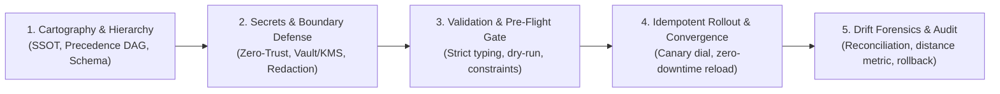

# Configuration Management: Universal Configuration Engineering & Operational Governance Protocol

> **Mandate**: *Configuration is the parameterized boundary between invariant logic and variable operational environments.* Invariant computation (code, binaries, container images, agent system prompts) must remain immutable across deployment lifecycles; all operational dimensions (network endpoints, resource quotas, secret bindings, feature toggles, agent tool policies) are externalized, strictly validated, and deterministically resolved. Unchecked configuration drift, ambiguous precedence cascades, plaintext secret leakage, and unvalidated boot sequences represent catastrophic systemic vulnerabilities. Separation of code and context, deterministic precedence lattices, strict schema contracts, idempotent convergence, and zero ambient secret exposure strictly precede mutation. Never bake variable context into deployable binaries; never commit plaintext secrets to version control; and never apply dynamic runtime mutations without bounded blast-radius controls and instant rollback readiness.

---

## 1 · The 5-Phase Configuration Lifecycle

Every configuration task—whether declaring local environment variables, provisioning multi-environment cloud templates, configuring runtime feature flags, or syncing autonomous agent tool policies—traverses this 5-phase protocol:

1. **Phase 1 — Cartography & Hierarchy Definition**: Discover all declared configuration sources, establish the authoritative Single Source of Truth (SSOT), define the typed schema contract, and resolve the acyclic precedence DAG (see [`references/precedence-scoping-and-hierarchy.md`](references/precedence-scoping-and-hierarchy.md)).
2. **Phase 2 — Secrets Isolation & Boundary Defense**: Enforce strict separation between public configuration parameters and sensitive secrets. Validate storage mechanisms (KMS, vaults, ephemeral injected environment variables) and verify zero plaintext in logs, traces, and VCS (see [`references/secrets-management-and-zero-trust.md`](references/secrets-management-and-zero-trust.md)).
3. **Phase 3 — Validation & Pre-Flight Gatekeeping**: Execute static type checking, range validation, semantic cross-field assertions, and dry-run execution against the target environment. Block any mutation with missing, ambiguous, or invalid parameters (see [`references/validation-schema-and-contract-enforcement.md`](references/validation-schema-and-contract-enforcement.md)).
4. **Phase 4 — Idempotent Rollout & Convergence**: Apply desired state idempotently ($f(f(x)) = f(x)$). For dynamic configuration or feature flags, coordinate with [`deployment`](../deployment/SKILL.md) for traffic shifting and zero-downtime hot-reloads (see [`references/dynamic-config-and-safe-rollout.md`](references/dynamic-config-and-safe-rollout.md)).
5. **Phase 5 — Continuous Reconciliation, Drift Forensics & Rollback**: Monitor runtime divergence against declared state using the formal Drift Distance Metric. Maintain an immutable, cryptographically verifiable change log and maintain immediate rollback readiness across applications, infrastructure, and agent systems (see [`references/environment-parity-and-drift-forensics.md`](references/environment-parity-and-drift-forensics.md) and [`references/agentic-governance-and-cross-tool-sync.md`](references/agentic-governance-and-cross-tool-sync.md)).

---

## 2 · Progressive Disclosure (Reference Routing)

To prevent cognitive overload and preserve LLM context bandwidth, consult reference manuals strictly on demand based on task context:

| Context Trigger | Mandatory Reference Manual | Purpose |
| :--- | :--- | :--- |
| **Config precedence, multiple sources, cascading overrides, SSOT** | [`references/precedence-scoping-and-hierarchy.md`](references/precedence-scoping-and-hierarchy.md) | Semi-lattice precedence order, cascading merges, variable expansion, SSOT authority, anti-shadowing. |
| **Config schemas, type safety, boundary validation, pre-flight checks** | [`references/validation-schema-and-contract-enforcement.md`](references/validation-schema-and-contract-enforcement.md) | Typed schemas (JSON Schema, Zod, Pydantic, CUE), type coercion rules, semantic constraints, fail-fast gates. |
| **API keys, passwords, certificates, encryption, .env leakage** | [`references/secrets-management-and-zero-trust.md`](references/secrets-management-and-zero-trust.md) | Secrets vs config ontology, vaults, KMS envelope encryption, rotation lifecycles, log redaction. |
| **Dev vs Staging vs Prod drift, .env.example, preview envs** | [`references/environment-parity-and-drift-forensics.md`](references/environment-parity-and-drift-forensics.md) | Scaling parity, ephemeral previews, drift distance metric $\Delta$, bidirectional state reconciliation. |
| **Runtime toggles, feature flags, zero-downtime reloads, rollbacks** | [`references/dynamic-config-and-safe-rollout.md`](references/dynamic-config-and-safe-rollout.md) | Dynamic reconfig without restarts, canary rings, blast-radius mitigation, circuit breakers, 1-step rollback. |
| **AI agent rules, prompt parameters, tool permissions, MCP sync** | [`references/agentic-governance-and-cross-tool-sync.md`](references/agentic-governance-and-cross-tool-sync.md) | AI agent rulesets, cross-tool sync, SAFE/APPROVAL/LOCKED policy tiers, mutation audits. |

---

## 3 · Adaptive Cognitive Sizing (The 6 Execution Modes)

Size your configuration engineering effort to the task's scope and risk profile. Never apply heavy enterprise bureaucracy to a single-line patch, and never execute speculative, unverified mutations across high-blast-radius production systems:

| Mode | Trigger & Scope | Engineering Discipline | Required Output & Protocol |
| :--- | :--- | :--- | :--- |
| **`schema-lint`** | Adding or modifying config keys, syntax linting, type validation. | Evaluate format, type safety, default values, and schema definitions. | Schema Validation Verdict: Pass/Fail with typed schema diff. |
| **`secret-audit`** | Security reviews, pre-commit checks, credential audits. | Scan for plaintext keys, verify `.gitignore`/`.env` isolation, audit redaction. | Zero-Trust Secret Certification: Proof of zero plaintext in VCS/logs. |
| **`env-parity-sync`** | Environment drift, staging/prod desynchronization, template updates. | Reconcile `.env.example`, unify cross-environment keys, verify scale-only delta. | Environment Parity Matrix: Comprehensive key diff across tiers. |
| **`drift-reconcile`** | Out-of-band mutations, infrastructure audit, config convergence. | Measure live vs declared state divergence, calculate drift metric $\Delta$, plan convergence. | Drift Forensics Report & Remediation: Plan to restore desired state. |
| **`dynamic-rollout`** | Feature flagging, runtime tuning, percentage dials, parameter adjustments. | Define flag schema, validate defaults, establish fallback circuit breakers. | Safe Rollout Plan & Rollback Trigger: Progression schedule and abort condition. |
| **`agent-govern`** | AI agent instruction changes, MCP server configs, tool authorization. | Classify by policy tier (`SAFE`, `APPROVAL`, `LOCKED`), audit provenance, sync across runtimes. | Agent Policy & Cross-Tool Sync Proof: Multi-agent coherence log. |

---

## 4 · The 7 Universal Configuration Invariants

Regardless of language, framework, cloud provider, or agent harness, every robust computational system upholds these 7 timeless invariants:

### 4.1 Invariant 1: Invariant Logic & Operational Context Separation (The Invariance Axiom)
A deployable computational artifact (binary, container, script, or agent system prompt) must be immutable and compile once. Any parameter that varies across deployment targets, environments, regions, or tenants must be injected at the execution boundary, never hardcoded into logic.

### 4.2 Invariant 2: Deterministic Precedence Lattice & Attribution (The Cascade Axiom)
Configuration resolution must follow an unambiguous, acyclic precedence order. When multiple sources supply a key, resolution order must be mathematically deterministic and traceable.

### 4.3 Invariant 3: Ontological Distinction of Secrets (The Zero-Trust Secrecy Axiom)
Secrets (private keys, tokens, passwords, certificates) are distinct from configuration. Secrets must never be stored in plain text, never committed to version control, never exposed to client browsers, and never output in application logs, traces, or agent conversation context.

### 4.4 Invariant 4: Strict Schema & Pre-Flight Validation (The Fail-Fast Boundary Axiom)
Configuration input constitutes an untrusted boundary. Systems must validate configuration values against a rigid, typed schema (checking types, formats, ranges, and cross-field constraints) before bootstrapping runtime services. A misconfigured system must fail fast during startup.

### 4.5 Invariant 5: Declarative Desired State & Idempotency (The Convergence Axiom)
Configuration changes must be expressed as the desired end-state, not imperative action scripts. Re-applying the identical configuration against a converged system must produce zero net mutation and zero side-effects ($f(f(x)) = f(x)$).

### 4.6 Invariant 6: Scaled Environment Parity (The Equivalence Axiom)
Development, staging, preview, and production environments are fundamentally the same system operating at different sizes. Any divergence between environments must be strictly confined to resource capacity, performance tiering, and external endpoint bindings.

### 4.7 Invariant 7: Bounded Blast-Radius & Instant Rollback (The Containment Axiom)
Dynamic runtime reconfigurations and feature rollouts must be guarded by bounded exposure envelopes. The system must maintain an immutable rollback posture: any configuration mutation must be instantly revertible to the previous known-good state with zero downtime.

---

## 5 · The Configuration Invariant Exception Protocol (Extreme Edge Cases)

When exceptional operational constraints (legacy brownfield monoliths with hardcoded settings, air-gapped enclaves without external vaults, emergency zero-day production hotfixes, or firmware hardware constraints) conflict with standard configuration invariants:

> [!CAUTION] CONFIGURATION INVARIANT EXCEPTION PROTOCOL
> An agent may deliberately bypass a configuration invariant **IF AND ONLY IF**:
> 1. **Operational Blocker Citation**: Explicitly cites the physical or organizational blocker.
> 2. **Quarantined Boundary Containment**: Confines the exception inside an isolated boundary.
> 3. **Micro-ADR**: Records the trade-off, rationale, and technical debt retirement ticket in an immutable record.

---

## 6 · Universal Archetype Adaptation

The 7 invariants adapt dynamically across every software ecosystem by abstracting tools to universal configuration roles:

* **Application & Microservices**: Version-controlled config files (`config.yaml`, `settings.json`); process environment variables; KMS envelope encryption or secret sidecars; validation via typed schemas (Zod, Pydantic, struct unmarshaling).
* **Infrastructure as Code**: Declarative templates (Terraform, K8s manifests); host parameters and cloud-init; provider-managed sealed secrets; static plan validation.
* **Dynamic Runtime & Edge**: Centralized dynamic key-value stores or feature flag services; polling or subscription streams; encrypted payloads; schema enforcement on change publish.
* **AI Agent Systems & MCP**: Canonical workspace rulebooks (`AGENTS.md`, `SKILL.md`, MCP JSON manifests); prompt context injection; ephemeral session tokens; agent evaluation verification gates.
* **OS & System Engineering**: System configuration tree (`/etc/*`, systemd units); kernel parameters (`sysctl`); hardware security modules (HSM) or TPM chips; daemon syntax verification.

---

## 7 · Guardrails & Anti-Patterns

* ❌ **No Plaintext Secrets in Repositories or Logs**: Never commit passwords, tokens, private keys, or `.env` files containing credentials to version control. Never print credentials in logs or agent conversational outputs.
* ❌ **No Ambiguous Precedence (Shadowing)**: Never establish a configuration topology where two conflicting sources can override a parameter without an explicit, deterministic precedence ordering.
* ❌ **No Silent Failure / Unvalidated Bootstrapping**: Never allow a service or agent to boot with invalid, unparsed, or malformed configuration using silent default fallbacks that mask critical misconfigurations.
* ❌ **No Client-Side Secret Leakage**: Never bundle server-side credentials, database connection strings, or master API tokens into frontend web client code, mobile client bundles, or public edge scripts.
* ❌ **No Out-of-Band Production Drift**: Never apply direct manual mutations without immediately committing the change to the declarative version-controlled source of truth.
* ❌ **No Ungoverned High-Risk Agent Mutations**: Never permit an autonomous agent to alter `LOCKED` security boundaries, tool execution scopes, or authentication secrets without explicit approval gates.
* ❌ **No Un-revertible Dynamic Rollouts**: Never push a dynamic configuration or feature flag without a tested, zero-downtime rollback path and active telemetry monitoring.

---

## 8 · Ecosystem Boundary Routing

* **[`infrastructure`](../infrastructure/SKILL.md)**: Owns provisioning the physical cloud/host substrates, secret vaults, and KMS keys. `configuration-management` manages the logical parameter keys, environment schemas, and values stored within them.
* **[`deployment`](../deployment/SKILL.md)**: Owns runtime rollout orchestration and traffic steering. `configuration-management` provides the validated configuration payloads and feature flag settings consumed during deployment.
* **[`security-engineering`](../security-engineering/SKILL.md)**: Audits secret isolation, credential rotation schedules, and encryption algorithms.

---

## 9 · The Clean Configuration Stopping Contract

A configuration management task is strictly **COMPLETE** only when:
1. **Schema & Typings Verified**: All configuration parameters conform to a strict, typed schema; invalid inputs are demonstrably rejected with clear causal error diagnostics.
2. **Secrets Hermetically Isolated**: Zero plaintext secrets exist in version control, diffs, or client-facing artifacts. All credentials utilize approved vault/KMS injection channels.
3. **Deterministic Precedence Proven**: All overrides, environment profiles, and cascading values resolve deterministically with traceable source provenance.
4. **Environment Parity & Convergence Demonstrated**: Configuration templates (`.env.example`, base profiles) reflect all active keys. Target state converges idempotently ($f(f(x)) = f(x)$) with zero unmanaged drift.
5. **Rollback & Audit Trail Certified**: Every change is recorded in an attributable version-controlled commit or immutable audit log, with a verified instant rollback mechanism.
