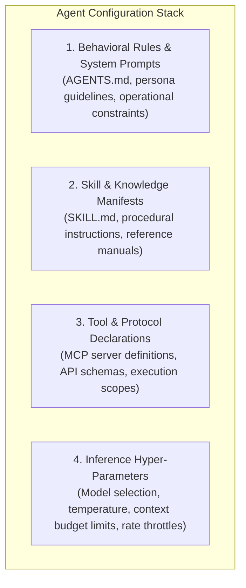
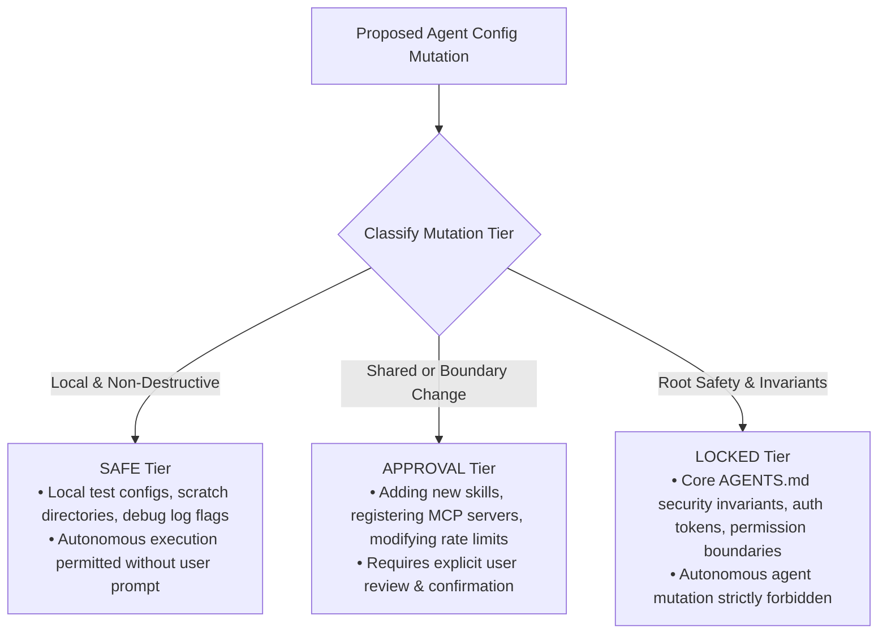
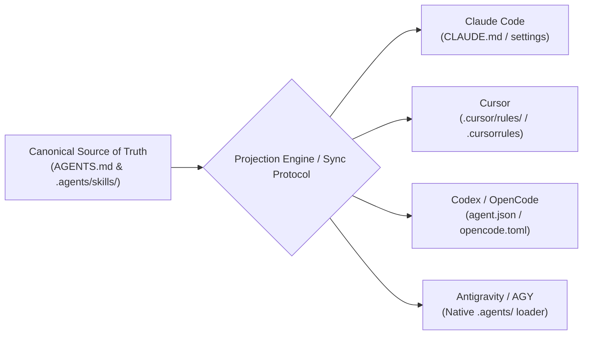

# AI Agent Configuration, Governance Policy, and Cross-Tool Synchronization

> **Mandate**: Autonomous AI agents operate with direct execution authority over tools, filesystems, and deployment pipelines. Agent system instructions, model parameters, skill manifests, and tool permission matrices are critical operational configurations. Unmanaged agent configuration leads to privilege escalation, hallucinated rule drift, and cross-tool divergence. Enforce tiered mutation policies, canonical single-source-of-truth architectures, and deterministic multi-harness synchronization.

---

## 1 · The Anatomy of Agentic Configuration

In modern agentic architectures, configuration spans four distinct layers:



---

## 2 · The Tiered Mutation Governance Model

To prevent catastrophic runaway modification loops or privilege escalation, all agent configuration parameters are classified into three governance tiers:



### Governance Rules
1. **SAFE Tier**: Edits confined to local scratch files, test assertions, or non-production environment values. The agent may execute these changes autonomously.
2. **APPROVAL Tier**: Introducing new third-party MCP servers, changing global skill routing, modifying external API endpoints, or updating dependency trees. The agent must present a detailed plan and obtain user consent before applying changes.
3. **LOCKED Tier**: Security invariants, root authorization credentials, safety guardrails, and cryptographic trust anchors. An agent cannot alter these parameters under any circumstance without explicit operator break-glass commands.

---

## 3 · Cross-Tool Synchronization (The Projection Architecture)

Developers frequently use heterogeneous AI coding tools (Claude Code, Cursor, OpenCode, Codex, Antigravity) across the same repository. Maintaining separate, hand-crafted instruction files leads to prompt drift and incompatible tool behaviors.



### 3.1 Single Source of Truth (SSOT)
* Maintain all system rules, procedural skills, and operational guidelines inside the version-controlled `.agents/` directory and root `AGENTS.md`.
* Never author independent, conflicting rules in tool-specific configuration files (`.cursorrules`, `CLAUDE.md`).

### 3.2 Automated Projections
* When a tool requires a specific legacy file format or location, generate that file deterministically from the canonical source:
  $$\text{TargetConfig} = \operatorname{Project}(\text{CanonicalRules}, \text{ToolAdapter})$$
* Tool-specific files must include an auto-generated header warning:
  ```markdown
  <!-- AUTO-GENERATED FROM AGENTS.md DO NOT EDIT MANUALLY -->
  <!-- Edit AGENTS.md or .agents/skills/ instead -->
  ```

---

## 4 · MCP (Model Context Protocol) Server Configuration

MCP server definitions govern which external tools, databases, and APIs an agent can invoke:

```json
{
  "mcpServers": {
    "git-provider": {
      "command": "npx",
      "args": ["-y", "@modelcontextprotocol/server-github"],
      "env": {
        "GITHUB_PERSONAL_ACCESS_TOKEN": "${VAULT_RESOLVED_GITHUB_TOKEN}"
      },
      "permissions": {
        "read": ["issues", "pull_requests"],
        "write": ["comments"]
      }
    }
  }
}
```

### Security & Scope Guardrails
1. **Least-Privilege Tool Scopes**: When registering MCP servers, declare minimal necessary scopes (e.g. read-only where write access is not required).
2. **No Plaintext Tokens in Tool Manifests**: Never hardcode API tokens inside `mcp.json` or `settings.json`. Reference environment variables injected by secure secret stores.
3. **Hermetic Server Execution**: Tool servers should run in isolated processes without ambient root or administrative filesystem privileges.

---

## 5 · Immutable Mutation History & Auditability

Every modification to agent instructions, prompt parameters, or tool manifests must produce an attributable audit trail:

```
[AGENT CONFIG MUTATION RECORD]
  Timestamp:     2026-09-25T11:45:00Z
  Actor:         Agent-Grimoire Engine (Conversation ID: ec67b9fd)
  Governance:    APPROVAL (User Approved via Plan Verification)
  Target:        .agents/skills/configuration-management/SKILL.md
  Pre-SHA256:    e3b0c44298fc1c149afbf4c8996fb92427ae41e4649b934ca495991b7852b855
  Post-SHA256:   8f47c234a9b...
  Rationale:     Added timeless configuration management protocol per specification.
```

* **Git-Backed Traceability**: Configuration changes must be committed as distinct, isolated commits with clear commit messages referencing task rationale.
* **Integrity Self-Audit**: Before completing a task, the agent verifies that all modified configuration files pass validation and that zero unintended side-effects or file corruptions occurred.
