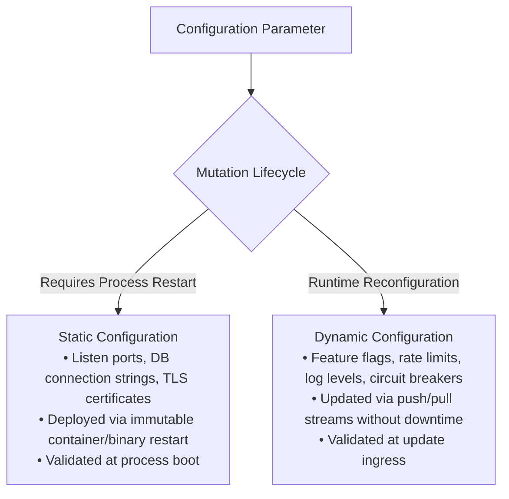
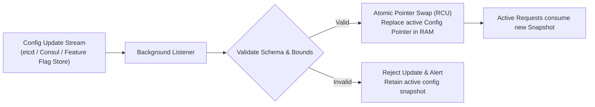
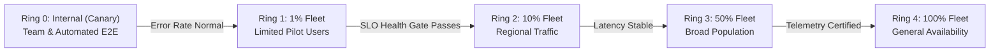
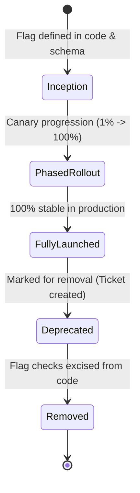

# Dynamic Configuration, Feature Flags, and Safe Rollouts

> **Mandate**: Modifying operational behavior at runtime without restarting processes or redeploying code provides immense agility, but introduces extreme volatility if ungoverned. Dynamic configuration must be strictly bounded by phased canary rollouts, automated health gate monitoring, offline resilience fallbacks, and immediate 1-step rollback mechanisms.

---

## 1 · Static vs Dynamic Configuration

Engineers must categorize every operational knob based on its lifecycle and mutation frequency:

---

## 2 · Zero-Downtime Hot-Reload Mechanics

When an application process receives dynamic configuration updates (via file watcher, Redis pub/sub, etcd watch, or HTTP push), memory updates must be atomic and non-blocking:

### 2.1 The Atomic Pointer Swap Pattern (Read-Copy-Update)
Never mutate fields in an active configuration object in place while reader threads are actively executing requests.
1. The background watcher parses and validates the incoming configuration payload.
2. A new immutable configuration struct is instantiated in memory.
3. An atomic pointer swap (`atomic.StorePointer` / `AtomicReference`) points incoming requests to the new struct. In-flight requests continue executing against the old struct until completion.

### 2.2 Offline Resilience & Fallback Baselines
A dynamic configuration service must **never** be a single point of failure (SPOF) for application availability:
* **Local In-Memory Cache**: The application maintains the last known good configuration in local RAM and persistent disk cache.
* **Network Partition Fallback**: If the central dynamic configuration server is unreachable, the client application continues running normally using its local cache. It must **never** crash or stall user traffic waiting for config updates.

---

## 3 · Bounded Blast-Radius & Phased Canary Rollouts

Dynamic features must never be switched from 0% to 100% globally in a single atomic action:

### Blast-Radius Mathematical Bounds
$$R_{\text{blast}}(M) = \left( \frac{N_{\text{exposed}}}{N_{\text{total}}} \right) \times C_{\text{impact}}(M)$$

Where:
- $\frac{N_{\text{exposed}}}{N_{\text{total}}}$ is the percentage of users or compute nodes exposed to the dynamic mutation.
- $C_{\text{impact}} \in [1, 10]$ is the criticality score of the subsystem governed by the flag.
- Each rollout ring must observe an active health baking period (e.g. 15–30 minutes) measuring error budget degradation $\Delta\epsilon$. If $\Delta\epsilon > \text{threshold}$, the rollout terminates immediately.

---

## 4 · Emergency Circuit Breakers & 1-Step Rollback

Every dynamic feature must have an explicit emergency kill-switch designed into its control plane:

1. **Deterministic Default State**: Every feature toggle must define a fail-safe default state (`enabled: false`) to which it reverts if unexpected exceptions occur.
2. **One-Step Disablement**: Reverting a problematic dynamic feature must require a single operational command or button press, executing within seconds without requiring a code commit or deployment pipeline run.
3. **Automated Rollback Triggers**: Dynamic flag management systems should integrate directly with observability alerts (APM/Prometheus). If p99 latency spikes by $>25\%$ or HTTP 5xx errors increase by $>0.1\%$, the system automatically trips the circuit breaker to revert to the safe baseline.

---

## 5 · Feature Flag Lifecycle & Technical Debt Retirement

Feature flags are temporary scaffolding, not permanent architectural fixtures:

* **Maximum Lifespan Policy**: Release feature flags must have an expiration horizon (e.g. 30–60 days post 100% rollout).
* **Debt Auditing**: Routinely audit codebases for "zombie flags"—flags that have been at 100% for over 30 days. Permanently excise the conditional logic and schema definition from the repository.
