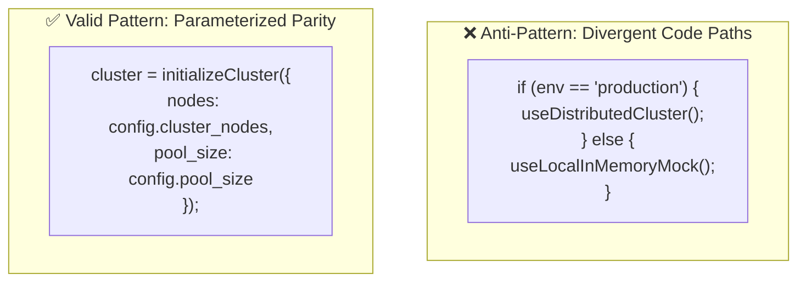
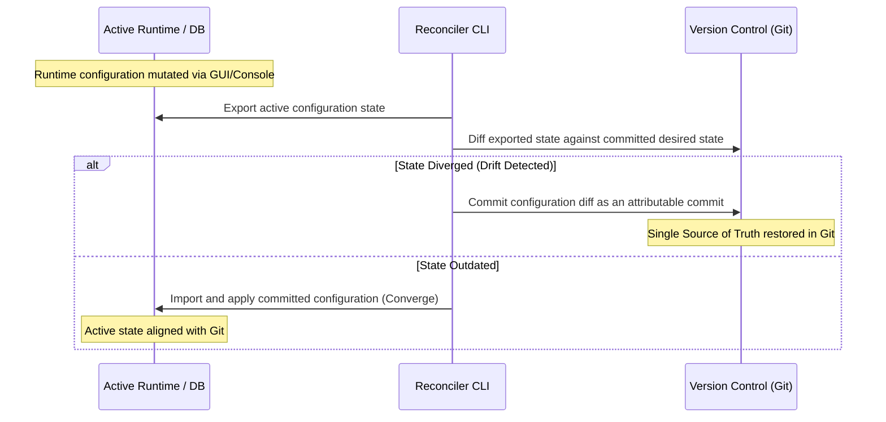

# Environment Parity, Drift Forensics, and Declarative Reconciliation

> **Mandate**: Environment drift is the primary source of the catastrophic *"works on my machine, fails in production"* anti-pattern. Development, staging, preview, and production environments must be treated as the exact same system operating at different scales. Behavior must be governed strictly by parameter values, never by environment-specific conditional branching in code. Live runtime divergence must be continuously measured and reconciled against version-controlled desired state.

---

## 1 · The Environment Equivalence Invariant

Environments must maintain 100% architectural and structural equivalence:



### Allowable vs Forbidden Divergence

| Category | Allowable Divergence (Configured via Parameters) | Strictly Forbidden Divergence (Violates Parity) |
| :--- | :--- | :--- |
| **Capacity & Sizing** | Dev: 1 replica, 512MB RAM; Prod: 50 replicas, 32GB RAM. | Using completely different database engines (e.g. SQLite in Dev, PostgreSQL in Prod). |
| **Network Endpoints** | Dev: `localhost:5432`; Prod: `rds.prod.internal`. | Changing communication protocols (HTTP in Dev vs gRPC in Prod). |
| **Credentials** | Dev uses local mock keys; Prod uses KMS-managed vault tokens. | Hardcoding bypass logic (`if (env === 'dev') skipAuth()`). |
| **Retention & Logging** | Dev: `DEBUG` logs retained 24h; Prod: `INFO` logs retained 90d. | Different code execution paths or omitted security layers. |

---

## 2 · The Contract Baseline: `.env.example` Discipline

Every project must maintain an authoritative, documented configuration template:

```ini
# .env.example - Authoritative Environment Contract
# Copy to .env and supply environment-specific credentials.

# --- SERVER RUNTIME ---
PORT=8080
LOG_LEVEL=INFO # Allowed: DEBUG | INFO | WARN | ERROR
HOST=0.0.0.0

# --- DATABASE CONNECTION ---
DB_HOST=localhost
DB_PORT=5432
DB_NAME=application_db
DB_USER=postgres
DB_PASSWORD=secret_password_here # DO NOT COMMIT REAL PASSWORDS TO THIS TEMPLATE

# --- SECURITY & SECRETS ---
SESSION_SECRET=min_32_characters_random_hex_string
API_TIMEOUT_MS=5000
```

### Automation & Synchronization Rules
- **Zero Undeclared Keys**: Every configuration key referenced anywhere in the codebase must exist in `.env.example`.
- **CI Contract Test**: Automated CI pipelines must run a parity linter verifying that all keys in `.env.example` are accounted for in the application's typed schema parser.

---

## 3 · Ephemeral Preview Environments

Modern continuous integration relies on dynamically provisioned preview environments per pull request:
- **Namespace Isolation**: Each preview instance receives an isolated namespace, database schema, or container group.
- **Dynamic Variable Promotion**: Ingress URLs, database names, and ephemeral credentials are generated and injected during deployment:
  $$\text{DB\_NAME} = \text{"app\_preview\_pr\_" } + \text{PR\_NUMBER}$$
- **Lifecycle Teardown**: Configuration orchestrators must destroy both infrastructure and ephemeral credentials upon PR closure.

---

## 4 · Drift Forensics & The Drift Distance Metric

Drift occurs when the live state of a running system $S_{\text{live}}$ diverges from the declarative version-controlled desired state $S_{\text{desired}}$.

### The Drift Distance Metric
$$\Delta(S_{\text{desired}}, S_{\text{live}}) = \sum_{k \in \mathcal{K}} w(k) \cdot \mathbb{I}\left(S_{\text{desired}}(k) \ne S_{\text{live}}(k)\right)$$

Where the weight $w(k)$ is categorized by risk tier:
- **$w(k) = 20$ (Critical Security & Ingress Invariants)**: Firewall rules, TLS certificates, auth providers, database endpoints. $\Delta > 0$ triggers an immediate high-priority alert.
- **$w(k) = 5$ (Operational Knobs)**: Connection pool sizes, timeout thresholds, concurrency limits.
- **$w(k) = 1$ (Cosmetic Settings)**: Log formats, banners, display strings.

---

## 5 · Bidirectional Reconciliation (Active State vs VCS)

In systems where administrative users or automated processes mutate active runtime configuration (e.g., CMS platforms, cloud consoles, SaaS toggles), systems must implement a bidirectional reconciliation loop:



1. **Continuous Inspection**: Automated scheduled jobs export live runtime configuration and diff it against the Git repository.
2. **Reconciliation Decision**:
   - If an out-of-band change was authorized, it must be committed back to Git immediately to update the SSOT.
   - If an unauthorized drift occurred, the reconciler re-applies the Git manifest to overwrite live divergence and restore desired state.
