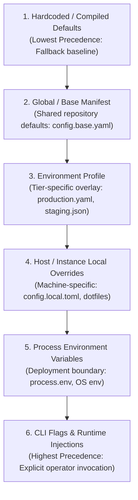
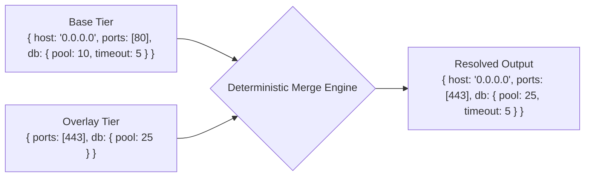

# Configuration Precedence, Scoping, and Hierarchical Cascades

> **Mandate**: In any non-trivial system, configuration values arrive from multiple disparate layers—compiled defaults, vendor profiles, filesystem manifests, environment variables, and runtime flags. Ambiguous or ad-hoc precedence leads to silent shadowing, phantom settings, and unpredictable production outages. Configuration resolution must follow an acyclic, mathematically deterministic Upper Semi-Lattice where source provenance is fully auditable.

---

## 1 · The Precedence Semi-Lattice

Configuration layers form a strictly ordered chain $(\mathcal{S}, \prec)$, ordered from lowest specificity (weakest) to highest specificity (strongest):



### Mathematical Formulation
Let $\mathcal{S} = \{S_1, S_2, \dots, S_n\}$ be the set of configuration sources ordered such that $S_i \prec S_{i+1}$.
For any configuration key $k$, the resolved value $V(k)$ is defined as:
$$V(k) = \text{val}\left(\operatorname{argmax}_{S_i \in \mathcal{S}} \{ \operatorname{tier}(S_i) \mid k \in \operatorname{keys}(S_i) \}\right)$$

Under this lattice:
- A higher-tier source **strictly supersedes** any lower-tier definition for scalar values.
- If key $k$ is omitted at a higher tier, it inherits the value from the highest defined lower tier.
- If key $k$ is nowhere defined, resolution terminates with a schema validation failure unless an explicit default exists.

---

## 2 · Cascading Merges & Aggregation Semantics

Merging structured configuration (dictionaries, objects, arrays) across tiers requires explicit mathematical semantics:



### 2.1 Deep Dictionary Merging (Key-by-Key Recursion)
Dictionaries and nested maps are merged recursively:
$$\operatorname{merge}(D_{\text{base}}, D_{\text{overlay}})(k) = \begin{cases} 
D_{\text{overlay}}(k) & \text{if } k \in D_{\text{overlay}} \setminus D_{\text{base}} \\
D_{\text{base}}(k) & \text{if } k \in D_{\text{base}} \setminus D_{\text{overlay}} \\
\operatorname{merge}(D_{\text{base}}(k), D_{\text{overlay}}(k)) & \text{if } D_{\text{base}}(k), D_{\text{overlay}}(k) \text{ are both dicts} \\
D_{\text{overlay}}(k) & \text{otherwise (scalar replacement)}
\end{cases}$$

### 2.2 Array Handling Semantics (Replacement vs Concatenation)
A frequent source of critical bugs is ambiguous array handling:
- **Default Rule: Atomic Array Replacement**: By default, an array at a higher tier completely replaces the lower-tier array. For example, `ports: [8080]` overrides `ports: [80, 443]`.
- **Explicit Concatenation or Append**: If merging or appending is required (e.g. adding an extra middleware or CORS origin), it must use explicit syntax or directives (e.g., `ports_append: [8443]`), never implicit or ambient concatenation.

---

## 3 · Anti-Shadowing & Conflict Detection

Shadowing occurs when a lower-precedence setting is unintentionally obscured, or when two peer sources at the same precedence tier introduce conflicting values.

### 3.1 Peer-Tier Conflict Prohibition
Two configuration sources must **never** occupy the same precedence tier without a disambiguation rule:
* ❌ *Invalid*: Loading both `.env` and `.env.local` without defining which takes priority.
* ✅ *Valid*: Explicitly specifying that `.env.local` strictly overrides `.env`.

### 3.2 Provenance Auditing
The resolution engine must support an introspection mode (`--explain-config` or `--debug-config`) that prints the origin of every resolved parameter:
```
[CONFIG RESOLUTION TRACE]
  server.port         = 8080        (source: CLI flag '--port')
  server.host         = "0.0.0.0"   (source: environment profile 'production.yaml')
  database.pool_size  = 25          (source: process env 'DB_POOL_SIZE')
  database.timeout_ms = 5000        (source: compiled default)
```

---

## 4 · Variable Interpolation & Templating Hygiene

Dynamic configuration often incorporates variable expansion (`${HOST}:${PORT}`). Interpolation must be governed by strict safety bounds:

1. **Acyclic Resolution**: Variable references must form a directed acyclic graph (DAG). The resolution engine must detect cyclic references (`A=${B}`, `B=${A}`) and terminate with an explicit error during pre-flight parsing.
2. **Deterministic Fallbacks**: Use standard fallback syntax (`${VAR:-default_val}`). If an environment variable is unset and no default is provided, fail-fast boundary validation must reject the boot.
3. **No Shell Execution in Templates**: Configuration interpolators must never evaluate arbitrary shell commands (e.g., ``$(rm -rf /)`` or backticks). Configuration files are data, not executable shell scripts.

---

## 5 · Single Source of Truth (SSOT) Architecture

In distributed architectures, microservices, and monorepos, multiple systems often consume shared configuration:

* **Canonical Base**: Maintain a canonical configuration schema and base values in a single repository or configuration registry.
* **Derived Projections**: Generate or project client-specific or service-specific configuration files automatically from the canonical source.
* **Zero Out-of-Band Divergence**: Never allow developers to edit generated or downstream configs manually. Changes flow unidirectionally from the SSOT to edge targets.
