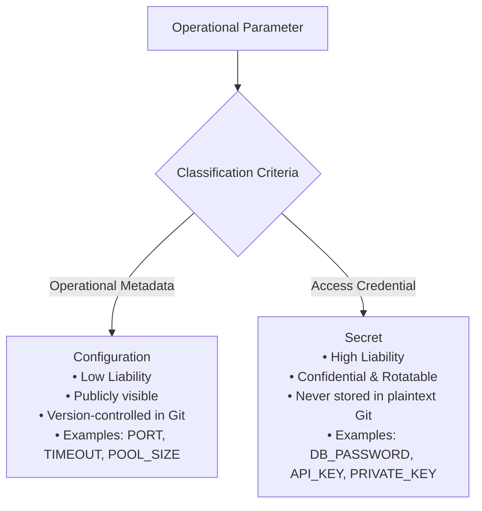
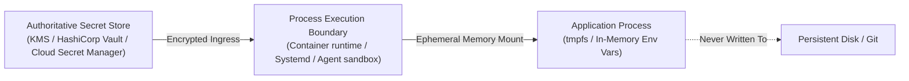
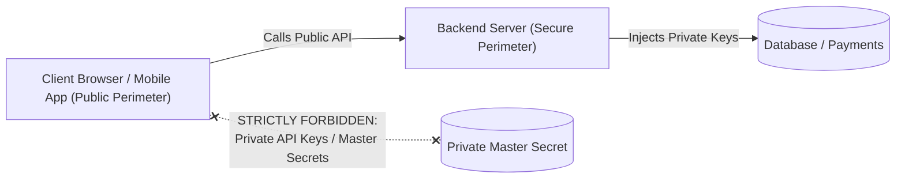
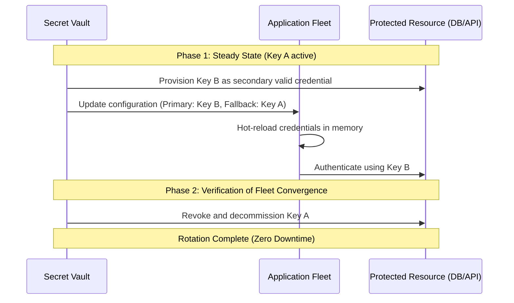

# Secrets Management, Cryptographic Hygiene, and Zero-Trust Isolation

> **Mandate**: Secrets are not ordinary configuration. Treating cryptographic keys, database passwords, and API tokens as generic configuration strings is the single leading cause of credential exposure and systemic compromise. Enforce a strict ontological distinction, zero ambient plaintext storage in version control, ephemeral memory delivery, and comprehensive log redaction across all environments.

---

## 1 · The Ontological Distinction

To manage systems safely, engineers must classify every operational parameter into either Configuration or Secret:



| Dimension | Ordinary Configuration | Secret Credential |
| :--- | :--- | :--- |
| **Entropy** | Low (standard numbers, URLs, strings). | High (cryptographic random strings, hex, base64). |
| **Exposure Impact** | Minor (reveals architecture or topology). | Catastrophic (unauthorized data exfiltration, system takeover). |
| **Version Control** | Safe and required in VCS. | **Strictly prohibited in VCS**. |
| **Lifecycle** | Evolves with application features. | Ephemeral; subject to scheduled and emergency rotation. |
| **Access Control** | Broad team read access. | Principle of Least Privilege; audit-logged access. |

---

## 2 · Storage & Delivery Architectures

Secrets must never exist in plaintext files inside application repositories:



### 2.1 The Pointer Pattern (Secret References)
In declarative configuration files, reference secrets by pointer or URI rather than inlining values:
```yaml
# database.yaml (Safe to commit to Git)
database:
  host: "db.internal.net"
  port: 5432
  user: "app_user"
  # Secret pointer resolved at deploy or runtime:
  password_ref: "vault://secret/data/production/db#password"
```

### 2.2 Ephemeral Delivery Channels
Deliver resolved secrets to runtime processes exclusively through ephemeral, non-persistent mechanisms:
1. **In-Memory Environment Variables**: Injected into process memory by the orchestrator at startup.
2. **RAM-Backed Virtual Filesystems**: Mounted into memory via `tmpfs` (e.g. `/run/secrets/api_token`), automatically wiped on container shutdown.

---

## 3 · Client-Plane Isolation Invariant

A fundamental architectural failure in web and mobile applications is bundling backend secrets into client-side code:



> [!CAUTION]
> **The Public Client Invariant**: Any code, bundle, or asset delivered to a web browser, mobile device, or CLI binary is completely public. Never inject private API keys, database credentials, or secret signing keys into frontend build pipelines (`NEXT_PUBLIC_*`, `VITE_*`, webpack defines). If an API requires a private secret, the client must call a backend proxy endpoint that mediates the secret on the server side.

---

## 4 · Zero-Downtime Secret Rotation Protocol

Every secret will eventually expire or leak. Systems must support rotation without service downtime using a Dual-Key verification cycle:



1. **Dual-Key Acceptance**: The receiving service accepts both Key A (old) and Key B (new).
2. **Client Rollout**: Deploy configuration instructing the client application fleet to authenticate using Key B.
3. **Decommissioning**: Once metrics confirm 100% of traffic is utilizing Key B, revoke Key A permanently.

---

## 5 · Redaction & Leakage Prevention

Secrets must be protected against passive exposure in logging and conversational pipelines:

1. **Automatic Log Sanitization**: Configure logging libraries to mask sensitive keys (`password`, `token`, `secret`, `authorization`, `cookie`, `apiKey`) with `[REDACTED]`.
2. **Pre-Commit Defense**: Implement automated pre-commit scanners (`gitleaks`, `detect-secrets`) to prevent accidental commits of high-entropy strings or private keys.
3. **Agent Transcript Hygiene**: Autonomous agents must never echo raw API keys or passwords into chat logs, generated markdown files, or shared subagent messages.
