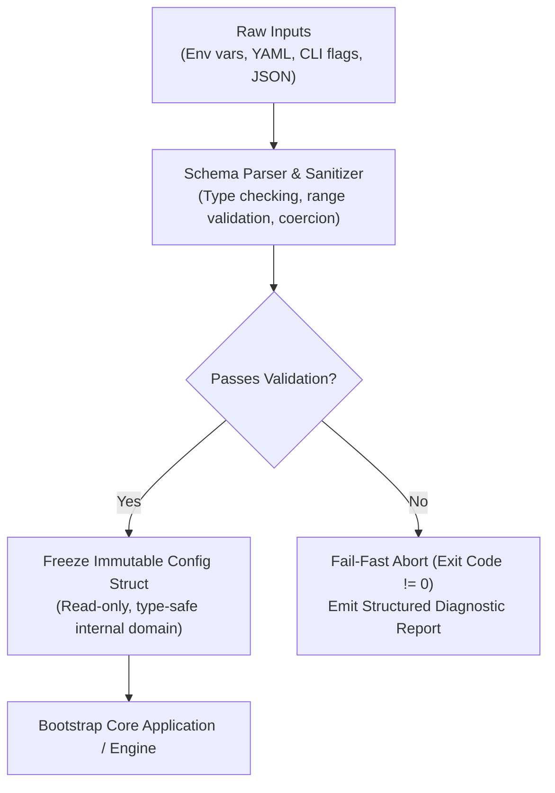
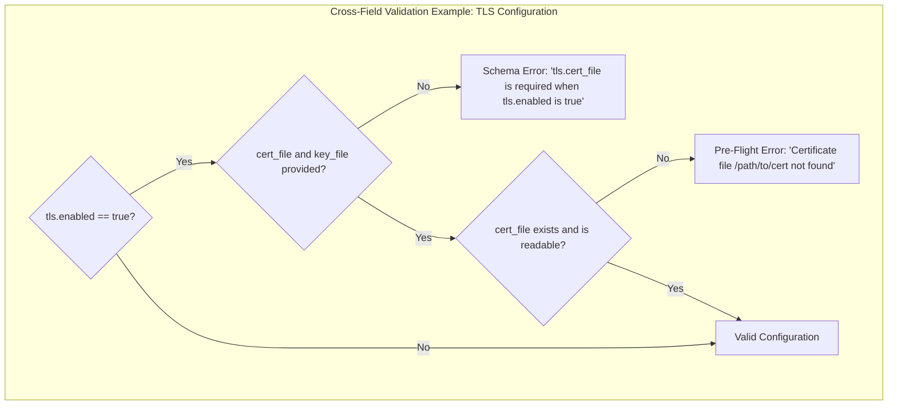

# Configuration Validation, Typed Schemas, and Contract Enforcement

> **Mandate**: Configuration input is an external, untrusted boundary. Treating configuration as arbitrary unvalidated key-value pairs leads to silent type coercion bugs, invalid runtime states, and production crashes halfway through request processing. Systems must define strict, typed schemas and enforce pre-flight validation gates that fail fast with structured, actionable diagnostics.

---

## 1 · The Fail-Fast Boundary Invariant

Configuration parsing must occur at the earliest possible lifecycle phase—before any network listener opens, before database connection pools initialize, and before agent tool execution begins:



* **No Silent Defaults for Missing Required Keys**: If a required key (e.g. database credentials or an encryption key) is missing, never substitute an empty string or dummy fallback. Abort execution immediately.
* **Immutable Runtime Snapshot**: Once parsed and validated, configuration objects must be frozen (made read-only in memory) to prevent accidental runtime mutations from polluting global state.

---

## 2 · Schema Type Enforcement & Normalization

Schemas must define strict primitive and semantic types rather than generic strings:

| Data Type | Validation Requirements & Bounds | Examples |
| :--- | :--- | :--- |
| **Port Number** | Integer in closed interval $[1, 65535]$. | `PORT: 8080` (rejects `-1`, `70000`, `"abc"`) |
| **Boolean** | Explicit truthy/falsy normalization. Disallow ambiguous strings. | `'true'`, `'1'`, `'yes'` $\to$ `true`; `'false'`, `'0'`, `'no'` $\to$ `false` |
| **Duration / Timeout** | Explicit units (milliseconds, seconds). Disallow bare numbers without unit. | `5000ms`, `30s`, `2m` (converts to integer milliseconds) |
| **Network Endpoints** | Validated URI / URL format; require scheme (`http://`, `https://`, `tcp://`). | `REDIS_URL: "redis://10.0.0.1:6379"` |
| **Enum / Mode** | Constrained set of known tokens. Disallow arbitrary strings. | `LOG_LEVEL: "DEBUG" \| "INFO" \| "WARN" \| "ERROR"` |
| **Filesystem Path** | Path syntax, readability check, and traversal defense (no `../../`). | `CERT_PATH: "/etc/ssl/cert.pem"` |

---

## 3 · Semantic Cross-Field Assertions

Many operational failures arise from combinations of settings that are individually valid but mutually incompatible. Schemas must enforce relational invariants:



### Common Relational Assertions
1. **Conditional Requirement**: If `AUTH_PROVIDER == "OAUTH2"`, then `OAUTH_CLIENT_ID` and `OAUTH_CLIENT_SECRET` must be non-empty.
2. **Bounds Ordering**: Ensure `MAX_CONNECTIONS >= MIN_CONNECTIONS` and `CONNECT_TIMEOUT_MS <= TOTAL_REQUEST_TIMEOUT_MS`.
3. **Mutual Exclusivity**: A storage driver cannot specify both `LOCAL_DISK_PATH` and `S3_BUCKET_NAME` simultaneously.

---

## 4 · Schema Tooling Across Ecosystems

Enforce schemas using established validation primitives native to the target stack:

* **TypeScript / Node**: Define schemas with `zod` or `typebox`. Parse environment variables at process launch and export a typed, validated `env` object.
* **Python**: Use `pydantic-settings` or `attrs`. Validate types, environment variable mappings, and custom field validators.
* **Go**: Map configuration to strongly typed structs with validator tags (e.g. `validate:"required,min=1,max=65535"`).
* **Rust**: Deserialize via `serde` into typed structs, enforcing constraints using the `validator` crate.
* **Infrastructure / Polyglot**: Author formal schemas in `JSON Schema`, `CUE`, or `Dhall` to validate YAML/JSON manifests before deployment.

---

## 5 · Actionable Diagnostic Reporting

When validation fails, error messages must be structured, human-readable, and actionable:

```
[FATAL CONFIGURATION ERROR] 3 validation failures detected:
  1. field 'server.port': value '99999' exceeds maximum allowed port number (65535).
  2. field 'database.pool_size': missing required integer value (source: 'DB_POOL_SIZE').
  3. relational rule 'tls_configuration': 'tls.key_file' is missing while 'tls.enabled' is true.

Action required: Verify your .env or production overlay file against .env.example.
Aborting application startup.
```

---

## 6 · Dry-Run & Pre-Flight Simulation

Systems must provide a non-destructive verification command (`--dry-run`, `--validate-config`, or `app config test`):
- Reads all configuration layers according to the precedence lattice.
- Executes full schema and cross-field validation.
- Verifies network socket availability and filesystem permissions without binding listeners or serving traffic.
- Exits with `0` on success or non-zero on failure, enabling automated CI/CD pre-deployment gating.
