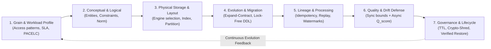
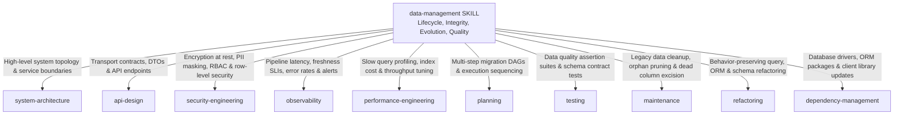

# Data Management: Universal Lifecycle, Schema Evolution & Trustworthiness Protocol

> **Mandate**: *State outlives application code. Deployments are transient; data is the living memory and balance sheet of the enterprise.*  
> 
> Data architecture is not the passive creation of database tables, nor is it the dogmatic application of a single favorite database engine. It is the formal specification of domain truth, entity grains, lifecycle state transitions, mechanical storage physics, and non-destructive schema evolution.
> 
> True data management enforces mathematical grain identity first, preserves semantic purity before physical optimization, executes lock-free zero-downtime migrations via the Expand-Contract axiom, guarantees deterministic pipeline idempotency ($f(f(x)) = f(x)$), verifies multi-dimensional data quality empirically, and governs privacy and retention across the entire data lifecycle. This protocol empowers agent architectural creativity across any storage paradigm, eliminates cargo-cult storage selections, and routes specialized execution to the Arsenal ecosystem.

---

## 1 · The 7-Phase Universal Data Lifecycle

Every data engineering and architecture initiative—from adding a single nullable column to architecting a global multi-region event-driven data platform—traverses this closed-loop lifecycle:



1. **Phase 1 — Grain & Workload Profiling**: Formally establish the atomic grain ($\mathcal{G}$). Profile the workload envelope: read/write ratio, point vs. range lookups, analytical scan frequency, latency bounds, and consistency trade-offs (ACID vs. BASE, PACELC).
2. **Phase 2 — Conceptual & Logical Modeling**: Model business entities, aggregate boundaries, cardinalities ($1:1, 1:N, N:M$), and normal forms ($3\text{NF}/\text{BCNF}$). Anchor domain constraints at the lowest authoritative layer (see [`references/data-modeling-conceptual-logical-physical.md`](references/data-modeling-conceptual-logical-physical.md)).
3. **Phase 3 — Physical Storage & Access Optimization**: Select the mechanical storage paradigm (B-tree, LSM-tree, Columnar, Vector, Graph, In-memory). Design primary and secondary indexing without index bloat. Specify partitioning, sharding, and physical memory layout.
4. **Phase 4 — Evolution & Migration Engineering**: For production systems with active consumers, mandate the 3-Phase Expand-Contract Protocol. Separate structural DDL from data DML backfills. Avoid table locks and verify forward-only reversibility (see [`references/zero-downtime-migrations-and-schema-evolution.md`](references/zero-downtime-migrations-and-schema-evolution.md)).
5. **Phase 5 — Lineage, Pipelines & Processing**: Formulate data-in-motion flows (batch or stream). Enforce deterministic consumer idempotency ($f(f(x)) = f(x)$), watermarking for late-arriving events, poison-pill isolation (DLQs), and clean backfill mechanics (see [`references/data-pipelines-idempotency-and-backfills.md`](references/data-pipelines-idempotency-and-backfills.md)).
6. **Phase 6 — Quality Verification & Drift Forensics**: Decouple synchronous ingress bounds from asynchronous statistical auditing. Calculate the 6-dimensional quality score ($Q_{\text{score}}$). Detect structural schema drift and distribution shifts (see [`references/data-quality-governance-and-drift.md`](references/data-quality-governance-and-drift.md)).
7. **Phase 7 — Governance, Privacy & Lifecycle Auditing**: Establish retention tiering (Hot $\to$ Warm $\to$ Cold $\to$ Purge). Enforce privacy mandates (GDPR/CCPA right-to-be-forgotten) via physical purge or Cryptographic Shredding. Empirically verify backup restoration and point-in-time recovery (PITR).

---

## 2 · Progressive Disclosure (Reference Routing)

To prevent cognitive overload and preserve LLM context bandwidth, **never load all reference manuals simultaneously**. Consult reference manuals strictly on demand based on task context:

| Context Trigger | Mandatory Reference Manual | Purpose |
| :--- | :--- | :--- |
| **Grain definition, primary key strategy, normal forms (3NF), constraints, ERDs** | [`references/data-modeling-conceptual-logical-physical.md`](references/data-modeling-conceptual-logical-physical.md) | 3-tier modeling, multi-modal grain ($\mathcal{G}$), UUIDv7 vs ULID vs natural keys, intentional denormalization calculus, lowest authoritative layer. |
| **Online migrations, column rename/split, lock timeouts, non-blocking DDL, backfills** | [`references/zero-downtime-migrations-and-schema-evolution.md`](references/zero-downtime-migrations-and-schema-evolution.md) | The 3-Phase Expand-Contract Protocol, lock-free DDL, chunked keyset backfill scripts, dual-horizon constraints (`NOT VALID`), forward-only evolution. |
| **Storage engines, LSM vs B-tree, isolation levels, lost update, write skew, PACELC, CRDT** | [`references/distributed-data-consistency-and-transactions.md`](references/distributed-data-consistency-and-transactions.md) | Storage engine physics, concurrency anomalies, isolation levels, PACELC trade-offs, Saga orchestrations vs 2PC, CRDTs and vector clocks. |
| **Data cleanliness, schema drift, lineage DAGs, TTL, GDPR deletion, crypto-shredding** | [`references/data-quality-governance-and-drift.md`](references/data-quality-governance-and-drift.md) | The 6 quality dimensions ($Q_{\text{score}}$), sync vs async quality architecture, schema drift, lineage metadata, cryptographic shredding, backup drills. |
| **Streaming pipelines, Kafka, idempotency, event time, watermarks, backfills, DLQs** | [`references/data-pipelines-idempotency-and-backfills.md`](references/data-pipelines-idempotency-and-backfills.md) | Idempotent consumers ($f(f(x)) = f(x)$), transactional outbox pattern, watermarking, dead-letter queues, historical backfills without double-counting. |
| **Formal schema design specimen & reusable architecture template** | [`examples/universal-data-model-specimen.md`](examples/universal-data-model-specimen.md) | Reusable markdown template for capturing conceptual, logical, and physical data architecture. |
| **Step-by-step production column split without downtime on 15M rows** | [`examples/zero-downtime-migration-walkthrough.md`](examples/zero-downtime-migration-walkthrough.md) | Concrete execution trace of live column migration using Expand-Contract and chunked keyset backfill. |
| **Auditing a dataset against the 6 quality dimensions with SQL tests** | [`examples/data-quality-audit-scorecard.md`](examples/data-quality-audit-scorecard.md) | Concrete data QA scorecard with automated assertions, $Q_{\text{score}}$ calculation, and certification gates. |
| **Cross-paradigm comparison (Relational vs Document vs Lakehouse vs Stream vs Vector)** | [`examples/multi-archetype-data-modeling-rosetta-stone.md`](examples/multi-archetype-data-modeling-rosetta-stone.md) | Rosetta Stone modeling the exact same domain aggregate across 5 distinct storage archetypes. |

---

## 3 · Adaptive Cognitive Sizing (The 6 Execution Modes)

Size your data management effort strictly to the task's blast radius and lifecycle phase. Never impose multi-phase enterprise bureaucracy on a local script, and never execute speculative, uncontracted mutations across active production databases:

| Mode | Trigger & Scope | Engineering Discipline | Required Output & Protocol |
| :--- | :--- | :--- | :--- |
| **`micro-data`** | Single column/index tweak, query filter, nullability fix ($< 30$ lines). | Quick compatibility check $\to$ verify grain and non-blocking DDL $\to$ zero overhead. | **3-Line Data Intent Block** directly preceding code change. |
| **`prototype-scratch`** | Greenfield pre-production spike, disposable app, single-consumer ($N_{\text{consumers}} \le 1$). | Rapid iteration: in-place mutations, drop/recreate allowed. Skip Expand-Contract. | Minimal Schema Specification or DDL script. |
| **`entity-model`** | New aggregate, table, collection, or entity boundary. | Define Grain ($\mathcal{G}$) $\to$ 3NF logical model $\to$ physical storage layout $\to$ constraint validation. | **Entity Model Specification** (`DATA_SPEC.md` or specimen). |
| **`schema-migration`** | Zero-downtime schema evolution, column rename/split, type modification ($N_{\text{consumers}} > 1$). | Full Expand-Contract protocol: lock-free DDL $\to$ chunked keyset backfill $\to$ dual-read cutover $\to$ contract. | **Expand-Contract Migration Runbook**. |
| **`pipeline-slice`** | New ETL/ELT pipeline, stream processor, CDC replication, or backfill job. | Idempotency strategy $\to$ watermark policy $\to$ poison-pill DLQ $\to$ lineage tags $\to$ replay tests. | **Pipeline Contract & Idempotency Specification**. |
| **`distributed-arch`** | Polyglot persistence, lakehouse rollout, multi-region replication, or database sharding. | Workload envelope $\to$ storage engine selection $\to$ PACELC trade-off $\to$ consistency model $\to$ ADR. | **Comprehensive Data Architecture Charter & ADR**. |

### The 3-Line Data Intent Protocol (For `micro-data` Mode)
When operating in `micro-data` mode, emit this concise block directly preceding implementation:
```markdown
> **Data Target**: [Exact entity, table/collection, column, or index touched]
> **Grain & Invariant**: [Preserved grain and domain constraint / nullability bound]
> **Migration Safety**: [Why this is non-breaking, lock-safe, and backward-compatible]
```

---

## 4 · The 8 Universal Data Management Invariants

Regardless of language, database engine, storage format, or execution platform, every robust data system upholds these 8 timeless invariants:

### 4.1 Invariant 1: Multi-Modal Grain & Identity Primacy
$$\forall E \in \mathcal{E}, \quad \exists! \mathcal{G}(E) \implies \text{Identity}(E) \text{ is Immutable, Deterministic, and Collision-Resistant}$$
* Every dataset must explicitly define its **Grain** ($\mathcal{G}$)—what single real-world event or atomic entity one record represents.
* Identity must follow an explicit, mechanically sympathetic strategy (e.g. UUIDv7/ULID for sequential B-tree locality; content hashes $H(p)$ for event deduplication; composite coordinate keys for time-series).

### 4.2 Invariant 2: Semantic Purity before Physical Optimization
$$\text{Design}(\text{Conceptual} \to \text{Logical}) \ll \text{Design}(\text{Physical Layout})$$
* Logical domain relationships and integrity constraints must be modeled and proven correct in normalized form ($3\text{NF}/\text{BCNF}$) or bounded aggregate form before any physical optimization (denormalization, caching shims, indexing hacks) is introduced.
* Denormalization is permitted **only** when query profiling proves read latency violates SLAs under a high read-to-write ratio ($\text{Reads}/\text{Writes} > 100$) and automated synchronization is guaranteed.

### 4.3 Invariant 3: Lowest-Authoritative-Layer Invariant Defense
$$\text{Validation}(\text{Domain Invariants}) \text{ at } \min(\text{Depth}(\text{Storage Topology}))$$
* Ephemeral application-layer checks are easily bypassed by direct scripts, migration jobs, or ETL pipelines.
* Critical domain invariants (`NOT NULL`, `CHECK`, `UNIQUE`, `FOREIGN KEY`) must be anchored at the lowest authoritative layer of the storage system (native relational constraints in SQL; ingress schema validators and DLQs in lakehouses and message streams).

### 4.4 Invariant 4: Phase-Aware Schema Evolution (The Expand-Contract Law)
$$\Delta_{\text{breakage}} = 0 \quad \forall t \in [t_{\text{deploy\_start}}, t_{\text{all\_consumers\_updated}}]$$
* When active external consumers exist ($N_{\text{consumers}} > 1$ or SLA $\ge 99.9\%$), breaking schema mutations in a single deployment step are strictly forbidden. The mutation must traverse the **3-Phase Expand-Contract Protocol** (Expand $\to$ Migrate/Backfill $\to$ Contract).
* Structural DDL and million-row transactional DML backfills must **never** be bundled in the same migration step.

### 4.5 Invariant 5: Deterministic Idempotency & Replayability
$$f(f(x)) = f(x) \quad \land \quad \text{Replay}(\text{Log}_{[t_0, t_1]}) \to \text{State}(t_1)$$
* All data pipelines, stream consumers, and data mutation procedures must tolerate duplicate message delivery and network retries without state corruption.
* Use natural/cryptographic upserts, idempotency tables, or monotonic sequence fencing. Pipelines must be safely replayable from historical source logs.

### 4.6 Invariant 6: Causal Lineage & Convergent Authority
$$\text{Authority}(D) \in \{\text{Single-Writer Domain Bounded Context}\} \cup \{\text{Mathematically Provable CRDT}\}$$
* Multiple services writing directly to the same shared database table is strictly forbidden. Exactly one authoritative service owns each dataset.
* In decentralized, offline-first, or multi-master systems, authority is governed by mathematically convergent reconciliation (State/Op-based CRDTs or monotonic vector clocks).
* All datasets must maintain verifiable causal lineage: $\text{Source} \to \text{Transformations} \to \text{Destination}$.

### 4.7 Invariant 7: Tiered Data Quality & Drift Defense
$$\text{Quality Gate} = \text{SyncBoundaryValidation}(\text{Payload}) \land \text{AsyncAudit}(Q_{\text{score}} \ge 0.95)$$
* Quality is decoupled into two tiers: **Synchronous Ingress Checks** (sub-millisecond schema, type, and range validation at write time) and **Asynchronous Statistical Auditing** (multi-dimensional $Q_{\text{score}}$ evaluation, null-rate variance, and volume anomaly detection).
* Schema drift and distribution shifts must trigger automated alerts before corrupting downstream decision-making.

### 4.8 Invariant 8: Lifecycle Durability, Privacy & Retention Governance
$$\forall D \in \mathcal{D}, \quad \text{Lifecycle}(D) \in \{\text{Hot}, \text{Warm}, \text{Cold}, \text{Tombstone}, \text{Cryptographically Shredded}\}$$
* Datasets must have an explicit retention policy (TTL, partition dropping, cold archiving).
* Where physical deletion is impossible (WORM storage, append-only immutable ledgers, distributed event streams), privacy compliance (GDPR/CCPA) must be enforced via **Cryptographic Shredding** (destroying dedicated per-tenant encryption keys).
* Backup restoration and point-in-time recovery (PITR) must be empirically verified via scheduled drills.

---

## 5 · The Data Invariant Exception Protocol (Emergency Overrides)

No static rulebook can anticipate every production anomaly. When exceptional operational constraints (e.g. emergency production zero-day mitigation, live P0 outage recovery, air-gapped embedded systems, or legacy brownfield migrations) conflict with standard data invariants, the agent invokes this protocol:

> [!CAUTION] DATA INVARIANT EXCEPTION PROTOCOL
> An agent may deliberately bypass a data invariant (e.g., executing a rapid in-place schema fix during a catastrophic outage, relaxing a foreign key constraint on an emergency ingestion pipeline, or deferring an Expand-Contract phase) **IF AND ONLY IF**:
> 1. **Operational Constraint Citation**: Explicitly cites the physical or operational emergency (e.g., *"Active production P0 outage requires immediate non-Expand-Contract column addition to unblock order processing"* or *"High-velocity telemetry stream ($10^6$ events/sec) cannot incur synchronous foreign-key validation overhead without dropping packets"*).
> 2. **Quarantined Boundary Containment**: Confines the exception inside an isolated boundary (e.g. applying a `NOT VALID` constraint with an asynchronous remediation ticket, or isolating unvalidated payloads into an ingestion buffer).
> 3. **Micro-ADR & Debt Registration**: Records the trade-off, rationale, and remediation ticket in `TECH_DEBT.md` (`[DATA-EXCEPTION: Unchecked foreign key in ingestion buffer pending batch reconciler in ticket DATA-804]`).

---

## 6 · Universal Archetype Adaptation Matrix

The 8 invariants adapt dynamically across every storage archetype by mapping to mechanical storage realities:

| Archetype | Storage Engine Model | Primary Consistency & Locks | Schema Evolution Mode |
| :--- | :--- | :--- | :--- |
| **Relational OLTP**<br>*(Postgres, MySQL, Oracle)* | B-Tree / Heap; in-place row mutation | ACID, MVCC, Serial / Read-Committed, page latches | Online DDL, Expand-Contract, lock-free indexes |
| **Document / Key-Value**<br>*(MongoDB, DynamoDB)* | B-Tree / LSM; denormalized JSON aggregates | Single-document ACID; tunable read/write quorums | Read-time schema, dual-write backfill, additive fields |
| **Analytical Lakehouse**<br>*(Snowflake, DuckDB, Iceberg)* | Columnar vectorization (Parquet/ORC); dictionary encoding | Append-mostly; ACID via Snapshot / Time-travel metadata | Additive schema evolution, partition pruning |
| **Event Streams**<br>*(Kafka, Redpanda, Pulsar)* | Append-only partitioned commit logs; sequential disk I/O | Strict ordering per partition; at-least-once delivery | Schema Registry (Avro/Protobuf), Full compatibility |
| **Vector Search**<br>*(pgvector, Qdrant, Milvus)* | HNSW graph / Inverted vector index | Eventual consistency; high-dimensional distance metrics | Parallel re-indexing, zero-downtime pointer swap |
| **Graph Network**<br>*(Neo4j, Memgraph)* | Adjacency index; index-free pointer chasing | Graph traversal consistency; node/edge constraints | Monotonic relationship label & property expansion |
| **Embedded & Edge**<br>*(SQLite, DuckDB, IndexedDB)* | Single-file B-Tree; memory-mapped WAL | Single-writer process lock; crash-safe WAL journal | Embedded migration hooks, `user_version` pragma |
| **AI Agent State**<br>*(Cognitive Memory, Sessions)* | Structured JSON state, Vector episodic log, KV scratchpad | Causal turn/session ordering; non-blocking snapshotting | Checkpoint versioning, rolling context window TTL |
| **Mobile / Offline-First**<br>*(Client sync engines)* | Local embedded SQLite with sync queue | Eventual consistency; local-first optimistic writes | Delta sync protocol, CRDTs or monotonic vector clocks |
| **Immutable Ledgers**<br>*(WORM, Audit trails)* | Cryptographic Merkle DAG; append-only hash chains | Absolute immutability; tamper-evident verification | Cryptographic Shredding for privacy compliance |

---

## 7 · The Arsenal Skill Boundary & Routing Contract

Data Management serves as the **Custodian of State, Schemas, Lifecycle, and Trustworthiness**. It does not duplicate specialized execution protocols; it governs data semantics and routes execution to the appropriate Arsenal skill:



* **When to remain in `data-management`**:
  * Defining entity grains ($\mathcal{G}$), logical schemas, candidate keys, and normalization structures.
  * Formulating zero-downtime Expand-Contract migration plans and backfill scripts.
  * Engineering idempotent data pipeline contracts and dead-letter queues.
  * Calculating data quality scores ($Q_{\text{score}}$) and diagnosing schema/distribution drift.
  * Establishing data retention policies, GDPR purge cascades, and cryptographic shredding.
* **When to transition to sibling skills**:
  * **To [`system-architecture`](../system-architecture/SKILL.md)**: When deciding service boundary decompositions, overall cloud storage topology, or multi-region database replication strategies.
  * **To [`api-design`](../api-design/SKILL.md)**: When exposing internal data models across external HTTP, gRPC, or GraphQL interface boundaries.
  * **To [`security-engineering`](../security-engineering/SKILL.md)**: When configuring field-level encryption algorithms, key management (KMS), row-level security (RLS) policies, or IAM database authentication.
  * **To [`performance-engineering`](../performance-engineering/SKILL.md)**: When analyzing `EXPLAIN ANALYZE` execution plans, resolving buffer pool cache misses, or tuning kernel I/O parameters.
  * **To [`planning`](../planning/SKILL.md)**: When orchestrating a complex, multi-step database migration spanning multiple services and deployment waves.
  * **To [`testing`](../testing/SKILL.md)**: When integrating data quality assertions into CI/CD regression test suites.
  * **To [`maintenance`](../maintenance/SKILL.md)**: When executing dead-column deprecation and leaf-first cleanup after the Contract phase.

---

## 8 · Guardrails & Strictly Disallowed Actions

- ❌ **No Blind Single-Step Destructive Migrations**: Never execute a column rename, column drop, or type change in a single deployment step on active production databases ($N_{\text{consumers}} > 1$). Mandate Expand-Contract.
- ❌ **No Undefined Grain**: Never design a table, collection, or pipeline without explicitly specifying the primary grain ($\mathcal{G}$) and unique identity strategy.
- ❌ **No Shared-Database Cross-Service Coupling**: Never allow multiple microservices to execute direct write mutations against the same underlying persistence store without an authoritative domain owner.
- ❌ **No Unbounded Table-Locking DDL**: Never execute long-running blocking table locks on live production paths without setting strict lock timeouts (`SET lock_timeout = '2s'`) and using online primitives (`CREATE INDEX CONCURRENTLY`).
- ❌ **No Bundled DDL and Massive DML**: Never bundle table structural alterations and multi-thousand-row data backfills into the same database transaction.
- ❌ **No Non-Idempotent Pipelines**: Never construct streaming or batch processing consumers that duplicate or corrupt state upon restart or re-delivery ($f(f(x)) \neq f(x)$).
- ❌ **No Unprofiled Denormalization**: Never denormalize relational schemas based on speculative performance assumptions without measuring read-to-write ratios and join latency bottlenecks.
- ❌ **No Ephemeral-Only Constraints**: Never rely solely on application-level form validations for critical domain data integrity invariants. Anchor constraints at the lowest authoritative layer.
- ❌ **No Untested Disaster Recovery**: Never declare a backup strategy complete without empirically verifying a point-in-time recovery (PITR) drill.

---

## 9 · The Data Management Stopping Contract

A data management task is strictly **COMPLETE** only when all of the following conditions are verified:

1. **Grain & Identity Certification**: Every modified or created dataset has an explicitly documented grain ($\mathcal{G}$) and a deterministic, collision-resistant identity strategy.
2. **Lowest-Authoritative Constraint Verification**: Mandatory domain invariants (`NOT NULL`, `CHECK`, `UNIQUE`, `FOREIGN KEY`, or schema registry rules) are compiled and enforced at the storage/ingress layer.
3. **Zero-Downtime Migration Safety**: If the task alters an existing production schema, the migration plan adheres to Expand-Contract, specifies explicit lock timeouts, and isolates DML backfills from structural DDL.
4. **Deterministic Idempotency Proof**: All pipeline mutations, backfills, and stream consumers are proven to be idempotent ($f(f(x)) = f(x)$) under simulated retries.
5. **Quality Gate Compliance**: Data quality has been evaluated across the 6 dimensions with an empirical $Q_{\text{score}} \ge 0.95$ (or an explicit quarantine decision recorded).
6. **Lifecycle & Retention Alignment**: Retention tiering, TTL parameters, and privacy compliance (purge or cryptographic shredding) are configured.
7. **Clean Invariance & Regression Check**: Static typecheckers, linters, and full test suites pass with exit code `0`. Diff inspection confirms zero unrelated file modifications or cosmetic churn.
