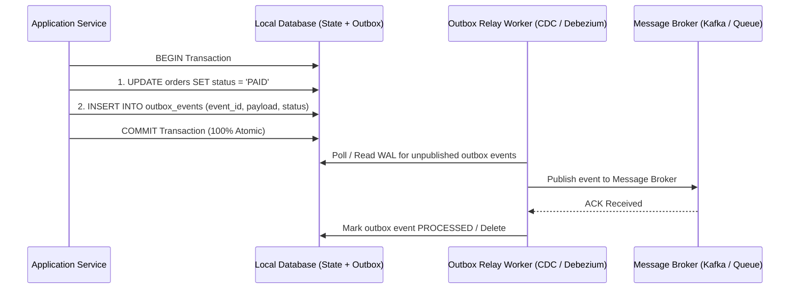

# Data Pipelines: Idempotency, Streaming Duality, and Backfill Engineering

> **Mandate**: *Networks are untrusted, processes crash, and messages duplicate. Robust data pipelines treat failure as an ordinary condition. Deterministic idempotency, watermarked time semantics, and poison-pill isolation guarantee that pipelines converge to identical state under arbitrary retries.*

---

## 1. The Idempotency Imperative ($f(f(x)) = f(x)$)

In distributed architectures, **exactly-once network delivery is physically impossible** over arbitrary partitions (The Two Generals' Problem). Message brokers provide **at-least-once** delivery. 

Therefore, true end-to-end exactly-once semantics is an application-layer property achieved through **deterministic idempotent processing**:

$$f(f(x)) = f(x) \quad \forall x \in \text{Messages}$$

```
Broker Retransmission ──> [ Consumer Node ] ──> Idempotency Check ──> State Mutation
      (Duplicate)                                  │
                                                   ├─ Already Processed? -> ACK & Skip
                                                   └─ Unseen Message?    -> Apply Atomically
```

### The 3 Core Idempotency Patterns

#### Pattern A: Natural Unique Key / Upsert
If the destination storage supports unique constraints, write operations can be structured as upserts keyed on the message's natural or cryptographic identity:
```sql
INSERT INTO daily_metrics (metric_date, customer_id, revenue)
VALUES ('2025-05-12', 'cust_42', 150.00)
ON CONFLICT (metric_date, customer_id)
DO UPDATE SET revenue = daily_metrics.revenue + EXCLUDED.revenue; -- Caution: Relative addition is NOT idempotent!
```
*Correction*: Never use relative additions (`+`) in idempotent upserts. Store the absolute sequence or ledger events and calculate aggregates deterministically:
```sql
-- Truly idempotent event ledger insert
INSERT INTO financial_ledger (transaction_id, customer_id, amount, event_time)
VALUES ('tx_abc123', 'cust_42', 150.00, '2025-05-12T10:00:00Z')
ON CONFLICT (transaction_id) DO NOTHING;
```

#### Pattern B: Deduplication Key Store (Idempotency Table)
Within the same ACID database transaction, insert an entry into a dedicated deduplication table:
```sql
BEGIN;
-- Atomic check and lock
INSERT INTO processed_events (event_id, processed_at) 
VALUES ('evt_98765', NOW());
-- If event_id already exists, transaction aborts with unique violation

-- Execute business state mutation
UPDATE accounts SET balance = balance + 100 WHERE id = 'acc_1';
COMMIT;
```

#### Pattern C: Monotonic Version / Offset Fencing
Reject any incoming update whose sequence number or version is less than or equal to the currently recorded state:
$$\text{Apply}(S, \text{Op}_v) \iff v > S.\text{current\_version}$$

---

## 2. The Transactional Outbox Pattern

A classic dual-write anti-pattern occurs when a service modifies a database row and immediately publishes a message to a message broker (Kafka, RabbitMQ):

```
Service -> 1. DB UPDATE (Succeeds)
Service -> 2. Network / Broker Crash (Fails!)
Result: Database updated, but message NEVER sent. System in permanent inconsistent state.
```

### The Outbox Solution
Atomically record the state mutation AND the outbound event in the same local database transaction:



---

## 3. Streaming Semantics: Event Time vs. Processing Time & Watermarks

In data-in-motion pipelines, the time an event occurred in the real world (**Event Time**) is distinct from the time the event arrives at the processing engine (**Processing Time**):

$$\text{Lag} = t_{\text{processing}} - t_{\text{event}} \ge 0$$

```
Event Occurs (12:00:00) ────── Mobile Offline / Network Flaky ──────> Ingestion (12:15:30)
      [Event Time]                                                          [Processing Time]
```

### Watermark Mechanics
A **Watermark** $W(t)$ is a monotonically increasing temporal threshold asserting that the engine expects no further events with event time $t_{\text{event}} < W(t)$:

* **Windowing**: When calculating tumbling or sliding hourly metrics, windows must close based on the *Watermark*, not server clock time.
* **Late-Arriving Data Policy**: Every streaming pipeline must explicitly define a policy for data arriving after $W(t)$ has passed:
  1. *Drop silently* (acceptable for high-velocity approximate telemetry).
  2. *Route to Late-Data Topic / DLQ* (required for financial or audit events).
  3. *Re-trigger window recalculation* (expensive; causes downstream retraction updates).

---

## 4. Poison-Pill Isolation & Dead-Letter Queues (DLQ)

A **Poison Pill** is a malformed, corrupt, or unexpected message that causes the consumer worker to crash or throw an unhandled exception every time it is retried.

```
Incoming Stream ──> [ Consumer Worker ] ──> Crash / Unhandled Exception!
                          ▲                          │
                          └──── Retries Forever ─────┘ (Stream completely halted!)
```

### The DLQ Circuit Breaker Protocol
1. **Bounded Retry with Exponential Backoff**: Retry transient errors (network timeout, database lock contention) up to $N_{\text{max}}$ times (e.g. 3 retries).
2. **Deterministic Poison-Pill Detection**: If failure is due to serialization mismatch, invalid JSON, or invariant violation, **do not retry**.
3. **Quarantine Routing**: Route the defective message to a dedicated Dead-Letter Queue (`DLQ`) along with error diagnostic metadata:
   * `_error_message`: Stack trace or validation failure reason.
   * `_failed_at`: Timestamp of quarantine.
   * `_retry_count`: Number of failed attempts.
4. **Stream Continues**: The worker acknowledges the message from the main queue and proceeds to process the next message without stalling the partition.

---

## 5. Historical Replay & Backfill Orchestration

When pipeline logic changes (e.g., fixing a bug in revenue calculation), historical state must be backfilled without corrupting real-time streaming counters or double-counting transactions.

### Safe Backfill Protocol
1. **Never Backfill Directly into Live Destination Tables**:
   * Create an isolated parallel table/view: `revenue_metrics_v2`.
2. **Execute Replay from Historical Event Log**:
   * Run the backfill job reading historical raw events from cold storage (S3/Parquet/Kafka beginning).
   * Backfill populates `revenue_metrics_v2` using deterministic upserts.
3. **Catch Up to Real-Time Horizon**:
   * Switch the stream consumer to dual-write or route live events into both `v1` and `v2`.
   * Verify parity between `v1` and `v2` for overlapping windows.
4. **Atomic Pointer Cutover**:
   * Swap the consumer-facing view or alias:
     ```sql
     -- Instantaneous metadata swap
     BEGIN;
     ALTER VIEW public_revenue_metrics RENAME TO public_revenue_metrics_v1_old;
     ALTER VIEW public_revenue_metrics_v2 RENAME TO public_revenue_metrics;
     COMMIT;
     ```
