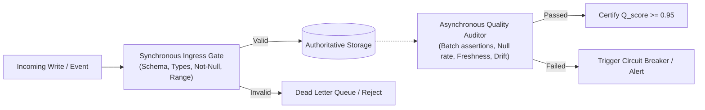

# Data Quality, Governance, Lineage, and Lifecycle Auditing

> **Mandate**: *Untrusted data is active liability. Data systems deteriorate through silent schema drift, distribution shift, uncollected garbage, and orphaned state. High-integrity data engineering implements empirical quality gates, causal lineage tracing, and automated lifecycle governance.*

---

## 1. The 6 Dimensions of Data Quality & The $Q_{\text{score}}$

Data trustworthiness is evaluated across six orthogonal mathematical dimensions:

```
┌────────────────────────────────────────────────────────────────────────┐
│                      THE 6 QUALITY DIMENSIONS                          │
├─────────────────┬──────────────────────────────────────────────────────┤
│ 1. Completeness │ Ratio of non-null, expected values present in sample │
│ 2. Uniqueness   │ Zero unauthorized duplicates within the declared G   │
│ 3. Validity     │ Adherence to domain ranges, regex formats, and types │
│ 4. Timeliness   │ Latency between real-world event and availability    │
│ 5. Consistency  │ Cross-dataset referential integrity and parity       │
│ 6. Accuracy     │ Agreement between recorded value and ground truth    │
└─────────────────┴──────────────────────────────────────────────────────┘
```

### The Composite Data Quality Score ($Q_{\text{score}}$)
$$Q_{\text{score}} = \sum_{i=1}^{6} w_i \cdot D_i \quad \text{where } \sum w_i = 1.0, \quad D_i \in [0.0, 1.0]$$

* **Production Gate**: Datasets destined for customer-facing APIs, financial ledgers, or ML inference must satisfy $Q_{\text{score}} \ge 0.95$ with zero tolerance for Uniqueness ($D_2 = 1.0$) and Validity ($D_3 = 1.0$).

---

## 2. Decoupled Quality Architecture: Sync Ingress vs. Async Auditing

Attempting to run complex statistical distribution tests synchronously on every incoming record creates catastrophic write latency and throttles throughput.



### 2.1 Synchronous Ingress Boundary
* **Execution**: Inline with write transaction ($< 2\text{ms}$).
* **Checks**: Serialization schema compliance (Avro/Protobuf/JSON-Schema), mandatory nullability bounds, domain bounds (`total >= 0`), strict string length limits.
* **Failure Mode**: Immediate rejection with standard error code or dead-letter queue routing.

### 2.2 Asynchronous Statistical Auditing
* **Execution**: Background batch, periodic cron, or sliding-window stream processor.
* **Checks**:
  * **Null Rate Variance**: Did the null rate on `shipping_postal_code` jump from $0.1\%$ to $14.5\%$ in the last hour?
  * **Row Count Velocity**: Did the hourly ingestion volume drop below $3\sigma$ of the historical rolling average?
  * **Referential Parity**: Are there orphaned records without parent entities across table boundaries?

---

## 3. Drift Forensics: Schema Drift vs. Distribution Drift

Data decay manifests in two distinct forms:

### 3.1 Schema Drift (Structural Deterioration)
* **Symptom**: Upstream API adds an unannounced field, changes a timestamp from ISO-8601 to epoch milliseconds, or drops a nested JSON attribute.
* **Defense**: Contract-first schemas with explicit compatibility rules (Backward, Forward, Full). Schemaless JSON columns must be guarded by JSON-Schema validation before downstream ingestion.

### 3.2 Distribution Drift (Semantic Shift)
* **Symptom**: The schema remains syntactically valid, but data semantics change (e.g. currency changes from USD to EUR without unit notation; user ages suddenly spike from average 28 to 99).
* **Defense**: Statistical anomaly tests (Kolmogorov-Smirnov test for continuous variables; Chi-square test for categorical distributions).

---

## 4. Causal Lineage Tracking & Ownership Boundaries

Every dataset in an organization must answer two fundamental questions:
1. *Who is the authoritative owner who created this data?*
2. *Through what pipeline transformations was this derived from original raw sources?*

### 4.1 The Lineage DAG
$$\text{Raw Source } S_0 \xrightarrow{\quad T_1 (\text{Clean}) \quad} S_{\text{clean}} \xrightarrow{\quad T_2 (\text{Aggregate}) \quad} S_{\text{mart}}$$

* **Lineage Metadata Invariant**: Every analytical table or derived store must preserve provenance tags:
  * `_source_system`: Name of the authoritative upstream domain context.
  * `_ingested_at`: UTC timestamp of raw arrival.
  * `_pipeline_version`: Git commit SHA of the transformation code that produced this record.
  * `_trace_id`: Distributed trace identifier (`traceparent`) linking the record to the triggering business action.

---

## 5. Lifecycle Governance: Retention, Privacy & Cryptographic Shredding

Data is not an asset to hoard forever; unmanaged data compounds operational cost, security attack surfaces, and regulatory liability.

```
Ingestion (Hot) ────> Active Serving ────> Warm Storage ────> Cold Archive ────> Tombstone / Shred
 (Fast I/O, SSD)     (Online Index)      (Partitioned)      (Cheap Object S3)    (Unrecoverable)
```

### 5.1 Partition-Based Retention Pruning
Never execute `DELETE FROM logs WHERE created_at < NOW() - INTERVAL '90 days';` on high-volume tables (causes massive I/O, index fragmentation, and WAL bloat).
* **The Partition Dropping Pattern**: Partition high-volume tables by time range (Daily/Monthly). Prune obsolete data by dropping entire partitions:
  ```sql
  -- Sub-second metadata operation, zero I/O lock
  DROP TABLE logs_2025_01;
  ```

### 5.2 Privacy Compliance & The "Right-to-be-Forgotten" (GDPR/CCPA)
When a user exercises their right to deletion, systems must guarantee purge across all tiers:

1. **Relational / Mutable Stores**: Soft-delete flag immediately (`deleted_at = NOW()`), followed by asynchronous hard purging of all PII attributes within the statutory window (e.g. 30 days).
2. **Cascading Child Erasure**: Ensure user references in dependent tables are either explicitly anonymized (`user_id = NULL` or `user_id = 'DELETED'`) or purged via foreign key actions.

### 5.3 Cryptographic Shredding (For Append-Only Ledgers & Immutable Storage)
In append-only event streams (Kafka), WORM storage, or cryptographic audit ledgers, physically mutating or deleting a historical record is mathematically impossible without breaking cryptographic hashes.

**The Cryptographic Shredding Protocol**:
$$\text{Payload} = \text{Encrypt}(\text{PII\_Data}, K_{\text{tenant\_user}})$$
* Every user or tenant has a unique, dedicated cryptographic encryption key ($K_u$) stored in a secure Key Management Service (KMS).
* All sensitive or personal data is encrypted with $K_u$ before appending to the immutable log.
* **Upon Deletion Request**: Delete or shred key $K_u$ from the KMS.
* **Result**: The immutable historical log remains completely intact and valid, but the user's personal data is permanently and mathematically unrecoverable.

---

## 6. Disaster Recovery: RPO, RTO & Verified Restoration

Disaster recovery plans that are not regularly tested are illusions.

* **Recovery Point Objective (RPO)**: The maximum acceptable data loss window (e.g., $RPO \le 5\text{ minutes}$ of committed transactions). Governed by WAL streaming and continuous archiving (Point-in-Time Recovery - PITR).
* **Recovery Time Objective (RTO)**: The maximum acceptable downtime to restore the database to an operational state (e.g., $RTO \le 30\text{ minutes}$).
* **The Empirical Restore Drill**: Automated CI/CD pipelines or scheduled jobs must periodically spin up an isolated staging database, restore from the latest snapshot and WAL stream, and execute verification sanity queries.
