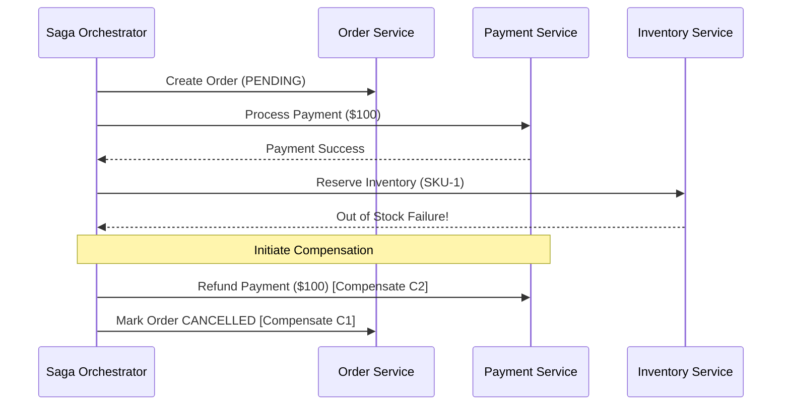

# Distributed Data Consistency & Transaction Engineering

> **Mandate**: *Physical reality governs distributed systems. Network partitions, disk physics, concurrent clock skew, and hardware failures are inescapable invariants. Engineering consistent data systems requires understanding storage mechanics, isolation boundaries, and deterministic convergence.*

---

## 1. Storage Engine Physics: LSM-Trees vs. B-Trees vs. Columnar

Storage engines are physical data structures optimized for specific hardware I/O characteristics. Choosing the wrong engine causes write amplification, lock thrashing, or query starvation.

```
┌────────────────────────────────────────────────────────────────────────────────────────┐
│ LSM-TREE (Log-Structured Merge-Tree)         B-TREE (In-Place Mutation)                │
│                                                                                        │
│ Writes -> In-Memory Memtable (WAL)           Writes -> In-Place Page Modification      │
│ Flushed -> Immutable SSTables on Disk        Reads  -> Direct Root-to-Leaf Traversal   │
│ Compaction -> Merge sorted runs asynchronously Locks -> Page latches / Page splits     │
│ Optimal: Write-heavy, Append, Sequential     Optimal: Read-heavy, Point lookups, Range │
└────────────────────────────────────────────────────────────────────────────────────────┘
```

### Storage Engine Comparative Matrix

| Architecture | Storage Mechanic | Primary Engines | Best-Fit Workload | Worst-Fit Workload |
| :--- | :--- | :--- | :--- | :--- |
| **B-Tree / Heap** | Fixed-size pages (4KB–16KB), in-place updates, random I/O | PostgreSQL, MySQL InnoDB, SQLite, Oracle | Balanced OLTP, predictable read latency, point lookups | Massive sustained ingest ($> 100\text{k writes/s}$) |
| **LSM-Tree** | Sequential append to WAL + Memtable $\to$ immutable SSTables | RocksDB, Cassandra, ScyllaDB, Bigtable, Kafka | Write-heavy ingestion, time-series, append logs | Heavy random range queries during compaction storms |
| **Columnar Projection** | Column-oriented vectors, dictionary encoding, run-length compression | ClickHouse, DuckDB, Parquet, Snowflake, BigQuery | OLAP, analytical scans, aggregations (`SUM`, `AVG`) | Single-row `UPDATE` / `DELETE`, point lookups |
| **HNSW / Vector Graph**| Hierarchical navigable small-world graphs | Qdrant, Milvus, pgvector, FAISS | Semantic similarity, high-dimensional vector search | Strict exact filtering without hybrid indices |
| **Adjacency Index** | Pointer-chasing graph relationships | Neo4j, Memgraph | Deep recursive graph traversal ($N$-hop joins) | High-throughput sequential tabular scans |

---

## 2. Transaction Isolation Levels & Concurrency Anomalies

Standard SQL isolation levels define what concurrent anomalies a transaction permits. Many developers assume "transactions prevent all bugs"—this is dangerous when running under default `READ COMMITTED`.

```
┌────────────────────────────────────────────────────────────────────────────────────────┐
│ Concurrency Anomaly  │ Description                                                     │
├──────────────────────┼─────────────────────────────────────────────────────────────────┤
│ 1. Dirty Read        │ Tx A reads uncommitted mutations made by Tx B (which then rolls)│
│ 2. Non-Repeatable    │ Tx A re-reads the same row and sees values modified by Tx B     │
│ 3. Phantom Read      │ Tx A re-executes a range query and sees new rows added by Tx B  │
│ 4. Lost Update       │ Tx A and B read same value; both write updates; one overwrites  │
│ 5. Write Skew        │ Tx A and B read overlapping sets, check an invariant, and make  │
│                      │ disjoint writes that together violate the global invariant      │
└──────────────────────┴─────────────────────────────────────────────────────────────────┘
```

### The Isolation Matrix

| Isolation Level | Dirty Read | Non-Repeatable Read | Phantom Read | Lost Update | Write Skew |
| :--- | :--- | :--- | :--- | :--- | :--- |
| **Read Uncommitted** | ❌ Allowed | ❌ Allowed | ❌ Allowed | ❌ Allowed | ❌ Allowed |
| **Read Committed** *(Default in PG/Oracle)* | ✅ Prevented | ❌ Allowed | ❌ Allowed | ❌ Allowed | ❌ Allowed |
| **Repeatable Read / Snapshot Isolation** | ✅ Prevented | ✅ Prevented | ✅ Prevented* | ✅ Prevented | ❌ Allowed |
| **Serializable** | ✅ Prevented | ✅ Prevented | ✅ Prevented | ✅ Prevented | ✅ Prevented |

*\*Note: True Snapshot Isolation prevents Phantoms for reads, but permits Write Skew unless Serializable Snapshot Isolation (SSI) or explicit row locking is used.*

### Mitigating the Classic "Lost Update" Anomaly

**Anti-Pattern (Vulnerable to Lost Update under Read Committed)**:
```python
# Thread 1 and Thread 2 both read balance = 100 simultaneously
account = db.query("SELECT balance FROM accounts WHERE id = 1")
new_balance = account.balance - 50
# Both write new_balance = 50, losing one $50 deduction!
db.execute("UPDATE accounts SET balance = :val WHERE id = 1", val=new_balance)
```

**Pattern 1: Atomic In-Database Mutation (Preferred)**:
```sql
UPDATE accounts SET balance = balance - 50 WHERE id = 1 AND balance >= 50;
```

**Pattern 2: Optimistic Concurrency Control (OCC) with Version Tokens**:
```sql
UPDATE accounts 
SET balance = balance - 50, version = version + 1 
WHERE id = 1 AND version = :read_version;
-- If affected rows == 0, abort and retry
```

---

## 3. Distributed Trade-Offs: The PACELC Theorem

The naive CAP Theorem is too simplistic (systems only face partitions rarely). Real systems must decide trade-offs during **both** normal operation and network partitions:

$$\mathbf{P} \text{artitioned} \implies (\mathbf{A} \lor \mathbf{C}) \quad \mathbf{E} \text{lse} \implies (\mathbf{L} \lor \mathbf{C})$$

```
                            IF PARTITION (P)
                           /                \
             Choose Availability (A)      Choose Consistency (C)
             (e.g., DynamoDB, Cassandra)  (e.g., Spanner, Cockroach, Raft)
                           \                /
                           ELSE NORMAL (E)
                           /                \
             Choose Latency (L)           Choose Consistency (C)
             (e.g., MongoDB unack)        (e.g., PostgreSQL sync replica)
```

* **PC/EC (Spanner, CockroachDB, Raft clusters)**: Chooses Consistency on partition; Chooses Consistency normally (higher read/write latency to ensure global consensus).
* **PA/EL (Cassandra, DynamoDB with eventual consistency)**: Chooses Availability on partition (stale reads allowed); Chooses Latency normally (async replication).

---

## 4. Distributed Transactions: Two-Phase Commit (2PC) vs. The Saga Pattern

When a business process spans multiple independent databases or microservices, traditional ACID transactions fail across network boundaries.

### 4.1 Why 2PC Fails in High-Scale Architectures
Two-Phase Commit (2PC) holds database row locks across network hops during Phase 1 (Prepare) and Phase 2 (Commit). If any node crashes or network latency spikes, all participating locks are held indefinitely, causing global cascading connection exhaustion.

### 4.2 The Saga Pattern: Orchestration vs. Choreography
Instead of locking distributed rows, a Saga breaks a distributed transaction into a sequence of local ACID transactions, each with an explicit **Compensating Action**:

$$\text{Forward Flow: } T_1 \to T_2 \to T_3 \quad \implies \quad \text{On Failure at } T_3: C_2 \to C_1$$



* **Idempotency Rule for Compensations**: A compensating transaction ($C_i$) must be strictly **idempotent**. If the orchestrator retries $C_i$ due to a network timeout, it must succeed without duplicating refunds.

---

## 5. Convergent Authority: CRDTs & Vector Clocks

In mobile offline-first applications, peer-to-peer collaboration, or multi-region active-active clusters, single-writer authority is impossible. Systems must use **Deterministic Convergence**.

### 5.1 Conflict-Free Replicated Data Types (CRDTs)
CRDTs are data structures that can be replicated concurrently across multiple nodes without coordination, and are guaranteed to mathematically converge to the exact same state once all replicas have exchanged messages:

1. **State-based CRDTs (CvRDT)**: Replicas exchange their entire state and merge via a monotonic join operator:
   $$\text{State}_{\text{merged}} = S_A \sqcup S_B \quad (\text{Commutative, Associative, Idempotent})$$
2. **Operation-based CRDTs (CmRDT)**: Replicas broadcast concurrent operations over causal networks.

### 5.2 Vector Clocks & Lamport Timestamps
Physical wall-clock time (`System.currentTimeMillis()`) skews across servers (NTP drift, leap seconds). Never use physical timestamps as the sole arbiter of distributed ordering without clock synchronization error bounds (TrueTime). Use **Vector Clocks** to detect true causal concurrency vs. sequential causality:

$$\mathbf{V}_A < \mathbf{V}_B \iff (\forall k, \mathbf{V}_A[k] \le \mathbf{V}_B[k]) \land (\exists k, \mathbf{V}_A[k] < \mathbf{V}_B[k])$$
If neither $\mathbf{V}_A < \mathbf{V}_B$ nor $\mathbf{V}_B < \mathbf{V}_A$, the events are **concurrent** and require domain conflict resolution.
