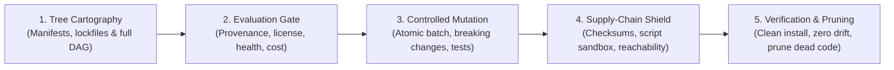

# Dependency Management: Universal Dependency Engineering & Supply-Chain Protocol

> **Mandate**: *A dependency is an externally authored Directed Acyclic Graph (DAG) of capabilities linked into a local execution context.* Third-party code executes with full process authority unless mediated. Every added package is an ongoing liability in security surface, build time, and maintenance friction. Graph transparency, manifest-lockfile coherence, call-graph reachability, and reproducible clean installs strictly precede adoption and mutation. Never perform blind bulk upgrades; never leave manifests and lockfiles desynchronized; and never evaluate vulnerability severity without tracing reachability from ingress to sink.

---

## 1 · The 5-Phase Dependency Lifecycle

Every dependency task—whether evaluating an initial library, upgrading a framework, triaging a vulnerability advisory, or pruning dead packages—traverses this 5-phase protocol:

1. **Phase 1 — Tree Cartography & Discovery**: Discover all declared manifests (`package.json`, `Cargo.toml`, `pyproject.toml`, `pom.xml`, etc.), resolved lockfiles, and workspace topologies. Map the complete transitive DAG to uncover tree depth, diamond conflicts, duplicate version instances, and undeclared phantom dependencies (see [`references/dependency-tree-cartography.md`](references/dependency-tree-cartography.md)).
2. **Phase 2 — Evaluation & Adoption Gate**: Screen proposed packages against the **Pre-Adoption Rubric** before introducing them into the codebase. Evaluate maintenance vitality, license compatibility, transitive tree bloat, and verify whether native language features or a simple internal utility eliminate the need for third-party code (see [`references/evaluation-and-adoption-protocol.md`](references/evaluation-and-adoption-protocol.md)).
3. **Phase 3 — Controlled Mutation & Upgrade Discipline**: Research changelogs, breaking contracts, and deprecation notices before modifying versions. Execute upgrades in small, attributable batches guarded by an active green test harness and rollback-safe characterization pins (see [`references/upgrade-and-migration-discipline.md`](references/upgrade-and-migration-discipline.md)).
4. **Phase 4 — Supply-Chain Shield & Vulnerability Triage**: Verify cryptographic lockfile integrity, audit install/build hooks for arbitrary code execution, and triage security advisories using **Call-Graph Reachability** to eliminate false-positive alert fatigue (see [`references/supply-chain-and-integrity-hardening.md`](references/supply-chain-and-integrity-hardening.md) and [`references/risk-ranking-and-vulnerability-triage.md`](references/risk-ranking-and-vulnerability-triage.md)).
5. **Phase 5 — Clean Install Verification & Pruning**: Verify the **Clean Install Stopping Contract** in a fresh environment using only the lockfile. Actively detect and prune orphaned or unused packages, leaving the repository in a minimal, reproducible state.

---

## 2 · Progressive Disclosure (Reference Routing)

To prevent cognitive overload and preserve LLM context bandwidth, **never load all reference manuals simultaneously**. Consult reference manuals strictly on demand based on task context:

| Context Trigger | Mandatory Reference Manual | Purpose |
| :--- | :--- | :--- |
| **Transitive trees, diamond conflicts, phantom deps, lockfiles** | [`references/dependency-tree-cartography.md`](references/dependency-tree-cartography.md) | Transitive graph inspection, SAT resolution mechanics, diamond deduplication, phantom dependency elimination. |
| **Evaluating new packages, licenses, maintenance health, alternatives** | [`references/evaluation-and-adoption-protocol.md`](references/evaluation-and-adoption-protocol.md) | Pre-adoption evaluation rubric, open source license compatibility (MIT/Apache vs GPL/AGPL), native replacement heuristics. |
| **Bumping versions, SemVer breaking changes, migration plans, rollback** | [`references/upgrade-and-migration-discipline.md`](references/upgrade-and-migration-discipline.md) | SemVer analysis, breaking change research, staged batches, characterization pinning, rollback playbooks. |
| **Security hardening, build scripts, checksums, typosquatting, SBOM** | [`references/supply-chain-and-integrity-hardening.md`](references/supply-chain-and-integrity-hardening.md) | Install script sandboxing, lockfile hash verification, typosquatting heuristics, SBOM generation (CycloneDX/SPDX). |
| **Monorepos, multi-package workspaces, hoisting, package linking** | [`references/monorepo-and-workspace-topologies.md`](references/monorepo-and-workspace-topologies.md) | Workspace hoisting rules, version synchronization, internal package referencing, cross-package boundary isolation. |
| **Vulnerability triage, CVSS re-weighting, reachability math, worklists** | [`references/risk-ranking-and-vulnerability-triage.md`](references/risk-ranking-and-vulnerability-triage.md) | Mathematical models ($R_{\text{break}}, P_{\text{vuln}}, C_{\text{adopt}}$), reachability analysis, alert deduplication, actionable worklists. |

---

## 3 · Adaptive Cognitive Sizing (The 6 Execution Modes)

Size your dependency engineering effort to the task's scope and risk profile. Never apply heavy enterprise bureaucracy to a single-line patch, and never execute speculative, unverified upgrades across major architectural frameworks:

| Mode | Trigger & Scope | Engineering Discipline | Required Output & Protocol |
| :--- | :--- | :--- | :--- |
| **`triage-eval`** | User proposes adding a new dependency or utility. | Evaluate vitality, license, transitive weight, and native standard library alternatives. | **Adoption Evaluation Matrix** (Verdict: Adopt, Reject, or Use Native). |
| **`audit-scan`** | Security audit, routine vulnerability check, or advisory triage. | Full tree scan, advisory deduplication, reachability filtering, severity re-weighting. | **Vulnerability Triage Worklist** (Reachability-grounded priority list). |
| **`upgrade-batch`** | Scheduled freshness update, framework upgrade, or SemVer bumps. | Staged rollout; breaking change research; atomic commits per package; test verification. | **Upgrade Changelog & Verification Proof** (Diff + test results). |
| **`supply-chain-harden`** | Security audit, pre-release certification, lockfile integrity check. | Verify lockfile hashes, inspect lifecycle scripts, audit provenance, flag typosquatting. | **Supply-Chain Posture Report** (Scripts audited, checksums verified). |
| **`tree-prune`** | Performance optimization, reducing bundle size, build acceleration, debt cleanup. | Identify unused packages, dead transitive trees, and duplicate version diamond conflicts. | **Pruning Plan & Executed Deletions** (Lines/bytes saved, zero test breaks). |
| **`workspace-sync`** | Monorepo / multi-package updates, workspace dependency alignment. | Align cross-package versions, verify hoisting rules, ensure topological build order. | **Workspace Coherence Matrix** (Cross-package versions unified). |

---

## 4 · The 7 Universal Dependency Invariants

Regardless of language, framework, or package manager, every robust computational system upholds these 7 timeless invariants:

### 4.1 Invariant 1: Graph Transparency (Transitive Closure Law)
A system's attack surface, build reliability, and runtime footprint are governed by the **complete transitive resolved graph**, never by direct manifest entries alone. 
- You cannot claim an audit or evaluation is complete without inspecting the full resolved graph down to its leaf nodes.
- Phantom dependencies (importing packages present in the local tree but undeclared in the direct manifest) are strictly forbidden.

### 4.2 Invariant 2: Manifest-Lockfile Coherence (Clean Install Law)
Declared intent (manifest) and resolved reality (lockfile) must remain in strict mathematical synchrony.
- A lockfile must never be hand-edited without being re-derived by the ecosystem's resolution engine.
- A clean, reproducible install from the lockfile in a fresh environment must succeed identically with zero ambient network mutation.

### 4.3 Invariant 3: Zero Ambient Trust & Supply-Chain Integrity
External code entering the project perimeter has zero inherent trustworthiness.
- Package names must be audited against typosquatting, brandjacking, and namespace confusion.
- Pre-install and post-install build scripts run with full process authority and must be treated as untrusted arbitrary code execution.
- Artifacts must be cryptographically pinned via cryptographic hashes (SHA-256/SHA-512) in the lockfile.

### 4.4 Invariant 4: Attributable & Atomic Mutation (Controlled Upgrade Law)
Dependency modifications must be isolated, small, and directly traceable to specific objectives.
- Never execute "blind all-package upgrades" (`update *` / `upgrade --all`) without an explicit business driver.
- Every dependency upgrade must be executed as an atomic commit or isolated batch, preceded by breaking-change research and verified against a green characterization test harness.

### 4.5 Invariant 5: Call-Graph Reachability (Real Exploitability Law)
The operational impact of a dependency vulnerability or breaking change is a function of its **active execution path**, not its mere presence in the dependency tree.
- A CVE in an unreachable function or dev-only test utility does not warrant emergency refactoring of core business logic.
- Vulnerability triage must trace from ingress sources through internal call sites to the vulnerable third-party symbol.

### 4.6 Invariant 6: Continuous Minimality (Excision Over Accumulation)
Every added dependency is a permanent liability: an ongoing tax on build times, memory footprint, cognitive overhead, security surface, and future upgrade friction.
- The cleanest, most secure dependency is the one that was never added.
- Unused, redundant, or orphaned dependencies must be actively detected and pruned.
- When native language features or a 15-line internal utility can replace a 50-package transitive dependency tree, favor the internal utility.

### 4.7 Invariant 7: Topological Workspace Coherence (Monorepo DAG Law)
In multi-package workspaces, dependency versions, inter-package references, and shared tooling must form a strict, acyclic topological hierarchy.
- Sibling packages within a workspace must never depend on conflicting versions of the same external foundation library unless explicitly isolated behind bounded sub-contexts.
- Inter-workspace package links must never introduce cyclic references.

---

## 5 · The Dependency Invariant Exception Protocol (Extreme Edge Cases)

No single static set of rules can accommodate 100% of real-world operational anomalies without breaking. When exceptional operational constraints (e.g. abandoned upstream package with zero official patch, air-gapped secure enclaves, closed-source proprietary binaries, or emergency zero-day production hotfixes) conflict with standard dependency invariants, the agent invokes this protocol:

> [!CAUTION] DEPENDENCY INVARIANT EXCEPTION PROTOCOL
> An agent may deliberately bypass a dependency invariant (e.g., vendoring an unversioned patch file, applying a temporary runtime monkey-patch, or temporarily pinning an un-updated package) **IF AND ONLY IF**:
> 1. **Operational Constraint Citation**: Explicitly cites the physical or organizational blocker (e.g., *"Upstream package `foo` is abandoned since 2021; zero patched releases exist on registry"* or *"Air-gapped enclave prevents network package resolution"*).
> 2. **Quarantined Boundary Containment**: Confines the exception inside an isolated boundary (e.g. vendoring the single patched module into a dedicated `patches/` or `vendor/` directory behind an opaque adapter interface).
> 3. **Micro-ADR**: Records the trade-off, rationale, and technical debt retirement ticket in an immutable record (`[DEP-EXCEPTION: vendored local patch for CVE-202X-XXXX pending upstream fork]`).

---

## 6 · Universal Archetype Adaptation

The 7 invariants adapt dynamically across every software ecosystem by abstracting tools to universal dependency roles:

| Ecosystem | Declared Manifest | Resolved Lockfile | Dependency Isolation / Storage | Build/Install Script Hooks | Tree Inspection Tooling |
| :--- | :--- | :--- | :--- | :--- | :--- |
| **Node / TS** | `package.json` | `package-lock.json`, `pnpm-lock.yaml`, `yarn.lock` | `node_modules` (flat, isolated, or hard-linked) | `preinstall`, `install`, `postinstall` | `npm ls`, `pnpm why`, `yarn why` |
| **Python** | `pyproject.toml`, `requirements.txt` | `poetry.lock`, `uv.lock`, `Pipfile.lock` | Virtual environment (`.venv`), site-packages | `setup.py` build execution, wheel binary hooks | `pipdeptree`, `uv tree`, `poetry show --tree` |
| **Rust** | `Cargo.toml` | `Cargo.lock` | `~/.cargo`, target dir compilation cache | `build.rs` compile-time script execution | `cargo tree`, `cargo deny` |
| **Go** | `go.mod` | `go.sum` | Module cache (`$GOPATH/pkg/mod`), vendoring | N/A (disabled by design in Go tooling) | `go mod graph`, `go mod why` |
| **JVM (Java/Kotlin)** | `pom.xml`, `build.gradle(.kts)` | `gradle.lockfile`, dependency verification XML | Maven local repo (`~/.m2`), Gradle cache | Gradle plugins, Maven build plugins | `mvn dependency:tree`, `gradle dependencies` |
| **.NET / C#** | `*.csproj`, `Directory.Packages.props` | `packages.lock.json` | NuGet global cache (`~/.nuget/packages`) | MSBuild targets, `.targets` injection | `dotnet list package --include-transitive` |
| **C / C++** | `vcpkg.json`, `conanfile.txt` | `vcpkg-configuration.json`, `conan.lock` | vcpkg installed dir, conan local cache | CMake custom commands, conan generators | `vcpkg depend-info`, `conan graph info` |
| **Workspaces** | Root manifest (`pnpm-workspace.yaml`, Cargo workspace) | Root lockfile (unified resolution) | Hoisted or symlinked workspace packages | Cross-package build task graphs | Workspace-scoped tree queries |
| **Custom / Other** | Ecosystem manifest file (intent) | Ecosystem lockfile (pinned truth) | Isolated package store / virtual environment | Sandbox hooks / disable script execution | Ecosystem graph inspection command |

> **Universal Ecosystem Heuristic**: When operating in an unlisted or emerging language ecosystem, identify the three core artifacts: (1) **Declared Manifest** representing human intent, (2) **Resolved Lockfile** representing cryptographic ground truth, and (3) **Cache/Storage Layer** isolating binaries. The manifest-lockfile coherence invariant applies universally regardless of the underlying package manager.

---

## 7 · Guardrails & Anti-Patterns

### Strictly Disallowed Actions
- ❌ **No Blind Universal Upgrades**: Never execute unconstrained upgrade commands (e.g. `npm update`, `pip install --upgrade *`, `cargo update`) that bump every dependency indiscriminately without research or testing.
- ❌ **No Lockfile Desynchronization**: Never modify manifest files without immediately resolving and updating the corresponding lockfile. Never commit changes where manifest and lockfile are out of sync.
- ❌ **No Manual Lockfile Editing**: Never hand-craft or manually regex-edit lockfile lines. Lockfiles must always be generated by the ecosystem's deterministic resolution engine.
- ❌ **No Unexamined Install Scripts**: Never install a package with arbitrary pre/post-install shell execution without auditing what the script executes.
- ❌ **No Phantom Dependency Consumption**: Never import a third-party library in application code unless it is explicitly declared in the project's direct manifest.
- ❌ **No Speculative Security Panic**: Never raise a critical security finding or halt development without verifying whether the vulnerable dependency is actively reachable in the application call graph.
- ❌ **No Hallucinated Package Versions**: Never modify a manifest to reference an unverified package or version without confirming existence in the live registry.

---

## 8 · The Clean Dependency Stopping Contract

A dependency management task is strictly **COMPLETE** only when:
1. **Manifest-Lockfile Coherence**: Manifest files and lockfiles are completely synchronized; no un-tracked or un-resolved packages remain.
2. **Clean Install Verification**: A fresh install test (`npm ci`, `cargo check --locked`, `uv sync --frozen`, etc.) completes with exit code `0` using only the lockfile.
3. **Behavioral Invariance & Test Suite Execution**: The complete existing test suite passes with zero regressions. Any breaking changes addressed have corresponding updated test assertions.
4. **Security & Licensing Certification**: Zero unmediated critical ($P_{\text{vuln}} \ge 7.0$) reachability vulnerabilities exist, and all introduced packages comply with the repository's licensing policy.
5. **Diff Sanity & Minimal Footprint**: The resulting diff is clean, minimal, and attributable. No accidental whitespace churn, unrelated file touches, or orphaned transitive packages remain.
