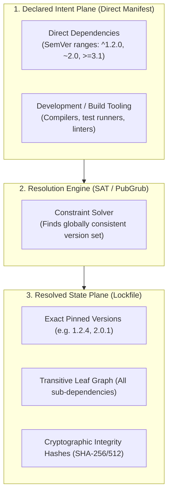
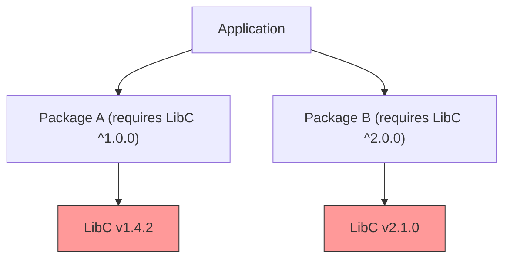

# Dependency Tree Cartography & Graph Resolution

> **Core Axiom**: *The runtime behavior and vulnerability surface of an application are defined by the complete transitive closure of its dependency graph, not by the declared manifest alone.*

---

## 1 · Graph Terminology & Structural Planes

Every modern software dependency system separates declared intent from resolved reality across three structural planes:



### Definitions:
* **Root Manifest**: The human-authored declaration of intent (`package.json`, `Cargo.toml`, `pyproject.toml`, `pom.xml`, `go.mod`).
* **Resolved Lockfile**: The machine-generated snapshot of the resolved graph (`package-lock.json`, `pnpm-lock.yaml`, `Cargo.lock`, `poetry.lock`, `uv.lock`, `go.sum`).
* **Direct Dependency**: A package explicitly declared in the root manifest that the application code imports or compiles against.
* **Transitive Dependency**: A package required by a direct dependency (or another transitive dependency). In large applications, transitive packages typically account for 85–95% of the total dependency tree.
* **Leaf Node**: A dependency in the graph with zero dependencies of its own.

---

## 2 · The Diamond Dependency Problem & Resolution Strategies

A **Diamond Dependency Conflict** occurs when two distinct dependencies require conflicting version ranges of a shared transitive dependency:



### How Ecosystems Handle Diamonds:
1. **Single-Version Runtimes (Strict SAT Solver - Rust, Go, Python)**:
   - The resolution engine fails fast if a single compatible version cannot satisfy both constraints, unless explicitly namespaced.
   - *Go*: Minimal Version Selection (MVS) picks the minimum version that satisfies all constraints.
   - *Rust (Cargo)*: Allows multiple major versions of the same crate in the compilation graph, as long as types are not passed across crate boundaries.
   - *Python*: Flat virtual environment requires exactly one version. A conflict results in an unresolvable build failure.
2. **Multi-Version / Nested Runtimes (Node.js/npm/pnpm)**:
   - Nested or isolated directories allow both `LibC v1` and `LibC v2` to co-exist in memory.
   - *The Danger*: Passing objects or prototypes instantiated by `LibC v1` into functions expecting `LibC v2` results in silent `instanceof` check failures, serialization bugs, and duplicate memory bloat.

### Resolution Protocol for Diamond Conflicts:
1. **Locate the Ancestor Nodes**: Run the tree query tool (`npm ls <pkg>`, `cargo tree -i <pkg>`, `uv tree --invert <pkg>`) to identify which top-level packages pull in the conflicting versions.
2. **Upgrade the Lagging Ancestor**: Check if upgrading `Package A` to its latest release aligns its `LibC` constraint to `^2.0.0`.
3. **Override / Force Pinning**: If `Package A` is unmaintained but compatible, apply a resolution override (`overrides` in npm, `pnpm.overrides`, `[patch.crates-io]` in Cargo, `replace` in Go) with characterization test verification.

---

## 3 · Phantom Dependencies (The Ghost Import Trap)

A **Phantom Dependency** occurs when an application imports a package that is physically present in the local storage directory (e.g. `node_modules` or global site-packages) because it was pulled in transitively, **but is not declared in the application's direct manifest**.

```markdown
// Application Code: src/index.ts
import { parse } from 'acorn'; // ❌ PHANTOM DEPENDENCY!
// 'acorn' is NOT in package.json dependencies, but was installed by 'webpack'.
```

### Why Phantom Dependencies Cause Catastrophic Failure:
1. When `webpack` upgrades or refactors internally to use a different parser, `acorn` disappears from the resolved tree.
2. The application crashes in production with `MODULE_NOT_FOUND` despite zero changes to application code.
3. In monorepos, phantom dependencies allow Package A to accidentally import un-exported internals from sibling Package B.

### Defense Against Phantom Dependencies:
- Enforce strict isolated package layouts (e.g. `pnpm` hard-linked content-addressable store, `go.mod` strict imports, Cargo crate boundary checking).
- Run linter rules (e.g., `import/no-extraneous-dependencies` or custom AST import scanners) before merging code.

---

## 4 · Transitive Tree Cartography Commands by Ecosystem

When diagnosing trees, use these non-mutating inspection commands:

| Ecosystem | Full Transitive Tree | Trace Why Package Exists | Find Duplicate Versions |
| :--- | :--- | :--- | :--- |
| **Node (pnpm)** | `pnpm ls --depth=Infinity` | `pnpm why <pkg>` | `pnpm dedupe --check` |
| **Node (npm)** | `npm ls --all` | `npm explain <pkg>` | `npm ls <pkg>` |
| **Python (uv)** | `uv tree` | `uv tree --invert <pkg>` | `pipdeptree --warn fail` |
| **Python (pip/poetry)** | `poetry show --tree` | `poetry show <pkg>` | `pipdeptree` |
| **Rust (Cargo)** | `cargo tree` | `cargo tree -i <pkg>` | `cargo tree --duplicates` |
| **Go** | `go mod graph` | `go mod why <pkg>` | Native compiler rejects dups |
| **JVM (Maven)** | `mvn dependency:tree` | `mvn dependency:tree -Dincludes=<pkg>` | `mvn dependency:analyze` |
| **.NET** | `dotnet list package --include-transitive` | Inspect `project.assets.json` | Visual Studio Dependency Viewer |
