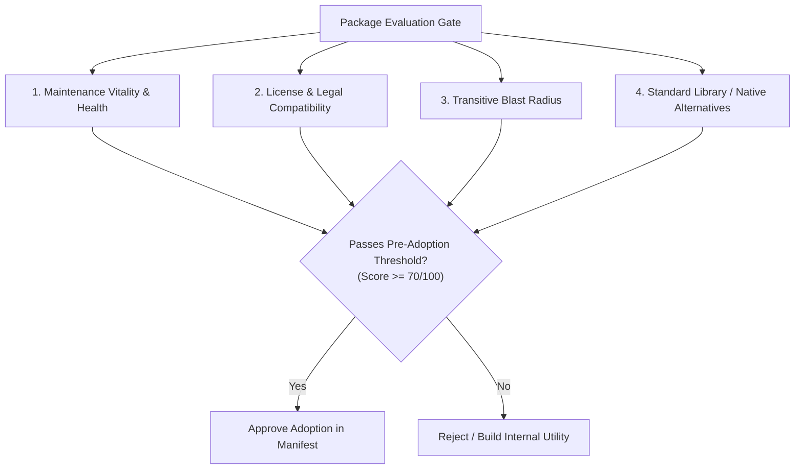

# Evaluation & Adoption Protocol

> **Core Axiom**: *Every dependency introduced into a codebase is a permanent liability. Adoption must earn its place through verified vitality, legal compatibility, and clear architectural necessity.*

---

## 1 · The Pre-Adoption Evaluation Rubric

Before adding any new library or tool, the agent must evaluate the package across four quantitative dimensions:



### 1.1 Dimension 1: Maintenance Vitality (0–25 points)
Evaluate the project's health and continuity:
* **Release Frequency**: Has a stable release occurred within the last 12–18 months? (Abandonment signal if inactive $> 2$ years).
* **Issue & PR Velocity**: Are critical bugs and security advisories acknowledged and resolved within reasonable turnaround times?
* **Bus Factor & Stewardship**: Is the package maintained by an active organization, foundation, or multiple co-maintainers, or is it a single-author hobby project?
* **Documentation & Typings**: Does it provide clear API contracts, type definitions, and release notes?

### 1.2 Dimension 2: License & Legal Compliance (0–25 points)
Categorize the license under the **Open Source Licensing Taxonomy**:

| License Category | Common Licenses | Commercial / Proprietary Compatibility | Permitted Use Cases |
| :--- | :--- | :--- | :--- |
| **Permissive** | MIT, Apache 2.0, BSD-2/3-Clause, ISC | ✅ Full commercial compatibility; patent grant in Apache 2.0. | Safe for all applications, libraries, and microservices. |
| **Weak Copyleft** | LGPL 2.1/3.0, MPL 2.0, EPL 2.0 | ⚠️ Permitted if dynamically linked or kept in isolated module. Changes to the library itself must be open-sourced. | Permitted in services and desktop apps with dynamic linkage. |
| **Strong Copyleft** | GPL 2.0/3.0, AGPL 3.0 | ❌ High risk: Forces entire consuming application to be licensed under GPL/AGPL if distributed. | Strictly quarantined; forbidden in proprietary commercial closed-source software unless granted explicit exception. |
| **Unlicensed / Ambiguous** | Missing license, "Commons Clause", SSPL | ❌ Strict liability: Legally proprietary or source-available with commercial restrictions. | Reject immediately. |

### 1.3 Dimension 3: Transitive Blast Radius (0–25 points)
Measure the total weight the package adds to the tree:
* **Sub-dependency Count**: Does adopting the package pull in 0 sub-dependencies, or an avalanche of 45 transitive crates/packages?
* **Installation Scripts**: Does the package require native compilation (`node-gyp`, `cmake`, `setuptools`) or execute install-time shell scripts?
* **Binary Size & Compilation Impact**: What is the impact on bundle size, cold-build compilation time, or container image footprint?

### 1.4 Dimension 4: Standard Library & Native Replacement (0–25 points)
Assess whether the dependency is genuinely necessary:
* **The 50-Line Rule**: If the desired functionality can be implemented cleanly in $< 50$ lines of tested, idiomatic native code (e.g. `is-odd`, `left-pad`, trivial string padding, basic debouncing), **reject the dependency and build the internal helper**.
* **Modern Platform Capabilities**: Modern language standards (Node 18+ native `fetch`/`crypto`, Python 3.11+ `tomllib`, Rust `std`) have incorporated vast standard library features that formerly required external libraries (e.g., `request`, `axios`, `toml`).

---

## 2 · The Adoption Decision Matrix

| Adoption Score | Classification | Protocol |
| :--- | :--- | :--- |
| **85 – 100** | **Greenlit (Standard Adoption)** | Clear ecosystem standard (e.g., `serde`, `zod`, `pydantic`). Add to direct manifest with bounded version range. |
| **70 – 84** | **Conditional Adoption** | Acceptable with constraints. Pin exact version in lockfile, isolate behind an internal adapter interface to prevent vendor lock-in. |
| **< 70** | **Rejected** | High liability. Choose an alternate package, implement an in-house utility, or cite the Dependency Invariant Exception Protocol. |

---

## 3 · The Adoption Evaluation Output Schema

When recommending or rejecting a package, the agent emits an **Adoption Evaluation Matrix**:

```markdown
### Dependency Adoption Evaluation: [package-name]
* **Target Version**: [e.g. 2.4.0]
* **License**: [e.g. MIT (Permissive)]
* **Maintenance Vitality**: [Score / 25] (Last release: YYYY-MM-DD, Active maintainers: N)
* **Transitive Weight**: [+N packages, ~M KB added to lockfile]
* **Standard Library Alternatives**: [Evaluated: Why native solution is / is not sufficient]
* **Adoption Score**: [Total / 100]
* **Verdict**: [ADOPT / REJECT / USE NATIVE ALTERNATIVE]
```
