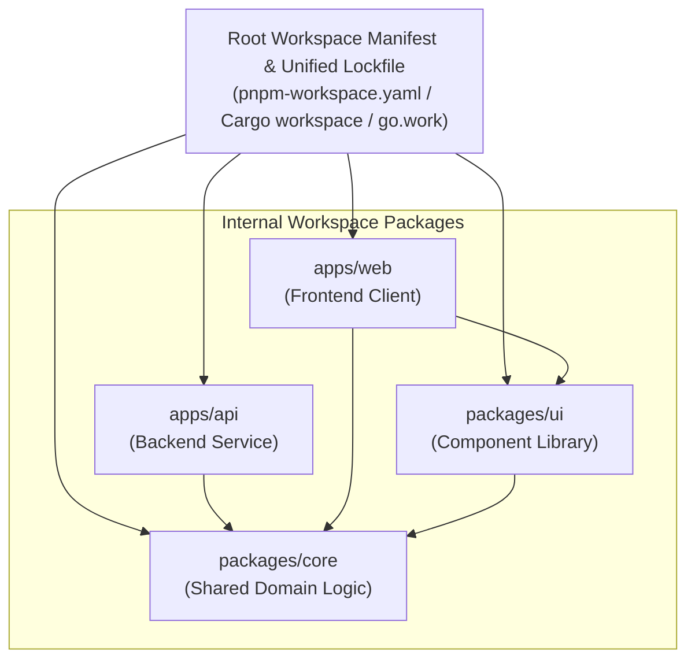

# Monorepo & Workspace Topologies

> **Core Axiom**: *In multi-package workspaces, dependency graphs, shared tooling, and inter-package boundaries must form a strict, acyclic topological hierarchy. Sibling packages must never create duplicate drift or circular dependencies.*

---

## 1 · Workspace Anatomy & The Root Authority

A monorepo (or multi-package workspace) contains multiple individual packages managed under a single unified version-control repository:

### Core Workspace Rules:
1. **Single Unified Lockfile**: A monorepo must maintain exactly **one** unified lockfile at the workspace root. Creating independent lockfiles inside nested child packages fragments dependency resolution and invites version drift.
2. **First-Class Workspace Protocols**: Reference sibling packages using explicit workspace protocols:
   - Node (pnpm/yarn): `"@corp/core": "workspace:*"`
   - Cargo: `core = { path = "../../packages/core" }`
   - Go: `replace example.com/corp/core => ../../packages/core`

---

## 2 · Hoisting Mechanics & Pitfalls

Many package managers attempt to "hoist" shared dependencies from child packages up to the root directory to reduce disk usage and deduplicate installations.

### The Pitfalls of Naive Hoisting:
* **Phantom Dependencies**: Sibling package A can import a library declared by sibling package B simply because it was hoisted into the root storage directory.
* **Conflicting Transitive Peers**: If package A requires `React 18` and package B requires `React 19`, naive hoisting can corrupt runtime module resolution.

### The Modern Solution:
* Prefer **isolated, symlinked storage engines** (such as `pnpm`, Cargo workspaces, or Yarn modern PnP) over flat hoisting.
* Enforce strict workspace boundaries: a package may only import dependencies explicitly listed in its own local manifest.

---

## 3 · Version Synchronization Strategies

In large workspaces, managing external dependencies across dozens of packages requires disciplined synchronization:

### Strategy A: Catalog / Unified Dependency Management
Define external dependency versions once at the root level, and reference them across child manifests:
* **pnpm Catalogs**: Define versions in `pnpm-workspace.yaml` under `catalog:`, and reference in `package.json` as `"catalog:"`.
* **Cargo Workspace Dependencies**: Define in root `Cargo.toml` under `[workspace.dependencies]`, and reference in member crates as `{ workspace = true }`.
* **.NET Central Package Management (CPM)**: Define in root `Directory.Packages.props`, omitting version numbers in individual `.csproj` files.

### Strategy B: Lockstep Versioning vs Independent Versioning
* **Lockstep Versioning**: All internal packages share identical version numbers (e.g. all bump to `2.1.0` simultaneously). Recommended when packages are tightly coupled or published together.
* **Independent Versioning**: Each internal package increments versions independently according to its own SemVer changes. Recommended for decoupled utility libraries within an enterprise monorepo.

---

## 4 · Workspace Verification Checklist

Before certifying a workspace dependency modification:
1. **Check for Cycles**: Verify that inter-package references form a strict DAG with zero circular imports (`A -> B -> A`).
2. **Audit Hoisting Leakage**: Verify that no child package relies on dependencies hoisted from other packages.
3. **Run Topological Build**: Verify that building the workspace in topological order succeeds cleanly from root.
