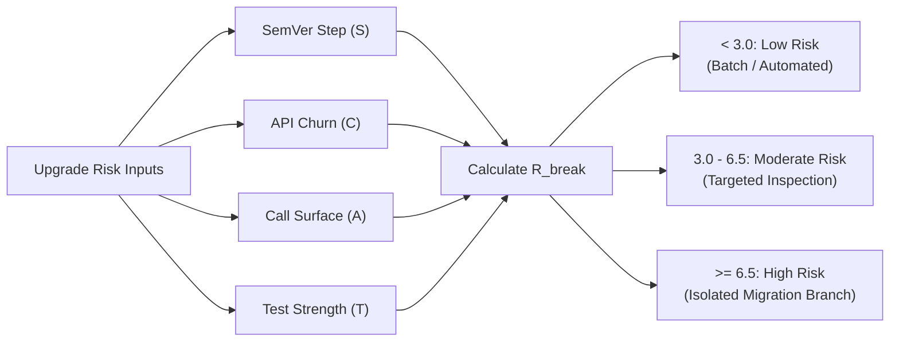

# Risk Ranking & Vulnerability Triage

> **Core Axiom**: *Severity without reachability is noise. True vulnerability triage traces execution paths from untrusted ingress to vulnerable third-party sinks. Upgrade breakage risk balances contract churn, surface area, and test coverage.*

---

## 1 · Upgrade Breakage Risk Index ($R_{\text{break}}$)

When deciding whether an upgrade can be applied automatically or requires an isolated migration plan, compute the Breakage Risk Index:

$$R_{\text{break}} = (w_s \cdot S) + (w_c \cdot C) + (w_r \cdot A) - (w_t \cdot T)$$



### Parameter Quantifications:
* **$S$ (SemVer Step Jump)**:
  - $1$: Patch update ($X.Y.Z \to X.Y.Z+1$)
  - $3$: Minor update ($X.Y.0 \to X.Y+1.0$)
  - $8$: Major update ($X.0.0 \to X+1.0.0$)
* **$C$ (API Churn Rating, 0–10)**:
  - Extracted from CHANGELOG / release notes. $0 =$ pure internal fix; $5 =$ deprecated methods; $10 =$ complete rewrite / architectural overhaul.
* **$A$ (Call-Site Surface Area, 0–10)**:
  - Logarithmic scale of active call sites invoking the target library:
    - $1$: $1 - 2$ call sites in non-critical utilities.
    - $5$: $5 - 20$ call sites across core features.
    - $10$: $> 50$ call sites or deep structural integration (e.g. database ORM, web framework).
* **$T$ (Test Harness Strength, 0–10)**:
  - Assertion density and coverage along call paths invoking the library. $0 =$ zero tests; $5 =$ basic happy-path coverage; $10 =$ comprehensive hostile/negative unit and integration test coverage.
* **Weights**: Default baseline weights: $w_s = 0.35, w_c = 0.25, w_r = 0.25, w_t = 0.15$.

---

## 2 · Vulnerability Triage Priority ($P_{\text{vuln}}$)

Do not prioritize security advisories by raw CVSS scores alone. Compute **Real Exploitability Priority**:

$$P_{\text{vuln}} = \text{CVSS}_{\text{base}} \times R_f \times E_c$$

### 2.1 Reachability Factor ($R_f$)
Trace the execution graph from system ingress to the vulnerable package function:
* **$R_f = 1.0$ (Direct Execution Path)**: The vulnerable function/class is imported and invoked directly by active production application code.
* **$R_f = 0.5$ (Transitive Execution Path)**: The vulnerable function is invoked indirectly by an intermediate third-party dependency.
* **$R_f = 0.1$ (Dead Code / Unused Symbol)**: The library is imported, but the specific vulnerable export/method is never referenced anywhere in the call graph.
* **$R_f = 0.0$ (Inactive Compilation Target)**: The vulnerable code exists only for uncompiled platforms (e.g. Windows-specific exploit in a Linux container deploy, or WebAssembly target in native code).

### 2.2 Environment Context ($E_c$)
* **$E_c = 1.0$**: Publicly exposed network edge, production server, internet-facing API.
* **$E_c = 0.6$**: Client-side production bundle (sandboxed browser, mobile app).
* **$E_c = 0.2$**: Internal offline CLI, batch data crunching behind private VPC.
* **$E_c = 0.05$**: Dev-only dependency (linter, test runner, local documentation generator).

### 2.3 Priority Classification:
* **$P_{\text{vuln}} \ge 7.0$**: **P0 Critical** — Immediate remediation required. Block merge/release.
* **$4.0 \le P_{\text{vuln}} < 7.0$**: **P1 High** — Priority remediation within active cycle.
* **$1.5 \le P_{\text{vuln}} < 4.0$**: **P2 Medium** — Group with scheduled routine upgrades.
* **$P_{\text{vuln}} < 1.5$**: **P3 Low / Noise** — Deprioritize / suppress from alert blockers.

---

## 3 · Dynamic Languages & Reflection Safeguard

In dynamic languages (JavaScript, Python, Ruby) or runtimes utilizing reflection/metaprogramming (Java, C#):
* If a package is invoked via dynamic reflection (`getattr()`, `eval()`, `importlib`, string-based factory registration), static AST reachability cannot prove that the function is unreachable.
* **Rule**: Treat dynamic reflection points as **taint-opaque**; assign $R_f = 0.5$ conservatively unless static analysis proves the reflection target is disjoint from the vulnerable symbol.

---

## 4 · Actionable Vulnerability Worklist Output Schema

When presenting vulnerability audits to human maintainers or CI gates, format findings into this schema:

```markdown
| Advisory ID | Package | Upstream CVSS | Reachability ($R_f$) | Context ($E_c$) | Priority ($P_{\text{vuln}}$) | Call-Site Trace / Evidence | Recommended Remediation |
| :--- | :--- | :--- | :--- | :--- | :--- | :--- | :--- |
| **GHSA-xxxx** | `lodash` | 7.5 (High) | 0.1 (Unused) | 1.0 (Prod API) | **0.75 (P3 Noise)** | Imported `merge`; vulnerable `template` never called. | Batch with routine updates. |
| **CVE-202X** | `axios` | 8.8 (High) | 1.0 (Direct) | 1.0 (Prod API) | **8.8 (P0 Critical)** | Direct call in `src/auth.ts:42` with user-supplied URL. | Immediate bump to `^1.7.4`. |
```
