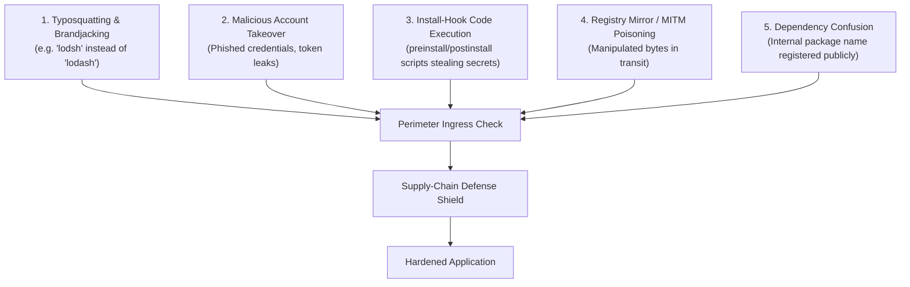

# Supply-Chain & Integrity Hardening

> **Core Axiom**: *Third-party code and build hooks execute with ambient machine privileges. Treat external packages as untrusted binary payloads: pin cryptographic hashes, sandbox lifecycle scripts, and detect malicious provenance before execution.*

---

## 1 · The Attack Vectors in Modern Software Supply Chains

Modern software supply chains face five primary attack categories:

---

## 2 · Cryptographic Lockfile Integrity & Hash Pinning

Every production lockfile must record cryptographic digests of the fetched artifacts:
* **Subresource Integrity (SRI) & SHA Hashes**: Ensures the exact bytes downloaded on CI match what was originally evaluated on the developer machine.
* **Tamper Detection**: If a package registry is compromised or a malicious actor alters a release artifact after publication, the package manager immediately aborts with a checksum mismatch error.

### Hardening Lockfile Execution:
* In CI/CD pipelines, always invoke package managers with **immutable lockfile flags**:
  - Node: `npm ci` or `pnpm install --frozen-lockfile`
  - Python: `uv sync --frozen` or `poetry install --no-root` (with lock verification)
  - Rust: `cargo check --locked` or `cargo build --locked`
  - Go: `go mod verify`
* Never permit CI runners to mutate lockfiles or download floating dependencies dynamically.

---

## 3 · Build & Install Script Sandboxing

Pre-install and post-install hooks (`package.json` scripts, `build.rs` in Rust, `setup.py` in Python) execute arbitrary shell code with the full permissions of the active developer or CI runner. Attackers frequently use these hooks to exfiltrate environment variables, AWS keys, and SSH credentials.

### Defensive Protocols:
1. **Audit Script Declarations**: Before installing an unfamiliar package, inspect its manifest for `preinstall`, `install`, `postinstall`, or custom build scripts.
2. **Disable Scripts by Default when Auditing**:
   - `npm install --ignore-scripts`
   - `pnpm config set ignore-scripts true`
3. **Allowlist Known Compilers**: Only permit build scripts for verified native compilation packages (e.g. `esbuild`, `sqlite3`, `tree-sitter`).

---

## 4 · Typosquatting & Provenance Verification

When evaluating or triaging package names:
* **Levenshtein Distance Check**: Beware of names phonetically or orthographically adjacent to popular libraries (`cross-env` vs `crossenv`, `colorama` vs `colourama`).
* **Namespace Squatting**: If an organization uses an internal scope (e.g. `@mycompany/auth`), configure registry configuration files (`.npmrc`, `pip.conf`) to forbid querying public registries for internal package scopes (preventing **Dependency Confusion** attacks).
* **Release Age Gating**: Exercise extreme caution when adopting package versions published within the last 24–48 hours, unless resolving a critical zero-day exploit. Malicious releases are typically reported and yanked by ecosystem security teams within 48 hours.

---

## 5 · Software Bill of Materials (SBOM) & Provenance

For enterprise, compliance, or regulatory boundaries, dependencies must be serializable into standard machine-readable inventory formats:
* **CycloneDX**: Lightweight, XML/JSON format optimized for application security, vulnerability matching, and license tracking.
* **SPDX**: Linux Foundation standard, heavily focused on open-source license attribution and compliance.

Generating an SBOM enables automated reachability auditing across downstream security monitoring platforms without requiring direct source code access.
