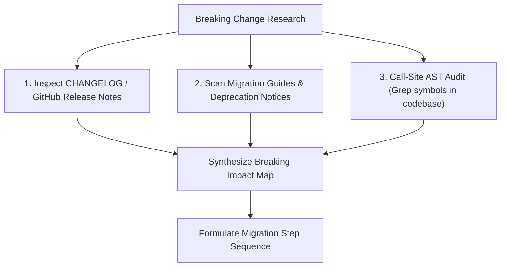

# Upgrade & Migration Discipline

> **Core Axiom**: *An upgrade is an atomic state mutation across the dependency graph. Blind bulk upgrades invite catastrophic regressions; disciplined upgrades research breaking contracts, isolate batches, and prove invariance.*

---

## 1 · The Semantic Versioning Contract ($MAJOR.MINOR.PATCH$)

Semantic Versioning (`X.Y.Z`) establishes an explicit behavioral contract between upstream publishers and consumers:

* **PATCH ($Z \to Z+1$)**: Backward-compatible bug fixes and internal refactorings. Expected breaking changes: **Zero**.
* **MINOR ($Y \to Y+1$)**: Backward-compatible feature additions, API enhancements, or deprecation notices. Expected breaking changes: **Zero**.
* **MAJOR ($X \to X+1$)**: Incompatible API changes, signature removals, runtime behavior modifications, or elevated minimum engine/compiler requirements. Expected breaking changes: **Present by definition**.

> [!WARNING] The Real-World SemVer Axiom
> Upstream publishers occasionally break contracts accidentally in MINOR or PATCH releases. Never assume a bump is safe because its version number says so; always verify against an active automated test suite.

---

## 2 · Breaking Change Research Protocol

Before altering a dependency version in a manifest or lockfile, the agent must execute this research checklist:

1. **Changelog & Release Notes Mining**: Extract the delta between current version $V_{\text{current}}$ and target version $V_{\text{target}}$. Identify removed methods, renamed configurations, and altered default behaviors.
2. **Call-Site AST Audit**: Search the codebase for every imported symbol from the target package:
   - Are any changed or deprecated APIs actively consumed?
   - How many call sites require signature or argument updates?
3. **Engine / Runtime Prerequisite Check**: Verify that the target version does not demand a newer runtime than the project's baseline (e.g. Node 20+, Python 3.12+, or Rust 1.80+).

---

## 3 · Staged Batching & Migration Workflows

Never bump unrelated dependencies in a single monolithic commit. Group upgrades into logical batches:

### 3.1 Batching Tiers
* **Tier 1 (Patch / Bugfix Batch)**: Safe to group together (e.g. bumping 5 patch releases simultaneously). Run tests once for the batch.
* **Tier 2 (Minor Feature Batch)**: Group related packages (e.g. all `@opentelemetry/*` packages or all `aws-sdk` clients together). Run tests after each package group.
* **Tier 3 (Major Framework Overhaul)**: Strict isolation. Exactly **one major dependency upgrade per commit/PR**. Example: migrating React 18 to 19, or Django 4 to 5.

### 3.2 The Micro-Step Upgrade Loop
For each major upgrade:
1. **Characterization Pinning**: If the code consuming the library lacks comprehensive tests, author characterization tests capturing current behavior *before* upgrading the package.
2. **Bumping Manifest & Lockfile**: Update the version constraint and run the ecosystem's resolution command to update the lockfile.
3. **Updating Call Sites**: Refactor application code to accommodate new API signatures and breaking changes.
4. **Running Scoped Test Harness**: Execute the test suite. If green, commit immediately: `build(deps): bump <pkg> from <v1> to <v2>`.
5. **Rollback Safety**: If tests fail with complex cascading breaks that cannot be resolved in localized micro-steps, revert immediately to the last green git state rather than debugging forward through a corrupt dependency state.

---

## 4 · Upgrade Verification Commands by Ecosystem

| Ecosystem | Safe Minor/Patch Update | Single Package Major Upgrade | Lockfile Integrity Check |
| :--- | :--- | :--- | :--- |
| **Node (pnpm)** | `pnpm update` | `pnpm update <pkg>@latest` | `pnpm install --frozen-lockfile` |
| **Node (npm)** | `npm update` | `npm install <pkg>@latest` | `npm ci` |
| **Python (uv)** | `uv lock --upgrade-package <pkg>` | `uv add <pkg>@latest` | `uv sync --frozen` |
| **Python (poetry)**| `poetry update <pkg>` | `poetry add <pkg>@latest` | `poetry check --lock` |
| **Rust (Cargo)** | `cargo update -p <pkg>` | Edit `Cargo.toml` + `cargo check` | `cargo check --locked` |
| **Go** | `go get -u <pkg>` | `go get <pkg>@v2` | `go mod verify` |
| **JVM (Maven)** | `mvn versions:use-latest-releases`| Edit `pom.xml` + `mvn verify` | `mvn clean compile` |
| **.NET** | `dotnet add package <pkg>` | `dotnet add package <pkg> --version <v>` | `dotnet restore --locked-mode` |
