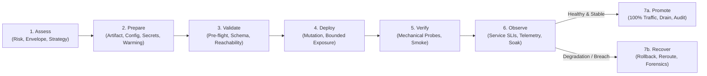

# Deployment Engineering: Universal Progressive Delivery & Rollout Protocol

> **Mandate**: *Deployment is the controlled, observable transition of a verified computational artifact into an operational environment.* A deployment does not begin when code is pushed, nor does it conclude when a process boots or an endpoint returns HTTP 200. It is a closed-loop engineering discipline spanning pre-flight environment auditing, risk-proportional blast-radius containment, progressive traffic steering, dual-horizon health verification, state-code co-evolution, and deterministic recovery. True deployment engineering preserves agent creativity, rejects platform dogma, and guarantees that every operational transition is observable, auditable, and recoverable across any software archetype.

---

## 1 · The 7-Stage Universal Deployment Lifecycle

Every deployment—from updating a 10-line CLI tool to orchestrating a global multi-region service rollout or deploying an autonomous multi-agent swarm—traverses this closed-loop lifecycle:



1. **Stage 1 — Assess (Risk & Strategy Formulation)**: Calculate the change blast radius ($R_{\text{blast}} = \Phi(\text{Exposure}, \text{Reversibility}, \text{Statefulness})$). Audit downtime tolerance, traffic volume, and schema coupling. Select the optimal rollout strategy (Recreate, Rolling, Blue-Green, Canary, Shadow, or Feature-Flagged) and determine required human/policy approval gates.
2. **Stage 2 — Prepare (Hermetic Packaging & Target Priming)**: Pin the immutable artifact digest ($Hash(A_{\text{dev}}) = Hash(A_{\text{prod}})$). Externalize and validate environment configuration. Inject secrets via secure, zero-ambient-authority mechanisms. Prime database connection pools and warm caches to prevent cold-start thundering herds (see [`references/rollout-strategies-and-risk-taxonomy.md`](references/rollout-strategies-and-risk-taxonomy.md)).
3. **Stage 3 — Validate (Pre-Flight Gatekeeping)**: Execute non-mutating checks against the target environment: schema compatibility, contract validation, least-privilege IAM reachability, and stateful migration stage prerequisites. Reject deployment if any pre-flight check fails (see [`references/verification-gates-and-observability.md`](references/verification-gates-and-observability.md) and [`references/stateful-migrations-and-schema-evolution.md`](references/stateful-migrations-and-schema-evolution.md)).
4. **Stage 4 — Deploy (Progressive Mutation)**: Apply changes to the designated target cohort. Enforce bounded exposure envelopes (e.g. 1% canary or single instance). Route traffic or spin processes according to the selected strategy.
5. **Stage 5 — Verify (Mechanical Deployment Health)**: Verify process initialization, socket bindings, and runtime health probes (Startup, Liveness, Readiness). Execute synthetic smoke tests against the isolated new cohort. Confirm mechanical vitality ($S_{\text{deploy}}$: instances are UP).
6. **Stage 6 — Observe (Operational Service Health)**: Monitor telemetry under live load (error budget burn, P95/P99 latency, resource saturation, agent evaluation scores). Filter transient noise via sustained multi-window observation ($\ge 3 \times \text{ProbeInterval}$) across an explicit soak window. Confirm service health ($H_{\text{service}}$) (see [`references/verification-gates-and-observability.md`](references/verification-gates-and-observability.md)).
7. **Stage 7 — Promote or Recover**:
   * **Path A (Promote)**: Advance traffic through progressive rings to 100%. Execute graceful connection drain and session handover on deprecated instances. Commit attributable deployment record to the audit log.
   * **Path B (Recover)**: Upon metric breach, unhandled exception, or safety trigger, immediately engage the Recovery Protocol. Revert the composite deployment tuple $\langle A, \mathcal{C}, \mathcal{S} \rangle$, divert traffic, preserve forensic artifacts (logs, core dumps), and escalate to [`failure-recovery`](../failure-recovery/SKILL.md) (see [`references/recovery-rollback-and-blast-containment.md`](references/recovery-rollback-and-blast-containment.md)).

---

## 2 · Progressive Disclosure (Reference Routing)

To prevent cognitive overload and preserve LLM context bandwidth, **never load all reference manuals simultaneously**. Consult reference manuals strictly on demand based on task context:

| Context Trigger | Mandatory Reference Manual | Purpose |
| :--- | :--- | :--- |
| **Strategy selection, canary, blue-green, rolling, blast radius, traffic shifting** | [`references/rollout-strategies-and-risk-taxonomy.md`](references/rollout-strategies-and-risk-taxonomy.md) | 5-axis decision matrix, traffic steering engines, blast radius math ($R_{\text{blast}}$), cold-start & cache priming. |
| **Health probes, SLIs/SLOs, canary metrics, synthetic tests, soak windows** | [`references/verification-gates-and-observability.md`](references/verification-gates-and-observability.md) | Dual-horizon health ($S_{\text{deploy}} \neq H_{\text{service}}$), Automated Canary Analysis (ACA), low-traffic synthetic inoculation. |
| **Database schemas, stateful migrations, queues, caches, expand/contract** | [`references/stateful-migrations-and-schema-evolution.md`](references/stateful-migrations-and-schema-evolution.md) | 5-phase Expand/Contract protocol, forward/backward schema compatibility, irreversible state handling, queue versioning. |
| **Promotion pipelines, GitOps, artifact digests, approval gates, rings** | [`references/pipeline-stages-and-environment-promotion.md`](references/pipeline-stages-and-environment-promotion.md) | Build-once provenance, multi-region rings, GitOps reconciliation, policy-as-code, human-in-the-loop approvals. |
| **AI agents, MCP servers, prompt updates, model shifts, eval gates** | [`references/agentic-deployment-and-mcp-orchestration.md`](references/agentic-deployment-and-mcp-orchestration.md) | Golden evaluation benchmark gates, prompt versioning, MCP tool scoping, active agent session preservation, token budgets. |
| **Rollback triggers, failed rollouts, side-effect taint, circuit breakers** | [`references/recovery-rollback-and-blast-containment.md`](references/recovery-rollback-and-blast-containment.md) | Decision lattice (rollback vs freeze vs forward), side-effect recovery, composite tuple reverts, forensic preservation. |

---

## 3 · Adaptive Cognitive Sizing (The 6 Execution Modes)

Size your deployment engineering effort to the task's scope and risk profile. Never apply heavy enterprise bureaucracy to a single-line script or local prototype, and never execute speculative, unverified mutations across high-blast-radius production systems:

| Mode | Trigger & Scope | Engineering Discipline | Required Output & Protocol |
| :--- | :--- | :--- | :--- |
| **`direct-apply`** | Local development, ephemeral preview environments, standalone internal utilities (< 200 lines). | Verify artifact build, execute direct replacement, verify single-point liveness. **Zero boilerplate**. | **3-Line Deployment Intent Block** directly preceding execution. |
| **`rolling-update`** | Stateless microservices, container replica sets, background worker fleets. | Incremental pod/process replacement with concurrency bounds ($N_{\text{surge}}$, $N_{\text{unavailable}}$) and readiness probes. | **Rolling Rollout Status**: Batch progression logs + zero-downtime evidence. |
| **`canary-progressive`** | High-traffic services, mission-critical public APIs, core business workflows. | Traffic-shifted canary cohorts ($1\% \to 5\% \to 25\% \to 100\%$) with Automated Canary Analysis (ACA) and automated rollback triggers. | **Canary Progression Matrix**: Telemetry comparison vs baseline at each stage. |
| **`blue-green-switch`** | Services requiring atomic cutover, instant rollback capability, or environments where parallel stacks are cost-effective. | Deploy full green environment alongside blue; validate green via synthetic traffic; atomically shift routing; maintain blue on hot standby. | **Atomic Cutover Attestation**: Routing switch confirmation + standby retention plan. |
| **`stateful-expand-contract`** | Deployments coupled with database schema changes, persistent storage migrations, or event message format updates. | Multi-phase co-deployment (Phase 1: Expand schema $\to$ Phase 2: Deploy dual-write code $\to$ Phase 3: Backfill data $\to$ Phase 4: Deploy read-new code $\to$ Phase 5: Contract old schema). | **State Co-Evolution Plan**: Compatibility proofs + forward-recovery guarantees. |
| **`agentic-fleet`** | AI agent deployments, MCP server registrations, prompt/skill updates, model endpoint routing shifts. | Non-deterministic system governance: golden evaluation dataset gates, token/latency budget validation, tool capability scoping, human-in-the-loop sign-off. | **Agentic Deployment Record (ADR)**: Eval score diff + tool policy audit + fallback routes. |

### The 3-Line Deployment Intent Protocol (For `direct-apply` mode)
To prevent philosophical bloat on small components, summarize deployment intent in exactly 3 lines before emitting commands or mutations:
```markdown
> **Target**: [Environment / Instance / Endpoint]
> **Artifact**: [Immutable Digest / Build Commit Hash]
> **Health Check**: [Liveness Verification Output: PASS]
```

---

## 4 · The 7 Universal Deployment Invariants

Regardless of language, framework, cloud provider, or runtime environment, every robust computational system upholds these 7 foundational invariants:

### 4.1 Invariant 1: Build-Once Artifact Immutability & Provenance (The Invariance Axiom)
A deployable computational artifact $A$ must be compiled, bundled, or packaged exactly once and remain byte-for-byte immutable across all deployment environments:
$$\text{Digest}(A_{\text{dev}}) = \text{Digest}(A_{\text{staging}}) = \text{Digest}(A_{\text{prod}})$$
* **Prohibition**: Compiling different binaries, baking environment-specific variables into container layers, or building separate artifacts per target environment is strictly forbidden.
* **Cryptographic Traceability**: Deployments must reference a cryptographically verifiable digest (e.g. SHA-256) or immutable signed tag, never a mutable pointer (such as `:latest`, `main`, or unpinned branch heads).

### 4.2 Invariant 2: Target Environment & Boundary Awareness (The Pre-Flight Axiom)
A deployment mutation is invalid until the target operational environment $T$ is proven receptive and verified:
$$\text{Receptive}(T) \iff \text{Capacity}(T) \land \text{Authority}(T) \land \text{ConfigParity}(T) \land \text{Dependencies}(T)$$
* The deployer must explicitly verify quota headroom, compute/memory capacity, permissions (least-privilege IAM/service account), and upstream/downstream network reachability *prior* to altering target state.

### 4.3 Invariant 3: Risk-Proportional Blast Radius & Progressive Exposure (The Containment Axiom)
The exposure envelope of any deployment mutation must be proportional to its operational risk and inversely proportional to historical confidence:
$$R_{\text{blast}} = \Phi(\text{Traffic}_{\text{exposed}}, \text{Reversibility}, \text{Statefulness}) \le \text{ErrorBudget}_{\text{allocated}}$$
* High-risk, high-traffic, or stateful deployments must utilize progressive rollout strategies (canary, ring-based, feature-gated) with explicit automated metric evaluation gates between stages.

### 4.4 Invariant 4: Dual-Horizon Health & Observability (The Verification Axiom)
Mechanical deployment completion ($S_{\text{deploy}}$) is fundamentally distinct from operational service health ($H_{\text{service}}$):
$$\text{HealthyDeployment} \iff S_{\text{deploy}}(\text{process}, \text{ports}, \text{probes}) \land H_{\text{service}}(\text{SLIs}, \text{error-rate}, \text{latency}, \text{correctness})$$
* A deployment is not declared successful when the process boots or passes synthetic liveness checks. It is successful only after operational metrics remain within acceptable SLO boundaries under real traffic over an explicit soak window.

### 4.5 Invariant 5: State & Schema Co-Evolution (The Non-Reversible Migration Axiom)
Code and stateful storage (databases, disk formats, event schemas) evolve asynchronously. Rollback of code must never corrupt or lose data written by the new version:
$$\forall t \in \text{RolloutWindow}, \quad \text{Compatible}(Code_{\text{active}}, State_t) \land \text{Compatible}(Code_{\text{previous}}, State_t)$$
* Destructive, in-place schema changes are prohibited during deployment. State evolution must follow the **Expand/Contract (Parallel Run)** pattern, ensuring backward and forward compatibility across version transitions.

### 4.6 Invariant 6: Declarative Convergence & Idempotency (The Convergence Axiom)
Every deployment action must be idempotent. Re-applying the deployment specification $D$ against the target environment $T$ must produce identical state with zero unmanaged side effects:
$$D(D(T)) = D(T)$$
* The deployment engine must converge toward the declared desired state regardless of whether the system was fresh, running, interrupted, or recovering from partial failure.

### 4.7 Invariant 7: Explicit Human Authority & Break-Glass Governance (The Governance Axiom)
Autonomous agents and automated pipelines must operate within bounded authority envelopes.
* Irreversible production actions (e.g. destructive database migrations, permanent traffic decommissioning, global DNS switches) require explicit human approval or signed policy attestations.
* In emergency outage scenarios, the system must support an auditable "break-glass" override with immediate mandatory logging and post-deployment reconciliation.

---

## 5 · The Deployment Invariant Exception Protocol (Extreme Edge Cases)

No single static rulebook can accommodate 100% of physical or operational anomalies without breaking. When exceptional operational constraints (e.g. active zero-day production hotfixes, air-gapped enclaves without external vaults, legacy single-instance databases requiring locked maintenance windows, or irreversible hardware flash updates) conflict with standard deployment invariants, the agent invokes this protocol:

> [!CAUTION] DEPLOYMENT INVARIANT EXCEPTION PROTOCOL
> An agent may deliberately bypass a deployment invariant (e.g., executing a live hot-patch without a full pipeline build, accepting downtime for a massive single-instance database migration, or bypassing an automated verification gate during a catastrophic network partition) **IF AND ONLY IF**:
> 1. **Operational Blocker Citation**: Explicitly cites the physical or operational necessity (e.g., *"Production database locked by active deadlock; immediate manual kill and unversioned DDL migration required to restore emergency access"*).
> 2. **Blast-Radius Quarantining**: Confines the bypass to the minimal necessary blast radius (e.g., single target instance, isolated regional silo, or maintenance-window tenant).
> 3. **Micro-ADR & Convergence Commitment**: Records the decision in an immutable record (`[DEPLOY-EXCEPTION: emergency manual override during Sev-0 incident #8491; post-incident reconciliation committed for YYYY-MM-DD]`).

---

## 6 · Universal Archetype Adaptation

The 7 invariants adapt dynamically across every software archetype by abstracting tools to universal deployment roles:

| Dimension | Cloud & Containers (K8s, ECS) | Serverless & Edge (Lambda, Cloudflare) | Bare-Metal & Monoliths (Systemd, VM) | Client & Mobile (iOS, Android, Desktop) | AI Agents & MCP Swarms | Embedded & IoT (Firmware, Edge HW) | Libraries & SDKs (NPM, PyPI, Cargo) | Data Pipelines (Airflow, dbt, Spark) | Air-Gapped & Enclaves |
| :--- | :--- | :--- | :--- | :--- | :--- | :--- | :--- | :--- | :--- |
| **Immutable Artifact** | OCI Container Image Digest (`sha256:...`) | Versioned Zip Bundle / Wasm Binary | Compiled Binary / Deb / RPM Package | Signed App Bundle / Installer (`.ipa`, `.aab`, `.exe`) | Packaged Agent Spec + Model Checkpoint + Prompt Hash | Signed Cryptographic Firmware Binary (`.bin`) | Signed Tarball / Package Archive (`.tar.gz`) | Versioned DAG Repo Tag / Dockerized Spark Job | Detached Encrypted & Signed Tarball Bundle |
| **Environment Injection** | ConfigMaps, Pod Env, Secret Manager Sidecars | Environment Variables, Edge KV Bindings | Systemd Environment files, Host Config (`/etc/`) | OS Settings, Plist, User Preference Stores | Runtime Session Context, Tool Secret Injection | Hardware NVRAM, EEPROM, Bootloader Args | Caller-supplied Config Objects / Options Struct | Pipeline Airflow Variables / dbt profiles.yml | Onboard Local Vault / Air-Gapped Keyring |
| **Rollout Strategy** | RollingUpdate / Argo Rollouts Canary | Traffic Weight Shifting / Version Aliases | Blue-Green symlink swap, Systemd socket activation | App Store Phased Release ($1\% \to 100\%$ over 7 days) | Shadow Routing $\to$ Canary Model Endpoint $\to$ Fleet | A/B Partition Flash Bank Slot Swap | SemVer Minor/Patch Publish + Deprecation Window | Parallel DAG Run $\to$ Output Table Swap | Staged Host Maintenance Window Swap |
| **Deployment Health** | K8s Liveness & Readiness Probes | Invocation Status Code, Init Duration | Daemon PID Check, Local Socket Bind Test | App Launch Time, Zero Crash-on-Boot (Crashlytics) | MCP Server Handshake, Tool Conformance Ping | Hardware Watchdog Timer, POST Health Signal | Downstream Build & Integration Matrix Smoke Tests | DAG Syntax Compilation / Dry-Run Plan | Local Process Health & Port Listener Check |
| **Service Observability** | Prometheus SLIs, Distributed Tracing | Execution Duration, Cold Starts, Edge Errors | System Logs (`journalctl`), Host Metrics | Crash-free Sessions, App Store ANR/Crash Rates | Eval Benchmark Score, Tool Error Rate, Latency | Sensor Read Telemetry, Heartbeat Ping Rate | Bug Tracker Influx Rate, Downgrade/Pin Telemetry | Data Quality Test Pass Rate / Row Anomaly Count | Local Syslog Audit Log / Hardware Telemetry |
| **Recovery Mechanism** | Automated Replica Set Rollback / Route Flip | Revert Version Traffic Alias ($100\% \to v_{n-1}$) | Swap Active Symlink to `/opt/app-prev` + Reload | Emergency Hotfix Release / Server-side Feature Kill | Fallback to Default Prompt / Previous Model Route | Hardware Bootloader Fallback to Alternate Partition | `npm unpublish` / `cargo yank` + Patch Release | Revert DAG Pointer $\to$ Rerun Historical Backfill | Restore Previous Inactive Local Directory |

---

## 7 · Guardrails & Strictly Disallowed Anti-Patterns

The skill enforces strict operational safety by explicitly forbidding these common failure modes:

* ❌ **No Ambiguous Pointers (`:latest`, `HEAD`)**: Never deploy an untagged or mutable artifact pointer. Deployments must cite immutable digests or cryptographically sealed versions.
* ❌ **No Destructive In-Place Schema Migrations**: Never run `DROP COLUMN`, table-locking migrations, or destructive data rewrites inside a deployment step without following the Expand/Contract multi-phase cycle.
* ❌ **No Conflating Deployment Success with Service Health**: Never mark a deployment complete solely because a process started, a container reached "Running", or an endpoint returned 200 once. Operational service health must be observed over a stabilization window.
* ❌ **No Unbounded All-at-Once Production Mutations**: Never push an unverified high-risk change directly to 100% of production traffic without progressive exposure or explicit human authorization.
* ❌ **No Secret Embedding in Deployable Artifacts**: Never bake environment-specific passwords, API keys, or private certificates into immutable binaries or container layers.
* ❌ **No Un-revertible Deployments Without Mitigation Plans**: Never execute a deployment path that lacks a clear, actionable recovery mechanism (whether automated rollback, traffic reroute, or forward-patch runbook).
* ❌ **No Ungoverned Autonomous Production Mutations**: Never permit an autonomous AI agent to unilaterally execute production schema migrations, global traffic cutovers, or infrastructure terminations without human-in-the-loop review.
* ❌ **No Mutating Side-Effects in Live Canaries**: Never allow an unverified canary cohort to execute irreversible real-world side-effects (charging payment gateways, sending bulk customer notifications) without virtualized dark sinks or compensating saga logs.
* ❌ **No Circular Deployment Deadlocks**: Never introduce multi-service dependencies that require simultaneous, atomic cross-service deployments. Deploy and verify callee interfaces before updating callers.

---

## 8 · The Clean Deployment Stopping Contract

A deployment engineering task is strictly **COMPLETE** only when all 6 exit criteria are certified with evidence:

1. **Artifact Immutability & Provenance Proven**: The deployed artifact is pinned to an immutable digest (SHA-256 or cryptographic signature) and verified to originate from an authorized source.
2. **Pre-Flight Validation Certified**: Target environment readiness, capacity headroom, credential injection, and schema compatibility were validated before mutations began.
3. **Rollout Execution Verified**: Traffic shifting or instance replacement proceeded according to the selected strategy without unmanaged blast-radius expansion.
4. **Mechanical Health Confirmed**: All deployed instances or endpoints have passed process initialization, liveness, and readiness probes.
5. **Operational Service Health Observed**: Production SLIs (error rates, P95/P99 latency, system saturation, and agent evaluation scores) remained strictly within error budget thresholds across the specified stabilization soak window.
6. **Recovery Posture & Audit Trail Recorded**: Standby environments were safely managed, rollback readiness was maintained throughout, and an attributable deployment record was committed to the system log.
