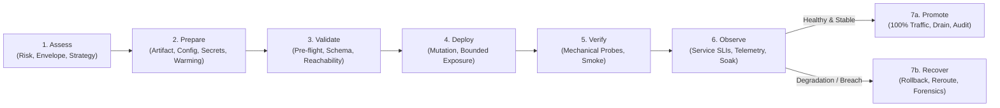

# Deployment Engineering: Universal Progressive Delivery & Rollout Protocol

> **Mandate**: *Deployment is the controlled, observable transition of a verified computational artifact into an operational environment.* A deployment does not begin when code is pushed, nor does it conclude when a process boots or an endpoint returns HTTP 200. It is a closed-loop engineering discipline spanning pre-flight environment auditing, risk-proportional blast-radius containment, progressive traffic steering, dual-horizon health verification, state-code co-evolution, and deterministic recovery. True deployment engineering preserves agent creativity, rejects platform dogma, and guarantees that every operational transition is observable, auditable, and recoverable across any software archetype.

---

## 1 · The 7-Stage Universal Deployment Lifecycle

Every deployment—from updating a localized internal utility to orchestrating a global multi-region service rollout or deploying an autonomous multi-agent swarm—traverses this closed-loop lifecycle:



1. **Stage 1 — Assess (Risk & Strategy Formulation)**: Calculate change blast radius based on exposure volume, reversibility, and statefulness. Audit downtime tolerance, traffic volume, and schema coupling. Select the optimal rollout strategy (Recreate, Rolling, Blue-Green, Canary, Shadow, or Feature-Flagged) and determine required approval gates.
2. **Stage 2 — Prepare (Hermetic Packaging & Target Priming)**: Verify the immutable artifact digest. Externalize and validate environment configuration. Inject secrets via secure, zero-ambient-authority mechanisms. Prime connection pools and warm caches to prevent cold-start stampedes (see [`references/rollout-strategies-and-risk-taxonomy.md`](references/rollout-strategies-and-risk-taxonomy.md)).
3. **Stage 3 — Validate (Pre-Flight Gatekeeping)**: Execute non-mutating checks against the target environment: schema compatibility, contract validation, least-privilege reachability, and stateful migration stage prerequisites. Reject deployment if any pre-flight check fails (see [`references/verification-gates-and-observability.md`](references/verification-gates-and-observability.md) and [`references/stateful-migrations-and-schema-evolution.md`](references/stateful-migrations-and-schema-evolution.md)).
4. **Stage 4 — Deploy (Progressive Mutation)**: Apply changes to the designated target cohort. Enforce bounded exposure envelopes (e.g., initial small canary cohort or single instance). Route traffic or spin processes according to the selected strategy.
5. **Stage 5 — Verify (Mechanical Deployment Health)**: Verify process initialization, socket bindings, and runtime health probes (Startup, Liveness, Readiness). Execute synthetic smoke tests against the isolated new cohort. Confirm mechanical vitality ($S_{\text{deploy}}$: instances are UP).
6. **Stage 6 — Observe (Operational Service Health)**: Monitor telemetry under live load (error budget burn, latency percentiles, resource saturation, agent evaluation scores). Filter transient noise via sustained multi-window observation across an explicit soak window. Confirm service health ($H_{\text{service}}$) (see [`references/verification-gates-and-observability.md`](references/verification-gates-and-observability.md)).
7. **Stage 7 — Promote or Recover**:
   * **Path A (Promote)**: Advance traffic through progressive cohorts to 100%. Execute graceful connection drain and session handover on deprecated instances. Commit attributable deployment record to the audit log.
   * **Path B (Recover)**: Upon metric breach or safety trigger, immediately engage the Recovery Protocol. Revert the composite deployment tuple $\langle A, \mathcal{C}, \mathcal{S} \rangle$, divert traffic, preserve forensic artifacts, and escalate to [`failure-recovery`](../failure-recovery/SKILL.md) (see [`references/recovery-rollback-and-blast-containment.md`](references/recovery-rollback-and-blast-containment.md)).

---

## 2 · Progressive Disclosure (Reference Routing)

To prevent cognitive overload and preserve LLM context bandwidth, consult reference manuals strictly on demand based on task context:

| Context Trigger | Mandatory Reference Manual | Purpose |
| :--- | :--- | :--- |
| **Strategy selection, canary, blue-green, rolling, blast radius, traffic shifting** | [`references/rollout-strategies-and-risk-taxonomy.md`](references/rollout-strategies-and-risk-taxonomy.md) | 5-axis decision matrix, traffic steering engines, blast radius math, cold-start & cache priming. |
| **Health probes, SLIs/SLOs, canary metrics, synthetic tests, soak windows** | [`references/verification-gates-and-observability.md`](references/verification-gates-and-observability.md) | Dual-horizon health ($S_{\text{deploy}} \neq H_{\text{service}}$), Automated Canary Analysis (ACA), low-traffic synthetic testing. |
| **Database schemas, stateful migrations, queues, caches, expand/contract** | [`references/stateful-migrations-and-schema-evolution.md`](references/stateful-migrations-and-schema-evolution.md) | 5-phase Expand/Contract protocol, schema compatibility, irreversible state handling, queue versioning. |
| **Promotion pipelines, GitOps, artifact digests, approval gates, rings** | [`references/pipeline-stages-and-environment-promotion.md`](references/pipeline-stages-and-environment-promotion.md) | Build-once provenance, multi-region rings, GitOps reconciliation, policy-as-code, human approvals. |
| **AI agents, MCP servers, prompt updates, model shifts, eval gates** | [`references/agentic-deployment-and-mcp-orchestration.md`](references/agentic-deployment-and-mcp-orchestration.md) | Evaluation benchmark gates, prompt versioning, MCP tool scoping, active session preservation. |
| **Rollback triggers, failed rollouts, side-effect taint, circuit breakers** | [`references/recovery-rollback-and-blast-containment.md`](references/recovery-rollback-and-blast-containment.md) | Decision lattice (rollback vs freeze vs forward), side-effect recovery, forensic preservation. |

---

## 3 · Adaptive Cognitive Sizing (The 6 Execution Modes)

Size your deployment engineering effort to the task's scope and risk profile. Never apply heavy enterprise bureaucracy to a localized utility, and never execute speculative, unverified mutations across high-blast-radius production systems:

| Mode | Trigger & Scope | Engineering Discipline | Required Output & Protocol |
| :--- | :--- | :--- | :--- |
| **`direct-apply`** | Local development, ephemeral preview environments, standalone single-instance utilities. | Verify artifact build, execute direct replacement, verify single-point liveness. **Zero boilerplate**. | **3-Line Deployment Intent Block** directly preceding execution. |
| **`rolling-update`** | Stateless microservices, container replica sets, background worker fleets. | Incremental process replacement with concurrency bounds and readiness probes. | Rolling Rollout Status: Batch progression logs + zero-downtime evidence. |
| **`canary-progressive`** | High-traffic services, mission-critical public APIs, core business workflows. | Traffic-shifted canary cohorts with automated telemetry comparison and automated rollback triggers. | Canary Progression Matrix: Telemetry comparison vs baseline at each stage. |
| **`blue-green-switch`** | Services requiring atomic cutover, instant rollback capability, or parallel stacks. | Deploy full green environment alongside blue; validate green; atomically shift routing; maintain blue on hot standby. | Atomic Cutover Attestation: Routing switch confirmation + standby retention plan. |
| **`stateful-expand-contract`** | Deployments coupled with database schema changes, persistent storage migrations, or event format updates. | Multi-phase co-deployment: Expand schema $\to$ Deploy dual-write code $\to$ Backfill data $\to$ Deploy read-new code $\to$ Contract old schema. | State Co-Evolution Plan: Compatibility proofs + forward-recovery guarantees. |
| **`agentic-fleet`** | AI agent deployments, MCP server registrations, prompt/skill updates, model routing shifts. | Non-deterministic system governance: evaluation dataset gates, token/latency budget validation, tool capability scoping. | Agentic Deployment Record: Eval score diff + tool policy audit + fallback routes. |

### The 3-Line Deployment Intent Protocol (For `direct-apply` mode)
When operating in `direct-apply` mode, summarize deployment intent in exactly 3 lines before emitting commands or mutations:
```markdown
> **Target**: [Environment / Instance / Endpoint]
> **Artifact**: [Immutable Digest / Build Commit Hash]
> **Health Check**: [Liveness Verification Output: PASS]
```

> **Boundary**: This skill owns *how artifacts reach target environments* (rollout strategy, health verification, progressive delivery, rollback). It does NOT own *what ships or when* — that is `release-management`'s responsibility. Deployment begins AFTER release-management has produced a versioned, signed-off release artifact.

---

## 4 · The 7 Universal Deployment Invariants

Regardless of language, framework, cloud provider, or runtime environment, every robust computational system upholds these 7 foundational invariants:

### 4.1 Invariant 1: Build-Once Artifact Immutability & Provenance (The Invariance Axiom)
A deployable computational artifact $A$ must be compiled, bundled, or packaged exactly once and remain byte-for-byte immutable across all deployment environments:
$$\text{Digest}(A_{\text{dev}}) = \text{Digest}(A_{\text{staging}}) = \text{Digest}(A_{\text{prod}})$$
* Deployments must reference a cryptographically verifiable digest or immutable tag, never a mutable pointer (such as `:latest`, `main`, or unpinned branch heads).

### 4.2 Invariant 2: Target Environment & Boundary Awareness (The Pre-Flight Axiom)
A deployment mutation is invalid until the target operational environment $T$ is proven receptive and verified:
$$\text{Receptive}(T) \iff \text{Capacity}(T) \land \text{Authority}(T) \land \text{ConfigParity}(T) \land \text{Dependencies}(T)$$
* Explicitly verify capacity headroom, permissions, and dependency reachability prior to altering target state.

### 4.3 Invariant 3: Risk-Proportional Blast Radius & Progressive Exposure (The Containment Axiom)
The exposure envelope of any deployment mutation must be proportional to its operational risk. High-risk, high-traffic, or stateful deployments must utilize progressive rollout strategies (canary cohorts, ring-based rollout, feature flags) with explicit automated metric evaluation gates between stages.

### 4.4 Invariant 4: Dual-Horizon Health & Observability (The Verification Axiom)
Mechanical deployment completion ($S_{\text{deploy}}$) is fundamentally distinct from operational service health ($H_{\text{service}}$):
$$\text{HealthyDeployment} \iff S_{\text{deploy}}(\text{process}, \text{ports}, \text{probes}) \land H_{\text{service}}(\text{SLIs}, \text{error-rate}, \text{latency}, \text{correctness})$$
* A deployment is not declared successful when the process boots or passes synthetic liveness checks. It is successful only after operational metrics remain within acceptable SLO boundaries under real traffic over an explicit soak window.

### 4.5 Invariant 5: State & Schema Co-Evolution (The Non-Reversible Migration Axiom)
Code and stateful storage (databases, disk formats, event schemas) evolve asynchronously. Rollback of code must never corrupt or lose data written by the new version:
$$\forall t \in \text{RolloutWindow}, \quad \text{Compatible}(Code_{\text{active}}, State_t) \land \text{Compatible}(Code_{\text{previous}}, State_t)$$
* Destructive, in-place schema changes are prohibited during deployment. State evolution must follow the **Expand/Contract (Parallel Run)** pattern.

### 4.6 Invariant 6: Declarative Convergence & Idempotency (The Convergence Axiom)
Every deployment action must be idempotent. Re-applying the deployment specification against the target environment must converge toward the declared desired state with zero unmanaged side effects.

### 4.7 Invariant 7: Explicit Human Authority & Break-Glass Governance (The Governance Axiom)
Autonomous agents and automated pipelines operate within bounded authority envelopes. Irreversible production actions require explicit human approval or signed policy attestations. Emergency outage scenarios must support an auditable "break-glass" override with mandatory logging and post-deployment reconciliation.

---

## 5 · The Deployment Invariant Exception Protocol (Extreme Edge Cases)

When exceptional operational constraints (active zero-day production hotfixes, air-gapped enclaves, legacy single-instance databases requiring locked maintenance windows, or irreversible hardware flash updates) conflict with standard deployment invariants:

> [!CAUTION] DEPLOYMENT INVARIANT EXCEPTION PROTOCOL
> An agent may deliberately bypass a deployment invariant **IF AND ONLY IF**:
> 1. **Operational Blocker Citation**: Explicitly cites the physical or operational necessity.
> 2. **Blast-Radius Quarantining**: Confines the bypass to the minimal necessary blast radius.
> 3. **Micro-ADR & Convergence Commitment**: Records the decision in an immutable record with a committed post-incident reconciliation date.

---

## 6 · Universal Archetype Adaptation

The 7 invariants adapt dynamically across every software archetype:

* **Cloud & Containers**: Pin OCI image digests; inject configuration via environment or sidecars; execute rolling or canary updates with readiness probes; monitor Prometheus/SLI metrics; automate replica set rollback.
* **Serverless & Edge**: Version zip bundles or Wasm binaries; use traffic weight shifting across aliases; verify cold-start latency and invocation error rates; instant alias revert on degradation.
* **Host & Bare-Metal Daemons**: Package compiled binaries or OS packages; use blue-green symlink swapping or socket activation; verify daemon socket binds; swap symlinks on failure.
* **Client & Mobile**: Build signed app bundles; execute phased store releases over time; monitor crash-free sessions and ANR rates; decouple features via server-side feature flags.
* **AI Agents & MCP Fleets**: Package agent prompt manifests, tool capability schemas, and model configs; use shadow routing then canary traffic; monitor task completion rate and tool error rates; fallback to previous model/prompt checkpoints.
* **Data & ML Pipelines**: Deploy versioned DAG definitions or model binaries; execute parallel runs on sample partitions before full table swap; revert DAG pointers on data quality failure.

---

## 7 · Guardrails & Strictly Disallowed Anti-Patterns

* ❌ **No Ambiguous Pointers (`:latest`, `HEAD`)**: Never deploy an untagged or mutable artifact pointer. Cite immutable digests or cryptographically sealed versions.
* ❌ **No Destructive In-Place Schema Migrations**: Never run `DROP COLUMN` or table-locking migrations inside a deployment step without following the Expand/Contract multi-phase cycle.
* ❌ **No Conflating Deployment Success with Service Health**: Never mark a deployment complete solely because a process started or an endpoint returned 200 once. Operational service health must be observed over a stabilization window.
* ❌ **No Unbounded All-at-Once Production Mutations**: Never push an unverified high-risk change directly to 100% of production traffic without progressive exposure or explicit human authorization.
* ❌ **No Secret Embedding in Deployable Artifacts**: Never bake environment-specific passwords, API keys, or private certificates into immutable binaries or container layers.
* ❌ **No Irreversible Deployments Without Mitigation Plans**: Never execute a deployment path that lacks a clear, actionable recovery mechanism.
* ❌ **No Mutating Side-Effects in Live Canaries**: Never allow an unverified canary cohort to execute irreversible real-world side-effects without virtualized dark sinks or compensating saga logs.

---

## 8 · The Clean Deployment Stopping Contract

A deployment engineering task is strictly **COMPLETE** only when all 6 exit criteria are certified with evidence:

1. **Artifact Immutability & Provenance Proven**: The deployed artifact is pinned to an immutable digest and verified to originate from an authorized source.
2. **Pre-Flight Validation Certified**: Target environment readiness, capacity headroom, credential injection, and schema compatibility were validated before mutations began.
3. **Rollout Execution Verified**: Traffic shifting or instance replacement proceeded according to the selected strategy without unmanaged blast-radius expansion.
4. **Mechanical Health Confirmed**: All deployed instances or endpoints have passed process initialization, liveness, and readiness probes.
5. **Operational Service Health Observed**: Production SLIs remained strictly within error budget thresholds across the specified stabilization soak window.
6. **Recovery Posture & Audit Trail Recorded**: Standby environments were safely managed, rollback readiness was maintained throughout, and an attributable deployment record was committed to the system log.
