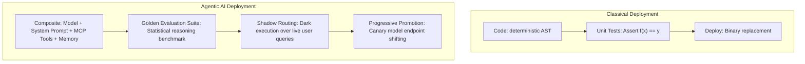
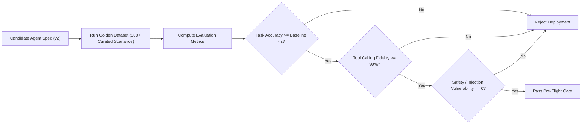
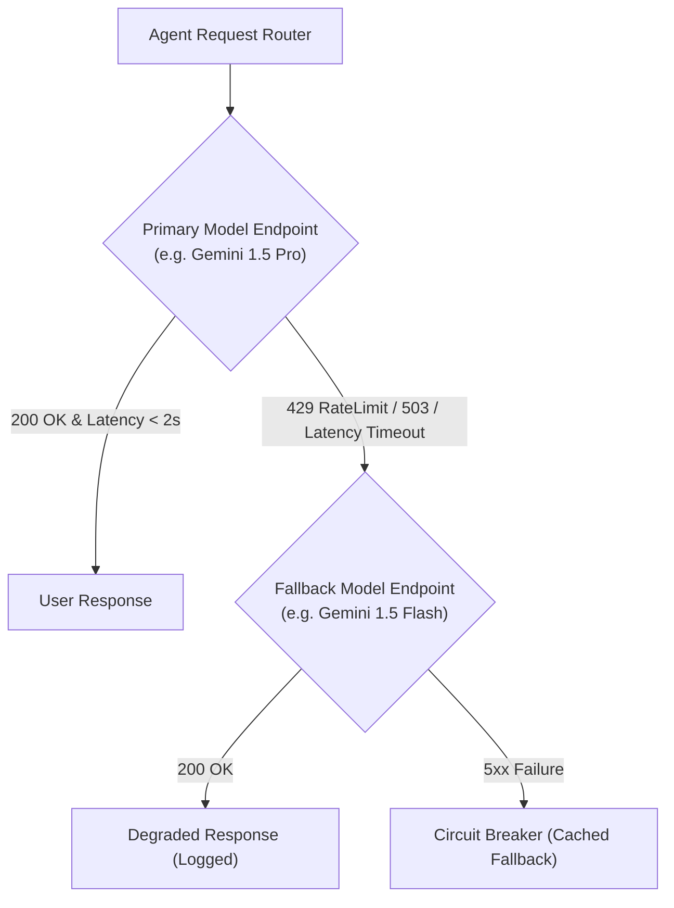

# Agentic Deployment & MCP Orchestration: Non-Deterministic Lifecycles & Tool Governance

> **Mandate**: *Deploying an autonomous AI agent or tool ecosystem is fundamentally different from deploying classical deterministic software.* Classical code has deterministic control flow; an AI agent relies on probabilistic neural reasoning over system prompts, tools, model checkpoints, and contextual memory. A minor prompt tweak or model version shift can introduce semantic drift, tool hallucination, or safety boundary breaches. Deploying AI agents requires specialized Golden Evaluation Benchmark Gates, MCP tool contract verification, and active conversation session migration protocols.

---

## 1 · The Non-Deterministic Deployment Challenge



### Why Traditional CI/CD Fails for AI Agents
1. **Semantic Drift**: A prompt update that improves code generation by 5% might simultaneously increase hallucination rates on mathematical reasoning by 20%.
2. **Tool Invocation Fragility**: Changing a tool's JSON schema or parameter descriptions can cause the LLM to misinterpret required fields or pass invalid arguments.
3. **Latency & Token Budget Variance**: A new model checkpoint or chain-of-thought prompt may double token consumption and latency, exhausting API rate limits and financial budgets.

---

## 2 · The Golden Evaluation Benchmark Gate

Before any AI agent configuration (system prompt, skill definition, model version, or temperature) is deployed, it must pass the offline **Golden Evaluation Benchmark Gate**:



### 2.1 The Evaluation Scoring Metric
The candidate agent $A_{\text{new}}$ must achieve a score within the acceptable tolerance envelope $\epsilon$ relative to the baseline $A_{\text{baseline}}$:

$$S_{\text{eval}}(A_{\text{new}}) \ge S_{\text{eval}}(A_{\text{baseline}}) - \epsilon$$

Where $S_{\text{eval}}$ evaluates:
* **Task Completion Rate**: Percentage of complex multi-step prompts solved correctly.
* **Tool Calling Precision**: Exact conformance of emitted tool arguments to declared JSON schemas.
* **Hallucination Rate**: Frequency of generating non-existent tool names or ungrounded facts.
* **Token Efficiency**: Mean token usage per resolved user query.

---

## 3 · Model Endpoint Versioning & Fallback Routing

Deploying agent systems requires decoupling the agent's reasoning logic from external model inference providers:



### 3.1 Immutable Model Pointers
* **Prohibition**: Never configure production agents to target unversioned model aliases (e.g. `claude-3-sonnet-latest` or `gpt-4o-default`). Upstream provider updates will silently alter agent behavior without notice.
* **Rule**: Target explicit, immutable model checkpoints (e.g. `gemini-1.5-pro-002`, `claude-3-5-sonnet-20241022`).

---

## 4 · MCP Server Registration & Tool Policy Governance

Model Context Protocol (MCP) servers provide agents with operational capabilities. Deploying or updating MCP servers follows strict capability scoping:

```mermaid
flowchart TD
    DeployMCP["Deploy New MCP Server Version"] --> Handshake["Protocol Handshake (tools/list)"]
    Handshake --> ValidateSchemas["Schema Verification against Grimoire Types"]
    ValidateSchemas --> PolicyCheck{"Tool Policy Scope Check"}
    PolicyCheck -->|SAFE (Read-Only)| AutoApprove["Register in Agent Discovery"]
    PolicyCheck -->|APPROVAL (Mutating)| HumanGate["Require Human-in-the-Loop Gate"]
    PolicyCheck -->|LOCKED (Admin / Secrets)| Reject["Block Deployment unless Break-Glass"]
```

### 4.1 Rolling MCP Server Updates
When updating an active MCP server:
1. **Contract Backward Compatibility**: New tools may be added; existing tool schemas must preserve parameter names and types.
2. **Socket / Process Hot-Reload**: The agent runtime connects to the new MCP server process and confirms the `tools/list` handshake *before* disconnecting the legacy MCP process.
3. **Zero Ambient Authority**: Deployed MCP servers must run in sandboxed containers or processes stripped of root permissions, with environment secrets injected explicitly per tool session.

---

## 5 · Active Session Preservation & Memory Migration

Deploying a new agent version while users are engaged in active multi-turn conversations must not sever context or corrupt state:

1. **Stateful Conversation Decoupling**:
   * Conversation history (messages, scratchpads, user preferences) must reside in external persistent stores (PostgreSQL, Redis), never in ephemeral agent process memory.
2. **In-Flight Turn Completion**:
   * If an agent is executing an active chain-of-thought or multi-step tool call loop, allow the current turn to complete on the existing runtime version before routing the next turn to the new agent version.
3. **Vector Index & Embedding Space Compatibility**:
   * If an agent deployment involves changing the underlying embedding model (e.g. migrating from 768-dim to 1536-dim embeddings), vector indexes cannot be migrated in-place.
   * Apply the **Expand/Contract Protocol for Vector Indexes**:
     1. Create new vector collection with new dimensions.
     2. Dual-index incoming documents.
     3. Asynchronously re-embed historical records.
     4. Switch agent search queries to the new index.
     5. Drop the legacy vector collection.
