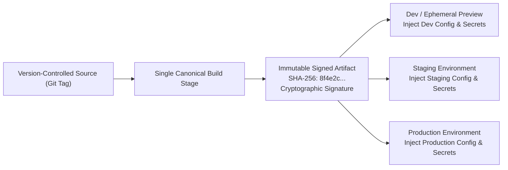
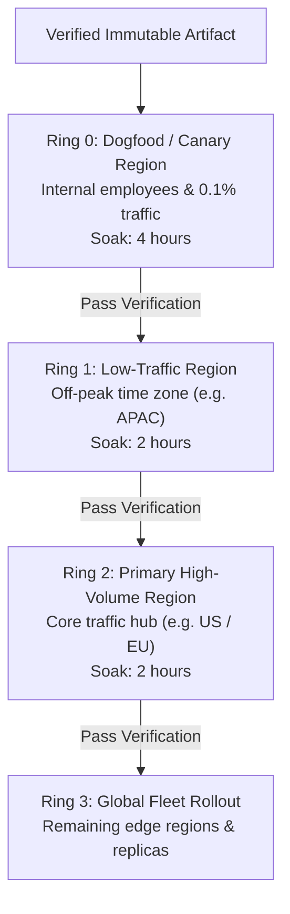
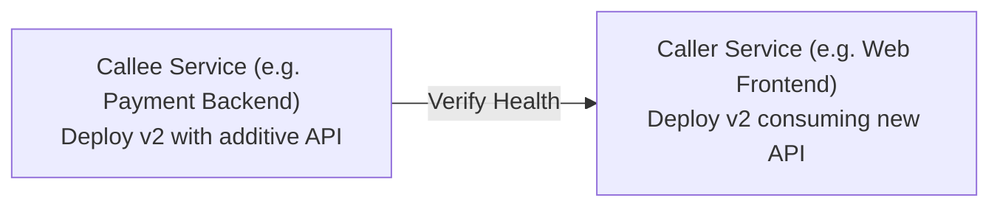

# Pipeline Stages & Environment Promotion: Provenance, Topologies & Multi-Region Rings

> **Mandate**: *Artifacts must be built once and promoted everywhere; environments are variable operational contexts, not unique build targets.* An artifact that is recompiled or rebuilt between staging and production is an untested artifact. Promotion pipelines must enforce cryptographic provenance, acyclic multi-service deployment topologies, and ring-based progressive regional rollouts guarded by continuous data replication and policy verification gates.

---

## 1 · The "Build Once, Promote Everywhere" Law

### 1.1 The Digest Equivalence Invariant
The fundamental axiom of Continuous Delivery states:
$$\text{Digest}(A_{\text{dev}}) = \text{Digest}(A_{\text{staging}}) = \text{Digest}(A_{\text{prod}})$$

* **The Rebuild Vulnerability**: If a pipeline compiles Docker images, Go binaries, or JavaScript bundles separately for staging and production, subtle variations in dependency resolution, compiler environment, or package registries will produce different binaries. Testing in staging becomes meaningless because the binary deployed to production was never tested.
* **Separation of Binary and Configuration**: All variable aspects (database URIs, external API endpoints, feature toggles, thread pool quotas) must be injected at runtime via environment variables, secret vaults, or configuration manifests.

---

## 2 · Environment Topologies & Promotion Topologies

Promotion paths must match the operational scale and risk profile of the organization:

### 2.1 The 4 Canonical Environment Topologies
1. **Direct Single-Box / Ephemeral**:
   * *Topology*: Local development, single VM, or per-PR ephemeral preview environments.
   * *Promotion*: Direct branch-to-preview deployment; torn down upon PR merge.
2. **Linear Staged Promotion**:
   * *Topology*: `Development` $\to$ `Staging` $\to$ `Production`.
   * *Promotion*: Artifact passes automated test suites in Dev; undergoes integration and performance verification in Staging; requires explicit approval for Production.
3. **Multi-Region Progressive Rings**:
   * *Topology*: Production partitioned into concentric risk rings across geographic regions.
   * *Promotion*: Governed by time-soak windows and replication lag health gates.
4. **Air-Gapped / Isolated Enclaves**:
   * *Topology*: Physically or logically disconnected defense, banking, or medical clusters.
   * *Promotion*: Artifact exported as a detached cryptographically signed bundle, transported via secure media, and validated onboard.

---

## 3 · Multi-Region Progressive Ring Topologies

Deploying an update to all global regions simultaneously risks catastrophic worldwide downtime. Multi-region architectures must roll out via concentric rings:

### 3.1 The Cross-Region Replication Lag Gate
In globally distributed databases (e.g. multi-region Spanner, CockroachDB, Aurora Global, or read-replica clusters), database schema changes and writes in Ring 0 propagate asynchronously to subsequent rings.
* **Invariant**: Before advancing deployment to the next regional ring, the deployment engine must verify that cross-region replication lag is strictly below the safety threshold:
  $$\Delta t_{\text{replication}} < \Delta t_{\text{threshold}} \quad (\text{e.g. } < 500\text{ms})$$
* If replication lag spikes, deployment promotion is paused immediately to prevent cross-region split-brain.

---

## 4 · Acyclic Multi-Service Deployment DAGs

When an architectural feature spans multiple interdependent microservices, deploying them out of order causes cascading connection failures and circular deadlocks.

### 4.1 The Non-Simultaneous Deployment Axiom
* **Prohibition**: A deployment engine must **NEVER** attempt simultaneous, synchronized deployment of multiple services where both require the other to be running in order to pass health probes.
* **Topological Ordering**: All service updates must form a strict Directed Acyclic Graph (DAG):
  $$\mathcal{G}_{\text{deploy}} = (\mathcal{V}, \mathcal{E}), \quad \text{Cycles}(\mathcal{G}) = \emptyset$$
* **Callee-First Rule**: Services exposing interfaces (callees) must deploy and verify their additive endpoints before caller services are deployed to invoke those endpoints.

---

## 5 · GitOps vs Imperative Pipeline Triggering

The skill supports both declarative GitOps reconciliation and event-driven CI/CD triggering:

| Dimension | Declarative GitOps (ArgoCD, Flux) | Event-Driven CI/CD (GitHub Actions, GitLab) |
|---|---|---|
| **Source of Truth** | Dedicated Git repository holding declared desired state. | CI pipeline scripts triggering deployment CLI commands. |
| **Execution Direction** | **Pull-based**: Agent inside cluster polls Git and reconciles live state. | **Push-based**: CI runner pushes changes to target cluster via remote credentials. |
| **Drift Correction** | Continuous and automatic; reverts out-of-band manual console edits. | Triggered only on commit/push; blind to subsequent manual drift. |
| **Security Posture** | Superior: Cluster firewall remains closed to external inbound traffic. | Requires storing cluster admin credentials inside CI secrets. |

---

## 6 · Human-in-the-Loop & Break-Glass Governance

1. **Policy-as-Code Gates**:
   * Pre-deployment checks must evaluate signed attestations (SLSA Level 3, unit test pass certification, vulnerability scan clean bill).
2. **Separation of Duties**:
   * The identity authoring the code change must be cryptographically distinct from the identity approving the production deployment.
3. **The Break-Glass Emergency Hotfix Protocol**:
   * In a Sev-0 outage, designated incident commanders may bypass standard staging gates by issuing an explicit break-glass token:
     `[BREAK-GLASS: Incident-INC-9482 by @commander]`
   * **Mandatory Convergence Requirement**: Any emergency break-glass hotfix must be retroactively backported into the main version-controlled GitOps pipeline within 24 hours of incident resolution.
